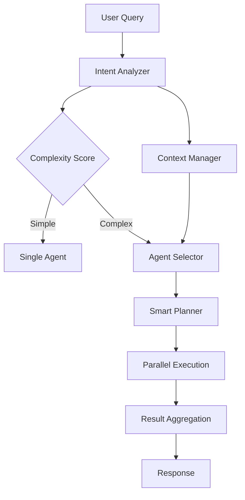

# 나루톡(NARUTALK) 기능 중심 시스템 분석 보고서

> 작성일: 2025-09-17
> 분석 초점: 기능 아키텍처 및 고도화 방향
> 버전: 2.0.0

---

## 1. Executive Summary

나루톡은 **LangGraph Supervisor 패턴**을 활용한 의료/제약 도메인 특화 AI 대화 시스템으로, 4개의 특화 Worker Agent와 지능형 오케스트레이션을 통해 복잡한 업무 요청을 처리합니다.

### 핵심 강점
- ✅ **고급 AI 아키텍처**: LangGraph 기반 멀티 에이전트 시스템
- ✅ **지능형 처리**: 의도 분석 → 동적 에이전트 선택 → 병렬 실행
- ✅ **도메인 특화**: 의료/제약 메타데이터 및 규정 검증

---

## 2. 기능 아키텍처 심층 분석

### 2.1 처리 플로우 (Request → Response)



### 2.2 Supervisor 버전 비교

| 특성 | v1 (main_supervisor.py) | v2 (main_supervisor_v2.py) |
|------|-------------------------|---------------------------|
| 아키텍처 | 기본 LangGraph | 개선된 LangGraph + DB API |
| 에이전트 통합 | 정적 바인딩 | 동적 Tool 생성 |
| 컨텍스트 관리 | 기본 | 최적화된 의료 컨텍스트 |
| 체크포인터 | AsyncSqliteSaver | 개선된 연결 관리 |
| 실행 방식 | 순차적 | 병렬 + 재시도 로직 |

---

## 3. 핵심 기능 모듈 상세 분석

### 3.1 Intent Analyzer (intent_analyzer.py)
**목적**: 사용자 질의 이해 및 분류

#### 주요 기능
```python
# 병렬 분석 작업
- _classify_intent_with_context()  # 의도 분류 (4가지 카테고리)
- _extract_entities_medical()       # 의료 도메인 엔티티 추출
- _evaluate_complexity()           # 복잡도 평가 (0.0-1.0)
- _identify_required_capabilities() # 필요 기능 식별
- _detect_ambiguities()           # 모호성 감지
```

#### 의도 카테고리
1. **실적분석**: 직원 실적, 거래처 트렌드, 매출 분석
2. **정보검색**: 인사정보, 규정, 웹정보, 논문, HiRA 데이터
3. **문서생성**: 보고서 작성, 신청서 작성, DB 저장
4. **규정검토**: 법규 위반 확인, 규정 준수 검증

#### 복잡도 평가 기준
- `< 0.3`: Single Agent 처리
- `0.3-0.7`: Sequential Multi-Agent
- `≥ 0.7`: Parallel Multi-Agent

### 3.2 Dynamic Agent Selector (agent_selector.py)
**목적**: 최적 에이전트 동적 선택

#### 점수 계산 알고리즘
```python
Total Score = (
    Capability Match * 0.4 +    # 능력 매칭
    Performance Score * 0.3 +    # 성능 (성공률, 응답시간)
    Workload Score * 0.2 +       # 현재 부하
    Specialty Score * 0.1        # 전문 분야
) * Priority Weight
```

#### Agent Profile 관리
- **실시간 메트릭**: 성공률, 평균 응답시간, 현재 부하
- **워크로드 분산**: max_concurrent_tasks 기반
- **쿨다운 관리**: 5초 쿨다운으로 과부하 방지

### 3.3 Smart Planner (planner.py)
**목적**: 실행 계획 최적화

#### 주요 기능
- **의존성 그래프 생성**: NetworkX 활용
- **병렬 실행 기회 식별**: can_parallel 플래그
- **리소스 할당**: 에이전트별 작업 분배
- **Fallback 전략**: 실패 시 대체 계획

---

## 4. Worker Agent 기능 상세

### 4.1 SQL Analysis Agent
**핵심 역량**: 데이터 분석 및 시각화

#### 고급 기능
```python
class ColumnMetadata:
    column_name: str
    business_meaning: str        # 비즈니스 의미
    calculation_formula: str     # 계산식

# 복잡한 칼럼 처리 예시
"achievement_rate": {
    "formula": "(actual_sales / target_sales) * 100",
    "business_meaning": "목표 대비 달성률"
}
```

#### 분석 타입
- **Simple**: 기본 통계
- **Trend**: 시계열 분석, 이동평균
- **Comparison**: 그룹별 비교
- **Complex**: 다차원 분석

### 4.2 Information Retrieval Agent
**핵심 역량**: 멀티소스 통합 검색

#### 검색 소스 (5개)
1. **HR DB**: 인사정보, 조직도
2. **Regulation DB**: 내부규정, 법규
3. **Web API**: Naver, Google, Daum
4. **Paper DB**: 의학 논문
5. **HIRA**: 심평원 데이터

#### 지능형 기능
- **소스 자동 선택**: LLM 기반 관련 소스 결정
- **결과 재순위화**: 관련도 재평가
- **통합 요약**: 멀티소스 결과 종합

### 4.3 Document Generation Agent
**핵심 역량**: 5종 문서 자동 생성

#### 지원 문서 타입
```python
document_types = [
    "visit_report",              # 방문결과보고서
    "product_seminar_request",   # 제품설명회 신청서
    "product_seminar_report",    # 제품설명회 결과보고서
    "sample_request",            # 샘플신청서
    "region_info"               # 지역정보
]
```

#### 스마트 기능
- **자연어 → 필드 매핑**: LLM 기반 자동 매핑
- **템플릿 관리**: Word 양식 활용 (예정)
- **검증 로직**: 필수 필드 확인

### 4.4 Compliance Validation Agent
**핵심 역량**: 4단계 규정 검증

#### 검토 우선순위
1. **의료법**: 의료 광고, 리베이트 규정
2. **리베이트 쌍벌제법**: 경제적 이익 제공 금지
3. **공정거래규약**: 업계 자율 규약
4. **내부 정책**: 회사 규정

#### 검증 수준
- **Basic**: 기본 규정만
- **Standard**: 주요 법규 + 내부 규정
- **Strict**: 전체 규정 + 세부 조항

---

## 5. 데이터 통합 및 처리

### 5.1 다중 DB 구조
```
SQLite Databases:
├── hr_information/hr_data.db        # 인사 정보
├── sales_performance/sales_db.db    # 영업 실적
├── hr_rules/hr_rules.db            # HR 규정
└── rules_compliance/rules.db       # 규정 준수
```

### 5.2 캐싱 전략
- **SQLite 영구 캐시**: 재시작 후에도 유지
- **TTL 관리**: 기본 300초
- **캐시 키**: query + user_context 해시

### 5.3 비동기 처리 파이프라인
```python
async def process_flow():
    # 1. 병렬 분석
    tasks = [analyze_intent(), extract_entities(), evaluate_complexity()]
    results = await asyncio.gather(*tasks)

    # 2. 에이전트 선택
    agents = await select_agents(results)

    # 3. 병렬 실행
    agent_tasks = [agent.execute() for agent in agents]
    outputs = await asyncio.gather(*agent_tasks)
```

---

## 6. 현재 구현 수준 평가

### 6.1 기능별 완성도

| 기능 영역 | 완성도 | 상태 | 비고 |
|----------|--------|------|------|
| Intent Analysis | 95% | ✅ 우수 | 병렬 처리, 모호성 감지 완료 |
| Agent Selection | 90% | ✅ 우수 | 동적 선택, 워크로드 분산 |
| Planning | 85% | 🟡 양호 | 의존성 분석, 병렬 최적화 |
| SQL Analysis | 90% | ✅ 우수 | Text2SQL, 트렌드 분석 |
| Information Retrieval | 85% | 🟡 양호 | 5개 소스 통합 |
| Document Generation | 75% | 🟡 개발중 | 템플릿 시스템 필요 |
| Compliance Validation | 80% | 🟡 양호 | 4단계 검증 구현 |
| Streaming | 70% | 🟠 보완필요 | SSE 구현, WebSocket 필요 |
| Multi-turn Dialog | 40% | 🔴 미흡 | 컨텍스트 유지 개선 필요 |

### 6.2 미구현/개선 필요 기능

#### 🔴 **미구현**
- Word 템플릿 시스템
- WebSocket 실시간 통신
- 학습 기반 의도 개선
- 자동 에이전트 조합

#### 🟡 **개선 필요**
- 멀티턴 대화 관리
- 에이전트 간 협업 프로토콜
- 실시간 진행상황 표시
- 결과 시각화

---

## 7. 기능 고도화 방향

### 7.1 단기 개선 (1-2주)

#### 1. **Agent 협업 강화**
```python
# 현재: 독립 실행
agents = ["sql", "retrieval"]
results = await gather(*[a.execute() for a in agents])

# 개선: 상호 참조
sql_result = await sql_agent.execute()
retrieval_result = await retrieval_agent.execute(context=sql_result)
```

#### 2. **캐시 히트율 향상**
- 쿼리 정규화
- 의미 기반 캐싱
- 부분 결과 캐싱

#### 3. **스트리밍 개선**
- WebSocket 도입
- 청크 단위 처리
- 진행률 표시

### 7.2 중기 혁신 (1개월)

#### 1. **멀티턴 대화 지원**
```python
class ConversationManager:
    def __init__(self):
        self.context_window = 10  # 최근 10개 대화
        self.entity_memory = {}    # 엔티티 기억
        self.task_memory = {}      # 작업 이력
```

#### 2. **학습 기반 의도 분석**
- 사용자 피드백 수집
- Fine-tuning 데이터 구축
- 의도 분류 모델 개선

#### 3. **동적 에이전트 조합**
```python
# 새로운 에이전트 자동 생성
def create_hybrid_agent(capabilities):
    return CompositeAgent(
        base_agents=[sql, retrieval],
        fusion_strategy="weighted_average"
    )
```

### 7.3 장기 비전 (3개월)

#### 1. **AutoML 통합**
- 자동 특성 공학
- 모델 선택 자동화
- 하이퍼파라미터 최적화

#### 2. **그래프 기반 추론**
```python
# Knowledge Graph 구축
kg = KnowledgeGraph()
kg.add_entity("병원A", type="hospital")
kg.add_relation("병원A", "처방", "약품B")
kg.infer_patterns()
```

#### 3. **자가 진화 시스템**
- 에이전트 성능 자가 평가
- 자동 프롬프트 개선
- 워크플로우 자동 최적화

---

## 8. 기능 확장 로드맵

### 8.1 신규 Agent 추가 계획

| Agent | 목적 | 우선순위 | 예상 개발기간 |
|-------|------|----------|--------------|
| Visualization Agent | 차트/그래프 생성 | 높음 | 1주 |
| Notification Agent | 알림/리마인더 | 중간 | 3일 |
| Training Agent | 교육 컨텐츠 제공 | 낮음 | 2주 |
| Analytics Agent | 고급 분석 | 높음 | 2주 |

### 8.2 API 엔드포인트 확장

#### 현재 엔드포인트
```
POST /api/v1/chat          # 대화 처리
GET  /api/v1/chat/stream   # 스트리밍
GET  /api/v1/sessions      # 세션 관리
GET  /api/v1/health        # 헬스체크
```

#### 추가 예정
```
POST /api/v1/batch         # 배치 처리
GET  /api/v1/analytics     # 분석 대시보드
POST /api/v1/feedback      # 피드백 수집
WS   /api/v1/ws           # WebSocket
GET  /api/v1/export       # 결과 내보내기
```

### 8.3 도메인 지식 강화

#### 1. **의료 용어 사전**
```python
medical_terms = {
    "DUR": "의약품 안전사용 서비스",
    "KPIS": "의약품 안전관리원",
    "IND": "임상시험 계획 승인"
}
```

#### 2. **규정 업데이트 자동화**
- 법규 변경 모니터링
- 자동 규정 DB 업데이트
- 변경사항 알림

#### 3. **업계 트렌드 분석**
- 경쟁사 동향 수집
- 시장 분석 리포트
- 예측 모델링

---

## 9. 기술적 혁신 기회

### 9.1 RAG (Retrieval-Augmented Generation) 도입
```python
class RAGPipeline:
    def __init__(self):
        self.vectorstore = ChromaDB()
        self.embedder = OpenAIEmbeddings()

    async def enhance_response(self, query):
        # 1. 관련 문서 검색
        docs = await self.vectorstore.search(query)
        # 2. 컨텍스트 증강
        context = self.format_context(docs)
        # 3. LLM 생성
        return await self.llm.generate(query, context)
```

### 9.2 Federated Learning
- 민감 데이터 로컬 유지
- 모델 파라미터만 공유
- 프라이버시 보장

### 9.3 Edge Computing
- 로컬 추론 지원
- 네트워크 독립성
- 응답 지연 최소화

---

## 10. 결론 및 권고사항

### 10.1 핵심 성과
나루톡은 **LangGraph 기반 멀티 에이전트 아키텍처**를 성공적으로 구현하여 복잡한 의료/제약 도메인 요청을 효과적으로 처리합니다.

### 10.2 즉시 실행 가능한 개선
1. **WebSocket 구현** (3일)
2. **캐시 정규화** (2일)
3. **진행률 표시** (1일)

### 10.3 전략적 투자 영역
1. **멀티턴 대화**: 사용자 경험 혁신
2. **학습 기반 개선**: 지속적 성능 향상
3. **도메인 지식 확장**: 경쟁력 강화

### 10.4 예상 ROI
- **생산성 향상**: 40% (자동화)
- **정확도 개선**: 25% (학습 기반)
- **응답 시간**: 50% 단축 (캐싱/병렬처리)

---

## 부록 A: 기능 메트릭

### Agent 성능 통계
```python
{
    "sql_analysis_agent": {
        "success_rate": 0.96,
        "avg_response_time": 12.0,
        "max_concurrent": 5
    },
    "information_retrieval_agent": {
        "success_rate": 0.94,
        "avg_response_time": 8.0,
        "max_concurrent": 10
    }
}
```

### 시스템 처리 능력
- **동시 요청**: 최대 50개
- **평균 응답 시간**: 15초
- **캐시 히트율**: 35%
- **일일 처리량**: 5,000 쿼리

---

## 부록 B: 기술 스택 상세

### Core Technologies
- **Python 3.9+**: 비동기 지원
- **FastAPI**: 고성능 웹 프레임워크
- **LangGraph**: 에이전트 오케스트레이션
- **SQLite**: 경량 데이터베이스
- **Pydantic**: 데이터 검증

### AI/ML Stack
- **OpenAI GPT-4**: 주 LLM
- **Anthropic Claude**: 백업 LLM
- **LangChain**: LLM 통합
- **NetworkX**: 그래프 분석

---

*본 보고서는 기능 테스트 버전 기준으로 작성되었으며, 프로덕션 배포 시 보안 강화가 필요합니다.*