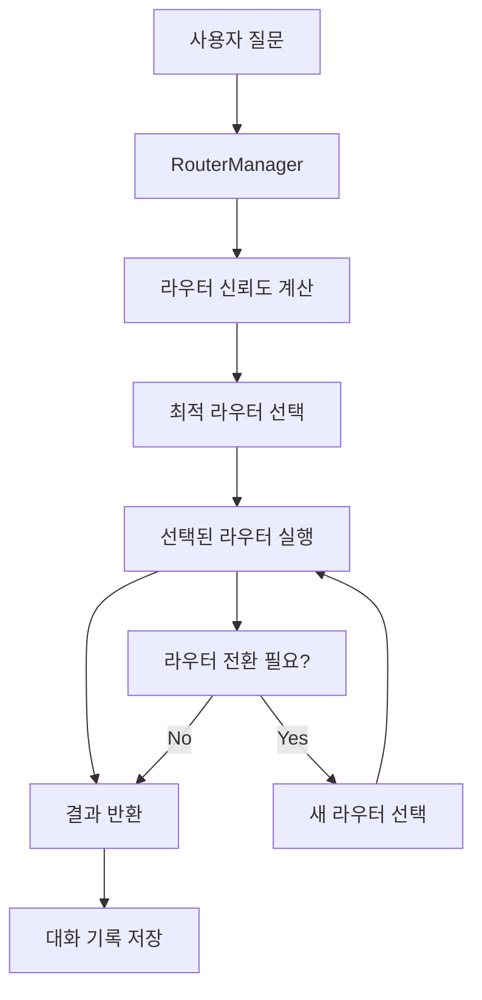

# 🔧 LangGraph 프레임워크 확장 가이드

## 📋 개요
NaruTalk AI 챗봇 시스템의 LangGraph 프레임워크를 확장하고 수정하는 방법을 설명합니다. 현재 시스템은 모듈화된 라우터 아키텍처를 사용하여 사용자 질문을 적절한 전문 모듈로 라우팅합니다.

## 🏗️ 현재 시스템 구조

### 1. 핵심 구조 개요
```
LangGraph 시스템
├── 📁 RouterManager (중앙 관리자)
│   ├── 라우터 선택 로직
│   ├── 대화 기록 관리
│   └── 사용자 설정 관리
├── 📁 BaseRouter (기본 라우터 클래스)
│   ├── 공통 인터페이스
│   ├── 서비스 주입
│   └── 라우터 간 전환 기능
└── 📁 특화 라우터들
    ├── QARouter (질문답변)
    ├── DocumentSearchRouter (문서검색)
    ├── EmployeeInfoRouter (직원정보)
    ├── GeneralChatRouter (일반대화)
    ├── AnalysisRouter (분석)
    └── ReportGeneratorRouter (보고서생성)
```

### 2. 메시지 처리 흐름


## 🔧 라우터 시스템 확장 방법

### 1. 새로운 라우터 추가하기

#### 단계 1: BaseRouter 상속 클래스 생성
```python
# backend/app/services/routers/custom_router.py
from .base_router import BaseRouter, RouterContext, RouterResult, RouterAction
from typing import Dict, Any
import logging

class CustomRouter(BaseRouter):
    """사용자 정의 라우터 예제"""
    
    def __init__(self):
        super().__init__(
            router_name="custom_router",
            description="사용자 정의 기능 처리",
            keywords=["특수기능", "사용자정의", "커스텀"],
            priority=5
        )
    
    async def can_handle(self, context: RouterContext) -> float:
        """라우터 신뢰도 계산"""
        message = context.current_message.lower()
        
        # 키워드 매칭 기반 신뢰도 계산
        keyword_matches = sum(1 for keyword in self.keywords 
                            if keyword in message)
        
        if keyword_matches > 0:
            return min(0.8, keyword_matches * 0.3)
        
        return 0.1
    
    async def handle_message(self, context: RouterContext) -> RouterResult:
        """메시지 처리 로직"""
        try:
            # 사용자 정의 처리 로직
            response = await self._process_custom_logic(context)
            
            return RouterResult(
                response=response,
                action=RouterAction.CONTINUE,
                confidence=0.8,
                sources=[],
                metadata={"router": self.router_name}
            )
        except Exception as e:
            self.logger.error(f"CustomRouter 처리 실패: {str(e)}")
            return RouterResult(
                response="죄송합니다. 사용자 정의 기능 처리 중 오류가 발생했습니다.",
                action=RouterAction.CONTINUE,
                confidence=0.0,
                sources=[],
                metadata={"error": str(e)}
            )
    
    async def _process_custom_logic(self, context: RouterContext) -> str:
        """사용자 정의 처리 로직"""
        # 여기에 특수 기능 구현
        return "사용자 정의 기능이 처리되었습니다."
```

#### 단계 2: 라우터 등록
```python
# backend/app/services/router_manager.py
from .routers.custom_router import CustomRouter

def _init_routers(self):
    """모든 라우터 초기화"""
    router_classes = [
        QARouter,
        DocumentSearchRouter,
        EmployeeInfoRouter,
        GeneralChatRouter,
        AnalysisRouter,
        ReportGeneratorRouter,
        CustomRouter  # 새 라우터 추가
    ]
    # ... 나머지 코드 동일
```

### 2. 4개 핵심 모듈 구성하기

#### 방법 1: 기존 라우터 우선순위 조정
```python
# backend/app/services/router_manager.py
def _init_core_routers(self):
    """핵심 4개 라우터만 초기화"""
    core_router_classes = [
        QARouter,           # 우선순위 8
        DocumentSearchRouter, # 우선순위 7
        EmployeeInfoRouter,  # 우선순위 6
        GeneralChatRouter   # 우선순위 3
    ]
    
    for router_class in core_router_classes:
        # 라우터 초기화 로직...
```

#### 방법 2: 설정 파일로 관리
```python
# backend/app/core/config.py
class Settings(BaseSettings):
    # 4개 핵심 라우터 설정
    core_routers: List[str] = [
        "qa_router",
        "document_search_router", 
        "employee_info_router",
        "general_chat_router"
    ]
    
    # 라우터 활성화/비활성화
    enabled_routers: List[str] = [
        "qa_router",
        "document_search_router",
        "employee_info_router", 
        "general_chat_router"
    ]
```

## 🎯 라우터 유형별 확장 가이드

### 1. QA 라우터 (질문답변)
**위치**: `backend/app/services/routers/qa_router.py`

**확장 포인트**:
- **문서 소스 추가**: 새로운 문서 유형 지원
- **답변 생성 로직**: GPT 모델 프롬프트 개선
- **검색 알고리즘**: 벡터 검색 최적화

**확장 예시**:
```python
async def _search_documents(self, query: str, limit: int = 5) -> List[Dict]:
    """문서 검색 로직 확장"""
    # 기존 벡터 검색
    vector_results = await self._vector_search(query, limit)
    
    # 새로운 검색 방법 추가
    keyword_results = await self._keyword_search(query, limit)
    
    # 하이브리드 검색 결과 조합
    combined_results = self._combine_search_results(
        vector_results, keyword_results
    )
    
    return combined_results
```

### 2. Document Search 라우터 (문서검색)
**위치**: `backend/app/services/routers/document_search_router.py`

**확장 포인트**:
- **검색 필터**: 날짜, 카테고리, 중요도 필터
- **검색 결과 랭킹**: 관련도 점수 계산
- **문서 메타데이터**: 추가 정보 제공

**확장 예시**:
```python
async def _advanced_search(self, query: str, filters: Dict[str, Any]) -> List[Dict]:
    """고급 검색 기능"""
    # 기본 검색
    base_results = await self._basic_search(query)
    
    # 필터 적용
    if filters.get("date_range"):
        base_results = self._filter_by_date(base_results, filters["date_range"])
    
    if filters.get("category"):
        base_results = self._filter_by_category(base_results, filters["category"])
    
    # 결과 랭킹
    ranked_results = self._rank_results(base_results, query)
    
    return ranked_results
```

### 3. Employee Info 라우터 (직원정보)
**위치**: `backend/app/services/routers/employee_info_router.py`

**확장 포인트**:
- **검색 조건**: 부서, 직급, 스킬 기반 검색
- **정보 연결**: 프로젝트, 평가, 교육 이력 연동
- **권한 관리**: 정보 접근 권한 제어

**확장 예시**:
```python
async def _comprehensive_employee_search(self, criteria: Dict[str, Any]) -> List[Dict]:
    """종합적인 직원 정보 검색"""
    base_query = "SELECT * FROM employees WHERE 1=1"
    params = []
    
    # 동적 쿼리 생성
    if criteria.get("department"):
        base_query += " AND department = ?"
        params.append(criteria["department"])
    
    if criteria.get("skill"):
        base_query += " AND skills LIKE ?"
        params.append(f"%{criteria['skill']}%")
    
    # 추가 정보 조인
    extended_query = f"""
    {base_query}
    LEFT JOIN projects ON employees.id = projects.employee_id
    LEFT JOIN evaluations ON employees.id = evaluations.employee_id
    """
    
    return await self._execute_query(extended_query, params)
```

### 4. General Chat 라우터 (일반대화)
**위치**: `backend/app/services/routers/general_chat_router.py`

**확장 포인트**:
- **대화 컨텍스트**: 이전 대화 기억 및 활용
- **감정 분석**: 사용자 감정 상태 파악
- **개인화**: 사용자 선호도 학습

**확장 예시**:
```python
async def _contextual_response(self, context: RouterContext) -> str:
    """컨텍스트를 고려한 응답 생성"""
    # 대화 기록 분석
    conversation_summary = self._analyze_conversation(context.conversation_history)
    
    # 사용자 감정 분석
    user_emotion = await self._analyze_emotion(context.current_message)
    
    # 개인화된 프롬프트 생성
    personalized_prompt = self._create_personalized_prompt(
        context.current_message,
        conversation_summary,
        user_emotion,
        context.user_preferences
    )
    
    # GPT 응답 생성
    response = await self._generate_response(personalized_prompt)
    
    return response
```

## 🔄 라우터 간 전환 시스템

### 1. 라우터 전환 로직
```python
# backend/app/services/routers/base_router.py
class BaseRouter:
    async def should_switch_router(self, context: RouterContext) -> Optional[str]:
        """다른 라우터로 전환이 필요한지 판단"""
        message = context.current_message.lower()
        
        # 명시적 전환 요청
        if "다른 기능" in message or "다음 단계" in message:
            return self._suggest_next_router(context)
        
        # 컨텍스트 기반 전환
        if self._context_suggests_switch(context):
            return self._get_best_router_for_context(context)
        
        return None
    
    def _suggest_next_router(self, context: RouterContext) -> str:
        """다음 라우터 제안"""
        # 현재 라우터에 따른 다음 라우터 제안 로직
        router_flow = {
            "qa_router": "document_search_router",
            "document_search_router": "employee_info_router",
            "employee_info_router": "general_chat_router",
            "general_chat_router": "qa_router"
        }
        
        return router_flow.get(self.router_name, "general_chat_router")
```

### 2. 동적 라우터 관리
```python
# backend/app/services/router_manager.py
class RouterManager:
    def enable_router(self, router_name: str):
        """라우터 활성화"""
        if router_name in self.available_routers:
            self.routers[router_name] = self.available_routers[router_name]
            logger.info(f"라우터 활성화: {router_name}")
    
    def disable_router(self, router_name: str):
        """라우터 비활성화"""
        if router_name in self.routers:
            del self.routers[router_name]
            logger.info(f"라우터 비활성화: {router_name}")
    
    def get_router_status(self) -> Dict[str, Any]:
        """라우터 상태 조회"""
        return {
            "active_routers": list(self.routers.keys()),
            "available_routers": list(self.available_routers.keys()),
            "router_statistics": self.get_router_statistics()
        }
```

## 🎛️ 설정 및 커스터마이징

### 1. 라우터 설정 파일
```python
# backend/app/core/config.py
class Settings(BaseSettings):
    # 라우터 시스템 설정
    router_confidence_threshold: float = 0.5
    max_router_switches: int = 5
    
    # 4개 핵심 라우터 설정
    primary_routers: List[str] = [
        "qa_router",
        "document_search_router",
        "employee_info_router", 
        "general_chat_router"
    ]
    
    # 라우터별 가중치
    router_weights: Dict[str, float] = {
        "qa_router": 0.8,
        "document_search_router": 0.7,
        "employee_info_router": 0.6,
        "general_chat_router": 0.5
    }
    
    # 라우터 전환 설정
    allow_auto_switching: bool = True
    max_context_length: int = 10
```

### 2. 런타임 설정 변경
```python
# 라우터 시스템 설정 API
@router.post("/config/routers")
async def update_router_config(config: RouterConfig):
    """라우터 설정 업데이트"""
    try:
        # 신뢰도 임계값 조정
        if config.confidence_threshold:
            settings.router_confidence_threshold = config.confidence_threshold
        
        # 활성 라우터 변경
        if config.active_routers:
            for router_name in config.active_routers:
                router_manager.enable_router(router_name)
        
        # 비활성 라우터 변경
        if config.disabled_routers:
            for router_name in config.disabled_routers:
                router_manager.disable_router(router_name)
        
        return {"success": True, "message": "라우터 설정이 업데이트되었습니다."}
    except Exception as e:
        return {"success": False, "error": str(e)}
```

## 🧪 테스트 및 디버깅

### 1. 라우터 개별 테스트
```python
# tests/test_routers.py
import pytest
from backend.app.services.routers.qa_router import QARouter
from backend.app.services.routers.base_router import RouterContext

@pytest.mark.asyncio
async def test_qa_router():
    """QA 라우터 테스트"""
    router = QARouter()
    
    # 테스트 컨텍스트 생성
    context = RouterContext(
        current_message="좋은제약 회사에 대해 알려주세요",
        user_id="test_user",
        session_id="test_session",
        conversation_history=[],
        current_router="",
        router_switches=0,
        user_preferences={}
    )
    
    # 신뢰도 테스트
    confidence = await router.can_handle(context)
    assert confidence > 0.5
    
    # 메시지 처리 테스트
    result = await router.handle_message(context)
    assert result.response
    assert result.confidence > 0
```

### 2. 라우터 전환 테스트
```python
@pytest.mark.asyncio
async def test_router_switching():
    """라우터 전환 테스트"""
    router_manager = RouterManager()
    
    # 첫 번째 메시지 (QA)
    result1 = await router_manager.process_message(
        "좋은제약에 대해 알려주세요", "test_user", "test_session"
    )
    assert result1["router_type"] == "qa_router"
    
    # 두 번째 메시지 (문서 검색으로 전환)
    result2 = await router_manager.process_message(
        "관련 문서를 더 찾아주세요", "test_user", "test_session"
    )
    assert result2["router_type"] == "document_search_router"
```

## 📊 성능 모니터링

### 1. 라우터 성능 메트릭
```python
# backend/app/services/router_manager.py
class RouterManager:
    def get_router_performance_metrics(self) -> Dict[str, Any]:
        """라우터 성능 메트릭 조회"""
        metrics = {}
        
        for router_name, router in self.routers.items():
            metrics[router_name] = {
                "total_requests": router.total_requests,
                "avg_response_time": router.avg_response_time,
                "success_rate": router.success_rate,
                "avg_confidence": router.avg_confidence
            }
        
        return metrics
```

### 2. 실시간 모니터링
```python
# 라우터 성능 모니터링 API
@router.get("/metrics/routers")
async def get_router_metrics():
    """라우터 성능 메트릭 조회"""
    return {
        "performance": router_manager.get_router_performance_metrics(),
        "statistics": router_manager.get_router_statistics(),
        "health": await router_manager.health_check()
    }
```

## 🚀 배포 및 운영

### 1. 프로덕션 설정
```python
# backend/app/core/config.py
class ProductionSettings(Settings):
    """프로덕션 환경 설정"""
    debug: bool = False
    router_confidence_threshold: float = 0.7  # 더 높은 신뢰도 요구
    max_router_switches: int = 3  # 전환 횟수 제한
    
    # 로깅 설정
    log_level: str = "INFO"
    log_router_decisions: bool = True
    log_performance_metrics: bool = True
```

### 2. 운영 모니터링
```python
# 라우터 시스템 헬스체크
@router.get("/health/routers")
async def router_health_check():
    """라우터 시스템 헬스체크"""
    health_status = {}
    
    for router_name, router in router_manager.routers.items():
        try:
            # 라우터별 헬스체크
            test_context = RouterContext(
                current_message="테스트 메시지",
                user_id="health_check",
                session_id="health_check",
                conversation_history=[],
                current_router="",
                router_switches=0,
                user_preferences={}
            )
            
            confidence = await router.can_handle(test_context)
            health_status[router_name] = {
                "status": "healthy" if confidence >= 0 else "unhealthy",
                "confidence": confidence,
                "last_check": str(datetime.now())
            }
        except Exception as e:
            health_status[router_name] = {
                "status": "error",
                "error": str(e),
                "last_check": str(datetime.now())
            }
    
    return health_status
```

## 📝 개발 가이드라인

### 1. 새 라우터 개발 체크리스트
- [ ] BaseRouter 클래스 상속
- [ ] can_handle() 메서드 구현
- [ ] handle_message() 메서드 구현
- [ ] 적절한 키워드 및 우선순위 설정
- [ ] 오류 처리 및 로깅 추가
- [ ] 단위 테스트 작성
- [ ] 통합 테스트 작성
- [ ] 문서화 업데이트

### 2. 코드 스타일 가이드
```python
# 라우터 클래스 네이밍
class CustomFunctionRouter(BaseRouter):  # PascalCase + Router 접미사
    
    def __init__(self):
        super().__init__(
            router_name="custom_function_router",  # snake_case
            description="명확한 기능 설명",
            keywords=["관련", "키워드", "목록"],
            priority=5  # 1-10 범위
        )
    
    async def can_handle(self, context: RouterContext) -> float:
        """신뢰도 계산 로직"""
        # 반드시 0.0-1.0 범위 반환
        return 0.5
    
    async def handle_message(self, context: RouterContext) -> RouterResult:
        """메시지 처리 로직"""
        # 반드시 RouterResult 객체 반환
        return RouterResult(...)
```

## 🎯 다음 단계

### 1. 즉시 구현 가능한 확장
1. **4개 핵심 라우터 최적화**
   - QA, 문서검색, 직원정보, 일반대화
   - 신뢰도 계산 로직 개선
   - 라우터 간 전환 플로우 최적화

2. **사용자 경험 개선**
   - 라우터 전환 시 사용자 안내 메시지
   - 진행 상황 표시
   - 대화 컨텍스트 유지

### 2. 중장기 확장 계획
1. **AI 기반 라우터 선택**
   - 머신러닝 기반 라우터 추천
   - 사용자 패턴 학습
   - 동적 신뢰도 조정

2. **다국어 지원**
   - 언어별 라우터 구성
   - 번역 기능 통합
   - 문화적 맥락 고려

3. **API 기반 확장**
   - 외부 서비스 연동 라우터
   - 플러그인 시스템
   - 서드파티 통합

---

## 📍 레포트 위치
- **현재 파일**: `LANGGRAPH_EXTENSION_GUIDE.md`
- **기존 아키텍처 보고서**: `ARCHITECTURE_REPORT.md`
- **관련 코드 위치**:
  - 라우터 매니저: `backend/app/services/router_manager.py`
  - 기본 라우터: `backend/app/services/routers/base_router.py`
  - 특화 라우터들: `backend/app/services/routers/` 디렉토리

이 가이드를 참고하여 NaruTalk AI 챗봇의 LangGraph 시스템을 확장하고 개선할 수 있습니다. 