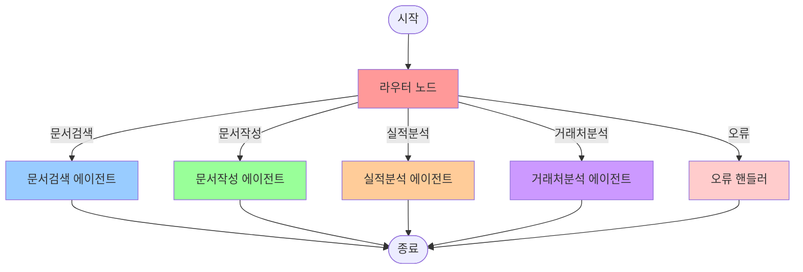

# 🏗️ **LangGraph 라우터 에이전트 파일 구조 완전 가이드**

## 📋 **개요**

LangGraph 기반 라우터 시스템의 완전한 파일 구조와 관리 방법을 설명합니다. 사용자는 **라우터만 관리**하면 되도록 설계되어 있으며, 모든 에이전트는 자동으로 통합 관리됩니다.

---

## 🏗️ **1. 전체 파일 구조**

```
beta_narutalk/
├── backend/
│   └── app/
│       ├── services/
│       │   ├── langgraph_router.py          # 🎯 메인 LangGraph 라우터 (핵심)
│       │   ├── agent_router_manager.py      # ⚠️  기존 커스텀 라우터 (레거시)
│       │   └── router_manager.py            # ⚠️  기존 라우터 (레거시)
│       │
│       ├── api/
│       │   └── v1/
│       │       ├── langgraph_chat.py        # 🎯 LangGraph API 엔드포인트 (신규)
│       │       └── chat.py                  # ⚠️  기존 채팅 API (레거시)
│       │
│       └── agents/                          # 🤖 4개 전문 에이전트들
│           ├── __init__.py                  # 에이전트 패키지 초기화
│           ├── base_agent.py                # 기본 에이전트 클래스
│           │
│           ├── document_search/             # 📄 문서검색 에이전트
│           │   ├── __init__.py
│           │   ├── agent.py                 # 메인 에이전트
│           │   ├── config.py                # 설정
│           │   └── database.py              # 데이터베이스 연동
│           │
│           ├── document_draft/              # ✍️  문서작성 에이전트
│           │   ├── __init__.py
│           │   ├── agent.py                 # 메인 에이전트
│           │   ├── config.py                # 설정
│           │   └── templates.py             # 템플릿 관리
│           │
│           ├── performance_analysis/        # 📊 실적분석 에이전트
│           │   ├── __init__.py
│           │   ├── agent.py                 # 메인 에이전트
│           │   ├── config.py                # 설정
│           │   └── analyzer.py              # 분석 로직
│           │
│           └── client_analysis/             # 🏢 거래처분석 에이전트
│               ├── __init__.py
│               ├── agent.py                 # 메인 에이전트
│               ├── config.py                # 설정
│               └── analyzer.py              # 분석 로직
│
└── LANGGRAPH_ROUTER_FILE_STRUCTURE.md      # 📖 이 문서
```

---

## 🎯 **2. 핵심 파일 상세 설명**

### **2.1 langgraph_router.py (메인 라우터)**

**위치**: `backend/app/services/langgraph_router.py`

**역할**: LangGraph 기반 라우터 시스템의 핵심

**구조**:
```python
# =============================================================================
# 1. LANGGRAPH STATE 정의 (TypedDict 기반)
# =============================================================================
class RouterState(TypedDict):
    # 메시지 관련 (LangGraph 표준)
    messages: Annotated[List[BaseMessage], add_messages]
    current_message: str
    
    # 라우팅 관련
    current_agent: Optional[str]
    routing_confidence: float
    confidence_scores: Dict[str, float]
    
    # 사용자 관련
    user_id: str
    session_id: str
    user_preferences: Dict[str, Any]
    
    # 처리 결과 및 워크플로우 제어
    final_response: str
    is_complete: bool
    workflow_history: List[str]
    # ... 기타 필드들

# =============================================================================
# 2. NODE 함수들 정의 (LangGraph 노드)
# =============================================================================
def router_node(state: RouterState) -> RouterState:
    """라우터 노드 - 최적의 에이전트 선택"""

def document_search_node(state: RouterState) -> RouterState:
    """문서검색 에이전트 노드"""

def document_draft_node(state: RouterState) -> RouterState:
    """문서작성 에이전트 노드"""

def performance_analysis_node(state: RouterState) -> RouterState:
    """실적분석 에이전트 노드"""

def client_analysis_node(state: RouterState) -> RouterState:
    """거래처분석 에이전트 노드"""

def error_handler_node(state: RouterState) -> RouterState:
    """오류 처리 노드"""

# =============================================================================
# 3. 조건부 엣지 함수들 (LangGraph 라우팅)
# =============================================================================
def route_after_router(state: RouterState) -> Literal[...]:
    """라우터 후 조건부 라우팅"""

def should_continue_or_end(state: RouterState) -> Literal["continue", "end"]:
    """계속 처리할지 종료할지 결정"""

# =============================================================================
# 4. HELPER 함수들
# =============================================================================
def _calculate_search_confidence(message: str) -> float:
def _calculate_draft_confidence(message: str) -> float:
def _calculate_performance_confidence(message: str) -> float:
def _calculate_client_confidence(message: str) -> float:

# =============================================================================
# 5. LANGGRAPH 워크플로우 클래스
# =============================================================================
class LangGraphRouter:
    """LangGraph 기반 라우터 시스템"""
    
    def __init__(self):
        self._initialize_workflow()
    
    async def process_message(self, message: str, user_id: str, session_id: str) -> Dict[str, Any]:
        """메시지 처리 메인 함수"""
```

**관리 포인트**:
- ✅ **라우터 노드**: 신뢰도 계산 로직 조정
- ✅ **조건부 엣지**: 라우팅 규칙 설정
- ✅ **상태 관리**: RouterState 필드 추가/수정
- ✅ **에러 핸들링**: 오류 처리 로직 개선

---

### **2.2 langgraph_chat.py (API 엔드포인트)**

**위치**: `backend/app/api/v1/langgraph_chat.py`

**역할**: LangGraph 라우터의 API 인터페이스

**주요 엔드포인트**:
```python
@router.post("/langgraph/chat")
async def chat_with_langgraph_router(request: LangGraphChatRequest):
    """메인 채팅 엔드포인트"""

@router.get("/langgraph/status")
async def get_langgraph_status():
    """라우터 상태 확인"""

@router.get("/langgraph/workflow")
async def get_workflow_structure():
    """워크플로우 구조 정보"""

@router.post("/langgraph/test")
async def test_langgraph_router():
    """라우터 테스트"""
```

**관리 포인트**:
- ✅ **API 스키마**: 요청/응답 모델 수정
- ✅ **엔드포인트**: 새로운 기능 추가
- ✅ **에러 핸들링**: API 레벨 오류 처리

---

## 🤖 **3. 에이전트 구조 (자동 통합 관리)**

### **3.1 BaseAgent 클래스**

**위치**: `backend/app/agents/base_agent.py`

**역할**: 모든 에이전트의 공통 기능 제공

**구조**:
```python
class BaseAgent(ABC):
    def __init__(self, agent_name: str):
        self.agent_name = agent_name
        # 서비스 의존성
        self.openai_client = None
        self.embedding_service = None
        self.database_service = None
    
    @abstractmethod
    async def can_handle(self, context: AgentContext) -> float:
        """신뢰도 계산"""
    
    @abstractmethod
    async def process(self, context: AgentContext) -> AgentResult:
        """메시지 처리"""
    
    def set_services(self, **services):
        """서비스 의존성 주입"""
```

### **3.2 4개 전문 에이전트**

#### **문서검색 에이전트 (DocumentSearchAgent)**
```python
# backend/app/agents/document_search/agent.py
class DocumentSearchAgent(BaseAgent):
    @property
    def description(self) -> str:
        return "내부/외부 문서 검색을 전담하는 전문 에이전트"
    
    @property
    def keywords(self) -> List[str]:
        return ["검색", "찾아", "조회", "문서", "자료", "정보"]
    
    async def can_handle(self, context: AgentContext) -> float:
        # 신뢰도 계산 로직
    
    async def process(self, context: AgentContext) -> AgentResult:
        # 문서 검색 처리 로직
```

#### **문서작성 에이전트 (DocumentDraftAgent)**
```python
# backend/app/agents/document_draft/agent.py
class DocumentDraftAgent(BaseAgent):
    @property
    def keywords(self) -> List[str]:
        return ["작성", "초안", "문서", "보고서", "제안서", "계획서"]
    
    async def process(self, context: AgentContext) -> AgentResult:
        # 문서 작성 처리 로직
```

#### **실적분석 에이전트 (PerformanceAnalysisAgent)**
```python
# backend/app/agents/performance_analysis/agent.py
class PerformanceAnalysisAgent(BaseAgent):
    @property
    def keywords(self) -> List[str]:
        return ["실적", "성과", "분석", "매출", "수익", "KPI"]
    
    async def process(self, context: AgentContext) -> AgentResult:
        # 실적 분석 처리 로직
```

#### **거래처분석 에이전트 (ClientAnalysisAgent)**
```python
# backend/app/agents/client_analysis/agent.py
class ClientAnalysisAgent(BaseAgent):
    @property
    def keywords(self) -> List[str]:
        return ["거래처", "고객", "파트너", "클라이언트", "업체"]
    
    async def process(self, context: AgentContext) -> AgentResult:
        # 거래처 분석 처리 로직
```

---

## 🎛️ **4. 라우터 관리 방법**

### **4.1 라우터만 관리하는 설계 철학**

**핵심 원칙**: 사용자는 **라우터만 관리**하고, 나머지는 자동으로 처리

```python
# 라우터에서 모든 에이전트 자동 관리
_agents = {}

def _get_document_search_agent():
    if "document_search" not in _agents:
        _agents["document_search"] = DocumentSearchAgent()
    return _agents["document_search"]

# 라우터에서 자동 서비스 설정
class LangGraphRouter:
    def set_agent_services(self, **services):
        """모든 에이전트에 서비스 자동 설정"""
        for agent in _agents.values():
            agent.set_services(**services)
```

### **4.2 라우터 설정 변경**

#### **신뢰도 계산 로직 수정**
```python
def _calculate_search_confidence(message: str) -> float:
    """문서검색 신뢰도 계산 - 여기서 수정"""
    search_keywords = ["검색", "찾아", "조회", "문서", "자료"]
    confidence = 0.0
    for keyword in search_keywords:
        if keyword in message:
            confidence += 0.2  # 🎯 가중치 조정
    return min(confidence, 1.0)
```

#### **라우팅 규칙 변경**
```python
def route_after_router(state: RouterState) -> Literal[...]:
    """라우터 후 조건부 라우팅 - 여기서 수정"""
    confidence = state.get("routing_confidence", 0.0)
    
    # 🎯 임계값 조정
    if confidence < 0.3:  # 30% → 다른 값으로 변경 가능
        return "error"
    
    # 🎯 특별한 라우팅 규칙 추가 가능
    message = state.get("current_message", "").lower()
    if "긴급" in message:
        return "document_search"  # 긴급 시 검색 우선
    
    return state.get("current_agent")
```

### **4.3 새로운 에이전트 추가**

**1단계**: 새로운 에이전트 생성
```python
# backend/app/agents/new_agent/agent.py
class NewAgent(BaseAgent):
    def __init__(self):
        super().__init__("new_agent")
    
    @property
    def keywords(self) -> List[str]:
        return ["새기능", "특별", "커스텀"]
    
    async def process(self, context: AgentContext) -> AgentResult:
        # 새로운 처리 로직
```

**2단계**: 라우터에 등록
```python
# langgraph_router.py에 추가
def new_agent_node(state: RouterState) -> RouterState:
    """새로운 에이전트 노드"""
    # 노드 로직

def _calculate_new_confidence(message: str) -> float:
    """새로운 에이전트 신뢰도 계산"""
    # 신뢰도 계산

def _get_new_agent():
    if "new_agent" not in _agents:
        _agents["new_agent"] = NewAgent()
    return _agents["new_agent"]

# 워크플로우에 노드 추가
workflow.add_node("new_agent", new_agent_node)
```

---

## 🔧 **5. 일상적인 관리 작업**

### **5.1 라우터 성능 모니터링**

```python
# GET /langgraph/status로 확인
{
    "status": "healthy",
    "router_type": "LangGraph",
    "statistics": {
        "total_nodes": 6,
        "agent_nodes": 4,
        "total_agents": 4,
        "available_agents": ["document_search", "document_draft", ...]
    }
}
```

### **5.2 라우팅 통계 확인**

```python
# GET /langgraph/workflow로 확인
{
    "workflow_structure": "START → router → [agents] → END",
    "statistics": {...},
    "description": "LangGraph 기반 4개 전문 에이전트 라우터 시스템"
}
```

### **5.3 라우터 테스트**

```python
# POST /langgraph/test로 확인
{
    "test_status": "completed",
    "test_results": [
        {
            "test_message": "문서를 찾아주세요",
            "selected_agent": "document_search",
            "confidence": 0.8,
            "workflow_history": ["routed_to_document_search", ...]
        }
    ]
}
```

---

## 🚀 **6. 고급 관리 기능**

### **6.1 동적 라우팅 규칙**

```python
# 사용자별 맞춤 라우팅
def route_after_router(state: RouterState) -> Literal[...]:
    user_prefs = state.get("user_preferences", {})
    preferred_agent = user_prefs.get("preferred_agent")
    
    if preferred_agent and state.get("routing_confidence", 0) > 0.5:
        return preferred_agent
    
    return state.get("current_agent")
```

### **6.2 라우터 상태 관리**

```python
# 상태 기반 복잡한 라우팅
def router_node(state: RouterState) -> RouterState:
    # 이전 대화 기록 고려
    history = state.get("conversation_history", [])
    last_agent = None
    if history:
        last_agent = history[-1].get("agent_type")
    
    # 연속성 고려한 라우팅
    if last_agent == "document_search":
        state["routing_confidence"] += 0.1  # 보너스 점수
    
    return state
```

### **6.3 오류 복구 및 폴백**

```python
def error_handler_node(state: RouterState) -> RouterState:
    error_msg = state.get("error_message", "")
    
    # 에러 유형별 다른 처리
    if "timeout" in error_msg:
        state["final_response"] = "처리 시간이 초과되었습니다. 잠시 후 다시 시도해주세요."
    elif "permission" in error_msg:
        state["final_response"] = "권한이 없습니다. 관리자에게 문의하세요."
    else:
        state["final_response"] = "일시적인 오류가 발생했습니다."
    
    return state
```

---

## 📊 **7. 시각적 워크플로우**



---

## 🎯 **8. 관리 체크리스트**

### **일일 관리**
- [ ] 라우터 상태 확인 (`GET /langgraph/status`)
- [ ] 오류 로그 점검
- [ ] 응답 시간 모니터링

### **주간 관리**
- [ ] 라우팅 정확도 분석
- [ ] 에이전트별 사용량 통계 확인
- [ ] 신뢰도 임계값 조정 검토

### **월간 관리**
- [ ] 새로운 키워드 패턴 분석
- [ ] 라우팅 규칙 최적화
- [ ] 에이전트 성능 개선 검토

---

## 🔧 **9. 문제 해결 가이드**

### **라우팅 정확도가 낮을 때**
1. 신뢰도 계산 함수 확인
2. 키워드 목록 업데이트
3. 임계값 조정

### **특정 에이전트가 선택되지 않을 때**
1. 해당 에이전트의 키워드 확인
2. 신뢰도 계산 로직 점검
3. 테스트 메시지로 검증

### **오류가 자주 발생할 때**
1. 오류 핸들러 로그 확인
2. 에이전트 초기화 상태 점검
3. 서비스 의존성 확인

---

## 📝 **결론**

LangGraph 라우터 시스템은 **라우터 중심의 관리 철학**을 따릅니다:

1. **단일 관리 포인트**: `langgraph_router.py`에서 모든 것을 관리
2. **자동화된 에이전트 통합**: 에이전트들은 자동으로 로드 및 관리
3. **선언적 워크플로우**: TypedDict와 조건부 엣지로 명확한 구조
4. **확장성**: 새로운 에이전트나 규칙을 쉽게 추가
5. **모니터링**: 내장된 상태 확인 및 테스트 기능

**핵심 메시지**: 사용자는 `langgraph_router.py` 파일 하나만 관리하면 모든 라우팅과 에이전트 조정이 가능합니다! 