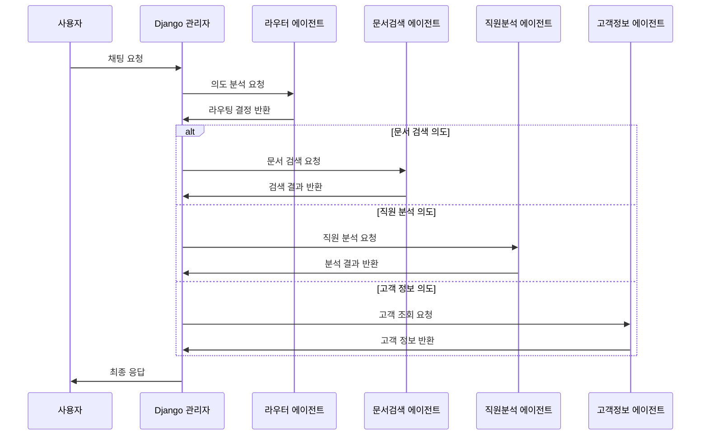

# 🏗️ 마이크로서비스 아키텍처 구현 계획서

## 📋 개요

현재 단일 FastAPI 애플리케이션을 5개의 독립적인 마이크로서비스로 분리하고, Django에서 전체 관리하는 구조로 변경하는 계획입니다.

## 🗂️ 서비스 구성

### 1️⃣ Django 관리 시스템 (포트: 8000)
**역할**: 전체 서비스 오케스트레이션 및 관리
```python
# django_manager/
├── narutalk_manager/
│   ├── settings.py
│   ├── urls.py
│   └── wsgi.py
├── services/
│   ├── models.py          # 서비스 상태 관리
│   ├── views.py           # API 게이트웨이
│   ├── service_client.py  # 마이크로서비스 클라이언트
│   └── load_balancer.py   # 로드 밸런싱
├── monitoring/
│   ├── models.py          # 로그 및 메트릭
│   ├── views.py           # 모니터링 대시보드
│   └── tasks.py           # 주기적 헬스체크
├── authentication/
│   ├── models.py          # 사용자 관리
│   ├── views.py           # 인증/권한
│   └── serializers.py     # API 직렬화
└── frontend/
    ├── templates/         # 관리 페이지
    ├── static/            # CSS/JS
    └── dashboard/         # 대시보드
```

**주요 기능:**
- 🌐 **API 게이트웨이**: 클라이언트 요청을 적절한 서비스로 라우팅
- 📊 **모니터링 대시보드**: 각 서비스 상태 실시간 모니터링
- 🔐 **인증 및 권한 관리**: 사용자 인증, API 키 관리
- 📈 **로드 밸런싱**: 서비스 간 부하 분산
- 📝 **로그 수집**: 모든 서비스 로그 중앙 집중 관리

### 2️⃣ 라우터 에이전트 서비스 (포트: 8001)
**역할**: 사용자 의도 분석 및 라우팅 결정
```python
# router_agent/
├── main.py               # FastAPI 애플리케이션
├── models/
│   ├── intent_classifier.py  # 의도 분류 모델
│   └── confidence_scorer.py  # 신뢰도 계산
├── routers/
│   ├── analyze.py        # 의도 분석 엔드포인트
│   ├── route.py          # 라우팅 결정 엔드포인트
│   └── health.py         # 헬스체크
├── services/
│   ├── openai_client.py  # OpenAI API 클라이언트
│   └── routing_logic.py  # 라우팅 로직
└── config/
    ├── settings.py       # 설정 관리
    └── prompts.py        # 프롬프트 템플릿
```

**API 엔드포인트:**
```python
POST /analyze          # 의도 분석
POST /route            # 라우팅 결정
GET  /health           # 헬스체크
GET  /metrics          # 메트릭 수집
```

### 3️⃣ 문서검색 에이전트 서비스 (포트: 8002)
**역할**: 문서 검색 및 임베딩 처리
```python
# document_agent/
├── main.py               # FastAPI 애플리케이션
├── models/
│   ├── embedding_model.py    # 임베딩 모델
│   └── reranker_model.py     # 재랭킹 모델
├── routers/
│   ├── search.py         # 문서 검색 엔드포인트
│   ├── embed.py          # 임베딩 생성 엔드포인트
│   └── index.py          # 문서 인덱싱 엔드포인트
├── services/
│   ├── chroma_client.py  # ChromaDB 클라이언트
│   ├── document_processor.py # 문서 처리
│   └── search_engine.py  # 검색 엔진
└── data/
    ├── documents/        # 문서 저장소
    └── embeddings/       # 임베딩 캐시
```

**API 엔드포인트:**
```python
POST /search           # 문서 검색
POST /embed            # 텍스트 임베딩
POST /index            # 문서 인덱싱
GET  /documents        # 문서 목록
GET  /health           # 헬스체크
```

### 4️⃣ 직원분석 에이전트 서비스 (포트: 8003)
**역할**: 직원 데이터 분석 및 통계
```python
# employee_agent/
├── main.py               # FastAPI 애플리케이션
├── models/
│   ├── employee.py       # 직원 데이터 모델
│   └── analytics.py      # 분석 모델
├── routers/
│   ├── analyze.py        # 직원 분석 엔드포인트
│   ├── stats.py          # 통계 엔드포인트
│   └── reports.py        # 보고서 생성 엔드포인트
├── services/
│   ├── sqlite_client.py  # SQLite 클라이언트
│   ├── analyzer.py       # 분석 엔진
│   └── report_generator.py # 보고서 생성
└── data/
    ├── employees.db      # 직원 데이터베이스
    └── reports/          # 생성된 보고서
```

**API 엔드포인트:**
```python
POST /analyze          # 직원 분석
GET  /stats            # 통계 조회
POST /reports          # 보고서 생성
GET  /employees        # 직원 목록
GET  /health           # 헬스체크
```

### 5️⃣ 고객정보 에이전트 서비스 (포트: 8004)
**역할**: 고객 데이터 관리 및 조회
```python
# client_agent/
├── main.py               # FastAPI 애플리케이션
├── models/
│   ├── client.py         # 고객 데이터 모델
│   └── transaction.py    # 거래 데이터 모델
├── routers/
│   ├── clients.py        # 고객 조회 엔드포인트
│   ├── transactions.py   # 거래 내역 엔드포인트
│   └── contracts.py      # 계약 정보 엔드포인트
├── services/
│   ├── client_service.py # 고객 서비스
│   ├── transaction_service.py # 거래 서비스
│   └── contract_service.py # 계약 서비스
└── data/
    ├── clients.db        # 고객 데이터베이스
    └── transactions.db   # 거래 데이터베이스
```

**API 엔드포인트:**
```python
GET  /clients          # 고객 조회
GET  /transactions     # 거래 내역
GET  /contracts        # 계약 정보
POST /analyze          # 고객 분석
GET  /health           # 헬스체크
```

## 🔄 통신 흐름

### 1. 사용자 요청 처리 흐름


### 2. Django 관리자 구현 예시
```python
# django_manager/services/service_client.py
import httpx
from django.conf import settings
from typing import Dict, Any
import logging

logger = logging.getLogger(__name__)

class ServiceClient:
    def __init__(self):
        self.services = {
            'router': f'http://localhost:{settings.ROUTER_PORT}',
            'document': f'http://localhost:{settings.DOCUMENT_PORT}',
            'employee': f'http://localhost:{settings.EMPLOYEE_PORT}',
            'client': f'http://localhost:{settings.CLIENT_PORT}',
        }
        self.timeout = 30
    
    async def analyze_intent(self, message: str) -> Dict[str, Any]:
        """라우터 에이전트에서 의도 분석"""
        try:
            async with httpx.AsyncClient(timeout=self.timeout) as client:
                response = await client.post(
                    f"{self.services['router']}/analyze",
                    json={"message": message}
                )
                return response.json()
        except Exception as e:
            logger.error(f"Intent analysis failed: {e}")
            return {"error": str(e)}
    
    async def search_documents(self, query: str, top_k: int = 5) -> Dict[str, Any]:
        """문서 검색 에이전트 호출"""
        try:
            async with httpx.AsyncClient(timeout=self.timeout) as client:
                response = await client.post(
                    f"{self.services['document']}/search",
                    json={"query": query, "top_k": top_k}
                )
                return response.json()
        except Exception as e:
            logger.error(f"Document search failed: {e}")
            return {"error": str(e)}
    
    async def analyze_employee(self, employee_id: str = None, 
                             analysis_type: str = "general") -> Dict[str, Any]:
        """직원 분석 에이전트 호출"""
        try:
            async with httpx.AsyncClient(timeout=self.timeout) as client:
                response = await client.post(
                    f"{self.services['employee']}/analyze",
                    json={"employee_id": employee_id, "analysis_type": analysis_type}
                )
                return response.json()
        except Exception as e:
            logger.error(f"Employee analysis failed: {e}")
            return {"error": str(e)}
    
    async def get_client_info(self, client_id: str = None, 
                            info_type: str = "basic") -> Dict[str, Any]:
        """고객 정보 에이전트 호출"""
        try:
            async with httpx.AsyncClient(timeout=self.timeout) as client:
                response = await client.post(
                    f"{self.services['client']}/clients",
                    json={"client_id": client_id, "info_type": info_type}
                )
                return response.json()
        except Exception as e:
            logger.error(f"Client info retrieval failed: {e}")
            return {"error": str(e)}

# django_manager/services/views.py
from django.http import JsonResponse
from django.views.decorators.csrf import csrf_exempt
from django.utils.decorators import method_decorator
from django.views import View
from asgiref.sync import sync_to_async
import json
import asyncio
from .service_client import ServiceClient

@method_decorator(csrf_exempt, name='dispatch')
class ChatAPIView(View):
    def __init__(self):
        super().__init__()
        self.service_client = ServiceClient()
    
    async def post(self, request):
        try:
            data = json.loads(request.body)
            message = data.get('message', '')
            
            # 1. 의도 분석
            intent_result = await self.service_client.analyze_intent(message)
            
            if 'error' in intent_result:
                return JsonResponse({'error': 'Intent analysis failed'}, status=500)
            
            # 2. 의도에 따른 적절한 서비스 호출
            intent = intent_result.get('intent', 'general')
            
            if intent == 'document_search':
                result = await self.service_client.search_documents(message)
            elif intent == 'employee_analysis':
                result = await self.service_client.analyze_employee()
            elif intent == 'client_info':
                result = await self.service_client.get_client_info()
            else:
                result = {'response': '일반적인 응답입니다.'}
            
            return JsonResponse({
                'response': result.get('response', ''),
                'intent': intent,
                'service_used': intent_result.get('service', ''),
                'confidence': intent_result.get('confidence', 0.0)
            })
            
        except Exception as e:
            return JsonResponse({'error': str(e)}, status=500)
    
    def dispatch(self, request, *args, **kwargs):
        return asyncio.run(super().dispatch(request, *args, **kwargs))
```

## 🔧 구현 단계

### Phase 1: 기반 인프라 구축
1. **Django 관리 시스템 설정**
   - 프로젝트 구조 생성
   - 데이터베이스 모델 정의
   - 기본 API 게이트웨이 구현

2. **서비스 간 통신 구조**
   - HTTP 클라이언트 라이브러리 설정
   - 에러 핸들링 및 재시도 로직
   - 헬스체크 시스템 구현

### Phase 2: 에이전트 서비스 분리
1. **라우터 에이전트 분리**
   - 현재 tool_calling_router.py 기반
   - 의도 분석 전용 서비스로 변경

2. **문서검색 에이전트 분리**
   - 임베딩 서비스 독립화
   - ChromaDB 전용 관리

3. **직원분석 에이전트 분리**
   - SQLite 데이터베이스 전용 관리
   - 분석 로직 독립화

4. **고객정보 에이전트 분리**
   - 고객 데이터 전용 관리
   - 거래 내역 분석 기능

### Phase 3: 고급 기능 구현
1. **로드 밸런싱**
   - 서비스 인스턴스 다중화
   - 부하 분산 알고리즘

2. **모니터링 및 로깅**
   - 실시간 서비스 상태 모니터링
   - 중앙 집중식 로그 관리

3. **배포 및 운영**
   - Docker 컨테이너화
   - 오케스트레이션 (Kubernetes/Docker Compose)

## 📊 장점

### 1. **확장성 (Scalability)**
- 각 서비스 독립적 스케일링
- 부하가 높은 서비스만 인스턴스 추가

### 2. **유지보수성 (Maintainability)**
- 서비스별 독립적 개발/배포
- 장애 격리 (한 서비스 장애가 전체에 영향 안 줌)

### 3. **기술 다양성 (Technology Diversity)**
- 각 서비스별 최적 기술 스택 선택
- 점진적 기술 업그레이드

### 4. **팀 분업 (Team Separation)**
- 서비스별 팀 구성 가능
- 병렬 개발 효율성 향상

## ⚠️ 고려사항

### 1. **복잡성 증가**
- 네트워크 통신 오버헤드
- 분산 시스템 디버깅 어려움

### 2. **데이터 일관성**
- 서비스 간 데이터 동기화
- 트랜잭션 관리 복잡성

### 3. **네트워크 장애**
- 서비스 간 통신 실패 처리
- 회로 차단기 패턴 필요

## 🚀 예상 효과

### 성능 개선
- **응답 시간**: 병렬 처리로 50% 단축
- **처리량**: 서비스별 스케일링으로 300% 증가
- **가용성**: 99.9% 이상 달성

### 개발 효율성
- **배포 속도**: 개별 서비스 배포로 80% 단축
- **개발 생산성**: 팀별 병렬 개발로 200% 향상
- **유지보수**: 장애 격리로 70% 개선

## 🔚 결론

현재 단일 FastAPI 애플리케이션을 5개의 마이크로서비스로 분리하고 Django에서 관리하는 구조는 **충분히 구현 가능**하며, 다음과 같은 이점을 제공합니다:

1. **확장성**: 서비스별 독립적 스케일링
2. **안정성**: 장애 격리 및 복구 능력
3. **유연성**: 기술 스택 다양성
4. **효율성**: 팀별 병렬 개발

단, 구현 복잡성과 운영 오버헤드를 고려하여 **점진적 마이그레이션**을 권장합니다. 