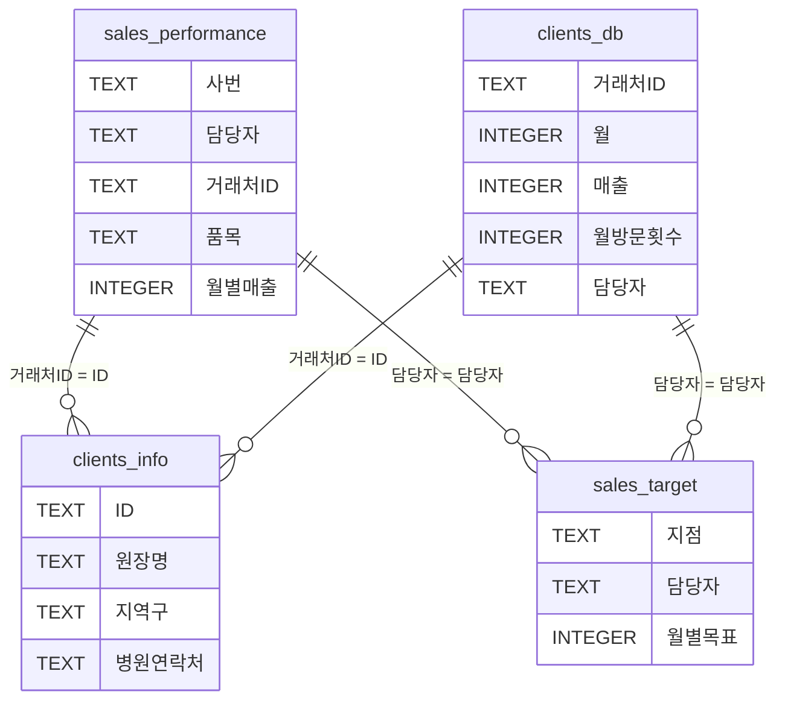

# Sales Performance Database Schema Documentation

## Overview
판매 성과 관리 시스템의 데이터베이스 스키마 문서입니다. 총 4개의 SQLite 데이터베이스로 구성되어 있으며, 각각 다른 도메인의 데이터를 관리합니다.

---

## 1. sales_performance_db.db
**목적**: 월별 판매 실적 데이터 저장
**테이블 수**: 1개
**총 레코드**: 1,711개

### Table: sales_performance
담당자별 거래처별 품목별 월별 매출 실적을 저장합니다.

| Column | Type | Description | Example |
|--------|------|-------------|---------|
| 사번 | TEXT | 직원 사번 | MR-01023 |
| 담당자 | TEXT | 담당자 이름 | 윤수아 |
| 거래처ID | TEXT | 거래처 고유 식별자 | 파라곤이비인후과 |
| 품목 | TEXT | 판매 품목명 | 가스몬, 레보플록사신, 클래트론 |
| 202212 | INTEGER | 2022년 12월 매출액 | 79,864 |
| 202301-202312 | INTEGER | 2023년 1월-12월 매출액 | - |
| 202401-202411 | INTEGER | 2024년 1월-11월 매출액 | - |

**특징**:
- 월별 컬럼이 `YYYYMM` 형식으로 되어 있음 (피벗 테이블 구조)
- 2022년 12월부터 2024년 11월까지의 데이터 보유
- 품목별로 별도 레코드로 저장 (정규화되지 않은 구조)

**인덱스**: 없음

**주요 쿼리 패턴**:
```sql
-- 특정 담당자의 월별 실적 조회
SELECT * FROM sales_performance WHERE 담당자 = '윤수아';

-- 특정 월의 전체 매출 합계
SELECT SUM(`202411`) FROM sales_performance;

-- 담당자별 월별 실적 집계
SELECT 담당자, SUM(`202411`) as total
FROM sales_performance
GROUP BY 담당자;
```

---

## 2. sales_target_db.db
**목적**: 지점별 담당자별 월별 판매 목표 저장
**테이블 수**: 1개
**총 레코드**: 6개

### Table: 지점별목표
지점별 담당자의 월별 판매 목표액을 저장합니다.

| Column | Type | Description | Example |
|--------|------|-------------|---------|
| 지점 | TEXT | 소속 지점/팀 | 서부팀 |
| 담당자 | TEXT | 담당자 이름 | 윤수아 |
| 202312 | INTEGER | 2023년 12월 목표액 | 40,000,000 |
| 202401-202411 | INTEGER | 2024년 1월-11월 목표액 | - |

**특징**:
- 목표액은 원 단위로 저장 (예: 40,000,000원)
- 현재 서부팀, 동부팀 등 6명의 담당자 데이터만 존재
- 월별 목표가 점진적으로 증가하는 패턴

**담당자 목록**:
- 서부팀: 조하은, 정예준, 윤수아
- 동부팀: 최수아, 김민지, 박지호

**주요 쿼리 패턴**:
```sql
-- 담당자별 목표 대비 실적 달성률
SELECT
    담당자,
    목표액,
    실적액,
    (실적액 * 100.0 / 목표액) as 달성률
FROM ...
```

---

## 3. clients_db.db
**목적**: 거래처별 월별 활동 및 성과 데이터 저장
**테이블 수**: 1개
**총 레코드**: 6,912개

### Table: 거래처자료
거래처별 월별 영업 활동 및 성과 데이터를 저장합니다.

| Column | Type | Description | Example | Notes |
|--------|------|-------------|---------|-------|
| 거래처ID | TEXT | 거래처 식별자 | 강재현내과의원 | |
| 월 | INTEGER | 년월 (YYYYMM) | 202212 | ⚠️ 저장된 값: 202,212 (쉼표 포함) |
| 매출 | INTEGER | 월 매출액 | 210,707 | |
| 월방문횟수 | INTEGER | 월간 방문 횟수 | 6 | |
| 사용 예산 | INTEGER | 사용된 마케팅 예산 | 25,000 | |
| 총환자수 | INTEGER | 병원 총 환자수 | 1,265 | |
| 담당자 | TEXT | 담당 영업사원 | 윤수아 | |

**⚠️ 데이터 이슈**:
- '월' 컬럼이 숫자 형식으로 저장되어 천단위 구분자가 포함됨 (202,212 instead of 202212)
- 데이터 조회 시 형변환 필요

**주요 쿼리 패턴**:
```sql
-- 거래처별 월별 활동 조회
SELECT * FROM 거래처자료
WHERE 거래처ID = '강재현내과의원'
ORDER BY 월;

-- 담당자별 거래처 수 및 총 매출
SELECT 담당자,
       COUNT(DISTINCT 거래처ID) as 거래처수,
       SUM(매출) as 총매출
FROM 거래처자료
GROUP BY 담당자;
```

---

## 4. clients_info.db
**목적**: 거래처 기본 정보 저장 (마스터 데이터)
**테이블 수**: 1개
**총 레코드**: 288개

### Table: 거래처정보
거래처(병원/의원)의 기본 정보를 저장합니다.

| Column | Type | Description | Example |
|--------|------|-------------|---------|
| ID | TEXT | 거래처 고유 식별자 | 강재현내과의원 |
| 원장명 | TEXT | 병원 원장 이름 | 김재현 |
| 지역구 | TEXT | 소재 지역구 | 양천구 |
| 병원연락처 | TEXT | 대표 전화번호 | 02-3780-4942 |

**특징**:
- 거래처 마스터 데이터 (정적 정보)
- 총 288개 병원/의원 정보 보유
- ID가 Primary Key 역할 (다른 테이블과 조인 키)

**주요 쿼리 패턴**:
```sql
-- 지역구별 거래처 수
SELECT 지역구, COUNT(*) as 거래처수
FROM 거래처정보
GROUP BY 지역구;

-- 거래처 상세 정보 조회
SELECT * FROM 거래처정보
WHERE ID = '강재현내과의원';
```

---

## 데이터베이스 간 관계 (Relationships)



---

## 주요 비즈니스 쿼리

### 1. 담당자 실적 vs 목표 비교
```sql
WITH 월별실적 AS (
    SELECT 담당자,
           SUM(`202411`) as 실적
    FROM sales_performance
    GROUP BY 담당자
)
SELECT
    t.담당자,
    t.지점,
    t.`202411` as 목표,
    COALESCE(p.실적, 0) as 실적,
    ROUND(COALESCE(p.실적, 0) * 100.0 / t.`202411`, 2) as 달성률
FROM 지점별목표 t
LEFT JOIN 월별실적 p ON t.담당자 = p.담당자;
```

### 2. 거래처별 매출 추이
```sql
SELECT
    sp.거래처ID,
    ci.원장명,
    ci.지역구,
    SUM(sp.`202409`) as '9월',
    SUM(sp.`202410`) as '10월',
    SUM(sp.`202411`) as '11월'
FROM sales_performance sp
JOIN clients_info ci ON sp.거래처ID = ci.ID
GROUP BY sp.거래처ID, ci.원장명, ci.지역구;
```

### 3. 품목별 판매 실적
```sql
SELECT
    품목,
    COUNT(DISTINCT 거래처ID) as 거래처수,
    COUNT(DISTINCT 담당자) as 담당자수,
    SUM(`202411`) as 총매출
FROM sales_performance
WHERE `202411` > 0
GROUP BY 품목
ORDER BY 총매출 DESC;
```

---

## 데이터 품질 이슈 및 개선 제안

### 현재 이슈:
1. **비정규화된 구조**: 월별 데이터가 컬럼으로 저장 (피벗 테이블)
2. **데이터 타입 불일치**: clients_db의 '월' 컬럼에 천단위 구분자 포함
3. **인덱스 부재**: 조회 성능 향상을 위한 인덱스 없음
4. **참조 무결성 부재**: Foreign Key 제약 조건 없음

### 개선 제안:

#### 1. 정규화된 스키마 구조
```sql
-- 제안: sales_performance 테이블 정규화
CREATE TABLE sales_performance_normalized (
    id INTEGER PRIMARY KEY AUTOINCREMENT,
    사번 TEXT NOT NULL,
    담당자 TEXT NOT NULL,
    거래처ID TEXT NOT NULL,
    품목 TEXT NOT NULL,
    년월 TEXT NOT NULL,  -- 'YYYYMM' format
    매출액 INTEGER DEFAULT 0,
    created_at TIMESTAMP DEFAULT CURRENT_TIMESTAMP,
    FOREIGN KEY (거래처ID) REFERENCES clients_info(ID)
);

-- 인덱스 추가
CREATE INDEX idx_담당자_년월 ON sales_performance_normalized(담당자, 년월);
CREATE INDEX idx_거래처_년월 ON sales_performance_normalized(거래처ID, 년월);
```

#### 2. 데이터 타입 수정
```sql
-- clients_db의 월 컬럼 수정
UPDATE 거래처자료
SET 월 = REPLACE(월, ',', '')
WHERE 월 LIKE '%,%';
```

#### 3. 뷰(View) 생성으로 쿼리 간소화
```sql
-- 월별 실적 요약 뷰
CREATE VIEW v_monthly_performance AS
SELECT
    담당자,
    SUBSTR(년월, 1, 4) as 년도,
    SUBSTR(년월, 5, 2) as 월,
    SUM(매출액) as 총매출
FROM sales_performance_normalized
GROUP BY 담당자, 년월;
```

---

## 사용 시 주의사항

1. **월 컬럼명**: 백틱(`)을 사용하여 숫자로 된 컬럼명 처리
   ```sql
   SELECT `202411` FROM sales_performance;  -- 올바름
   SELECT 202411 FROM sales_performance;    -- 오류
   ```

2. **NULL 값 처리**: 매출이 없는 경우 0 또는 NULL로 저장됨
   ```sql
   SELECT COALESCE(`202411`, 0) as 매출 FROM sales_performance;
   ```

3. **날짜 범위 쿼리**: 현재 구조에서는 동적 쿼리 생성 필요
   ```python
   # Python 예제
   months = ['202409', '202410', '202411']
   columns = ' + '.join([f'`{m}`' for m in months])
   query = f"SELECT 담당자, {columns} as total FROM sales_performance"
   ```

4. **성능 최적화**:
   - 대량 데이터 조회 시 LIMIT 사용
   - 집계 함수 사용 시 GROUP BY 최적화
   - 필요시 임시 테이블 활용

---

## 연락처 및 유지보수

- **최종 업데이트**: 2024년 11월
- **데이터 범위**: 2022년 12월 ~ 2024년 11월
- **총 데이터 크기**: 약 8,900+ 레코드

**참고**: 이 문서는 현재 데이터베이스 구조를 기반으로 작성되었으며, 시스템 업데이트 시 변경될 수 있습니다.