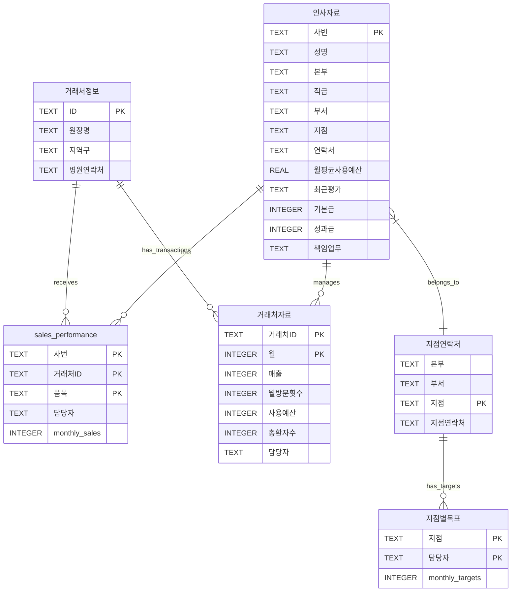

# 데이터베이스 관계 구조 (Database Relationships)

## 시스템 아키텍처 개요

```
┌─────────────────────────────────────────────────────────────┐
│                     Medical Sales CRM System                 │
├─────────────────────────────────────────────────────────────┤
│                                                               │
│  ┌──────────────┐     ┌─────────────┐     ┌──────────────┐ │
│  │   HR System  │────▶│Sales System │────▶│Client System │ │
│  └──────────────┘     └─────────────┘     └──────────────┘ │
│         │                    │                     │         │
│         ▼                    ▼                     ▼         │
│  ┌──────────────┐     ┌─────────────┐     ┌──────────────┐ │
│  │  hr_data.db  │     │sales DBs(3) │     │clients DBs(2)│ │
│  └──────────────┘     └─────────────┘     └──────────────┘ │
└─────────────────────────────────────────────────────────────┘
```

## 엔티티 관계 다이어그램 (ERD)



## 주요 관계 정의

### 1. Primary Relationships (주요 관계)

#### 1.1 직원-영업실적 관계
- **관계 유형**: 1:N (One-to-Many)
- **Parent Table**: 인사자료
- **Child Table**: sales_performance
- **연결 키**: 인사자료.사번 → sales_performance.사번
- **설명**: 한 명의 직원이 여러 거래처에 대한 영업 실적을 가질 수 있음

#### 1.2 거래처-영업실적 관계
- **관계 유형**: 1:N (One-to-Many)
- **Parent Table**: 거래처정보
- **Child Table**: sales_performance
- **연결 키**: 거래처정보.ID → sales_performance.거래처ID
- **설명**: 한 거래처가 여러 품목에 대한 거래 실적을 가질 수 있음

#### 1.3 거래처-거래내역 관계
- **관계 유형**: 1:N (One-to-Many)
- **Parent Table**: 거래처정보
- **Child Table**: 거래처자료
- **연결 키**: 거래처정보.ID → 거래처자료.거래처ID
- **설명**: 한 거래처가 여러 월별 거래 내역을 가짐

### 2. Secondary Relationships (보조 관계)

#### 2.1 직원-지점 관계
- **관계 유형**: N:1 (Many-to-One)
- **연결**: 인사자료.지점 → 지점연락처.지점
- **설명**: 여러 직원이 하나의 지점에 소속됨

#### 2.2 지점-목표 관계
- **관계 유형**: 1:N (One-to-Many)
- **연결**: 지점연락처.지점 → 지점별목표.지점
- **설명**: 각 지점이 월별 영업 목표를 가짐

#### 2.3 담당자 이름 기반 관계
- **관계 유형**: Weak Relationship
- **연결**: 인사자료.성명 ≈ sales_performance.담당자 ≈ 거래처자료.담당자 ≈ 지점별목표.담당자
- **주의**: 이름 기반 연결은 동명이인 문제 발생 가능

## 데이터 무결성 규칙

### 1. 참조 무결성 (Referential Integrity)

```sql
-- 영업 실적 등록 시 유효한 직원 확인
FOREIGN KEY (사번) REFERENCES 인사자료(사번)

-- 영업 실적 등록 시 유효한 거래처 확인
FOREIGN KEY (거래처ID) REFERENCES 거래처정보(ID)

-- 거래 내역 등록 시 유효한 거래처 확인
FOREIGN KEY (거래처ID) REFERENCES 거래처정보(ID)
```

### 2. 비즈니스 규칙 (Business Rules)

1. **직원 삭제 제한**: 영업 실적이 있는 직원은 삭제 불가
2. **거래처 삭제 제한**: 거래 내역이 있는 거래처는 삭제 불가
3. **월별 데이터 유일성**: 동일 거래처-월 조합은 하나의 레코드만 존재
4. **목표 설정 제한**: 지점-담당자 조합당 하나의 목표만 설정 가능

## 조인 패턴 예시

### 1. 직원별 종합 실적 조회
```sql
SELECT
    e.사번,
    e.성명,
    e.지점,
    SUM(sp."202411") as 월실적,
    COUNT(DISTINCT sp.거래처ID) as 관리거래처수
FROM 인사자료 e
LEFT JOIN sales_performance sp ON e.사번 = sp.사번
GROUP BY e.사번, e.성명, e.지점;
```

### 2. 거래처 종합 정보 조회
```sql
SELECT
    ci.ID,
    ci.원장명,
    ci.지역구,
    cd.월,
    cd.매출,
    cd.담당자,
    sp.품목
FROM 거래처정보 ci
LEFT JOIN 거래처자료 cd ON ci.ID = cd.거래처ID
LEFT JOIN sales_performance sp ON ci.ID = sp.거래처ID
WHERE cd.월 = 202411;
```

### 3. 지점별 목표 대비 실적
```sql
SELECT
    b.지점,
    b.지점_연락처,
    st.담당자,
    st."202411" as 목표,
    COALESCE(SUM(sp."202411"), 0) as 실적
FROM 지점연락처 b
JOIN 지점별목표 st ON b.지점 = st.지점
LEFT JOIN sales_performance sp ON st.담당자 = sp.담당자
GROUP BY b.지점, b.지점_연락처, st.담당자, st."202411";
```

## 데이터 정합성 체크 쿼리

### 1. 고아 레코드 확인 (Orphan Records)

```sql
-- 존재하지 않는 직원의 영업 실적
SELECT DISTINCT 사번
FROM sales_performance
WHERE 사번 NOT IN (SELECT 사번 FROM 인사자료);

-- 존재하지 않는 거래처의 거래 내역
SELECT DISTINCT 거래처ID
FROM 거래처자료
WHERE 거래처ID NOT IN (SELECT ID FROM 거래처정보);
```

### 2. 중복 데이터 확인

```sql
-- 중복된 거래처 정보
SELECT ID, COUNT(*) as cnt
FROM 거래처정보
GROUP BY ID
HAVING cnt > 1;

-- 중복된 월별 거래 데이터
SELECT 거래처ID, 월, COUNT(*) as cnt
FROM 거래처자료
GROUP BY 거래처ID, 월
HAVING cnt > 1;
```

## 성능 최적화를 위한 인덱스 전략

### 1. Primary Indexes (기본 인덱스)
- 인사자료.사번
- 거래처정보.ID
- sales_performance.(사번, 거래처ID, 품목)
- 거래처자료.(거래처ID, 월)

### 2. Secondary Indexes (보조 인덱스)
- sales_performance.담당자 - 담당자별 조회 최적화
- 거래처자료.담당자 - 담당자별 거래 조회 최적화
- 거래처정보.지역구 - 지역별 거래처 조회 최적화

### 3. Composite Indexes (복합 인덱스)
- sales_performance.(사번, 거래처ID) - 조인 성능 향상
- 거래처자료.(거래처ID, 월) - 시계열 조회 최적화

## 데이터 마이그레이션 고려사항

### 1. 현재 문제점
- Primary Key 미설정
- Foreign Key 제약 없음
- 이름 기반 연결 (사번 대신 성명 사용)
- 월별 컬럼 하드코딩

### 2. 개선 방안
1. **정규화**: 월별 데이터를 행 기반으로 변경
2. **키 정의**: 모든 테이블에 명시적 Primary Key 설정
3. **관계 강화**: Foreign Key 제약 추가
4. **인덱스 생성**: 쿼리 성능 향상을 위한 인덱스 추가

### 3. 마이그레이션 순서
1. 백업 생성
2. 새 스키마로 테이블 생성
3. 데이터 변환 및 이전
4. 무결성 검증
5. 인덱스 생성
6. 기존 테이블 제거