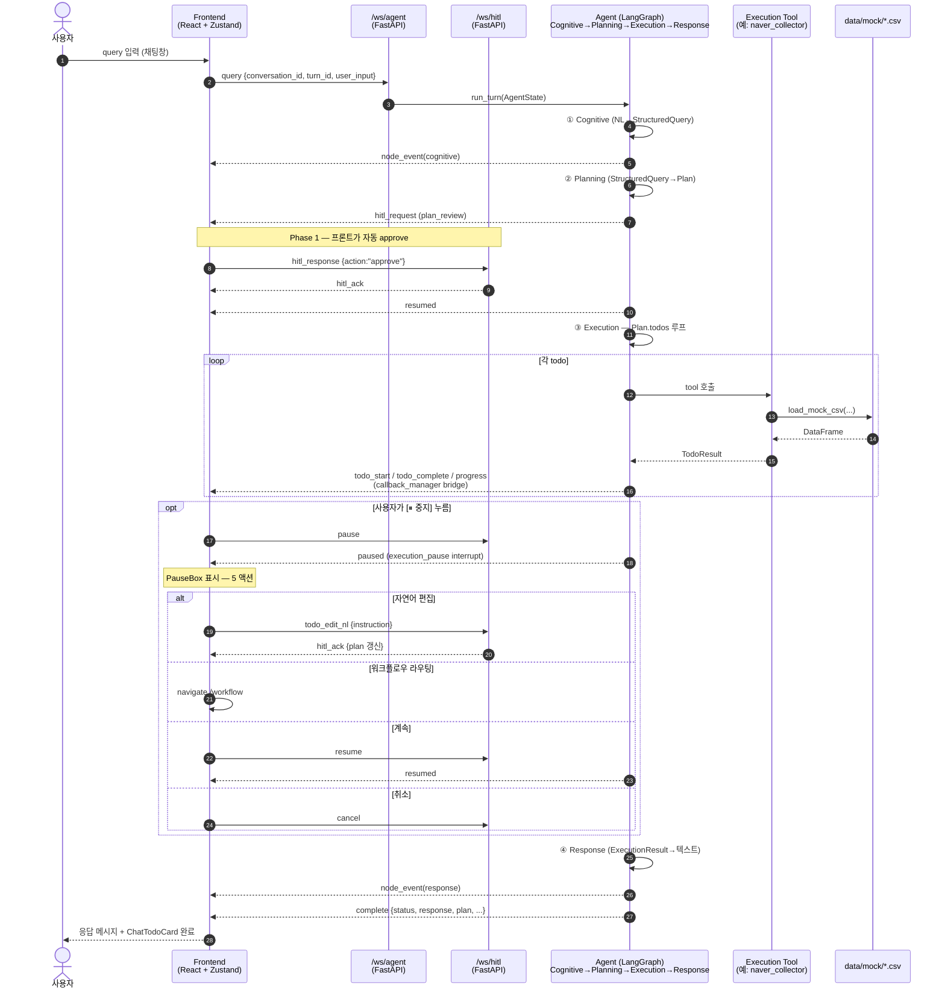

# End-to-End Flow — OctorAD Dream Agent V2

| 항목 | 내용 |
|------|------|
| 담당자 | 도윤 |
| 분류 | 개발 - 온보딩 / 시스템 개관 |
| 진행상태 | **Active** (Phase 1 Integration 직후, 2026-05-15) |
| 버전 | **v1.0** |
| 최종 수정일 | 2026-05-15 |
| 관련 명세 | `10_system_architecture_v1.9.md` (전체 구조 deep) / `14_system_agent_overview_v1.0.md` (Agent 내부) / `21_WEBSOCKET_PROTOCOL_v1.5.md` (WS) / `24_sequence_diagrams_v1.3.md` (시나리오 7+) / `30_DATA_MODELS_v1.1.md` (Pydantic) |

---

## 0. 이 문서의 목적

**새로 합류한 사람에게 "이거 한 장 먼저 봐라" 라고 던질 수 있는 entry doc.**

- 사용자 query 입력 → 화면 응답까지의 한 사이클을 한 페이지에서 본다.
- deep dive 는 §5 의 "다음에 어디 봐야 하나" 표를 따라간다.
- 본 문서는 *변하지 않는 큰 흐름* 만 담는다. 메시지 상세 필드, 노드 구현, 데이터 모델은 각 전문 spec 참조.

> 이 문서가 stale 해지면 — 본 다이어그램에 등장한 *컴포넌트* 가 바뀐 경우다 (예: 새 레이어 추가, WS 채널 분리/통합). 필드 수정으로는 stale 되지 않게 일부러 간결하게 둔다.

---

## 1. 한 장 — 핵심 흐름



---

## 2. 4-Layer 책임 — 한 줄 요약

| 레이어 | 입력 | 출력 | 한 줄 |
|--------|------|------|------|
| **Cognitive** | `user_input` (NL) | `StructuredQuery` | NL → 정형 쿼리 *번역기*. 시스템 핵심 계약 (memory: [project_cognitive_as_translator](.)) |
| **Planning** | `StructuredQuery` | `Plan{ todos, dag, teams_selected }` | StructuredQuery → 실행 가능한 DAG. plan_review interrupt 발동 |
| **Execution** | `Plan` | `ExecutionResult{ todos, status }` | DAG 위상정렬 → Phase 별로 tool 호출 + callback emit |
| **Response** | `ExecutionResult` | 텍스트 + attachments | 결과 → 사람이 읽을 수 있는 응답 합성 |

> 4-Layer 는 **개념 단위** — 구현 노드는 자유롭게 쪼개거나 추가 가능 (memory: [feedback_layer_concept_vs_impl](.)).

상세: [14_system_agent_overview_v1.0.md](14_system_agent_overview_v1.0.md)

---

## 3. 채널 카탈로그

| 채널 | 경로 | 방향 | 용도 |
|------|------|------|------|
| **REST** | `/api/...`, `/api/mock/...` | 클라→서버 (req-res) | 대시보드 데이터 fetch, mock 12 endpoint |
| **WS Agent** | `/ws/agent?user_id=<id>` | **서버→클라 주(主)** + query/resume 입력 | 노드 이벤트, hitl_request, paused, todo_*, progress, complete, error |
| **WS HITL** | `/ws/hitl?user_id=<id>` | **양방향** | 사용자 명령 (pause / resume / cancel / hitl_response / todo_edit_nl) + ack |

WS 가 *2 채널인 이유* — 이벤트 스트림과 사용자 명령의 backpressure/생명주기 분리. **pause 중에도 명령 받기 위함**.

상세: [21_WEBSOCKET_PROTOCOL_v1.5.md](21_WEBSOCKET_PROTOCOL_v1.5.md)

---

## 4. 데이터 source — POC 단계

- **에이전트 tool 의 입력**: `backend/app/dream_agent/tools/shared/helpers.py::load_mock_csv()` → `data/mock/*.csv` 직접 로드 (pandas).
  - 예: `naver_collector.py` → `mock_data_review_trends.csv`
- **대시보드 시각화의 입력**: `/api/mock/<name>` REST endpoint → 같은 CSV 를 JSON 으로 서빙 (`backend/api_v2/routes/mock_data.py`).
  - 즉 두 경로가 *같은 CSV* 를 다른 인터페이스로 읽음. 에이전트와 대시보드는 데이터 source 만 공유, 동작은 독립.

> POC = mock CSV 12종 (블루밍글로우 마케팅). MVP 부터 실 외부 API 로 교체 예정 (memory: [project_mock_data_as_poc_source](.)).

---

## 5. 다음 어디 봐야 하나 — Reading Order

| 질문 | 보는 spec |
|------|-----------|
| "4-Layer 가 정확히 어떻게 나뉘어 있고 각자 책임은?" | [14_system_agent_overview_v1.0.md](14_system_agent_overview_v1.0.md) |
| "AgentState 의 필드는? Reader/Writer 는?" | [11_main_graph_state_v1.5.md](11_main_graph_state_v1.5.md) |
| "Manager 5개는 각자 뭐 함?" | [12_manager_layer_v1.4.md](12_manager_layer_v1.4.md) |
| "WS 메시지 한 종류의 정확한 필드는?" | [21_WEBSOCKET_PROTOCOL_v1.5.md](21_WEBSOCKET_PROTOCOL_v1.5.md) |
| "Pydantic 모델 ↔ 실제 코드 매핑은?" | [30_DATA_MODELS_v1.1.md](30_DATA_MODELS_v1.1.md) |
| "특정 시나리오 (pause / cancel / timeout) 의 시퀀스는?" | [24_sequence_diagrams_v1.3.md](24_sequence_diagrams_v1.3.md) |
| "Error code 카탈로그는?" | [22_error_codes_v1.1.md](22_error_codes_v1.1.md) |
| "왜 이렇게 설계했나 (큰 결정)" | [adr/](adr/INDEX.md) |
| "DB schema 는?" | [35_DB_SCHEMA_v1.0.md](35_DB_SCHEMA_v1.0.md) |
| "Frontend state / routing 은?" | [61_frontend_architecture_v1.0.md](61_frontend_architecture_v1.0.md) |
| "Frontend ↔ Backend 계약 (zod / WS message)은?" | [63_frontend_backend_contract_v1.0.md](63_frontend_backend_contract_v1.0.md) |
| "Tool 어떤 게 구현됐고 어떤 게 미구현?" | [32_execution_agent_tools_v1.0.md](32_execution_agent_tools_v1.0.md) |

---

## 6. 폴더 한 눈에

```
beta_v001/
├── backend/
│   ├── api_v2/             # FastAPI — REST 라우트 + /ws/agent + /ws/hitl
│   │   ├── ws_agent.py     # run_turn, /ws/agent
│   │   ├── ws_hitl.py      # pause/resume/cancel/hitl_response/todo_edit_nl 핸들러
│   │   └── routes/mock_data.py  # /api/mock/* 12 endpoint
│   ├── app/dream_agent/
│   │   ├── main_graph.py        # 4-Layer LangGraph 조립
│   │   ├── cognitive/           # ① NL→SQ
│   │   ├── planning/            # ② SQ→Plan
│   │   ├── execution/           # ③ Plan→ExecutionResult
│   │   ├── response/            # ④ ExecutionResult→텍스트
│   │   ├── tools/               # naver_collector, format_normalizer, ... (POC 8개)
│   │   ├── workflow_managers/   # HITL / Todo / Callback / Concurrency / LLM (5 Manager)
│   │   └── models/              # Pydantic — StructuredQuery / Plan / ExecutionResult / ...
│   └── tests/
│
├── frontend/src/
│   ├── api/                # ws.ts, schemas.ts (zod), hooks/
│   ├── features/
│   │   ├── agent/          # SideChatPanel, ChatTodoCard, PauseBox
│   │   ├── execution/      # useExecution store (plan + runtime 결합)
│   │   ├── hitl/           # useHitl store + PlanReviewModal(dormant)
│   │   ├── session/        # useSession (conversation/turn id)
│   │   └── workflow/       # WorkflowPage + WorkflowCanvas (React Flow)
│   └── routes/             # TanStack Router
│
├── data/mock/              # 12 CSV — 블루밍글로우 마케팅
└── docs/
    ├── agent_specs/        # ★ 이 문서가 있는 곳
    └── _claude/            # 실험/탐색 자취 (gitignored 일부)
```

---

## 7. 자주 묻는 것 — Phase 1 시점

| 질문 | 답 |
|------|------|
| WS 가 진짜 2채널 맞나? | 맞음. `/ws/agent` 가 주 이벤트 스트림, `/ws/hitl` 이 사용자 명령. 한 user_id 가 두 채널에 동시 연결. |
| Plan review 가 모달로 뜨지 않는 이유? | Phase 1 (P1-6, D5) — 프론트가 hitl_request 받자마자 자동 approve 송신. 사용자는 ChatTodoCard 로 Plan 확인 → 수정은 [⏸ 중지] → PauseBox 에서. |
| Plan 편집의 단일 경로는? | PauseBox 의 자연어 textarea → `todo_edit_nl`. 워크플로우 캔버스 (W2) 는 후속 Phase. |
| `progress` 와 `todo_complete` 동시에 emit 되는 이유? | callback_manager 가 각각 별도 이벤트로 emit. progress 는 Phase 진행률 (completed/total), todo_complete 는 개별 todo. |
| 서버 재시작 후 turn 복원? | `localStorage.last_turn_id` + WS 재연결 시 `resume_query` 송신 — Sprint 13 R-9 (현재 frontend hook 은 미배선, Phase 2 예정). |

---

## 변경 이력

| 버전 | 날짜 | 내용 |
|------|------|------|
| v1.0 | 2026-05-15 | 초안 — Phase 1 통합 직후, 사용자 요청 "한 장으로 신규 입사자에게 던질 수 있는 그림". Mermaid sequence (full happy path + HITL + 5 PauseBox 액션) + 채널 카탈로그 + Reading Order 표 |
