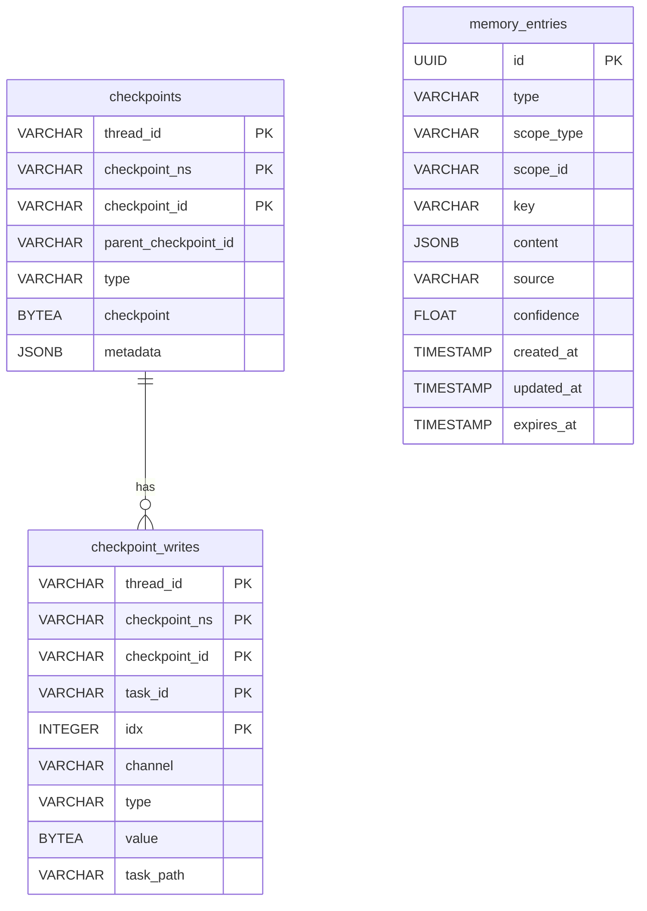
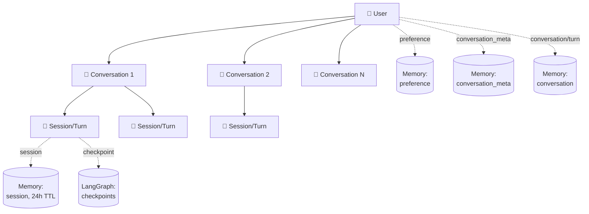

# 35. DB Schema (PostgreSQL) v1.0

| 항목 | 내용 |
|------|------|
| 작성일 | 2026-04-28 |
| 위치 | `docs/agent_specs/35_DB_SCHEMA_v1.0.md` (31~34 점유로 35 배치) |
| 자매 spec | [`30_DATA_MODELS_v1.1.md`](./30_DATA_MODELS_v1.1.md) (Pydantic models) |
| 시각화 | [`erd_database.md`](./erd_database.md) (Mermaid 7 view — ERD / hierarchy / flow / type 분류 / sprint 진화) |
| north star | [`00_vision_and_intent.md`](./00_vision_and_intent.md) |
| Status | v1.0 (Sprint 14 A3 종결 시점 — Sprint 15 P0 진입 전 baseline + Sprint 15 추가 예정 테이블) |

---

## 0. 본 문서의 역할

PostgreSQL DB 의 **테이블 / 인덱스 / ERD / 의미적 관계** 정식 spec.

`30_DATA_MODELS` 가 Pydantic 차원이라면, 본 문서는 DB 차원. 두 spec 은 짝.

본 문서가 다루지 않는 것:
- Pydantic 모델 (→ `30_DATA_MODELS`)
- ORM / DAO 코드 (→ `12_manager_layer`)
- 마이그레이션 스크립트 (→ `backend/migrations/`)

---

## 0.1 설계 원칙 ⭐ — 확장/변경 용이성 (사용자 통찰, 2026-04-29)

> "지금 설계해도 쓰다보면 UX 적인 측면에서 변경이 많이 될 텐데, 난 확장이나 변경이 용이한 구조가 좋아. 지금 결정하는 건 다 가설이라 의미 없어. 다만 확장/변경이 쉬운 구조여야 한다."
> — 사용자 (2026-04-29)

**이 원칙은 본 spec 의 모든 결정의 기준점**. 구체 schema 보다 **schema 진화 비용을 결정하는 구조** 가 본질.

### 0.1.1 5 가지 보장 원칙

| # | 원칙 | 효과 |
|---|------|------|
| **1** | **JSONB content** (정형 컬럼 최소화) | 구조 변경 시 컬럼 마이그레이션 X |
| **2** | **`schema_version` 필드 in content** | content 구조 진화 시 v1/v2 공존 + reader 분기 가능 |
| **3** | **Pydantic Optional 위주** | 미래 필드 추가 시 기존 row 손대지 않음 |
| **4** | **String + validator (enum 신중)** | 새 type 추가 시 CHECK constraint 1 마이그레이션 |
| **5** | **Append-only message log** | 기존 row mutate X, 추가만 — event sourcing 영감 |

### 0.1.2 변경 비용 매트릭스

| 미래 변경 | 비용 |
|---------|------|
| messages 안에 새 role / type 추가 | ✅ 0 (배열 안 자유) |
| 새 metadata 필드 추가 | ✅ 0 (JSONB) |
| 채팅 표시 형식 변경 (UI) | ✅ 0 (frontend 만) |
| summary 생성 방법 변경 | ✅ 0 (writer 만 변경) |
| schema 구조 큰 변경 (v1 → v2) | 🟡 reader 분기 + 신규 writer. 기존 v1 row 그대로 유지 |
| 새 memory type 추가 (예: feedback) | 🟡 CHECK constraint + Pydantic Literal 갱신 (1 마이그레이션) |
| scope 확장 (org / global 활용) | ✅ 0 (Sprint 16+ 그대로 사용) |
| 테이블 분리 (turns vs messages) | 🔴 큰 마이그레이션. **단 schema_version 필드로 v2 부터 분리** 가능 |

→ 대부분 변경 = **0 비용** (JSONB + append-only). 큰 구조 변경만 schema_version 으로 v1/v2 분기.

### 0.1.3 의도적 단순 (v1)

POC 단계에서 **정확한 message type 분류 / summary 생성 / attachments 위치 등은 의도적 미정**. 쓰면서 정의하고 v2 로 진화.

지금 결정 가능한 것 = 진화를 막지 않는 **구조 원칙** 만.

### 0.1.4 본 원칙의 적용 범위

본 spec 외 다음 spec / 코드 / ADR 모두 본 원칙 따름:
- `30_DATA_MODELS` Pydantic 모델 (Optional 위주)
- `12_manager_layer` MemoryManager API (구체 schema 의존 최소)
- ADR-015 (메모리 + Clarification — Sprint 15 진입 시 본문 작성)
- Phase E-1/E-2/E-3 구현 계획서 — 모두 v1 schema_version 표기

---

## 1. 전체 ERD (Sprint 15 P0 종료 시점)



**관계**:
- `checkpoints` ↔ `checkpoint_writes` = LangGraph native (1:N, FK)
- `memory_entries` = 독립 (의미적 soft FK 만 — content 안의 conversation_id 등)
- `checkpoints` ↔ `memory_entries` = **분리** (다른 테이블, 같은 DB) — ADR-015 §A.7

---

## 2. 의미적 관계 (Logical Hierarchy)

DB FK 는 없지만 **의미적으로** 다음 hierarchy:



### 2.1 Hierarchy 정의

| Level | 단위 | 예시 ID |
|-------|------|---------|
| 1 | User | `user_demo` (POC = 단일 사용자) |
| 2 | Conversation | `conv_fa81d02` (한 채팅 세션의 모든 turn) |
| 3 | Session/Turn | `turn_d36ffd35ad77` (1 query → response) |

→ User 1명 → Conversation N개 → Turn M개

### 2.2 Sprint 15 P0 단순화 결정

POC 단계에서는:
- `session_id` ↔ `turn_id` 통일 (1 turn = 1 session)
- `conversation_id` 는 별도 (UI sidebar 용)

Sprint 16+ 에서 Conversation 안에 Multi-turn 컨텍스트 본격 분리 가능.

---

## 3. 테이블 schema 상세

### 3.1 `checkpoints` (LangGraph native, Sprint 12 도입)

**역할**: LangGraph StateGraph 의 thread state snapshot. interrupt/resume 의 핵심.

**관리**: LangGraph Checkpointer 가 자동 (직접 SQL 조작 X).

**컬럼**:
| 컬럼 | 타입 | 설명 |
|------|------|------|
| `thread_id` | VARCHAR | LangGraph thread ID = `turn_xxx` |
| `checkpoint_ns` | VARCHAR | namespace |
| `checkpoint_id` | VARCHAR | snapshot ID |
| `parent_checkpoint_id` | VARCHAR | 이전 snapshot |
| `type` | VARCHAR | checkpoint type |
| `checkpoint` | BYTEA | serialized state |
| `metadata` | JSONB | source / step / writes |

**사용**: ws_agent 가 turn 시작 시 Checkpointer 통해 thread state 복원/저장.

### 3.2 `checkpoint_writes` (LangGraph native, Sprint 12)

**역할**: 각 step 에서의 channel write 기록.

**관리**: LangGraph 자동.

### 3.3 `memory_entries` (Sprint 15 P0 신규) ⭐

**역할**: 학습 데이터 / 사용자 선호 / 대화 이력 등 cross-thread knowledge.

**관리**: `MemoryManager` (Phase E-1).

**컬럼**:
| 컬럼 | 타입 | NULL | 설명 |
|------|------|------|------|
| `id` | UUID | NOT | PK, default uuid4 |
| `type` | VARCHAR(32) | NOT | memory type (§4) |
| `scope_type` | VARCHAR(16) | NOT | global / org / user / session |
| `scope_id` | VARCHAR(255) | NOT | scope_type 별 식별자 |
| `key` | VARCHAR(255) | NOT | unique key within scope |
| `content` | JSONB | NOT | flexible content (§5) |
| `source` | VARCHAR(16) | NOT | explicit / implicit / extracted |
| `confidence` | FLOAT | NOT | 0.0~1.0, default 1.0 |
| `created_at` | TIMESTAMPTZ | NOT | default NOW() |
| `updated_at` | TIMESTAMPTZ | NOT | trigger 자동 갱신 |
| `expires_at` | TIMESTAMPTZ | NULL | TTL — NULL = 무한 |

**Constraints**:
```sql
CHECK (type IN ('preference', 'conversation', 'conversation_meta', 'plan',
                'pattern', 'knowledge', 'session', 'tool_cache'))
CHECK (scope_type IN ('global', 'org', 'user', 'session'))
CHECK (source IN ('explicit', 'implicit', 'extracted'))
CHECK (confidence >= 0.0 AND confidence <= 1.0)
UNIQUE (scope_type, scope_id, type, key)
```

**Indexes**:
| Index | 컬럼 | 용도 |
|-------|------|------|
| PK | `id` | row 식별 |
| `idx_memory_scope` | `(scope_type, scope_id, type)` | scope cascade 조회 |
| `idx_memory_content` | `content` GIN | JSONB 검색 (E2-5 conversation_id filter 등) |
| `idx_memory_expires` | `expires_at` (partial) | TTL cleanup |
| `idx_memory_unique_key` | `(scope_type, scope_id, type, key)` UNIQUE | upsert 보장 |

**Trigger**: `memory_entries_updated_at_trigger` — UPDATE 시 `updated_at = NOW()`.

---

## 4. Memory Type 8 가지

| type | 설명 | scope 권장 | TTL | 도입 |
|------|------|---------|------|------|
| `preference` | 사용자 선호 (기본 entity 등) | user | 무한 | Sprint 15 P0 |
| `conversation` | 개별 turn 데이터 | user | 90일 (POC = 무한) | Sprint 15 P0 (E2-1) |
| `conversation_meta` | 대화 메타 (sidebar 표시) | user | 무한 | Sprint 15 P0 (E2-5) |
| `plan` | plan 이력 | user | 무한 | Sprint 15 P0 |
| `session` | 세션 단기 컨텍스트 | session | 24h | Sprint 15 P0 |
| `pattern` | 추출된 패턴 | user / org | 무한 | Sprint 17+ |
| `knowledge` | 도메인 지식 | user / org | 무한 | Sprint 16+ |
| `tool_cache` | tool 결과 cache | global / user | 1~7일 | Sprint 16+ |

---

## 5. content JSONB schema (type 별)

### 5.1 `preference`
```json
{
  "value": "<entity>",
  "from_clarification": true   // optional — clarification 답변에서 온 경우
}
```

### 5.2 `conversation` (개별 turn) ⭐ — 설계 원칙 §0.1 적용

**v1 schema (의도적 단순)**:

```json
{
  "schema_version": "v1",                  // ← 원칙 #2 — 진화 방어
  "conversation_id": "conv_fa81d02",
  "session_id": "turn_xyz",
  "messages": [                            // ← 원칙 #5 — append-only 배열
    {"role": "user", "content": "...", "ts": "..."},
    {"role": "assistant", "type": "clarification", "content": "어떤 대상?", "ts": "..."},
    {"role": "user", "content": "<entity>", "ts": "..."},
    {"role": "assistant", "type": "result", "content": "...", "attachments": [...], "ts": "..."}
    // 향후 새 role / 새 type 자유 추가 — schema_version bump 불필요
  ],
  "summary": "...",                        // 1줄 요약 (sidebar 표시용)
  "metadata": {                            // ← 자유 영역 (확장)
    "plan": { ... },
    "result_data": { ... },
    "completed_at": "..."
  }
}
```

**의도적 미정** (쓰면서 결정):
- message 의 `type` 정확한 분류 (clarification / result / progress / system 등)
- `summary` 생성 방법 (LLM 호출 / 첫 query 50자 / hybrid)
- `attachments` 위치 (message 안 / metadata 안)
- 진행 중 메시지 (cognitive done / planning done 등) 표시 여부

**Soft FK**: `conversation_id` (다른 테이블 FK 없지만 의미적 link).

**Clarification 통합** (Phase E-3):
- Clarification 질의 / 답변 모두 같은 `messages` 배열에 append
- 별도 row 생성 X — 1 turn = 1 row 유지
- Phase E-3 의 `store_clarification` 은 별도로 `type=preference` 도 저장 (다음 turn 자동 활용용)

### 5.3 `conversation_meta` (대화 메타, sidebar 표시)
```json
{
  "conversation_id": "conv_fa81d02",
  "title": "<entity> 도메인 작업",
  "started_at": "2026-04-28T13:30:00Z",
  "last_turn_at": "2026-04-28T13:31:17Z",
  "turn_count": 3
}
```

**key 패턴**: `conv_{conversation_id}` — 1 메타 per conversation.

### 5.4 `plan`
```json
{
  "plan_id": "plan_xxx",
  "version": 1,
  "todos": [...],
  "approved_at": "...",
  "edited_by_user": false
}
```

### 5.5 `session` (24h TTL)
```json
{
  "last_query": "...",
  "timestamp": "...",
  // 기타 단기 변수
}
```

### 5.6 `pattern` (Sprint 17+)
```json
{
  "pattern_type": "default_value",
  "field": "entity",
  "value": "<entity>",
  "sample_size": 10,
  "extracted_at": "..."
}
```

### 5.7 `knowledge` (Sprint 16+)
```json
{
  "subject": "<도메인 작업>",
  "rules": ["..."],
  "user_taught_at": "..."
}
```

### 5.8 `tool_cache` (Sprint 16+)
```json
{
  "tool": "<tool>",
  "input_hash": "sha256:...",
  "output": {...}
}
```

---

## 6. scope_type 별 scope_id 의미

| scope_type | scope_id 의미 | 예시 |
|----------|------------|------|
| `global` | 빈 문자열 또는 "default" | system-wide |
| `org` | 기업 ID | "acme_corp" (Sprint 16+) |
| `user` | 사용자 ID | "user_demo" |
| `session` | 세션 (turn) ID | "turn_xyz" |

→ `conversation` 단위는 별도 scope_type 으로 분리하지 않고, `content.conversation_id` (soft FK) 로 grouping. POC 단순화 (영역 1 §3 결정).

---

## 7. 자주 쓰는 query 패턴

### 7.1 사용자 conversation 목록 (E2-5 sidebar)
```sql
SELECT content
FROM memory_entries
WHERE scope_type = 'user' AND scope_id = $1
  AND type = 'conversation_meta'
ORDER BY (content->>'last_turn_at')::timestamptz DESC
LIMIT 5 OFFSET $2;
```

### 7.2 특정 conversation 의 turn 목록 (E2-5 클릭)
```sql
SELECT content
FROM memory_entries
WHERE scope_type = 'user' AND scope_id = $1
  AND type = 'conversation'
  AND content->>'conversation_id' = $2
ORDER BY created_at DESC
LIMIT 5;
```

### 7.3 사용자 preference cascade (E2-3 Cognitive 직전)
```sql
SELECT type, key, content
FROM memory_entries
WHERE
  (scope_type = 'session' AND scope_id = $session_id) OR
  (scope_type = 'user'    AND scope_id = $user_id)    OR
  (scope_type = 'org'     AND scope_id = $org_id)     OR
  (scope_type = 'global'  AND scope_id = '')
  AND (expires_at IS NULL OR expires_at > NOW());
```

### 7.4 Conversation 삭제 (E2-5 DELETE)
```sql
-- turn 삭제
DELETE FROM memory_entries
WHERE scope_type = 'user' AND scope_id = $1
  AND type = 'conversation'
  AND content->>'conversation_id' = $2;

-- meta 삭제
DELETE FROM memory_entries
WHERE scope_type = 'user' AND scope_id = $1
  AND type = 'conversation_meta'
  AND key = 'conv_' || $2;

-- preference 는 보존 (삭제 안 함)
```

---

## 8. 향후 확장 (Sprint 16+)

### 8.1 추가 가능 테이블
- **별도 `patterns` 테이블** (Sprint 17+): 패턴 추출 시 정규화 — confidence / sample_size 등 검색 빈도 시
- **별도 `tool_cache` 테이블** (Sprint 16+): cache 가 많아지면 hot path 분리
- **별도 `audit_log` 테이블** (MVP): 감사 로그
- **별도 `users` / `orgs` 테이블** (MVP): 정식 user / org 관리

### 8.2 PlannedTodo lifecycle 확장 (ADR-010 D 단일화 후)

planner.PlannedTodo 에 timestamps / status 추가 시 → Plan/Todo 의 history / replay / audit 기능 도입.

이 시점에 `plan_history` 또는 `todo_history` 테이블 신규 가능성.

### 8.3 Vector index (Sprint 18+ semantic search)

memory content 의 semantic search 도입 시 → `pgvector` 확장 + embedding 컬럼 추가.

---

## 9. 마이그레이션 이력

| 마이그레이션 | Sprint | 변경 |
|---------|--------|------|
| `langgraph_checkpointer_init` | 12 | LangGraph Checkpointer 도입 (`checkpoints` + `checkpoint_writes`) |
| `sprint15_001_memory_entries` | 15 P0 | `memory_entries` 테이블 + 5 인덱스 + trigger |

---

## 10. 관련 문서

- **north star**: [`00_vision_and_intent.md`](./00_vision_and_intent.md)
- **자매 Pydantic spec**: [`30_DATA_MODELS_v1.1.md`](./30_DATA_MODELS_v1.1.md)
- **Manager layer**: [`12_manager_layer_v1.4.md`](./12_manager_layer_v1.4.md)
- **ADR**: ADR-010 (Plan/Todo schema 통합), ADR-015 (메모리 + Clarification) — 결정 박제

---

## 변경 이력

> 프레임워크 추출(2026-06-19) 이전(마케팅 도메인 시기)의 상세 변경 이력은 git 히스토리를 참조하세요.
