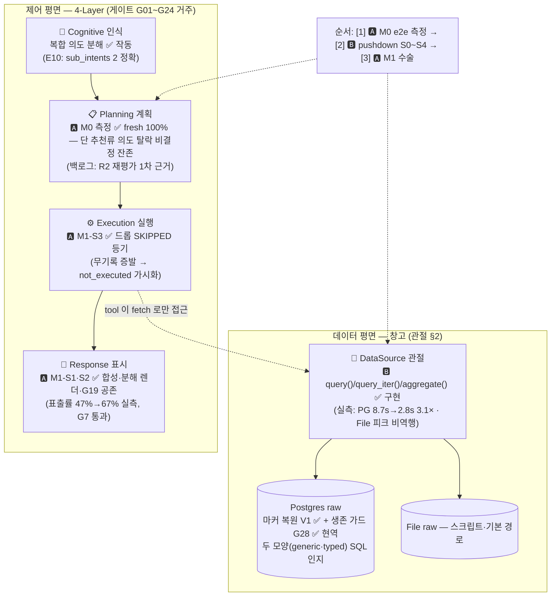

# 43 — Gate Ledger (게이트 대장: 런타임 검증·수선 장치 전수 등기부)

| 항목 | 내용 |
|------|------|
| 담당자 | 도윤 |
| 분류 | 운영 - 인벤토리 (게이트 등기부 — 구조도의 진실 소스) |
| 진행상태 | **Active** |
| 버전 | v1.6 |
| 최종 수정일 | 2026-06-18 |
| 관련 명세 | [19 헌법](19_architecture_constitution_v1.0.md)(불변식·§5 신호 라우팅·§7 채용 3문항) · [16 Layer Dependency](16_layer_dependency_architecture_v1.0.md)(물리 의존) · [18 Engineering Disciplines](18_engineering_disciplines_v1.0.md) |

> **지위**: 게이트가 ~25개로 늘어 "한 장 그림"은 그리는 날 예쁘고 다음 주에 거짓말이 된다.
> 그래서 **이 표가 진실이고, 그림(§4)은 표에서 생성된 파생물**이다 —
> `python -m scripts.generate_gate_map` 이 §4를 다시 그리고, `tests/test_gate_ledger_sync.py` 가
> 표↔그림 불일치를 RED 로 강제한다. 게이트를 추가/폐기하면 이 표를 고치는 것이 곧 구조도 갱신.
>
> 행 추가 조건 = 헌법 §7 채용 3문항 (측정 근거 / 소속 층 / 신호 소비자) + §5 라우팅 표 등록(R6).
>
> 🖥 **브라우저 열람용 HTML 뷰** = [docs/_claude/gate_ledger.html](../_claude/gate_ledger.html) — 같은 명령이 함께 생성
> (오버레이·구조도·대장 표·예정/현역 배지 포함, gitignored). 브라우저로 열면 그림이 렌더됨. **직접 수정 금지** — 표 고치고 재생성.

---

## §0 ★ 데이터 정합(A-5) 후 1회 감사 (2026-06-18) — 할루시 2축 정정

> 출처: 감사 워크플로 `w8477io1y`(census→triage→적대 교차검증, 전 항목 file:line 실측). 전체 근거 = [A-7 tool 구조점검·게이트 감사 보고서](../reports/A-7_tool구조점검_게이트감사_2026-06-18.md).
> **본 §0 = 감사 분석 기록(권고).** 실제 retire/merge **적용**은 §6 규약대로 §1 행 변경 → §4 재생성 → sync 테스트 (오너 승인 후). 지금 §1/§4는 미변경.

**★ 핵심 정정 — "데이터가 맞으면 gate 증식 멈춤" 가정은 약하다.**
데이터 본선 정합(A-5: canonical 단일세계, 26.8M·MER 4.46) 완료 후 감사한 결과:
- **측정근거가 데이터 수술로 소멸한 gate = 0개.** canonical cutover는 tool을 하나도 삭제하지 않고 **데이터소스만 재지정**(예: cac_overall→canonical_translator). period:`'all'` 오염원 5곳(`utm_normalizer`·`member_guest_stats`·`category_multi_distributor`·`ad_cost_total`·`channel_attribution_normalizer`)은 **전부 live**이며 'all 라벨 방출금지' 가드를 그대로 보유(코드 실측).
- 따라서 검사 열의 다수 gate(G06·G09·G10·G11·G19·G28 등)는 World-B **'데이터'**가 아니라 **데이터소스-무관 메커니즘**을 겨냥한다: *"LLM이 스코프 param을 빠뜨림 → optional-period tool 이 전기간으로 넓어짐 → 0건 → silent-0(거짓 보고서)"*.

→ **할루시는 2축.** ① **데이터 정확성** (canonical 로 ✅해결) ② **에이전트 planning 취약성** (스코프 누락·빈입력 지어내기·부분실행 둔갑 — **이 대장의 게이트 대부분이 ②축을 지킨다, 여전히 필요**). canonical 은 ①만 고쳤다. **"데이터 고치면 gate 줄어든다"는 두 축을 혼동한 것.** 남은 할루시 본 작업(C2)은 ②축의 라이브 검증이다.

**감사 verdict 요약 (현역 28 → 현역 23 + planned 2):**

| 처리 | 대상 | 근거 |
|---|---|---|
| **retire → planned 강등** (2) | G01(clarification_question)·G08(validate_dag) | **미배선** — 신호 생산하나 소비자 0/로그only(§1에 이미 "배선 예정" 명시). 코드 삭제 아님, 대장 '현역' 카운트에서 제외·`planned` 배지. 배선(슬라이스2-①/③) 시 재등재 |
| **merge → 대장 통합** (5→2, 코드 안전장치 전부 유지) | 묶음A `G11+G12`(executor 입력 위생) · 묶음B `G13+G14`(LLMTool silent-0 가드) · 묶음C `G16+G17`(state 평면분리) | 같은 함수·같은 기준을 입구/출구로 쪼갠 쌍 → 대장 1행씩. **코드는 전부 유지**, 등기 행수만 축소 |
| **keep** (17) | G02·G03·G05·G06·G07·G09·G10·G18·G19·G20·G21·G22·G23·G24·G25·G26·G27·G28 등 | canonical 과 직교한 실 안전장치 (silent-0 차단·정직 표면·수명주기) |

- ⚠ **과도은퇴 금지**: `G11`을 "World-B 소멸"로 retire 하면 오염원 5곳이 live 라 **silent-0 재발**. measurement-소멸 retire = **0**.
- ⚠ **`G04`→`G03` 코드머지 불가**: `ensure_interpretation_fed.py:402-403` — 해석 tool 은 consumes 미선언이라 `complete_dataflow_chain`(G03)이 구조적으로 못 잡는 케이스를 G04 가 전담. **대장 문서 그룹핑만** 허용(코드 통합 시 빈입력 보고서 재발).
- **"gate 증식이 멈춘다"의 진짜 의미** = 데이터정합이 아니라 **미배선 gate 배선완료 + silent-0 변종 통합**. 새 gate 안 만들고 기존 정리.

**§0.1 — 게이트 1:1 인과 재귀속 (2026-06-18 후속 감사 `wgl8y5yk5`).** 게이트별 원천 사고를 재추적한 결과(전체 = [컨텍스트엔지·게이트 재귀속 보고서](../reports/컨텍스트엔지니어링_게이트인과재귀속_2026-06-18.md)):
- 28 게이트 root_cause: **data_comprehension 2(G04·G13)** · data_correctness/무결성 1(G28) · **planning_llm_fragility 16** · runtime_safety 9.
- **"데이터(틀린 값)를 planning이 억울하게 뒤집어썼다" = 거의 틀림** (data_correctness 누명 0건 — period:`'all'`은 param-flow 메커니즘 버그·데이터 멀쩡). planning 게이트는 정당 배치(억울 아님).
- ★ **단 '의미 미전달(data_comprehension)'은 진짜**(G04·G13): insight_extractor·report_writer가 **칼럼 description·단위 없이 벌거벗은 숫자**를 받아 거짓 산출. 의미 인프라(_COL_DESC·_lineage·glossary)가 execution 해석 LLM에 **미배선**. → **근본 수정 = 게이트가 아니라 execution LLM 의미 배선**(보고서 S1~S3). ⚠ **G04·G13 은퇴 금지** — 의미 주입은 환각을 *완화*하나 0건 입력은 상존하므로 빈입력 가드는 안전망 잔존.

---

## §1 런타임 게이트 대장

층 번호는 헌법 §2: ①Contract ②Guardrail ③Plan repair ④Policy ⑤Harness.

**검사 열 = 이 게이트가 무엇을 검사하나** (검사 대상 축 — 2026-06-12 오너 Q&A 박제: "데이터를 못 보는 cognitive·planning에 왜 게이트가?" → 그 게이트들은 데이터가 아니라 **에이전트 언어**를 검사한다. LLM 출력은 불신 입력이고, 데이터를 못 보는 층일수록 자기 산출물이 틀려도 스스로 모른다):

- **언어** = 에이전트 언어(LLM이 만든 layer 간 전달물 — 정형 쿼리·계획·params·state·메시지) 자체의 정합. 헌법의 **제어 평면**.
- **접점** = 언어의 약속(consumes·params)을 데이터 현실(존재·count·형식)과 대조 — execution 입구의 본질.
- **데이터** = 실데이터·저장 형태 자체 (헌법의 **저장 평면**. 관절은 §2).
- **표면** = 사람에게 나가는 표시·입력의 정직.

### 1a. Cognitive — 신호 생산 (언어 이해)

| ID | 게이트/신호 (코드) | 층 | 검사 | 무엇을 | 신호 → 소비자 | 박제 |
|---|---|---|---|---|---|---|
| G01 | QueryMeta 모호 신호 (`cognitive` 출력 `ambiguity`/`clarification_question`) | ① 생산 | 언어 | 모호·미지원 질문 인식 | → 되묻기 응답 (**슬라이스 2-① 배선 예정** — 현재 미소비) | — |

### 1b. Planning — plan repair (계획 수선·자가평가)

| ID | 게이트/신호 (코드) | 층 | 검사 | 무엇을 | 신호 → 소비자 | 박제 |
|---|---|---|---|---|---|---|
| G02 | subject-coherence 필터 (`planning/planner.py:152`) | ③ | 언어 | 텍스트 의도 없는 쿼리에서 리뷰-데이터 todo 제거 (F2) | plan_notes 표기 → plan | `test_planning_subject_coherence_gate.py` |
| G03 | complete_dataflow_chain (`planner.py:299`) | ③ | 언어 | consumes artifact 의 생산자 누락 → 삽입·배선 | plan_notes → plan | (특성화 — stage 회귀) |
| G04 | ensure_interpretation_fed (`planner.py:395`) | ③ | 언어 | 해석 tool(insight 등)이 굶으면 대표 metric 삽입 | plan_notes → plan | (특성화) |
| G05 | enforce_breakdown_dimension (`planner.py:457`) | ③ | 언어 | breakdown 의도인데 차원분해 tool 부재 → 삽입 | plan_notes → plan | (특성화) |
| G06 | bind_temporal_params + `_resolved_month` (`planner.py:286`) | ③ | 언어 | 쿼리 절대월을 period(필수+**선택**, R-1)·period_a/b 에 결정론 바인딩. 월 범위 01-12 검증·zero-pad | tool_params → executor | `test_planning_temporal_binding.py` · `test_slice1_period_honesty.py` |
| G07 | detect_plan_gaps (`planner.py:220`) | ③ | 언어 | 필수 param 미바인딩 사전 탐지 (스코프 param 은 상류 artifact 로 충족 간주 금지) | `plan.gaps` → 실행 경계 G10 + responder G19 (✅ 슬라이스 1-⑤) | `test_planning_gaps.py` |
| G08 | validate_dag (`planner.py:506`) | ③ | 언어 | cycle·미지 의존 탐지 | issues → **차단 배선 = 슬라이스 2-③** (현재 로그) | — |

### 1c. Execution 입구 — Guardrail (검문소)

| ID | 게이트 (코드) | 층 | 검사 | 무엇을 | 신호 → 소비자 | 박제 |
|---|---|---|---|---|---|---|
| G09 | data_gate `check_consume_sufficiency` (`execution/data_gate.py:42`) | ② | 접점 | consumes artifact 존재+non-empty. **`_dataref` 스텁은 count 로 판정** (L4 0건 맹점 봉합) | SKIPPED(data_insufficient) → cascade + responder G20 | `test_execution_data_gate.py` (+`_wiring`) |
| G10 | `_param_boundary_issue` (`execution/executor.py`) | ② | 접점 | 필수 param 누락(missing_param) / 스코프 형식 YYYY-MM(invalid_param, 공백 정규화=검증값=실행값) / ToolSpec `validate_params` | SKIPPED(사유 dict) → responder G19·G22 | `test_slice1_period_honesty.py` |
| G11 | `_inject_prev_outputs` 스코프 차단 (`executor.py`) | ② | 접점 | SCOPE_PARAMS(period 류)·`_`키 주입 금지 — 시간 스코프는 쿼리에서만 (R2) | (차단 — 신호 없음) | `test_slice1_period_honesty.py` |
| G12 | ctx.previous_results COMPLETED 필터 (`executor.py`) | ② | 접점 | SKIP/FAILED 사유 dict 가 LLM tool payload 에 데이터인 척 유입 방지 (R-8) | (차단) | `test_slice1_period_honesty.py` |
| G13 | LLMTool 빈입력 가드 (`tools/llm_tool.py`) | ② | 접점 | 입력 부족 시 LLM 호출 생략 → data_insufficient (지어내기 방지) | → G14 → SKIPPED | `test_silent0_axis2_llmtool_guard.py` |
| G14 | silent-0 전파 변환 (`executor.py`) | ② | 접점 | tool 이 `reason: data_insufficient` 반환 시 COMPLETED 로 흐르지 않게 SKIPPED 전환 | SKIPPED → responder | `test_silent0_fix_r1.py` |

### 1d. Execution 출구 — 제어 평면 경계 (state/checkpoint)

| ID | 게이트 (코드) | 층 | 검사 | 무엇을 | 신호 → 소비자 | 박제 |
|---|---|---|---|---|---|---|
| G15 | `_json_safe` (`executor.py`) | ② | 언어 | DataFrame 등 비직렬 값 드롭 — checkpoint 직렬화 크래시(F1) 방지 | (정화) | `test_execution_dataframe_serialization.py` |
| G16 | state_guard `slim_execution_result` (`execution/state_guard.py`, L3) | ② | 언어 | state 진입 값 >256KB → 참조 스텁 치환 (104MB/턴 누수 봉인) | `_state_guard` 스텁 → responder(dict 스킵)·chart(비차트화) + slim warning 로그 | `sprint15/test_state_guard.py` |
| G17 | RawCollectorBase `_dataref` (`tools/collection/_base.py`, L4) | ② | 접점 | collector 가 데이터셋 비탑재 — 참조(source_id·count)만 반환 (발원지) | `_dataref` 스텁 → G09(count 판정)·chart(비차트화)·downstream=데이터 평면 직조회 | `sprint15/test_collector_dataref.py` |
| G28 | 수집 save 마커 생존 가드 (`workspace/postgres.py` save→save_stream 라우팅, ADR-031-5) | ② | 데이터 | 외부 수집 blob save 가 `__streamed__` 마커·행-테이블을 침묵 소멸시키지 않게 — 기존 마커 또는 ≥10,000행 record 목록이면 save_stream 재라우팅 (06-11 20:47 실사고 재발 방지. **현역 전환 2026-06-12**, V1 마커 복원 동반) | 라우팅 로그 + clumi 실DB 마커 assert → RED | `test_datasource_query_pg.py` (PQ5·PQ5b·PQ6) |

### 1e. Response — 정직 표면 (결정론 게이트 4)

| ID | 게이트 (코드) | 층 | 검사 | 무엇을 | 신호 → 소비자 | 박제 |
|---|---|---|---|---|---|---|
| G18 | build_degrade_payload (`response/responder.py`) | ② | 표면 | 미구현 op(진단·예측·기여)가 실행 0건 → "준비 중" 정직 응답 | ResponsePayload → frontend | `test_response_honest_degrade.py` |
| G19 | build_missing_period_payload (`responder.py`) | ② | 표면 | period 스코프 SKIP → **"기간을 알려주세요"** (D3 — 부분 완료에도 숫자 단정 금지. FAILED 엔 양보) | ResponsePayload(meta.missing_period) → frontend | `test_slice1_period_honesty.py` |
| G20 | build_insufficient_data_payload (`responder.py`) | ② | 표면 | 데이터 0건/부재로 전 분석 막힘 → 정직 degrade | ResponsePayload → frontend | `test_phase2c_response_display_dispatcher.py` |
| G21 | display 거짓-완료 가드 (`responder.py` build_display_payload) | ② | 표면 | FAILED 정직 고지(H4) + 분석 산출 0(collector-only 포함)인데 "완료" 둔갑 금지 | text/error → frontend | `test_phase2c_response_display_dispatcher.py` · `test_slice1_period_honesty.py` |

### 1f. 시스템·관측 (턴 수명주기)

| ID | 게이트 (코드) | 층 | 검사 | 무엇을 | 신호 → 소비자 | 박제 |
|---|---|---|---|---|---|---|
| G22 | layer_inspector `inspect_layer_output` (`system_graph/layer_inspector.py`) | ②관측 | 언어 | 레이어 출력 5종 검사 (COGNITIVE_EMPTY_QUERY·PLANNING_EMPTY_PLAN·EXECUTION_ALL_FAILED·PARTIAL·RESPONSE_EMPTY) | fatal→aborted / warning→guard_warnings + `layer_guard.jsonl` | `sprint13/test_layer_guard_unit.py` |
| G23 | ws error→END 정직화 (`api_v2/ws_agent.py`) | ② | 표면 | stage 가 error 로 끝났는데 성공으로 안 나가게 — LAYER_ERROR + complete(aborted) | error 이벤트 → frontend | (슬라이스 0-③ 박제) |
| G24 | HITL 활성 turn 가드 + resume timeout (`ws_hitl.py`·`hitl_manager`) | ④ | 표면 | stale turn 명령 거부(is_turn_active) / 무응답 30분 → 정직 aborted(hitl_timeout) | hitl_ack(accepted:false)·complete(aborted) → frontend | `sprint14/test_hitl_timeout_integration.py` |

### 1g. Frontend — 표시·입력 가드

| ID | 게이트 (코드) | 층 | 검사 | 무엇을 | 신호 → 소비자 | 박제 |
|---|---|---|---|---|---|---|
| G25 | zod `WSMessageSchema` (`api/schemas.ts`) | ② | 언어 | WS 수신 메시지 형식 검증 — 불일치는 콘솔行 (화면 오염 방지) | parsed → stores | (vitest 스위트) |
| G26 | cycleGuard DFS (`features/workflow/editing`) | ② | 표면 | 시각 편집의 DAG cycle 사전 차단 | toast → 사용자 | `useWorkflowEditing.test.ts` |
| G27 | hitl_ack accepted:false 가시화 (`features/hitl/store.ts`) | ② | 표면 | 승인/거부 거절의 침묵 금지 — toast + pending 유지(재시도) | toast → 사용자 | `features/hitl/store.test.ts` |

## §2 데이터 평면 관절 (게이트가 아니라 "창고 문")

| 관절 | 위치 | 역할 |
|---|---|---|
| `DataSource.get` / `stream_jsonl` | `app/data_sources/` (File·Postgres) | tool 의 유일한 데이터 접근 경로 (`BaseTool.fetch`, client 는 ctx 에서만) |
| `query()` / `query_iter()` / `aggregate()` | **구현됨** (ADR-031, 2026-06-12 — base 기본구현=스트리밍 1-pass / Postgres 행-테이블 SQL override, generic·typed **두 모양 인지**) | 조회 2차원(범위·집계) pushdown. 시범 tool `ga4_session_aggregator` 실측: **PG 8.7s→2.8s (3.1×)**·피크 64→32MB / File 피크 **0.1MB 비역행**(시간 1.5× — V3 상한 2× 내). 격리 집계 26배(E4). 교차 일관성 테스트가 두 백엔드 같은답 강제 |
| Postgres raw 저장 실태 | `{client}._workspace` + `raw_*` 테이블 | 마커(`__streamed__`)→행-테이블 / 마커 없으면 blob. **현 라이브: GA4 traffic·page_events 모두 마커+generic 행-테이블 정상** (V1 복원 2026-06-12 — 파일 진실원천에서 save_stream 재적재 5.4s, 38,319행 검증). 재발 방지 = G28 라우팅 |
| Workspace `_storage` 계층 | raw → cleaned → computed | tool 산출의 저장 평면 (제어 평면과 분리 — G16/G17 이 경계 강제) |

## §3 오프라인 하네스 (⑤ — 감사실)

런타임 게이트가 아닌 측정·박제: pytest 회귀(backend 900+·frontend 90+) · DC doc-code 계약 검사 · S2/스코프 계약 박제(`test_d1_output_category_split`·`test_slice1` 계약 테스트) · 진단 사다리(`scripts/agent_lang_diagnostics/` — baseline_compound 5런×14쿼리 98.5% 기준선·run_harness·score_coverage) · **오너 기준질문 G1~G6** (헌법 §9 — 채팅으로 검증) · **예정(A 트랙 M0)**: e2e 멀티쿼리 측정기 정비 4종(T1 비파괴 출력·T2 full-graph corpus 인자화·T3 다중 산출 표시 판정기·T4 의도 귀속 판정기) + 복합 기준질문 G7·G8 ([계획_멀티쿼리](../reports/계획_멀티쿼리_복합의도_수직슬라이스_2026-06-12.md) §4).

## §4 구조도 (생성물 — 손으로 고치지 말 것)

`python -m scripts.generate_gate_map` 실행 시 §1 표에서 재생성된다.
노드 색 = 검사 대상: 파랑=언어 · 보라=접점 · 초록=데이터 · 주황=표면.

```mermaid
flowchart TB
  subgraph SG_1a["Cognitive — 신호 생산 (언어 이해)"]
    G01["G01 QueryMeta 모호 신호"]
  end
  subgraph SG_1b["Planning — plan repair (계획 수선·자가평가)"]
    G02["G02 subject-coherence 필터"]
    G03["G03 complete_dataflow_chain"]
    G04["G04 ensure_interpretation_fed"]
    G05["G05 enforce_breakdown_dimension"]
    G06["G06 bind_temporal_params + _resolved_month"]
    G07["G07 detect_plan_gaps"]
    G08["G08 validate_dag"]
  end
  subgraph SG_1c["Execution 입구 — Guardrail (검문소)"]
    G09["G09 data_gate check_consume_sufficiency"]
    G10["G10 _param_boundary_issue"]
    G11["G11 _inject_prev_outputs 스코프 차단"]
    G12["G12 ctx.previous_results COMPLETED 필터"]
    G13["G13 LLMTool 빈입력 가드"]
    G14["G14 silent-0 전파 변환"]
  end
  subgraph SG_1d["Execution 출구 — 제어 평면 경계 (state/checkpoint)"]
    G15["G15 _json_safe"]
    G16["G16 state_guard slim_execution_result"]
    G17["G17 RawCollectorBase _dataref"]
    G28["G28 수집 save 마커 생존 가드"]
  end
  subgraph SG_1e["Response — 정직 표면 (결정론 게이트 4)"]
    G18["G18 build_degrade_payload"]
    G19["G19 build_missing_period_payload"]
    G20["G20 build_insufficient_data_payload"]
    G21["G21 display 거짓-완료 가드"]
  end
  subgraph SG_1f["시스템·관측 (턴 수명주기)"]
    G22["G22 layer_inspector inspect_layer_output"]
    G23["G23 ws error→END 정직화"]
    G24["G24 HITL 활성 turn 가드 + resume timeout"]
  end
  subgraph SG_1g["Frontend — 표시·입력 가드"]
    G25["G25 zod WSMessageSchema"]
    G26["G26 cycleGuard DFS"]
    G27["G27 hitl_ack accepted:false 가시화"]
  end
  SG_1a --> SG_1b
  SG_1b --> SG_1c
  SG_1c --> SG_1d
  SG_1d --> SG_1e
  SG_1e --> SG_1f
  SG_1f --> SG_1g
  classDef lang fill:#E7EDF3,stroke:#5C7A99,color:#3D3833
  classDef junction fill:#EFE9F2,stroke:#92799A,color:#3D3833
  classDef data fill:#E3EBE6,stroke:#507C6D,color:#3D3833
  classDef surface fill:#F6E7D8,stroke:#A87257,color:#3D3833
  class G01,G02,G03,G04,G05,G06,G07,G08,G15,G16,G22,G25 lang
  class G09,G10,G11,G12,G13,G14,G17 junction
  class G28 data
  class G18,G19,G20,G21,G23,G24,G26,G27 surface
```

<!-- GATE-MAP:BEGIN -->

<!-- GATE-MAP:END -->

### §4-2 두 평면 뷰 (검사 대상 축 — 생성물)

같은 게이트들을 "어디 있나"(§4)가 아니라 **"무엇을 검사하나"**로 재배열한 그림 — §1 검사 열에서 재생성된다.

```mermaid
flowchart LR
  subgraph P_LANG["🅛 언어 — LLM이 만든 layer 간 전달물 검사 (제어 평면) (12)"]
    direction TB
    G01["G01 QueryMeta 모호 신호"]
    G02["G02 subject-coherence 필터"]
    G03["G03 complete_dataflow_chain"]
    G04["G04 ensure_interpretation_fed"]
    G05["G05 enforce_breakdown_dimension"]
    G06["G06 bind_temporal_params + _resolved_month"]
    G07["G07 detect_plan_gaps"]
    G08["G08 validate_dag"]
    G15["G15 _json_safe"]
    G16["G16 state_guard slim_execution_result"]
    G22["G22 layer_inspector inspect_layer_output"]
    G25["G25 zod WSMessageSchema"]
  end
  subgraph P_JUNC["🅛↔🅓 접점 — 언어의 약속 vs 데이터 현실 대조 (7)"]
    direction TB
    G09["G09 data_gate check_consume_sufficiency"]
    G10["G10 _param_boundary_issue"]
    G11["G11 _inject_prev_outputs 스코프 차단"]
    G12["G12 ctx.previous_results COMPLETED 필터"]
    G13["G13 LLMTool 빈입력 가드"]
    G14["G14 silent-0 전파 변환"]
    G17["G17 RawCollectorBase _dataref"]
  end
  subgraph P_DATA["🅓 데이터 — 실데이터·저장 형태 (저장 평면) (1)"]
    direction TB
    G28["G28 수집 save 마커 생존 가드"]
  end
  subgraph P_SURF["표면 — 사람에게 나가는 표시·입력의 정직 (8)"]
    direction TB
    G18["G18 build_degrade_payload"]
    G19["G19 build_missing_period_payload"]
    G20["G20 build_insufficient_data_payload"]
    G21["G21 display 거짓-완료 가드"]
    G23["G23 ws error→END 정직화"]
    G24["G24 HITL 활성 turn 가드 + resume timeout"]
    G26["G26 cycleGuard DFS"]
    G27["G27 hitl_ack accepted:false 가시화"]
  end
  P_LANG -->|"계획·params"| P_JUNC
  P_JUNC -->|"조회 (DataSource 관절 §2)"| P_DATA
  P_JUNC -->|"SKIP·사유 신호"| P_SURF
  classDef lang fill:#E7EDF3,stroke:#5C7A99,color:#3D3833
  classDef junction fill:#EFE9F2,stroke:#92799A,color:#3D3833
  classDef data fill:#E3EBE6,stroke:#507C6D,color:#3D3833
  classDef surface fill:#F6E7D8,stroke:#A87257,color:#3D3833
  class G01,G02,G03,G04,G05,G06,G07,G08,G15,G16,G22,G25 lang
  class G09,G10,G11,G12,G13,G14,G17 junction
  class G28 data
  class G18,G19,G20,G21,G23,G24,G26,G27 surface
```

<!-- PLANE-MAP:BEGIN -->

<!-- PLANE-MAP:END -->

## §5 건설 현황 오버레이 — 2트랙이 이 뼈대의 어디를 짓는가 (2026-06-12)

> 진실 = [계획_마스터_2트랙_순서](../reports/계획_마스터_2트랙_순서_2026-06-12.md). 이 그림은 그 요약 — 단계([1]·[2]·[3]) 완료 시 갱신.
> 🅰 = 멀티쿼리 트랙 (위층: 계획·실행·표시) · 🅱 = pushdown 트랙 (아래층: 데이터 관절). E번호 = [테스트 기반 검증](../reports/검증_테스트기반_계획서3장_2026-06-12.md) 실측.

## §6 갱신 규약

1. 게이트 **추가**: 헌법 §7 채용 3문항 통과 → §1 행 추가(검사 열 = 언어/접점/데이터/표면 중 택1) + 헌법 §5 신호 등록(R6) + 박제 테스트.
2. 게이트 **폐기**: 행 제거 + 짝 단위(코드·테스트·신호 선언) + tombstone.
3. §4 그림은 생성 스크립트로만 갱신 — `test_gate_ledger_sync.py` 가 표↔그림 drift 를 RED 로 강제.

## 변경 이력

| 버전/일자 | 내용 |
|---|---|
| v1.0 — 2026-06-12 | 신설 (오너 지시: 게이트 ~25개 시대의 구조도 전략 = "표가 진실, 그림은 파생"). 런타임 게이트 27 전수 등기(G01~G27, 전 행 코드 실측) + 데이터 평면 관절 + 오프라인 하네스 요약 + Mermaid 생성 스크립트·동기 테스트. |
| v1.1 — 2026-06-12 | **2트랙 건설 현황 반영**: G28(수집 save 마커 생존 가드 — 예정, pushdown V2) 등재, §2 데이터 평면 갱신(pushdown 승인·26배 실증 E4·행-테이블 2모양·라이브 마커 소실 실태 E2~E3), §3 하네스에 M0 측정기 4종(T1~T4)·G7·G8 예정 등재, **§5 건설 현황 오버레이 신설**(2트랙이 뼈대의 어디를 짓는지 — 진실=마스터 계획서, 단계 완료 시 갱신). 구 §5 갱신 규약 → §6. |
| v1.2 — 2026-06-12 | **브라우저 HTML 뷰 신설** — `generate_gate_map` 이 §4 와 함께 `docs/_claude/gate_ledger.html` 생성 (오버레이+구조도+대장 표+현역/예정 배지, Warm Neutral). 오너 상시 참조용. HTML 도 생성물 — 직접 수정 금지, 표 고치고 명령 1회. |
| v1.3 — 2026-06-12 | **검사 대상 축 신설** (오너 Q&A "왜 cognitive·planning에도 게이트가?" 박제) — §1 전 행에 검사 열(언어 12·접점 7·데이터 1·표면 8), §4 노드 색 = 검사 대상, **§4-2 두 평면 뷰** 생성 블록 신설(언어→접점→데이터 + 표면), HTML 뷰에 두 평면 뷰·검사 배지·집계 추가. |
| v1.4 — 2026-06-12 | **G28 현역 전환 + pushdown 구현 반영** (마스터 [2] 완료): G28 = save→save_stream 라우팅(ADR-031-5, PQ5·PQ6 박제), §2 관절 query/query_iter/aggregate 구현됨(PG 3.1×·File 피크 비역행 실측), raw 실태 = V1 복원 완료(마커 2종 정상), §5 오버레이 🅱 ✅. |
| v1.6 — 2026-06-18 | **§0.1 신설 — 게이트 1:1 인과 재귀속**(워크플로 `wgl8y5yk5`). 게이트별 원천 사고 재추적: root_cause data_comprehension 2(G04·G13)·correctness 1(G28)·planning 16·runtime 9. "데이터(틀린 값)를 planning이 억울하게 뒤집어썼다"=거의 틀림(누명 0). 단 '의미 미전달(comprehension)'은 진짜(G04·G13) — 근본수정=게이트 아닌 execution LLM 의미 배선(보고서 S1~S3), G04·G13 은퇴 금지. → 할루시 ②축(데이터 이해/컨텍스트엔지) 식별. |
| v1.5 — 2026-06-18 | **§0 신설 — 데이터 정합(A-5) 후 1회 감사**(워크플로 `w8477io1y`). ★할루시 2축 정정: "데이터 맞으면 gate 증식 멈춤" 가정 약함 — 측정근거 소멸 retire=0, gate는 데이터소스-무관 메커니즘(스코프누락→0건→silent-0=②축 planning 취약성)을 겨냥. 감사 verdict: 현역 28→23(retire 2=미배선 G01·G08 강등 / merge 5→2=G11+G12·G13+G14·G16+G17 대장통합, 코드 전부 유지 / keep 17). 과도은퇴 금지(G11 retire=silent-0 재발). **§1/§4 미변경 — 적용은 오너 승인 후 §6 규약대로.** [A-7 보고서](../reports/A-7_tool구조점검_게이트감사_2026-06-18.md). |
