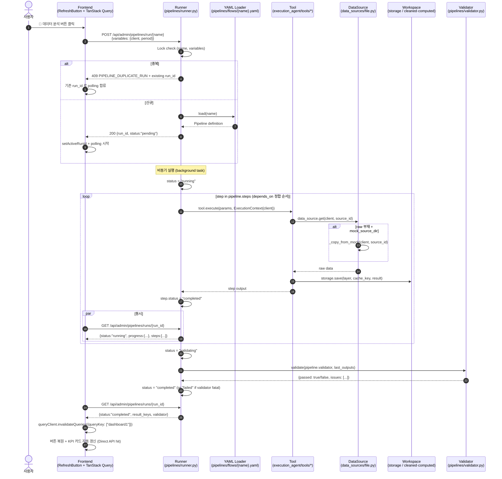

# 63. Frontend Backend Contract — Frontend 측 WS / REST 사용

| 항목 | 내용 |
|------|------|
| 버전 | v1.0 |
| 작성일 | 2026-05-13 |
| 상태 | Accepted |
| 의존 | [60_frontend_overview_v1.0.md](60_frontend_overview_v1.0.md) (진입점) / [61 Architecture](61_frontend_architecture_v1.0.md) (TanStack Query + Zustand) |
| 진실 소스 | [21_WEBSOCKET_PROTOCOL_v1.5.md](21_WEBSOCKET_PROTOCOL_v1.5.md) / [20_INTERFACE_CONTRACT_v1.1.md](20_INTERFACE_CONTRACT_v1.1.md) / [22_error_codes_v1.1.md](22_error_codes_v1.1.md) |

---

## 0. 본 문서의 역할

**Frontend 측에서 백엔드 WS / REST 를 어떻게 사용하는가** 의 정식 spec.

진실 소스는 백엔드 spec (21 / 20 / 22) — 본 문서는 **frontend 측 zod schema / 호출 패턴 / 에러 처리 / drift 방지** 가이드.

> **원칙**: 백엔드 변경 = frontend zod 도 함께 업데이트 (PR 체크리스트). 본 문서가 매핑 표.

---

## 1. 호스트 / 식별 체계

### 1.1 호스트

| 환경 | 백엔드 | Frontend |
|------|--------|----------|
| 로컬 | `http://localhost:8001` | `http://localhost:5173` (Vite dev) |
| dev | `https://dev.octorad.com` | `https://app.dev.octorad.com` |
| prod | (Sprint 6+) | (Sprint 6+) |

`.env` :
```
VITE_BACKEND_URL=http://localhost:8001
VITE_WS_URL=ws://localhost:8001
```

### 1.2 식별 체계 ([20 §6](20_INTERFACE_CONTRACT_v1.1.md) / [21 §1.4](21_WEBSOCKET_PROTOCOL_v1.5.md) 진실 소스)

| ID | 의미 | 생성 시점 |
|----|------|----------|
| `user_id` | 사용자 (Sprint 6+ 인증 후). POC = `"demo"` 고정, WS URL query 로 전달 | 회원가입 / POC 는 하드코딩 |
| `conversation_id` | 대화 묶음 | **클라이언트** 가 새 대화 시작 시 `crypto.randomUUID` |
| `turn_id` | 한 번의 query/response 사이클 | **클라이언트** 가 매 query 마다 `crypto.randomUUID` — ⚠️ REST 응답이 아님, query 는 WS 송신 |
| `session_id` | 백엔드 내부 alias of turn_id (deprecated) | `turn_id == session_id` (Sprint 13 통합). 외부 계약 사용 금지 |
| `thread_id` | LangGraph Checkpointer 키 | 서버가 `f"{conversation_id}_{turn_id}"` 로 생성 |
| `request_id` | 단일 HITL 요청 식별자 (추적용 라벨) | 서버가 `hitl_request` / `paused` 발행 시 `req_<8hex>` |

> ⚠️ **검증 정정 (2026-05-15, 사이클 3)**: `turn_id` 생성 시점이 이전 버전엔 "`POST /api/agent/stream` 응답" 으로 적혀 있었으나, 그 엔드포인트는 존재하지 않고 `turn_id` 는 **클라이언트가 생성**한다 ([21 §1.4](21_WEBSOCKET_PROTOCOL_v1.5.md)).

### 1.3 인증 (Sprint 6+)

POC 단계는 인증 없음. WS 는 `user_id="demo"` 고정 (URL query parameter, [21 §1.1](21_WEBSOCKET_PROTOCOL_v1.5.md)). Sprint 6 에서 JWT 또는 cookie session 도입 예정.

---

## 2. REST API 매핑

### 2.1 현재 구현 (Sprint 13 ~ 14)

> ⚠️ **검증 정정 (2026-05-15, 사이클 3)**: 이전 버전이 적은 `/api/agent/stream`(POST)·`/api/agent/runs/{turn_id}`·`/api/agent/feedback` **3개 엔드포인트는 백엔드에 존재하지 않는다**. 쿼리 실행은 REST 가 아니라 **`/ws/agent` WebSocket 의 `{type:"query"}` 메시지**로 한다 (§3, [21 §2.1](21_WEBSOCKET_PROTOCOL_v1.5.md)). 진실 소스 = [20 §1.1](20_INTERFACE_CONTRACT_v1.1.md) — 백엔드 `api_v2/main.py` 등록 라우터.

실재하는 REST 엔드포인트:

| Endpoint | 메서드 | Frontend Hook (TanStack Query) | 비고 |
|----------|--------|-------------------------------|------|
| `/health/` | GET | `useHealth()` | health check |
| `/health/detail` | GET | — | 4-Layer graph compile 검사 포함 |
| `/api/dashboard1/*` | GET | `useDashboard1Data()` | Dashboard1 페이지 — 20 endpoint (KPI 9 + MoM 4 + Segment 7) |
| `/api/admin/pipelines/category/{cat}` | GET | `useCategoryResults(cat, client, period)` | 5 v2 페이지 데이터 — 52 pipeline 카테고리별 실행 결과 |
| `/api/admin/pipelines/run/{name}` | POST | `useRunCategory(cat).mutate()` | 명시적 pipeline 트리거 ("데이터 분석" 버튼) |
| ~~`/api/mock/*`~~ | ~~GET~~ | ~~`useMock*()`~~ | ⚠️ **deprecated 2026-05-28** (mock layer 폐기, §2.3 참조) |

쿼리 시작·turn 진행·완료는 전부 WS. turn 이력/상세 조회용 REST 는 **Sprint 15 P0+ 예정** (§2.2).

### 2.2 Sprint 15 P0+ 예정

| Endpoint | 메서드 | Frontend Hook | 비고 |
|----------|--------|--------------|------|
| `/api/conversations` | GET | `useConversations()` | E2-5 sidebar 데이터 |
| `/api/conversations/{id}` | GET | `useConversation(id)` | 대화 상세 |
| `/api/conversations/{id}/turns` | GET | `useTurns(id)` | turn 이력 |
| `/api/memory` | GET | `useMemory(userId, scope)` | memory_entries |
| `/api/memory/{id}` | GET | `useMemoryEntry(id)` | 단일 entry |
| `/api/memory` | POST | `useSaveMemory()` mutation | save (W3 template 등) |
| `/api/memory/{id}` | PATCH | `useUpdateMemory()` mutation | 수정 |
| `/api/memory/{id}` | DELETE | `useDeleteMemory()` mutation | 삭제 |
| `/api/memory/{id}/apply` | POST | `useApplyTemplate()` mutation | W3 — slot 채워 plan 생성 |
| `/api/attachments/{turn_id}` | GET | `useAttachments(turnId)` | Sprint 4 |

### 2.3 ~~Mock 데이터 API~~ (deprecated 2026-05-28, 폐기) ⚠️

> **2026-05-28 폐기 박제** ([memory project-mock-data-as-poc-source](../../memory/project_mock_data_as_poc_source.md))
> - `backend/api_v2/routes/mock_data.py` 폐기 (source 삭제). `/api/mock/*` route 등록 X.
> - `useMockCompany()` ~ `useMockReviews()` 12개 hook 폐기. v2 페이지 = `useCategoryResults` 로 전환.
> - `data/mock/` 폴더 폐기. POC 데이터 = `data/{client}/raw/` (External collector + mock_api 보조).
> - 본 §2.3 하단 표 = **historical reference only** (현 코드 미정합, MVP+ 시 ELT 참고 자료).
> - 2026-06-01 정정 — `data/mock_api/` 폴더는 **외부 API 시뮬레이터** 로 살아있음 (mock data 와 별개). [memory project-collector-two-kinds](../../memory/project_collector_two_kinds.md)

| Endpoint | 메서드 | Frontend Hook | 응답 데이터 | 쿼리 파라미터 |
|----------|--------|--------------|------------|--------------|
| `/api/mock/company` | GET | `useMockCompany()` | company_info (15 rows) | — |
| `/api/mock/products` | GET | `useMockProducts()` | products (31 rows) | `?category=스킨케어` |
| `/api/mock/campaigns` | GET | `useMockCampaigns()` | campaigns (21 rows) | `?status=진행중&type=BRP` |
| `/api/mock/creatives` | GET | `useMockCreatives()` | creatives (47 rows) | `?campaign_id=BRP-001&channel=naver` |
| `/api/mock/channel-performance` | GET | `useMockChannelPerformance()` | channel_performance (6 rows) | — |
| `/api/mock/daily-performance` | GET | `useMockDailyPerformance()` | daily_performance (5,329 rows) | `?from=YYYY-MM-DD&to=YYYY-MM-DD&channel=naver` |
| `/api/mock/conversion-funnel` | GET | `useMockConversionFunnel()` | conversion_funnel (21 rows) | `?channel=naver` |
| `/api/mock/ab-tests` | GET | `useMockAbTests()` | ab_tests (9 rows) | `?campaign_id=BRP-001` |
| `/api/mock/budget-allocation` | GET | `useMockBudgetAllocation()` | budget_allocation (9 rows) | — |
| `/api/mock/keywords` | GET | `useMockKeywords()` | keyword_performance (21 rows) | `?channel=naver` |
| `/api/mock/retention` | GET | `useMockRetention()` | retention (5 rows) | — |
| `/api/mock/reviews` | GET | `useMockReviews()` | review_trends (36 rows) | `?sentiment=긍정&source=oliveyoung` |

**응답 포맷 (모두 동일)**:
```json
{
  "data": [...],
  "count": 21,
  "filters_applied": { "status": "진행중" }
}
```

**zod schema**: `src/api/schemas.ts` 의 `MockResponseSchema` (T = 각 row schema).

**MVP+ 마이그레이션**:
- POC (Sprint 0~5): mock CSV → `backend/api_v2/mock_data.py` 가 pandas 로딩
- MVP (Sprint 6+): 외부 API (네이버광고/메타광고/구글광고) 연동 — endpoint 표면 동일, frontend 변경 0
- Production (Sprint 11+): 자체 분석 DB 적재 + endpoint 동일

### 2.3.1 Dashboard1 API (Sprint 16 신설) ⭐ multi-client

> 결정 박제: [ADR-022](adr/ADR-022_data_source_workspace_layer_separation.md) — Agent 우회 Direct API.
> 구현 위치: [`backend/api_v2/routes/dashboard1.py`](../../backend/api_v2/routes/dashboard1.py) (commit b17ec8a)
> Frontend hook: [`frontend/src/api/hooks/useDashboard1Data.ts`](../../frontend/src/api/hooks/useDashboard1Data.ts)

**역할**: tool 의 cleaned/computed 결과를 frontend 가 *직접* 조회 (agent 우회 = 빠른 응답). 같은 `DataSource` + `Workspace` layer 를 사용하므로 agent 실행 결과와 *항상 동기*.

**Path prefix**: `/api/dashboard1/*` · **Tags**: `["Dashboard1"]`

**공통 Query 파라미터** (모든 endpoint):
- `?client=` (str, default `"clumi"`) — 회사 선택 (TopBar 드롭다운 → store → 여기)
- `?period=` (str, e.g. `"2026-04"`) — 분석 기간

| Endpoint | Frontend Hook | 응답 (Pydantic Output) |
|---|---|---|
| `/api/dashboard1/kpi/revenue` | `useDashboard1Revenue(client, period)` | `S001RevenueTotal` |
| `/api/dashboard1/kpi/ad-cost` | `useDashboard1AdCost(client, period)` | `AdCostTotal` |
| `/api/dashboard1/kpi/roas` | `useDashboard1Roas(client, period)` | `S005Roas` |
| `/api/dashboard1/kpi/cac` | `useDashboard1Cac(client, period)` | `S007Cac` |
| `/api/dashboard1/kpi/aov` | `useDashboard1Aov(client, period)` | `S014Aov` |
| `/api/dashboard1/kpi/new-members` | `useDashboard1NewMembers(client, period)` | `S028NewMembersMonthly` |
| `/api/dashboard1/kpi/signup-conversion` | `useDashboard1SignupConversion(client, period)` | `S067SignupConversion` |
| `/api/dashboard1/kpi/repurchase-rate` | `useDashboard1RepurchaseRate(client, period)` | `S012RepurchaseRateMom` |
| `/api/dashboard1/kpi/unknown-revenue-share` | `useDashboard1UnknownRevenue(client, period)` | `S016UnknownRevenueShare` |
| `/api/dashboard1/kpi/promotion-revenue` | ... | `S019PromotionRevenue` |
| `/api/dashboard1/kpi/promotion-roas` | ... | `S020PromotionRoas` |
| `/api/dashboard1/mom/revenue` | `useDashboard1MomRevenue(client)` | MoM 시계열 |
| `/api/dashboard1/segment/grade-ratio` | `useDashboard1GradeRatio(client, period)` | 등급 분포 |
| `/api/dashboard1/segment/age-bucket` | `useDashboard1AgeBucket(client, period)` | 연령대 분포 |
| `/api/dashboard1/segment/category-dist` | `useDashboard1CategoryDist(client, period)` | 카테고리 분포 |
| `/api/dashboard1/segment/channel-dist` | `useDashboard1ChannelDist(client, period)` | 채널 분포 |
| `/api/dashboard1/segment/member-guest` | `useDashboard1MemberGuest(client, period)` | 회원/게스트 |
| `/api/dashboard1/segment/grade-timeseries` | `useDashboard1GradeTimeseries(client)` | 등급 시계열 |
| ... (총 20 endpoint) |  |  |

**Cache 패턴** (`_cached_or_run` 헬퍼):
- 같은 `(client, period)` 요청 시 `Workspace.load("computed", key)` 우선 (HTTP cache + tool 결과 공유)
- cache miss → tool 실행 → `Workspace.save` → 반환

**zod schema**: `frontend/src/api/hooks/useDashboard1Data.ts` 의 각 hook 안에 inline (Pydantic Output 미러).

### 2.3.2 Admin API (Sprint 16 신설)

> 구현 위치: [`backend/api_v2/routes/admin.py`](../../backend/api_v2/routes/admin.py)
> Frontend hook: [`frontend/src/api/hooks/useAdminCatalog.ts`](../../frontend/src/api/hooks/useAdminCatalog.ts)

**Path prefix**: `/api/admin/*` · **Tags**: `["Admin"]`

| Endpoint | Frontend Hook | 응답 |
|---|---|---|
| `/api/admin/catalog` | `useAdminCatalog()` | 65 tool 메타 dump (name, category, description, status, parameters) |
| `/api/admin/clients` | `useAdminClients()` | `data/{client}/raw/` 디렉토리 scan → `[{id, name, source_count}]` |

**용도**:
- `useAdminCatalog()` → ToolPalette UI ([`features/workflow/ToolPalette.tsx`](../../frontend/src/features/workflow/ToolPalette.tsx)) 의 65 tool 카탈로그
- `useAdminClients()` → TopBar 클라이언트 드롭다운 ([`components/layout/TopBar.tsx`](../../frontend/src/components/layout/TopBar.tsx))

**client 흐름** (전체):

```
TopBar 드롭다운 (AVAILABLE_CLIENTS or useAdminClients)
   ↓
useCurrentClient Zustand store
   ↓
useDashboard1Data(client, period) hook 의 queryKey 일부
   ↓
fetch(`/api/dashboard1/.../?client=${client}&period=${period}`)
   ↓
ExecutionContext.client_id (agent 사용 시) 또는 직접 route 처리
   ↓
DataSource.get(client, source_id) → data/{client}/raw/{filename}
```

→ tool 코드는 client 무관. 회사 추가 = `data/{new_client}/raw/` 디렉토리 + dropdown entry 만.

### 2.3.3 Pipeline API (POC v1 — Phase 1 신설 예정) ⭐ Trigger 추상화

> **결정 박제**: [ADR-023](adr/ADR-023_pipeline_5_actors_and_trigger_abstraction.md) — Pipeline 5 주체 (Agent · Direct API · Maker · Runner · Validator) + 6 Trigger 추상화 (button/upload/cron/webhook/agent).
> **Pipeline 정의 진실 소스**: [68 spec](68_pipeline_catalog_v1.0.md) — 52 시각화 × 52 pipeline YAML 카탈로그 (Batch 1 = Dashboard1 21 완료).
> **본 §의 책임**: *frontend 가 Runner 를 어떻게 호출하는가* — Pipeline 내부 구현 (Runner / Validator / YAML parser) 은 [10 §7.7](10_system_architecture_v1.9.md) + 추후 신규 spec 위임 (V5 영역 분리).
> **구현 상태**: `backend/app/pipelines/` 부재 (2026-05-27). 본 §는 *Phase 1 신설 직전의 contract*. Frontend `useRunPipeline` hook 도 Phase 1 동반.

#### 2.3.3.1 §2.3.1 Direct API 와의 분리

| 영역 | §2.3.1 Direct API | §2.3.3 Pipeline API (본 §) |
|---|---|---|
| 호출 시점 | 페이지 로드 시 (자동) | 사용자 명시 트리거 ("🔄 데이터 분석" 버튼) |
| 응답 시간 | < 100ms (cache hit) ~ 수초 (miss) | 수초 ~ 수분 (다단계 step 실행) |
| 입력 | `?client=&period=` | `+ pipeline name + 변수 (period 등)` |
| Cache | tool 1개 결과 | **여러 step 의 결과 → 같은 Workspace cache 채움** (이후 §2.3.1 도 hit) |
| 5 주체 | **2. Direct API** | **4. Runner** (Trigger=button) → **3a. Maker (개발자)** 의 YAML |
| 진행 표시 | 없음 (즉시 응답) | ✅ run_id 발급 + polling (POC) |

> **관계**: Pipeline 실행 = *Workspace cache 채우기*. 이후 §2.3.1 Direct API 호출이 cache hit 으로 빨라짐. **두 API 는 *상호 보완*** — Pipeline 으로 일괄 갱신, Direct 로 페이지 조회.

#### 2.3.3.2 Path prefix · Tags

`/api/admin/pipelines/*` · `["Admin", "Pipelines"]`

> `/api/admin/*` 아래 둔 이유: 현 admin.py 의 `/catalog`, `/clients` 와 *시스템 메타 / 운영* 영역 같음. 사용자 인증 도입 (MVP) 시 admin scope 분리 정합.

#### 2.3.3.3 Endpoint 4개 (POC v1)

| Endpoint | 메서드 | Frontend Hook | 응답 | 비고 |
|---|---|---|---|---|
| `/api/admin/pipelines` | GET | `usePipelineCatalog()` | `PipelineCatalog` | 등록된 pipeline 목록 (YAML scan) |
| `/api/admin/pipelines/run/{name}` | POST | `useRunPipeline()` mutation | `PipelineRunCreated` | Trigger=button. 비동기 (run_id 즉시 반환) |
| `/api/admin/pipelines/runs/{run_id}` | GET | `usePipelineRun(run_id)` | `PipelineRunStatus` | 상태 polling |
| `/api/admin/pipelines/runs` | GET | `usePipelineRunHistory()` | `PipelineRunList` | (선택) 최근 N개 실행 이력 |

> Sprint 0~1 = 위 2번·3번 필수. 1번·4번 = Sprint 1+ 보강 (UI 가 필요할 때).

#### 2.3.3.4 요청 / 응답 schema (Pydantic ↔ zod)

```typescript
// frontend/src/api/schemas/pipelines.ts (신설 예정)
import { z } from 'zod';

// ── 요청 ──
export const PipelineRunRequestSchema = z.object({
  variables: z.record(z.string()).default({}),    // ${client}, ${period} 등 — 68 §3.3 변수
  trigger: z.literal('manual').default('manual'), // POC v1 = manual 만
  // POC v1 미사용 (MVP+): force_refresh, override_cache
});

// ── 응답: run 시작 ──
export const PipelineRunCreatedSchema = z.object({
  run_id: z.string(),                              // UUID — polling 키
  pipeline_name: z.string(),
  status: z.literal('pending'),
  trigger: z.string(),
  variables: z.record(z.string()),
  created_at: z.string(),                          // ISO8601
  poll_url: z.string(),                            // 클라이언트 편의 — GET URL
});

// ── 응답: 상태 조회 ──
export const PipelineStepStatusSchema = z.object({
  id: z.string(),                                  // step id (68 §4.3 컨벤션)
  status: z.enum(['pending', 'running', 'completed', 'failed', 'skipped']),
  started_at: z.string().nullable(),
  completed_at: z.string().nullable(),
  output_key: z.string().nullable(),               // Workspace cache key (있을 시)
  error: z.object({
    code: z.string(),
    message: z.string(),
  }).nullable(),
});

export const PipelineRunStatusSchema = z.object({
  run_id: z.string(),
  pipeline_name: z.string(),
  status: z.enum(['pending', 'running', 'validating', 'completed', 'failed', 'cancelled']),
  variables: z.record(z.string()),
  steps: z.array(PipelineStepStatusSchema),
  progress: z.object({
    total_steps: z.number().int(),
    completed_steps: z.number().int(),
    percent: z.number(),                           // 0~100
  }),
  validator: z.object({
    passed: z.boolean().nullable(),                // null = 아직 실행 안 됨
    issues: z.array(z.object({
      severity: z.enum(['error', 'warning']),
      message: z.string(),
    })).default([]),
  }).nullable(),
  result_keys: z.array(z.string()).default([]),    // 완료 시 Workspace cache key 목록
  error: z.object({                                // status === 'failed'
    code: z.string(),
    layer: z.enum(['runner', 'tool', 'validator', 'data_source']),
    message: z.string(),
    failed_step: z.string().nullable(),
  }).nullable(),
  created_at: z.string(),
  updated_at: z.string(),
  completed_at: z.string().nullable(),
});
```

**카탈로그 응답** (`GET /api/admin/pipelines`):

```typescript
export const PipelineCatalogEntrySchema = z.object({
  name: z.string(),                                // dashboard1_kpi_revenue
  visualization_id: z.string(),                    // K01
  category: z.string(),                            // dashboard1 | dashboard_v1 | ...
  description: z.string(),
  owner: z.enum(['developer', 'canvas', 'agent']),
  required_variables: z.array(z.string()),         // ["client", "period"]
  estimated_seconds: z.number().nullable(),
});

export const PipelineCatalogSchema = z.object({
  total: z.number().int(),
  by_category: z.record(z.number().int()),
  pipelines: z.array(PipelineCatalogEntrySchema),
});
```

> **Pydantic Output 대응** = 68 spec §3 의 YAML 필드 1:1 매핑 (validator 가 schema 일치 보장). Pipeline 내부 구현이 결정 후 본 zod schema 도 *V1 코드 정합 사이클* 1회 더.
>
> **Pydantic 모델 상태 (2026-05-28)**: `backend/app/pipelines/schemas.py` 부재. 본 zod schema = *frontend 의 contract 선언*. Phase 1 진입 commit 에 Pydantic 모델 동반 신설 + DC-FE-4 (zod 필수 필드 ↔ Pydantic required 일치) 검증.

#### 2.3.3.5 진행 표시 UX (POC v1 결정 = Polling 2s)

| 옵션 | POC v1 | 사유 |
|---|:---:|---|
| **Polling 2s** ✅ | 채택 | 단순 (TanStack Query `refetchInterval` 만), pipeline `< 30s` 가정 시 부담 X |
| WebSocket | ⏸️ MVP+ | 기존 `/ws/agent` 채널 재사용 또는 `/ws/pipelines` 신설 검토. 인프라 비용 ↑ |
| SSE (EventSource) | ⏸️ MVP+ | 단방향 진행 표시에 적합. WS 보다 단순. MVP 진입 시 재검토 |

**Polling 구현**:

```typescript
// useRunPipeline.ts — 트리거 + 자동 polling
export function useRunPipeline(name: string) {
  const queryClient = useQueryClient();
  return useMutation({
    mutationFn: (req: PipelineRunRequest) => rest.post(`/api/admin/pipelines/run/${name}`, req),
    onSuccess: (created: PipelineRunCreated) => {
      // run_id 받자마자 status query 활성화 → polling 시작
      queryClient.setQueryData(['pipelineRun', created.run_id], {
        ...created, steps: [], progress: { total_steps: 0, completed_steps: 0, percent: 0 },
        validator: null, result_keys: [], error: null, updated_at: created.created_at,
        completed_at: null,
      } as PipelineRunStatus);
    },
  });
}

export function usePipelineRun(runId: string | null) {
  return useQuery({
    queryKey: ['pipelineRun', runId],
    queryFn: () => rest.get(`/api/admin/pipelines/runs/${runId}`).then(r => PipelineRunStatusSchema.parse(r)),
    enabled: !!runId,
    refetchInterval: (data) => {
      const status = (data as PipelineRunStatus | undefined)?.status;
      // 종료 상태면 polling 중단
      if (!status || ['completed', 'failed', 'cancelled'].includes(status)) return false;
      return 2000;  // 2s
    },
  });
}
```

**완료 직후 cache invalidation** (§2.3.1 Direct API 와 정합):

```typescript
// PipelineRunStatus.status === 'completed' 감지 시
useEffect(() => {
  if (run?.status === 'completed') {
    // result_keys 가 영향 주는 dashboard1 query 무효화 → 다음 render 에 새 cache 로딩
    queryClient.invalidateQueries({ queryKey: ['dashboard1'] });
  }
}, [run?.status]);
```

#### 2.3.3.6 에러 처리 (POC v1 = alert toast)

| 시점 | 코드 / 분기 | 처리 |
|---|---|---|
| 호출 자체 실패 (4xx/5xx) | `BackendError` (§2.5) | toast — "⚠️ 실행 요청 실패" |
| Pipeline status = `failed` | `error.layer` 별 분기 | toast — "⚠️ Pipeline 실패 ({failed_step})" + 콘솔 detail |
| Validator `passed=false` | `validator.issues` | toast (warning) — pipeline 은 `completed` 이나 검산 경고 |
| Polling 중 네트워크 끊김 | TanStack Query retry | 자동 재시도 (default) |

**Error code 신규** (Phase 1 진입 시 `error_codes.py` 추가 — §7.1 갱신 필요):

| Code | layer | severity | 의미 |
|---|---|---|---|
| `PIPELINE_NOT_FOUND` | runner | fatal | `name` 에 해당하는 YAML 부재 |
| `PIPELINE_RUN_NOT_FOUND` | runner | fatal | `run_id` 무효 |
| `PIPELINE_STEP_FAILED` | tool | fatal | step 의 tool.execute() 예외 |
| `PIPELINE_VALIDATOR_FAILED` | validator | warning | schema·범위·정답값 불일치 |
| `PIPELINE_DUPLICATE_RUN` | runner | warning | 같은 `(name, variables)` 의 진행 중 run 존재 (§2.3.3.7) |
| `PIPELINE_DATA_SOURCE_MISSING` | data_source | fatal | raw 파일 부재 + `mock_source_dir` 도 없음 |

> ⚠️ **신규 코드 6개** → Phase 1 진입 commit 에 `error_codes.py` + `errorMessages.ts` + 본 §7.1 표 동반 갱신. DC-FE-1 검증 대상.

#### 2.3.3.7 동시성 — 중복 실행 방지

```
같은 (pipeline_name, variables) 가 진행 중 (pending|running|validating) 일 때:
   ─ POC v1: 409 + code=PIPELINE_DUPLICATE_RUN + 기존 run_id 반환
              (frontend = 기존 run_id 의 polling 으로 합류)
   ─ MVP+:   force_refresh=true 옵션 시 cancel + 신규 run
```

→ **Runner 내부 Lock** = `(pipeline_name, frozenset(variables.items()))` 기준 in-memory set (POC). MVP+ = Redis 또는 DB row lock.

> 다른 `(name, variables)` 조합은 *병렬 실행 허용*. 예: `dashboard1_kpi_revenue?period=2026-04` 와 `=2026-03` 은 동시 가능.

#### 2.3.3.8 Frontend 사용 패턴 (Dashboard1 페이지)

```tsx
// frontend/src/features/dashboard1/RefreshButton.tsx (Phase 1 신설 예정)
function RefreshButton() {
  const client = useCurrentClient();
  const [period] = usePeriod();
  const [activeRunId, setActiveRunId] = useState<string | null>(null);

  const runMutation = useRunPipeline('dashboard1_kpi_revenue');  // 또는 묶음
  const { data: run } = usePipelineRun(activeRunId);

  const onClick = () => {
    runMutation.mutate(
      { variables: { client, period } },
      { onSuccess: (created) => setActiveRunId(created.run_id) }
    );
  };

  const isRunning = run && !['completed', 'failed', 'cancelled'].includes(run.status);

  return (
    <Button onClick={onClick} disabled={isRunning}>
      {isRunning
        ? `🔄 분석 중 (${run.progress.percent}%)`
        : '🔄 데이터 분석'}
    </Button>
  );
}
```

> **묶음 트리거** (Dashboard1 전체 21 pipeline 일괄) = Phase 2 보강. POC v1 = 1 pipeline 1 버튼 (단순). 추후 *pipeline group* 개념 도입 시 본 § 갱신.

#### 2.3.3.9 POC v1 → POC v2 → MVP 진화

| 단계 | 변경 | 본 §의 contract |
|---|---|---|
| **POC v1** | manual trigger, polling 2s, 1 pipeline 1 trigger | ✅ 본 § 표면 |
| **POC v2** | + Canvas 발행 pipeline (`owner=canvas`, `memory_entries` 저장) | + Canvas-saved pipeline 의 `/api/admin/pipelines/run/{name}` 호출 — 표면 변경 X |
| **MVP-1** | + upload trigger | `POST /api/admin/pipelines/run/{name}` 에 `multipart/form-data` 지원 |
| **MVP-2** | + cron / webhook | 새 endpoint X (백엔드 내부 트리거) — 진행 표시만 본 § 의 GET 으로 |
| **MVP+** | + WS 진행 표시 + Agent Maker | `/ws/pipelines` 또는 `/ws/agent` 채널 재사용 — 별도 ADR |

→ **Trigger 추상화 = 본 §의 GET status endpoint 는 *영구 불변*** (모든 trigger 가 같은 PipelineRun 모델 공유).

### 2.4 REST 클라이언트 패턴

```typescript
// src/api/rest.ts
import { z } from 'zod';

const BASE_URL = import.meta.env.VITE_BACKEND_URL;

async function request<T>(path: string, init?: RequestInit): Promise<unknown> {
  const res = await fetch(`${BASE_URL}${path}`, {
    headers: { 'Content-Type': 'application/json', ...init?.headers },
    ...init,
  });
  if (!res.ok) {
    const body = await res.json().catch(() => ({}));
    throw new BackendError(res.status, body);
  }
  return res.json();
}

export const rest = {
  get: <T>(path: string) => request<T>(path),
  post: <T>(path: string, body: unknown) => request<T>(path, {
    method: 'POST',
    body: JSON.stringify(body),
  }),
  // patch / delete 동일
};

// 사용 예 (zod 검증과 함께)
export async function fetchConversations() {
  const raw = await rest.get('/api/conversations?limit=20');
  return ConversationListSchema.parse(raw);
}
```

### 2.5 Error 처리 — BackendError 클래스

```typescript
// src/api/errors.ts
export class BackendError extends Error {
  constructor(
    public status: number,
    public body: { code?: string; message?: string; detail?: unknown }
  ) {
    super(body.message ?? `HTTP ${status}`);
    this.name = 'BackendError';
  }
}

// 사용
try {
  await fetchConversations();
} catch (e) {
  if (e instanceof BackendError && e.body.code === 'CONVERSATION_NOT_FOUND') {
    // 친절한 UI
  }
}
```

---

## 3. WebSocket 채널

### 3.1 채널 2개 ([21 §1](21_WEBSOCKET_PROTOCOL_v1.5.md))

| 채널 | URL | 방향 | 용도 |
|------|-----|------|------|
| `/ws/agent` | `ws://host/ws/agent` | server → client 위주 | 노드 이벤트 / 채팅 / 완료 |
| `/ws/hitl` | `ws://host/ws/hitl` | bidirectional | HITL 요청 / 응답 / 편집 |

### 3.2 연결 관리

```typescript
// src/api/ws.ts (간략)
import { useSession } from '@/stores/session';
import { WSMessageSchema } from './schemas';

const WS_URL = import.meta.env.VITE_WS_URL;

let agentWs: WebSocket | null = null;
let hitlWs: WebSocket | null = null;

export function connectAll() {
  agentWs = setupChannel(`${WS_URL}/ws/agent`, handleAgentMessage);
  hitlWs = setupChannel(`${WS_URL}/ws/hitl`, handleHitlMessage);
}

function setupChannel(url: string, handler: (msg: unknown) => void): WebSocket {
  const ws = new WebSocket(url);
  ws.onmessage = (event) => {
    const raw = JSON.parse(event.data);
    const parsed = WSMessageSchema.safeParse(raw);
    if (!parsed.success) {
      console.error(`[ws] invalid message`, parsed.error, raw);
      return;
    }
    handler(parsed.data);
  };
  ws.onopen = () => useSession.getState().setConnectionStatus('connected');
  ws.onclose = () => {
    useSession.getState().setConnectionStatus('closed');
    setTimeout(() => reconnect(url), 1000);  // 1s 후 재연결
  };
  return ws;
}

export function sendHitlMessage(msg: unknown) {
  if (hitlWs?.readyState !== WebSocket.OPEN) {
    console.error('[ws] hitl not connected');
    return;
  }
  hitlWs.send(JSON.stringify(msg));
}
```

### 3.3 재연결 정책

- onclose → 1s 후 재시도 (exponential backoff Sprint 6+)
- 재연결 후 마지막 conversation_id / turn_id 로 상태 복원 (백엔드가 자동 — 23 / DB checkpointer)

---

## 4. Server → Client 메시지 카탈로그

진실 소스: [21 §2 / §3](21_WEBSOCKET_PROTOCOL_v1.5.md). 본 표는 frontend 측 zod schema 와 store 라우팅.

> ⚠️ **검증 정정 (2026-05-15, 사이클 3)**: 이전 버전은 `agent_message`/`agent_message_complete` (토큰 스트리밍) 를 적었으나 **백엔드는 이 두 메시지를 발행하지 않는다** — 스트리밍 채팅은 현 백엔드에 없음. 최종 응답은 `complete.data.response` 로 1회 전달. 또한 `hitl_request`/`paused`/`resumed` 는 `/ws/hitl` 이 아니라 **`/ws/agent`** 채널로 온다 ([21 §2.2](21_WEBSOCKET_PROTOCOL_v1.5.md)).

### 4.1 `/ws/agent` 이벤트 (server → client 주 채널)

| 메시지 | zod schema | Zustand store action |
|--------|-----------|---------------------|
| `connected` | `ConnectedSchema` | `useSession.setConnectionStatus('connected')` |
| `node_event` | `NodeEventSchema` | `useAgent.appendNodeEvent(msg)` — `data` 는 노드 State update dict |
| `hitl_request` | `HitlRequestSchema` | `useHitl.setPending(data)` → plan_review modal open |
| `paused` | `PausedSchema` | `useHitl.setPaused(data)` (execution_pause) |
| `resumed` | `ResumedSchema` | `useHitl.clearPending()` + 진행 표시 |
| `complete` | `CompleteSchema` | `useAgent.finalizeFromComplete(data)` + `useSession.resetTurn()` |
| `error` | `ErrorSchema` (평탄, 22 매핑) | toast + `useSession.setError` |
| `layer_start` / `todo_start` / `todo_complete` / `progress` | `CallbackEventSchema` (4종) | `useAgent`/`useWorkflow` 진행 표시 (callback bridge 경유) |
| `pong` | — | keepalive (무시) |

### 4.2 `/ws/hitl` 이벤트 (server → client, 명령 ack 채널)

| 메시지 | zod schema | Zustand store action |
|--------|-----------|---------------------|
| `connected` | `ConnectedHitlSchema` (`channel:"hitl"` 포함) | `useSession.setConnectionStatus('connected')` |
| `hitl_ack` | `HitlAckSchema` | `useHitl.setCascadeResult(data)` + Sonner |
| `error` | `ErrorSchema` (평탄/중첩 2종 — [21 §3.2](21_WEBSOCKET_PROTOCOL_v1.5.md)) | toast |
| `pong` | — | keepalive (무시) |

### 4.3 메시지 zod schema 예시

> ⚠️ **검증 정정 (2026-05-15, 사이클 3)**: 아래는 [21 §2.2 / §3.2](21_WEBSOCKET_PROTOCOL_v1.5.md) 의 **실제 백엔드 emit 포맷**. 이전 버전 schema (`node_event.data` 에 `{layer,node_name,status}` / `hitl_request.data` 에 `request_type` / `WSMessageSchema` 에 `AgentMessage*`) 는 백엔드와 불일치하여 **모든 메시지가 `safeParse` 에서 폐기**되던 원인이었음. 전면 정정.

```typescript
// src/api/schemas.ts
import { z } from 'zod';

// ── envelope 공통: 평탄 구조, node/code 등이 최상위 ──

export const NodeEventSchema = z.object({
  type: z.literal('node_event'),
  node: z.string(),                       // "cognitive" | "planning" | "execution" | "response"
  conversation_id: z.string(),
  turn_id: z.string(),
  data: z.record(z.unknown()),            // 노드 State update dict — structured_query / plan / execution_result / response 중 해당 키
});

export const HitlRequestSchema = z.object({
  type: z.literal('hitl_request'),
  conversation_id: z.string(),
  turn_id: z.string(),
  data: z.object({
    request_id: z.string(),
    plan: PlanSchema,                     // §6 PlanSchema
    options: z.array(z.string()),         // ["approve","reject","modify"]
    message: z.string(),
    turn_id: z.string(),                  // envelope 값 복제
    conversation_id: z.string(),
  }),
  // ⚠️ request_type / clarification 필드 없음 — plan_review 단일 (paused 는 별도 메시지)
});

export const PausedSchema = z.object({
  type: z.literal('paused'),
  conversation_id: z.string(),
  turn_id: z.string(),
  data: z.object({
    request_id: z.string(),
    completed: z.array(z.string()),
    total: z.number().int(),
    current_phase: z.number().int(),
    progress: z.record(z.unknown()),      // ExecutionProgress dump
    turn_id: z.string(),
    conversation_id: z.string(),
  }),
});

export const ResumedSchema = z.object({
  type: z.literal('resumed'),
  conversation_id: z.string(),
  turn_id: z.string(),
  data: z.object({
    action: z.enum(['approve', 'modify', 'reject', 'continue', 'cancel']),
  }),
});

export const CompleteSchema = z.object({
  type: z.literal('complete'),
  conversation_id: z.string(),
  turn_id: z.string(),
  data: z.object({
    status: z.enum(['success', 'rejected', 'cancelled', 'aborted']),
    guard_warnings: z.array(z.object({ layer: z.string(), code: z.string() })).default([]),
    reason: z.string().optional(),        // status==="aborted"
    message: z.string().optional(),       // status==="rejected"
    response: z.record(z.unknown()).optional(),         // status==="success" — ResponsePayload
    execution_result: z.record(z.unknown()).optional(),
    structured_query: z.record(z.unknown()).optional(),
    plan: PlanSchema.optional(),
  }),
});

export const ErrorSchema = z.object({          // §6 평탄 포맷 (/ws/agent)
  type: z.literal('error'),
  code: z.string(),
  layer: z.enum(['transport', 'cognitive', 'planning', 'execution', 'response', 'runtime']),
  severity: z.enum(['fatal', 'warning']),
  message: z.string(),
  detail: z.record(z.unknown()).optional(),
  conversation_id: z.string().optional(),       // fan-out error 만
  turn_id: z.string().optional(),
});

export const ConnectedSchema = z.object({       // /ws/agent
  type: z.literal('connected'),
  session_id: z.string(),
  user_id: z.string(),
  timestamp: z.string(),
});

export const ConnectedHitlSchema = z.object({   // /ws/hitl
  type: z.literal('connected'),
  channel: z.literal('hitl'),
  user_id: z.string(),
  timestamp: z.string(),
});

export const HitlAckSchema = z.object({
  type: z.literal('hitl_ack'),
  timestamp: z.string(),
  data: z.object({
    action: z.string(),                   // pause|resume|cancel|approve|reject|modify|todo_*
    session_id: z.string().optional(),    // == turn_id
    request_id: z.string().optional(),
    accepted: z.boolean(),
    reason: z.string().optional(),        // accepted=false — free-form 또는 turn_not_active
    code: z.string().optional(),          // accepted=false — ErrorCodes enum (TODO_EDIT_NOT_PAUSED 등)
    invalidated: z.array(z.string()).optional(),
    restart_from: z.string().nullable().optional(),
    preserved: z.array(z.string()).optional(),
    issues: z.array(z.string()).optional(),
    nl_action: z.enum(['add', 'remove', 'modify', 'reorder']).optional(),
    plan: z.record(z.unknown()).optional(),
    todo_id: z.string().optional(),
  }),
});

// callback bridge 경유 (Sprint 12 호환 이벤트) — bridge 가 conversation_id/turn_id 보강
export const CallbackEventSchema = z.object({
  type: z.enum(['layer_start', 'todo_start', 'todo_complete', 'progress']),
  session_id: z.string(),                 // == turn_id
  timestamp: z.string().optional(),
  data: z.record(z.unknown()),
  conversation_id: z.string().optional(),
  turn_id: z.string().optional(),
});

// Discriminated union — type 별 분기. agent_message* 없음.
export const WSMessageSchema = z.discriminatedUnion('type', [
  ConnectedSchema,
  ConnectedHitlSchema,
  NodeEventSchema,
  HitlRequestSchema,
  PausedSchema,
  ResumedSchema,
  CompleteSchema,
  ErrorSchema,
  HitlAckSchema,
  CallbackEventSchema,   // layer_start/todo_start/todo_complete/progress 4종
]);
```

> `ConnectedSchema` 와 `ConnectedHitlSchema` 는 둘 다 `type:"connected"` 이므로 `discriminatedUnion('type', ...)` 에 동시에 넣을 수 없다 — `connected` 는 별도 `z.union` 으로 처리하거나, 채널별 핸들러에서 채널을 알고 있으므로 채널별 파싱 권장.

---

## 5. Client → Server 메시지 카탈로그

### 5.1 `/ws/agent` 송신

| 메시지 | 함수 | 사용처 |
|--------|------|--------|
| `query` | `sendQuery(text, conversationId?)` | 새 turn 시작 |
| `resume_query` | `sendResumeQuery(turnId)` | 서버 재시작 후 복원 |

### 5.2 `/ws/hitl` 송신

| 메시지 | 함수 | 사용처 |
|--------|------|--------|
| `hitl_response` | `sendHitlResponse({request_id, turn_id, action, value?})` | approve / reject |
| `todo_delete` | `sendTodoDelete({turn_id, todo_id})` | 🗑 버튼 |
| `todo_modify` | `sendTodoModify({turn_id, todo_id, changes})` | 노드 더블클릭 → 저장 |
| `todo_add` | `sendTodoAdd({turn_id, new_todo})` | + 버튼 / 노드 라이브러리 드래그 |
| `todo_edit_nl` | `sendTodoEditNl({turn_id, instruction})` | NL textarea ⚡ 적용 |
| `pause` / `resume` / `cancel` | 각각 함수 | 채팅 컨트롤 |

### 5.3 송신 패턴

```typescript
// src/api/ws/hitl.ts
import { sendHitlMessage } from '../ws';
import { useSession } from '@/stores/session';

export function sendTodoEditNl(instruction: string) {
  const turnId = useSession.getState().turnId;
  if (!turnId) return;
  sendHitlMessage({
    type: 'todo_edit_nl',
    data: {
      turn_id: turnId,
      session_id: turnId,  // session_id == turn_id (Sprint 13)
      instruction,
    },
  });
}
```

---

## 6. Plan / Todo zod schema — 백엔드 ↔ frontend 매핑

진실 소스: [30_DATA_MODELS_v1.1.md](30_DATA_MODELS_v1.1.md) / [`planner.Plan`](../../backend/app/dream_agent/planning/planner.py) (ADR-010 D 단일화).

### 6.1 PlannedTodo zod

```typescript
// src/api/schemas.ts
export const PlannedTodoSchema = z.object({
  id: z.string(),
  task_type: z.string(),
  team: z.string().nullable().optional(),     // planner.py PlannedTodo.team — 검증 사이클 재검증 추가
  agent: z.string().nullable().optional(),
  tool: z.string().nullable().optional(),
  tool_params: z.record(z.unknown()).default({}),
  depends_on: z.array(z.string()).default([]),
  priority: z.number().int().default(1),
  rationale: z.string().default(''),

  // Workflow Canvas (62) — Optional, Sprint 15+ 신규 (현 planner.py 에는 아직 없음)
  position: z.object({ x: z.number(), y: z.number() }).nullable().optional(),
  node_type: z.enum(['task', 'branch', 'join', 'start', 'end']).default('task'),
  visualization_meta: z.record(z.unknown()).default({}),
});

export const PlanSchema = z.object({
  teams_selected: z.array(z.string()).default([]),
  todos: z.array(PlannedTodoSchema).default([]),
  dag: z.record(z.array(z.string())).default({}),
  plan_notes: z.string().default(''),
});
```

### 6.2 Memory Entry zod (Sprint 15+)

진실 소스: [35_DB_SCHEMA_v1.0.md](35_DB_SCHEMA_v1.0.md).

```typescript
export const MemoryEntrySchema = z.object({
  id: z.string(),
  user_id: z.string(),
  scope_type: z.enum(['session', 'user', 'org', 'global']),
  scope_id: z.string().nullable(),
  conversation_id: z.string().nullable(),
  turn_id: z.string().nullable(),
  type: z.enum([
    'conversation', 'fact', 'preference', 'pattern',
    'feedback', 'error_recovery', 'clarification_history',
    'conversation_meta', 'workflow_template',  // ← 62 추가
  ]),
  content: z.record(z.unknown()),  // JSONB (schema_version per type)
  created_at: z.string(),
  updated_at: z.string(),
});
```

### 6.3 Workflow Template content schema (W3)

진실 소스: [62 §3.2](62_workflow_canvas_design_v1.2.md).

```typescript
export const WorkflowTemplateContentSchema = z.object({
  schema_version: z.literal('v1'),
  name: z.string(),
  description: z.string(),
  todos: z.array(PlannedTodoSchema),
  dag: z.record(z.array(z.string())),
  param_slots: z.array(z.object({
    name: z.string(),
    type: z.enum(['string', 'number', 'boolean']),
    required: z.boolean(),
    description: z.string().optional(),
  })),
  usage_count: z.number().int().default(0),
  last_used_at: z.string().nullable(),
  tags: z.array(z.string()).default([]),
});
```

---

## 7. Error Code 처리

진실 소스: [22_error_codes_v1.1.md](22_error_codes_v1.1.md) + [`backend/app/core/error_codes.py`](../../backend/app/core/error_codes.py).

### 7.1 11 카탈로그 — 진실 소스 `error_codes.py`

> ⚠️ **검증 정정 (2026-05-15, 사이클 3)**: 이전 버전 표의 `PLAN_REQUEST_NONE`/`TURN_NOT_ACTIVE`/`SESSION_NOT_FOUND`/`LAYER_GUARD_FATAL`/`HITL_TIMEOUT`/`LLM_UNAVAILABLE`/`INTERNAL_ERROR` **7개는 `error_codes.py` 에 존재하지 않는 가공 코드**였고, 실제 코드 7개가 누락돼 있었다. 아래가 실제 11개 ([22 §1](22_error_codes_v1.1.md) = `backend/app/core/error_codes.py`).

| Code | layer | severity | 전달 경로 | Frontend 처리 |
|------|-------|----------|-----------|--------------|
| `INVALID_MESSAGE` | transport | fatal | `error` 이벤트 | toast + console.error (개발자용) |
| `CONCURRENT_LIMIT_EXCEEDED` | transport | fatal | `error` 이벤트 | toast "⚠️ 동시 실행 한도 초과" |
| `EXECUTION_ERROR` | runtime | fatal | `error` 이벤트 | toast "⚠️ 실행 중 오류" |
| `COGNITIVE_EMPTY_QUERY` | cognitive | fatal | `error` + `complete(aborted)` | toast "⚠️ 질문을 이해하지 못함" |
| `PLANNING_EMPTY_PLAN` | planning | fatal | `error` + `complete(aborted)` | toast "⚠️ 실행 계획 생성 실패" |
| `EXECUTION_ALL_FAILED` | execution | fatal | `error` + `complete(aborted)` | toast "⚠️ 모든 작업 실패" |
| `EXECUTION_PARTIAL_FAILED` | execution | warning | `error` + `complete.guard_warnings` | 경고 배지 (turn 계속 진행) |
| `RESPONSE_EMPTY` | response | fatal | `error` + `complete(aborted)` | toast "⚠️ 응답 생성 실패" |
| `TODO_EDIT_NOT_PAUSED` | runtime | warning | `hitl_ack.code` | toast "⚠️ 일시정지 상태가 필요" |
| `INVALID_DAG` | planning | warning | `hitl_ack.code` | toast "⚠️ Todo 의존 관계 오류" |
| `NL_INTENT_UNCLEAR` | planning | warning | `hitl_ack.code` | toast "⚠️ 이해하지 못함, 다시" + textarea 보존 |

> 추가 참고: `hitl_ack.reason` 의 free-form 문자열 (`turn_not_active`, NL 처리 오류 등)은 enum 이 아니므로 `code` 없이 `reason` 만 옴 — fallback 메시지 처리.

### 7.1.1 신규 예정 — Pipeline 6 (Phase 1 동반 신설) ⭐

> 본 spec **§2.3.3** + **§8.6** 의 결정에 따라 `error_codes.py` 추가 예정. **현재 미존재** — Phase 1 진입 commit 에 `error_codes.py` + `errorMessages.ts` + 본 §7.1 표 동반 갱신 (DC-FE-1 검증 대상).

| Code | layer | severity | 전달 경로 | Frontend 처리 |
|---|---|---|---|---|
| `PIPELINE_NOT_FOUND` | runner | fatal | POST 404 | toast "⚠️ Pipeline 미정의" |
| `PIPELINE_RUN_NOT_FOUND` | runner | fatal | GET 404 | toast "⚠️ 실행 이력 없음" |
| `PIPELINE_STEP_FAILED` | tool | fatal | `PipelineRunStatus.error` | toast "⚠️ {step} 실패" + console.error(detail) |
| `PIPELINE_VALIDATOR_FAILED` | validator | warning | `PipelineRunStatus.validator.issues` | toast (warning) — cache invalidate 진행 |
| `PIPELINE_DUPLICATE_RUN` | runner | warning | POST 409 + existing run_id | silent (기존 run polling 합류) |
| `PIPELINE_DATA_SOURCE_MISSING` | data_source | fatal | `PipelineRunStatus.error` | toast "⚠️ raw 데이터 부재 — collector 먼저" |

→ Phase 1 진입 시 본 §7.1 합산 = **17 코드**. layer enum 에 `runner` / `tool` / `validator` / `data_source` 추가 필요.

### 7.2 Error 처리 헬퍼

```typescript
// src/api/errorHandling.ts
import { toast } from 'sonner';
import { ErrorCodeMessages } from './errorMessages';

export function handleBackendError(code: string, fallback?: string) {
  const message = ErrorCodeMessages[code] ?? fallback ?? '⚠️ 알 수 없는 오류';
  toast.error(message);
}

// errorMessages.ts — frontend 측 사용자 친화 메시지 (11개 전부 — DC-FE-1 검증 대상)
export const ErrorCodeMessages: Record<string, string> = {
  INVALID_MESSAGE: '⚠️ 메시지 형식 오류가 발생했습니다.',
  CONCURRENT_LIMIT_EXCEEDED: '⚠️ 동시에 실행 중인 작업이 너무 많습니다.',
  EXECUTION_ERROR: '⚠️ 실행 중 오류가 발생했습니다.',
  COGNITIVE_EMPTY_QUERY: '⚠️ 질문을 이해하지 못했습니다. 다시 입력해주세요.',
  PLANNING_EMPTY_PLAN: '⚠️ 실행 계획을 생성하지 못했습니다.',
  EXECUTION_ALL_FAILED: '⚠️ 모든 작업이 실패했습니다.',
  EXECUTION_PARTIAL_FAILED: '⚠️ 일부 작업이 실패했습니다.',
  RESPONSE_EMPTY: '⚠️ 응답을 생성하지 못했습니다.',
  TODO_EDIT_NOT_PAUSED: '⚠️ 편집하려면 일시정지 상태가 필요합니다.',
  INVALID_DAG: '⚠️ Todo 의존 관계에 문제가 있습니다.',
  NL_INTENT_UNCLEAR: '⚠️ 어떤 작업을 원하시는지 이해하지 못했습니다. 다시 시도해주세요.',
};
```

### 7.3 Drift 방지

- 백엔드 `error_codes.py` 추가 시 → frontend `errorMessages.ts` 도 추가
- PR 체크리스트에 명시
- 미정의 code 가 도착하면 fallback 메시지 ("⚠️ 알 수 없는 오류 ({code})")

---

## 8. 시퀀스 — 주요 5 케이스

### 8.1 Happy Path (Plan review 승인 → 실행 → 완료)

> ⚠️ **검증 정정 (2026-05-15, 사이클 3)**: 쿼리는 REST `POST /api/agent/stream` 가 아니라 **`/ws/agent` 의 `{type:"query"}` 메시지**. `turn_id` 는 클라이언트가 생성해 query 에 실어 보낸다 (서버 응답으로 받는 게 아님 — [21 §1.4](21_WEBSOCKET_PROTOCOL_v1.5.md)). `agent_message` 스트리밍 없음 — 최종 응답은 `complete.data.response`.

```
C (frontend)              S (backend)
│                          │
│ (WS /ws/agent 연결, conversation_id/turn_id 는 클라가 생성)
│──[WS /ws/agent] query────▶│   {type:"query", conversation_id, turn_id, user_input}
│◀─connected────────────────│
│◀─node_event(cognitive)────│   useAgent.appendNodeEvent — data = {structured_query:{...}}
│◀─node_event(planning)─────│   data = {plan:{...}}
│◀─hitl_request─────────────│   /ws/agent 채널. data = {request_id, plan, options, message}
│                           │
│ [PlanReviewModal open] useHitl.setPending(data)
│                           │
│──[WS /ws/hitl] hitl_response──▶│   {type:"hitl_response", data:{request_id, turn_id, action:"approve"}}
│◀─[WS /ws/hitl] hitl_ack───│   {data:{action:"approve", accepted:true}}
│◀─resumed──────────────────│   /ws/agent. data = {action:"approve"|"modify"}
│◀─node_event(execution)────│   data = {execution_result:{...}}
│◀─todo_start/todo_complete/progress  (callback bridge 경유, 선택)
│◀─node_event(response)─────│   data = {response:{...}}
│◀─complete─────────────────│   data = {status:"success", response, plan, ...}
│                           │   useAgent.finalizeFromComplete + useSession.resetTurn
```

### 8.2 Plan Reject

`hitl_response({action:"reject"})` → 백엔드가 `resumed(action:"reject")` 후 `complete(status:"rejected", message:"실행 계획이 거부되었습니다.")` → frontend toast. (`reason` 필드는 `status:"aborted"` 전용 — reject 는 `status` 로 구분)

### 8.3 Pause / Resume

| 단계 | 메시지 |
|------|--------|
| pause 요청 | `sendPause(turnId)` (WS /ws/hitl) |
| 백엔드 응답 | `hitl_ack(accepted:true)` |
| 편집 작업 | `todo_delete` / `todo_modify` / `todo_edit_nl` (각 ack 받음) |
| resume | `hitl_response({action:"approve", value:edited_plan})` |

### 8.4 NL 편집 (R-16 핵심)

```
C ──todo_edit_nl({instruction:"4번 삭제"})──▶ /ws/hitl
                                              │ parse + validate + apply (1~3s)
C ◀──hitl_ack({accepted:true, nl_action:"remove", invalidated, plan})──│
[useHitl.setCascadeResult → 🔴 tint + 토스트]
```

### 8.5 서버 재시작 복원

```
WS reconnect (onopen)
   │
   ▼ sendResumeQuery(turnId) (자동, localStorage 의 turnId 활용)
백엔드 Checkpoint 복원
   │
   ▼ 마지막 상태부터 이벤트 재발행
C: 정상 흐름 재개
```

### 8.6 Pipeline Invocation — Trigger=button, POC v1 (§2.3.3) ⭐

> **진실 소스**: [ADR-023 §3](adr/ADR-023_pipeline_5_actors_and_trigger_abstraction.md) Trigger 추상화 + [65 §13.3](65_dashboard_pages_v1.0.md) 5 주체 + [68 §6](68_pipeline_catalog_v1.0.md) Batch 1 YAML.
> **본 §의 책임**: frontend ↔ backend Runner 의 *호출 시퀀스* + 상태 전이. Pipeline 내부 step 흐름은 [68 §3.4 step 의존성](68_pipeline_catalog_v1.0.md) 위임.

#### 8.6.1 Sequence Diagram — Happy Path



#### 8.6.2 State Machine — PipelineRun

```
                    ┌─────────────────────────────────────────────┐
                    │                                             │
                    ▼                                             │
   ┌─────────┐  start  ┌─────────┐  steps done  ┌────────────┐   │
   │ pending │────────▶│ running │─────────────▶│ validating │   │
   └─────────┘         └────┬────┘              └─────┬──────┘   │
        │                   │                         │           │
        │                   │ step error              │ validator │
        │                   ▼                         │   pass    │
        │              ┌────────┐                     │           │
        │              │ failed │◀────────────────────┤           │
        │              └────────┘   validator fatal   │           │
        │                                             │           │
        │                                             ▼           │
        │ user cancel                          ┌────────────┐    │
        ├────────────────────────────────────▶ │ completed  │    │
        │                                      └────────────┘    │
        ▼                                                         │
   ┌──────────┐                                                   │
   │cancelled │◀──── (POC v1 미구현 — MVP+ 보강) ─────────────────┘
   └──────────┘
```

| 상태 | 의미 | 다음 가능 | Frontend 표시 |
|---|---|---|---|
| `pending` | Runner 등록, 미시작 | running / cancelled | "⏳ 대기 중" |
| `running` | step 실행 중 | validating / failed / cancelled | "🔄 분석 중 (N%)" |
| `validating` | 모든 step 완료, 검산 중 | completed / failed | "✅ 검산 중" |
| `completed` | 검산 통과 (warning 가능) | (종료) | "✅ 완료" + cache invalidate |
| `failed` | 어느 단계든 fatal | (종료) | "❌ 실패 ({step})" + toast |
| `cancelled` | 사용자 취소 (MVP+) | (종료) | "⏹ 취소됨" |

> **종료 3 상태** (`completed`/`failed`/`cancelled`) = polling 자동 중단 (§2.3.3.5).

#### 8.6.3 Trigger 추상화 — 같은 시퀀스, 주체만 다름

```
Trigger 종류                       시퀀스 변경
────────────────────────────────   ──────────────────────────────────────
[POC v1]  button (본 §8.6)         (기준)
[POC v2]  Canvas "▶ 실행"          1번 = Canvas 노드 → 같은 POST. 나머지 동일
[MVP-1]   upload                    1번 = multipart upload → 같은 POST + 파일 step 추가
[MVP-2]   cron                      1번 = scheduler 내부 호출 → frontend 미진입
[MVP-3]   webhook                   1번 = 외부 push → frontend 미진입
[MVP+]    agent                     1번 = LLM dynamic YAML → SessionWorkspace 분기
```

→ **시퀀스 2~10 = 영구 불변**. Trigger 만 다름. Frontend 진행 표시 (`usePipelineRun`) 는 button / Canvas / upload 3종 공통.

#### 8.6.4 실패 시나리오 분기

| # | 실패 위치 | 응답 | Frontend 처리 |
|---|---|---|---|
| 1 | POST 자체 (`PIPELINE_NOT_FOUND`) | 404 | toast "⚠️ Pipeline 미정의" |
| 2 | 중복 (`PIPELINE_DUPLICATE_RUN`) | 409 + existing run_id | 기존 run polling 합류 (silent) |
| 3 | DataSource (`PIPELINE_DATA_SOURCE_MISSING`) | status="failed", layer="data_source" | toast "⚠️ raw 데이터 부재 — collector 먼저 실행" |
| 4 | Tool step (`PIPELINE_STEP_FAILED`) | status="failed", layer="tool", failed_step | toast "⚠️ {step} 실패" + console.error(detail) |
| 5 | Validator warning (`PIPELINE_VALIDATOR_FAILED` severity=warning) | status="completed", validator.passed=false | toast (warning) — cache invalidate 진행 |
| 6 | Validator fatal | status="failed", layer="validator" | toast "⚠️ 검산 실패" + cache *미invalidate* |
| 7 | Polling 중 backend 재시작 | 5xx 일시 → TanStack retry | 자동 재시도. 영구 5xx → toast + retry 중단 |

#### 8.6.5 POC v1 vs MVP+ — 본 시퀀스의 진화 영역

| 영역 | POC v1 | MVP+ |
|---|---|---|
| 진행 표시 | Polling 2s (§2.3.3.5) | WS push 또는 SSE |
| Lock | in-memory set | Redis / DB row |
| run 이력 | 메모리 휘발 | DB persist (`pipeline_runs` 테이블) |
| Validator 정답값 | YAML `reference.file` 정적 비교 | 동적 정답 비교 (Great Expectations 통합) |
| 동시 실행 한도 | 무제한 (다른 key 면) | 사용자별 / 시스템 quota |
| 권한 | 없음 (admin 우회) | RBAC + audit log |

→ 진화는 **본 §의 zod schema 표면을 *최소 변경*** 으로 흡수 (status enum 추가, 신규 필드 optional 만).

---

## 9. Frontend 구현 체크리스트 — Sprint 0~1

### Sprint 0 (인프라)

- [ ] `frontend/src/api/rest.ts` — fetch wrapper + BackendError
- [ ] `frontend/src/api/ws.ts` — WebSocket 클라이언트 (2 채널)
- [ ] `frontend/src/api/schemas.ts` — zod 스키마 (모든 메시지 / 응답)
- [ ] `frontend/src/api/queryKeys.ts` — TanStack Query keys
- [ ] `frontend/src/api/errors.ts` + `errorMessages.ts`
- [ ] `frontend/.env` + `.env.production` 설정

### Sprint 1 (통합)

- [ ] TanStack Query Provider 설정 (App root)
- [ ] WebSocket 연결 lifecycle (App mount / unmount)
- [ ] Zustand store 7개 — WS 라우팅 처리
- [ ] 기본 채팅 흐름 (query 송신 → node_event 수신 → 채팅 렌더링)
- [ ] PlanReviewModal — hitl_request 수신 시 open

### Sprint 2+ (도메인 컴포넌트)

- [ ] WorkflowCanvas (62 W1)
- [ ] Cascade visualization
- [ ] NL textarea + ⚡ 적용
- [ ] Conversation sidebar (Sprint 4)

---

## 10. Drift 방지 — Doc-Code Contract Test (DC) Frontend 측

백엔드는 이미 DC-1~10 가 있음. Frontend 측은 Sprint 1 에 도입 검토.

### 10.1 후보 DC

| DC | 검증 |
|----|------|
| DC-FE-1 | `errorMessages.ts` 의 모든 key 가 백엔드 `error_codes.py` 에 존재 |
| DC-FE-2 | `schemas.ts` 의 메시지 type 이 백엔드 `WSMessageType` 와 일치 |
| DC-FE-3 | TanStack Query hooks 이 정의된 endpoint 만 호출 (URL 패턴) |
| DC-FE-4 | zod schema 의 필수 필드가 백엔드 Pydantic 의 required 필드와 일치 |
| DC-FE-5 | 본 문서의 송신/수신 표 ↔ 실제 코드 일관성 |

→ Sprint 1 PoC. 통과 시 CI 통합.

### 10.2 PR 체크리스트

백엔드 변경 시 frontend 검토:

- [ ] 21 / 20 / 22 변경 → frontend `schemas.ts` / `errorMessages.ts` 업데이트
- [ ] 새 endpoint 추가 → TanStack Query hook 작성
- [ ] 새 WS 메시지 → zod schema + store action 추가
- [ ] DC-FE-1~5 통과

---

## 11. 관련 문서

### 11.1 60대
- [60_frontend_overview_v1.0.md](60_frontend_overview_v1.0.md) — 진입점
- [61_frontend_architecture_v1.0.md](61_frontend_architecture_v1.0.md) — State / Routing / Component / Design
- [62_workflow_canvas_design_v1.2.md](62_workflow_canvas_design_v1.2.md) — Workflow Canvas

### 11.2 백엔드 진실 소스
- [21_WEBSOCKET_PROTOCOL_v1.5.md](21_WEBSOCKET_PROTOCOL_v1.5.md) ⭐ — WS 메시지 카탈로그
- [20_INTERFACE_CONTRACT_v1.1.md](20_INTERFACE_CONTRACT_v1.1.md) — REST + Layer / AgentState Contract
- [22_error_codes_v1.1.md](22_error_codes_v1.1.md) — Error code 카탈로그
- [24_sequence_diagrams_v1.3.md](24_sequence_diagrams_v1.3.md) — 시퀀스 다이어그램
- [30_DATA_MODELS_v1.1.md](30_DATA_MODELS_v1.1.md) — Pydantic 모델 (zod 변환 원본)
- [35_DB_SCHEMA_v1.0.md](35_DB_SCHEMA_v1.0.md) — memory_entries

### 11.3 ADR
- [ADR-002](adr/ADR-002_nl_edit_phased_roadmap.md) — NL 편집
- [ADR-010](adr/ADR-010_plan_schema_unification.md) — planner.Plan 단일화 (zod schema 의 PlannedTodo 기준)

### 11.4 탐색 자취
- [docs/_claude/new_frontend/02_backend_contract.md](../_claude/new_frontend/02_backend_contract.md) — 본 문서가 정제

---

## 12. 변경 이력

| 버전 | 날짜 | 내용 |
|------|------|------|
| v1.0 | 2026-05-13 | 초안 — 호스트 / 식별 체계 / REST API 매핑 (현재 4 + Sprint 15 예정 9) + WebSocket 2 채널 / 메시지 카탈로그 (in 8 + out 8 + zod schema 예시) + Plan/Memory/WorkflowTemplate zod 매핑 (ADR-010 + 35 + 62 통합) + Error code 11 처리 + 시퀀스 5 케이스 + 구현 체크리스트 (Sprint 0~2) + DC-FE-1~5 Drift 방지. `docs/_claude/new_frontend/02_backend_contract.md` 정제 |
| v1.1 | 2026-05-13 | **§2.3 Mock 데이터 API 12 endpoint 추가** — POC 데이터 source 결정 반영. `backend/api_v2/mock_data.py` (Sprint 1 신설) 가 `data/mock/` 12 CSV 서빙. `/api/mock/{company,products,campaigns,creatives,channel-performance,daily-performance,conversion-funnel,ab-tests,budget-allocation,keywords,retention,reviews}` + 응답 포맷 표준화 + MVP 마이그레이션 경로 |
| v1.1 (검증 전면 정정) | 2026-05-15 | **프론트 통합 전 문서↔백엔드 다중 사이클 검증 (사이클 3).** 본 문서가 spec 21/20/22 와 광범위하게 어긋나 전면 정정 — (1) §1.2 `turn_id` 는 클라 생성 (REST 응답 아님), `thread_id` 행 추가. (2) §2.1 가공 REST 엔드포인트 `/api/agent/*` 3개 삭제 — 쿼리는 WS `{type:"query"}`. (3) §2.3 중복 번호 정정 (REST 클라 패턴 → 2.4, Error → 2.5). (4) §4 이벤트 카탈로그·zod 스키마 전면 재작성 — `agent_message*` 삭제(미발행), `node_event`/`hitl_request` 평탄 envelope, `paused`/`resumed`/`connected`/callback 4종 추가, `hitl_request` 채널을 `/ws/agent` 로 정정. **이것이 `safeParse` 전량 폐기의 근본 원인이었음.** (5) §7.1 에러코드 11개를 `error_codes.py` 실제값으로 교체 (가공 7개 삭제). (6) §8.1 시퀀스 WS query 기반으로 정정. §6 Plan zod 는 정합 확인 (정정 없음) |
| v1.1 (검증 정정) | 2026-05-15 | **프론트 통합 전 문서↔백엔드 코드 다중 사이클 검증 (사이클 3).** 본 문서가 spec 21/20/22 와 광범위하게 어긋나 있어 — 프론트 `schemas.ts` 가 이 문서대로 작성되어 백엔드 응답을 `safeParse` 에서 전량 폐기하던 원인 — 4개 섹션 전면 정정: **§2.1** 존재하지 않는 `/api/agent/*` REST 3개 제거, 쿼리는 WS `query` 메시지임을 명시. **§4.1/4.2** WS 이벤트 카탈로그 — `agent_message*`(미발행) 제거, `hitl_request`/`paused`/`resumed` 가 `/ws/agent` 채널임을 정정, `connected`/`layer_start`/`todo_*`/`progress`/`pong` 추가. **§4.3** zod schema 전면 재작성 — 평탄 envelope, `node_event.data`=State dict, `hitl_request` 에서 `request_type` 제거. **§7.1** error code 11개 — 가공 7개 제거, 실제 7개 추가. **§8.1/8.2** 시퀀스 정정. §6 Plan zod 는 planner.py 와 정합 확인 (무수정). 상세: `reports/agent_specs_verification_2026-05-15.md` §사이클3 |
| **v1.1 (Sprint 16 보강)** | **2026-05-27** | **ADR-022 박제** — Agent 우회 Direct API 신설. **§2.3.1 Dashboard1 API** (20 endpoint, `/api/dashboard1/*` + `?client=&period=`) + Pydantic Output 매핑 + `_cached_or_run` Workspace cache + hook 목록. **§2.3.2 Admin API** (`/api/admin/catalog` 65 tool dump + `/api/admin/clients` 디렉토리 scan) — ToolPalette + TopBar 드롭다운 source. **client 흐름** 전체 다이어그램 (TopBar → store → queryKey → ?client= → ExecutionContext → DataSource). 신규 frontend: `features/dashboard1/` 12 파일 + `useDashboard1Data` + `useAdminCatalog` + `useCurrentClient` store. Sprint 16 commits b17ec8a (route rename) + e88e362 (hook) + fee8a19 (ToolPalette) + ba242c7 (TopBar). |
| **v1.2 (Phase 0.5 A — Pipeline Invocation Flow)** | **2026-05-28** | **ADR-023 박제** (Pipeline 5 주체 + Trigger 추상화) + **68 spec 연동** (Pipeline DSL 카탈로그). **§2.3.3 Pipeline API** (POC v1, Phase 1 신설 예정) — `/api/admin/pipelines/*` 4 endpoint + Pydantic↔zod schema (`PipelineRunRequest` / `PipelineRunCreated` / `PipelineRunStatus` / `PipelineStepStatus` / `PipelineCatalog`) + **진행 표시 UX 결정 (Polling 2s)** + 에러 처리 (신규 code 6개 — `PIPELINE_NOT_FOUND`/`_RUN_NOT_FOUND`/`_STEP_FAILED`/`_VALIDATOR_FAILED`/`_DUPLICATE_RUN`/`_DATA_SOURCE_MISSING`) + 동시성 (Lock: `(name, variables)` in-memory set, POC) + frontend 사용 패턴 (`useRunPipeline` + `usePipelineRun` + `RefreshButton` + cache invalidation) + POC→MVP 진화. **§7.1.1 신규 예정 — Pipeline 6 코드** 박제 (Phase 1 동반 신설). **§8.6 Pipeline Invocation 시퀀스** — Mermaid Sequence (사용자→Runner→Tool→DataSource→Workspace→Validator) + State Machine (`pending`→`running`→`validating`→`completed`/`failed`/`cancelled`) + Trigger 추상화 시퀀스 정합 + 실패 7 분기 + POC↔MVP 진화 영역. **V5 영역 분리**: 본 § = frontend 측 contract. Runner / Validator / YAML parser 내부 구현 = [10 §7.7](10_system_architecture_v1.9.md) + 추후 신규 spec 위임. **상태**: `backend/app/pipelines/` 부재 → Phase 1 신설 시 V1 코드 정합 사이클 1회 더. **ADR-024 V1·V2 사이클 검증 결과**: V1 코드 정합 9/9 PASS · V2 cross-ref 5/6 PASS + 1 WARN (정정 완료 — 68 spec §0 짝 spec link + 63 §7.1.1 신규 박제). V3 사용자 검토 게이트 대기 후 commit. |
