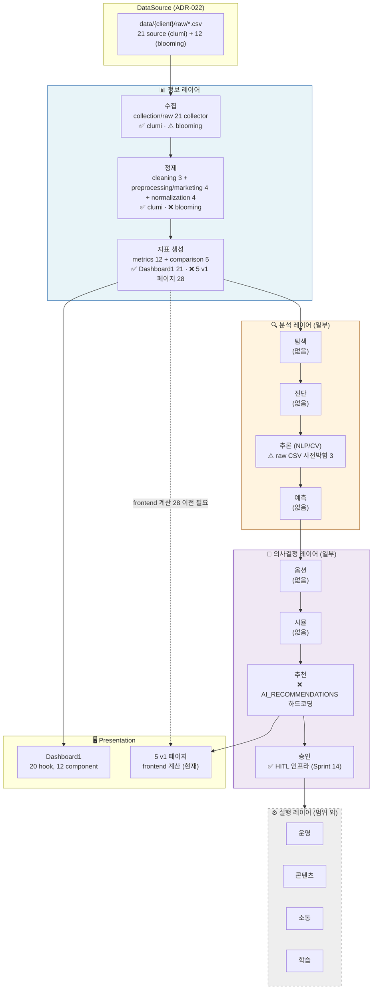
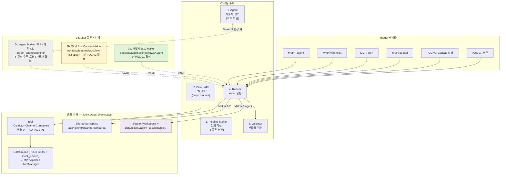
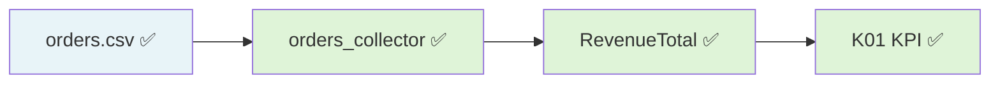
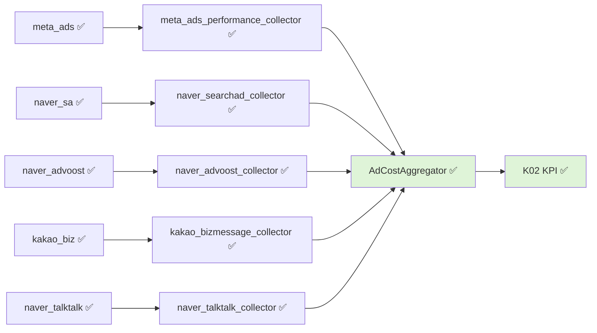
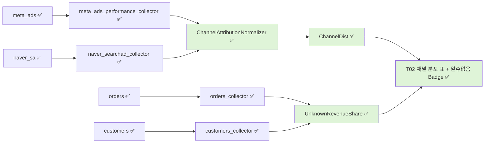
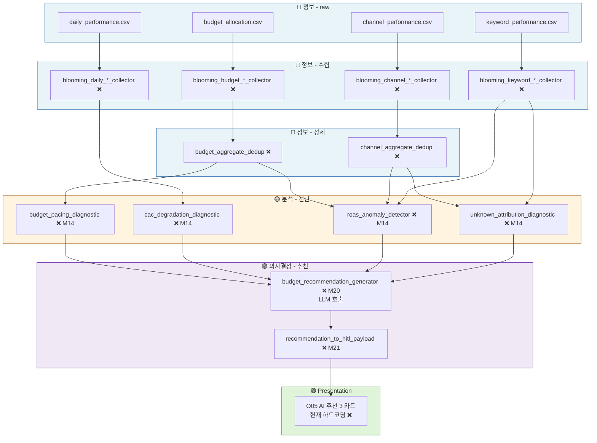

# 65. Dashboard Pages Specification v1.1

> **3 PART 구조** — *현 상태 박제* (PART I) + *통합 매트릭스* (PART II) + *Tool 신설 로드맵* (PART III). 클라이언트 분석 **6 페이지의 페이지 → 카드 구성** 단일 진실 소스.
>
> ⚠️ **v1.1 (2026-06-17) — PART I 전면 현행화**: §2·§3 을 **2026-06-08 실데이터 재구축 이후 현 6 페이지** (대시보드·월간결산·채널·트렌드·소재·비용) 로 교체 + **§2.4 Page → Card 한눈 매트릭스** 신설. 구 v1.0 (2026-05-27) 은 *2026-06-08 이전 mock 페이지* (`useMock*` / `/api/mock/*` / frontend 계산) 를 박제 — 현 코드와 불일치였음. **PART II·III (§10~§17) 는 아직 구 mock 페이지 박제** (별도 갱신 대기 — [§10 caveat](#part-ii-갱신-대기-caveat) 참조).

---

## 0. 메타

| 항목 | 내용 |
|---|---|
| 작성일 | 2026-05-27 (v1.0) · **개정 2026-06-17 (v1.1 — PART I page→card 현행화)** |
| 위치 | `docs/agent_specs/65_dashboard_pages_v1.0.md` |
| 진실 소스 | **코드** (`frontend/src/features/*` + `backend/app/api_v2/routes/*`). 본 문서는 매핑/박제 |
| 관련 spec | [60](60_frontend_overview_v1.0.md) overview / [61](61_frontend_architecture_v1.0.md) architecture / [62](62_workflow_canvas_design_v1.2.md) workflow canvas / [63](63_frontend_backend_contract_v1.0.md) backend contract / [66](66_v1_to_v2_migration_map.md) migration map |
| 관련 ADR | [ADR-022](adr/ADR-022_data_source_workspace_layer_separation.md) DataSource / Workspace |
| 짝 자료 | [data/description/mock/UI_MAPPING.md](../../data/description/mock/UI_MAPPING.md) (mock CSV ↔ UI 매핑 측면) |
| 4 레이어 framework | 사용자 명시 (§12) — 정보 / 분석 / 의사결정 / 실행 |

---

## 🗂️ 문서 입구 인덱스

| PART | § | 라벨 | 제목 | 상태 | 작성 | 한 줄 요약 |
|:---:|:---:|:---:|---|:---:|:---:|---|
| **I — 현 상태 박제** | §1 | meta | 본 문서의 역할 — 3 목적 + **5 Step 작업 흐름** | ✅ | 05-27 | 사용자 작업 진입 순서 박제 |
| I | §2 | inventory | 페이지 인벤토리 (현 6 페이지) + 조합 매트릭스 | ✅ | **06-17** | client context 분석 6 페이지 |
| **I** | **§2.4** | **inventory** | **⭐ Page → Card 한눈 매트릭스** | ✅ | **06-17** | **어떤 페이지에 어떤 카드 — 본 갱신의 헤드라인** |
| I | §3 | cards | **페이지별 카드 구성** (현 6 페이지) | ✅ | **06-17** | 페이지 → 카드 (종류·표시·데이터 바인딩) |
| I | §4 | pattern | 표시 패턴 카탈로그 | ✅ | **06-17** | KPI/차트/테이블/색상 |
| I | §5 | source | 데이터 source 매핑 + **§5.0 폴더 의미** | ✅ | **06-17** | raw = 외부 / 나머지 = tool 산출 |
| I | §6 | drift | 하드코딩 잔존 | ✅ | **06-17** | PERIOD·도메인 분류·라벨 |
| I | §7 | roadmap | 진화 경로 (POC→MVP) | ✅ | **06-17** | 전역 기간·라벨 정정·데이터 확충 |
| I | §8 | history | 변경 이력 | ✅ | **06-17** | — |
| I | §9 | trigger | 갱신 트리거 | ✅ | 05-27 | — |
| **II — 통합 매트릭스** | §10 | matrix-A | 표시 정보 통합 | ✅ | 05-27 | 사용자 요구 #1 |
| II | §11 | matrix-B | 정보 생성 | ✅ | 05-27 | 사용자 요구 #2 |
| II | §12 | framework | 4 레이어 framework + 현 매핑 | ✅ | 05-27 | 사용자 명시 framework |
| II | §13 | viz | Mermaid 4 layer 파이프라인 | ✅ | 05-27 | 시각화 |
| II | §13.3 | actors | **5 주체 분리** (Agent / Direct API / Maker / Runner / Validator) + Trigger 추상화 | ✅ | 05-27 | [ADR-023](adr/ADR-023_pipeline_5_actors_and_trigger_abstraction.md) 정합 |
| II | §14 | methodology | **분석 방법론 카탈로그 (21 방법론)** | ✅ | 05-27 | 시각화 ↔ 방법론 ↔ tool 3 축 |
| II | §14.6 | composition | **시각화별 Tool Chain 매핑 (✅/❌/🔧)** | ✅ | 05-27 | 시각화 1개 = N tool 협력 |
| **III — Tool 신설 로드맵** | §15 | roadmap | 진입 안내 (D1·D2·D3 순서) | ✅ | 05-27 | 사용자 요구 #3·#4 |
| III | §15.1 | D1 | 부족 tool 식별 | ✅ | 05-27 | 이름 + 한 줄 |
| III | §15.2 | D2 | tool 명세 (input/output/처리) — **41 tool** (🔴27 + 🟠14) | ✅ | 05-27 | D1.6 결정 권장 채택 후 |
| III | §15.3 | D3 | 우선순위·의존성 | ⏳ | — | D2 검토 후 작성 |
| **IV — 추후 구현 (MVP/MVP+)** | §16 | future | 추후 구현 영역 (학습 루프·외부 API·기타) | ✅ | 05-27 | POC 범위 외, *별도 작업 진입점* |
| IV | §17 | trigger | PART IV 갱신 트리거 | ✅ | 05-27 | — |

**범례**: ✅ 작성 완료 / ⏳ 작성 예정 (사용자 검토 게이트)

> ⚠️ **PART II·III·IV (§10~§17) 갱신 대기**: v1.1 은 PART I (§2·§3·§4·§5·§6·§7) 만 현 6 페이지로 현행화. PART II/III 는 *2026-06-08 이전 mock 페이지* (K10~K21 Dashboard v1/Trend/Creative KPI, `useMock*`, AI_RECOMMENDATIONS 등 — 현존 X) 를 박제. **page→card 차원의 진실은 PART I §2·§3**. PART II/III 의 *방법론 카탈로그·tool 로드맵 골격* 은 개념적 보존 가치가 있으나 페이지 매핑은 미갱신. ([§10 caveat](#part-ii-갱신-대기-caveat))

**Cross-link 컨벤션**:
- 같은 문서 안 → `[§10](#10-matrix-a-표시-정보-통합)`
- 다른 spec → `[63 §2.3.1](63_frontend_backend_contract_v1.0.md)`
- ADR → `[ADR-022](adr/ADR-022_data_source_workspace_layer_separation.md)`
- 코드 → `[file.py:34](../../backend/api_v2/routes/mock_data.py#L34)`

---

# PART I — 현 상태 박제 (작성: 2026-05-27)

> **목적**: 5 v1 페이지 + Dashboard1 의 *코드 현 상태* 를 spec 으로 박제. 추측·미래 X.
> **소비자**: 보완 작업의 첫 referential. PART II·III 의 *입력 자료*.

---

## 1. 본 문서의 역할 — 3 목적

| # | 목적 | 본 문서에서 |
|---|---|---|
| **P1** | 대시보드 페이지에 *무엇이 표시되어야 하는가* | §3 (6 페이지 × 표시 요소 매트릭스) |
| **P2** | 그것을 *어떻게 표시·계산* 하는가 (분석 방법 포함) | §3 (4 layer 분해) + §4 (표시 패턴 카탈로그) |
| **P3** | *현재 어떻게 구성되어* 있는가 (dashboard1 포함) | §2 (인벤토리) + §3 + §6 (하드코딩 잔존) |

→ 5 페이지 *보완/재구축* 작업 시 **첫 진입 문서**.

### 1.1 다른 spec 과의 관계

| 영역 | 진실 소스 |
|---|---|
| 전체 페이지 라우트 목록 | [66 migration map](66_v1_to_v2_migration_map.md) |
| API endpoint 명세 (계약) | [63 backend contract](63_frontend_backend_contract_v1.0.md) §2 |
| WebSocket / 메시지 카탈로그 | [63](63_frontend_backend_contract_v1.0.md) §3·§4·§5 |
| Workflow Canvas 구조 | [62](62_workflow_canvas_design_v1.2.md) |
| 컴포넌트 inventory / 라우팅 / 디자인 토큰 | [61](61_frontend_architecture_v1.0.md) |
| Tech stack / vision / roadmap | [60](60_frontend_overview_v1.0.md) |
| Tool ↔ Data layer (DataSource/Workspace) | [ADR-022](adr/ADR-022_data_source_workspace_layer_separation.md) + [10 §7.7](10_system_architecture_v1.9.md) |

본 문서 = *페이지 × 표시 × 데이터/분석* 의 한 축. 다른 spec 의 영역 침범 X (cross-link 만).

### 1.2 사용자 명시 5 Step 작업 흐름 (보완 작업 진입 순서)

> 본 spec 의 *읽기·작업 순서* 박제 (사용자 발언 — 2026-05-27).

```
Step 1. 어떤 시각화를 어떤식으로 표시하는지 정리
        → §10 [matrix-A] 표시 정보 통합

Step 2. 시각화에 어떤 데이터가 필요한지 정리
        → §11 [matrix-B] 정보 생성 (시각화 → 데이터 의미)

Step 3. 그 데이터를 만들기 위해 raw + 정제·분석 (4 layer) 정리
        → §11 + §12 [framework] + §14 [methodology]

Step 4. 4 layer 카테고리에 맞춰 tool 고민
        → §15.1 [D1] 부족 tool 식별

Step 5. 각 tool 구현 세부 계획
        → §15.2 [D2] 명세 + §15.3 [D3] 우선순위·의존성
```

**원칙** (사용자 명시):
- 시각화가 *먼저* (회사·데이터는 후순위)
- *분석 카테고리* (대시보드 유형) 와 *클라이언트* (회사) 는 **N:M** — 모든 분석 카테고리는 *어떤 클라이언트* 데이터에든 적용 가능
- 현 "Dashboard1 ↔ clumi / 5 v1 ↔ blooming" 매핑은 *POC mock 데이터의 우연*, 의도 X
- **POC 단계 = 인위적 메뉴 확장** → 사용자/전문가 선택으로 narrowing (다양한 메뉴 → 좁히기)

---

## 2. 페이지 인벤토리 — 현 6 페이지

> **클라이언트 컨텍스트 (Sidebar `client` context) = 분석 6 + 에이전트 2.** 본 spec 의 대상 = *카드를 표시하는* 분석 6 페이지. 진실 소스 = [router.tsx](../../frontend/src/routes/router.tsx) + [navigation/store.ts](../../frontend/src/features/navigation/store.ts) (`CLIENT_TABS`).

### 2.1 분석 그룹 6 페이지 (2026-06-08 실데이터 재구축)

| # | id | label (sidebar) | path | 컴포넌트 | 데이터 hook → endpoint | 카드 | 상태 |
|---|---|---|---|---|---|:---:|:---:|
| 1 | `dashboard` | 대시보드 | `/dashboard` | [DashboardPage.tsx](../../frontend/src/features/dashboard/DashboardPage.tsx) | `useDashboardOverview` → `/api/dashboard1/overview` | 2 | ✅ |
| 2 | `monthly` | 월간 결산 | `/monthly` | [MonthlyPage.tsx](../../frontend/src/features/monthly/MonthlyPage.tsx) | `useMonthly*` (20 endpoint `/api/dashboard1/*`) | 10 | ✅ |
| 3 | `channel` | 채널 | `/channel` | [ChannelPage.tsx](../../frontend/src/features/channel/ChannelPage.tsx) | `useChannelOverview` → `/api/dashboard1/channel-overview` | 2 | ✅ |
| 4 | `trend` | 트렌드 | `/trend` | [TrendPage.tsx](../../frontend/src/features/trend/TrendPage.tsx) | `useTrendOverview` → `/api/dashboard1/trend-overview` | 2 | ✅ |
| 5 | `creatives` | 소재 | `/creatives` | [CreativePage.tsx](../../frontend/src/features/creative/CreativePage.tsx) | `useCreativeOverview` → `/api/dashboard1/creative-overview` | 1 | ✅ |
| 6 | `cost` | 비용 | `/cost` | [CostPage.tsx](../../frontend/src/features/cost/CostPage.tsx) | `useCostOverview` → `/api/dashboard1/cost-overview` | 4 | ✅ |

> "카드" 열 = 콘텐츠 카드 수 (PageHeader·읽는법 callout 공통 제외). 전 페이지 공통: `const PERIOD = '2026-04'` 하드코딩 (전역 기간 선택기 도입 전 임시, [§6](#6-하드코딩-잔존-vs-동적-데이터)).

> ✅ **재구축 자취 (2026-06-08 ~ 06-09)**:
> - 구 mock 페이지 (`useMock*` / `/api/mock/*` / frontend 계산) = **전면 폐기**. v1.0 §3 가 박제했던 KPI4·AreaChart·감성 PieChart·RadarChart(AI 5축)·AB테이블·AI추천 3카드 등은 **현존 X**.
> - 6 페이지 전부 **backend `/api/dashboard1/*` 패밀리 (Postgres 실데이터)** 소비 — `useCurrentClient` (데이터 주도: `selectedClientId ?? raw_count>0 첫 client ?? 첫 client`) 로 client 분기.
> - ⚠️ **endpoint 의 `dashboard1` 은 옛 페이지명 잔재** — 백엔드 URL 경로만 유지하고 프론트 hook 은 `useMonthly*` / `useXxxOverview` 로 rename (backend rename 은 별도). 현 `/dashboard` 페이지와는 무관.
> - `monthly` = 옛 `dashboard1` 페이지를 **월간 결산** 으로 승격·재배열 (Hero + 4 트랙). `dashboard` = 운영형 (퍼널·ROAS 진단) 신규.
> - clumi = raw 충분 → 작동. blooming/asyou/bluban = raw 부실 → "데이터가 없습니다" (의도된 검증 케이스).

### 2.2 비분석 페이지 (카드 페이지 아님 — 참조용)

> 2026-06-09 페이지 재구성: `/agent` + `/hitl` 폐기, 리포트·메모리·에이전트관찰·System·DB 가 client → system 컨텍스트로 이동. 진실 소스 = [navigation/store.ts](../../frontend/src/features/navigation/store.ts).

| 컨텍스트 | id | label | path | 종류 | 비고 |
|---|---|---|---|---|---|
| client | `workflow` | 워크플로우 | `/workflow` | Canvas | Workflow Canvas + ToolPalette ([62](62_workflow_canvas_design_v1.2.md)) |
| client | `conversations` | 대화이력 | `/conversations` | 목록 | 대화 이력 |
| system | `portfolio` | 포트폴리오 | `/portfolio` | 진입점 | 시스템 컨텍스트 랜딩 (`/` 도 매핑) |
| system | `report` | 리포트 | `/report` | 문서 | — |
| system | `agent-observability` | 에이전트 | `/agent-observability` | 관찰 콘솔 | 에이전트 작동 관찰 |
| system | `memory` | 메모리 | `/memory` | 목록 | — |
| system | `system-console` | System | `/system` | DB 콘솔 | System(Postgres) 무-SQL 조회 |
| system | `data-console` | DB | `/db` | DB 콘솔 | Data DB(client 정형) 무-SQL 조회 |
| — | `settings` | 설정 | `/settings` | 설정 | Sidebar 하단 고정 |

### 2.3 분석 페이지 × 클라이언트 (N:M)

> 6 페이지 전부 **같은 backend 패밀리 (`/api/dashboard1/*`) + `useCurrentClient` 분기** 를 공유 → *어떤 client 든* 적용 가능 (N:M, [ADR-022](adr/ADR-022_data_source_workspace_layer_separation.md) P3). 현재 작동 여부는 *해당 client 의 raw 데이터 충분 여부* 로만 갈림.

| 분석 페이지 \ 클라이언트 | **clumi** | blooming / asyou / bluban | 향후 client |
|---|:---:|:---:|:---:|
| 대시보드·월간결산·채널·트렌드·소재·비용 (6) | ✅ 작동 (raw 충분) | ❌ "데이터가 없습니다" (raw 부실) | ⏳ `data/{client}/raw/` 추가 시 자동 |

**범례**: ✅ 작동 / ❌ raw 부실 → 빈 상태 / ⏳ DataSource 추가 시 자동

→ 구 v1.0 의 "Dashboard1↔clumi / 5 v1↔blooming" 1:1 매핑은 *mock 시절의 우연* 이었고, 현재는 **상단 client 드롭다운 하나로 6 페이지 전부 동일 client 를 바라봄**.

### 2.4 ⭐ Page → Card 한눈 매트릭스

> **본 갱신의 헤드라인 — "어떤 페이지에 어떤 카드가 있는가".** 렌더 순서대로. PageHeader·읽는법 callout 은 모든 페이지 공통이라 *카드* 에서 제외(우측 열 표기). 상세 = [§3](#3-페이지별-카드-구성-현-6-페이지).

| 페이지 | 카드 (렌더 순서) | 공통 |
|---|---|---|
| **대시보드** `/dashboard` | ① 마케팅 퍼널 사슬 (MetricChainStrip — 노출→클릭→전환→전환매출 4노드 + CTR/CVR/객단가 3전이, 목표대비) · ② 일별 ROAS (LineChart, 목표선·BE선) | PageHeader + 읽는법 |
| **월간 결산** `/monthly` | **Hero** 월간 사슬 (MetricChainStrip 마케팅비→매출→AOV) · **[성과]** 핵심 KPI 9 그리드 (KpiGrid) · MoM 변화 4 (MomBar) · **[마케팅]** 광고비 5매체 (AdCostBar 가로 Bar) · 채널 분포 (ChannelDistTable 2 테이블) · **[고객]** 회원·비회원+재구매+신규 (MemberGuestSummary) · **[세그먼트]** 등급 회원수 시계열 (GradeDots Line) · 등급별 회원·매출 (GradeRatioTable) · 연령 bucket (AgeBucketBar Bar) · 카테고리 분배 (CategoryDistTable) | PageHeader + 읽는법 |
| **채널** `/channel` | ① 채널 비교 (ChannelComparison — 채널별 small-multiples 패널 + 스파크라인 + ROAS/CPA/전환 목표대비 + 역할 태그) · ② 전환 퍼널 (FunnelChart 3단계 노출→클릭→전환) | PageHeader + 읽는법 |
| **트렌드** `/trend` | ① 일별 ROAS (LineChart, 목표선·BE선) · ② 일별 노출수·전환수 (이중 축 ComposedChart — Bar 노출 + Line 전환) | PageHeader + 읽는법 |
| **소재** `/creatives` | ① 소재 성과 표 (DataTable — ID·소재명·채널·CTR·CVR·ROAS·Freq·피로 8컬, ROAS in-cell 막대·히트색, Freq 낮을수록 좋음, 평균 footer) | PageHeader + 읽는법 |
| **비용** `/cost` | ① KPI 3 (총예산·평균집행률·키워드평균ROAS) · ② 채널 예산 비중 (DataTable) · ③ 키워드 ROI (DataTable 7컬 + 합계 footer, 히트) · ④ 예산 페이싱 (PacingWidget — 캠페인별 진행바·상태) | PageHeader + 읽는법 |

> 표시 종류 약어: MetricChainStrip(사슬) · LineChart/BarChart/ComposedChart(recharts) · DataTable(정렬·히트·in-cell 막대·footer) · ChannelComparison(small multiples) · FunnelChart(퍼널) · PacingWidget(페이싱) · KpiGrid/KpiCard(KPI 타일). 상세 [§4 표시 패턴](#4-표시-패턴-카탈로그).

---

## 3. 페이지별 카드 구성 (현 6 페이지)

> 각 페이지의 *렌더 순서대로* 카드 = 종류 + 표시 내용 + 데이터 바인딩. 모든 페이지 공통: `space-y-6 p-6` 컬럼 + 상단 PageHeader + 하단 "읽는 법/데이터 출처" callout + `const PERIOD = '2026-04'`. backend endpoint 상세 = [63 backend contract](63_frontend_backend_contract_v1.0.md).
> 진실 소스 = 각 페이지 `frontend/src/features/{page}/*Page.tsx` (2026-06-17 코드 + `wf_a203d962` 적대 검증 대조).

### 3.1 대시보드 `/dashboard` — 마케팅 퍼널 + ROAS 진단 (운영형)

**컴포넌트** [DashboardPage.tsx](../../frontend/src/features/dashboard/DashboardPage.tsx) · **hook** `useDashboardOverview(client, '2026-04')` → `GET /api/dashboard1/overview` · **icon** Home

| # | 카드 | 종류 | 표시 내용 | 데이터 바인딩 |
|---|---|---|---|---|
| 1 | 마케팅 퍼널 사슬 | MetricChainStrip | 4 노드(노출수·클릭수·전환수·전환매출) + 3 전이(CTR·CVR·객단가) 교차 배치. 각 노드/전이에 목표대비 배지(above 녹색/below 빨강). 전환매출은 'ROAS {roas}% (목표 {target_roas}%)' | `data.funnel`·`data.ratios`·`data.targets` (buildNodes·buildTransitions) |
| 2 | 일별 ROAS | LineChart (recharts) | ChartFrame. X=일자(MM-DD), Y=%. ROAS 단선 + 목표선(muted 점선) + 손익분기 BE선(destructive) ReferenceLine 2개 (값 null 시 생략) | `data.daily.roas` · `targets.target_roas` · `targets.breakeven_roas` |
| — | 읽는 법 | Callout | 병목 읽는 법 + "데이터: Postgres 실데이터 ({client} {period})" | `data.client`·`data.period` |

**상태 분기** (4-way, 순서대로): `!client` → "상단에서 client를 선택하세요." · `isLoading` → "불러오는 중…" · `!data` → "데이터가 없습니다." · else → 카드. (에러 분기 없음 — hook 이 `{data, isLoading}` 만 구조분해 → 실패 시 `!data` 폴백.)

### 3.2 월간 결산 `/monthly` — 한 달 정량 결산 (Hero + 4 트랙)

**컴포넌트** [MonthlyPage.tsx](../../frontend/src/features/monthly/MonthlyPage.tsx) · **hook** `useMonthly*` ([useMonthlyData.ts](../../frontend/src/api/hooks/useMonthlyData.ts)) → 20 endpoint `GET /api/dashboard1/{kpi,mom,segment}/*` · **period** `CURRENT_PERIOD='2026-04'` · `PREVIOUS_PERIOD='2026-03'` (MoM) · **icon** CalendarRange

> 옛 `dashboard1` 페이지를 승격. 8 섹션 28 요소 → Hero + 4 트랙 재배열. 카드별 `animate-pulse` 스켈레톤 (페이지 단위 로딩/에러 UI 없음).

| # | 트랙 | 카드 | 종류 | 표시 내용 | 데이터 바인딩 |
|---|---|---|---|---|---|
| 1 | Hero | 월간 사슬 | MetricChainStrip | 3 노드(마케팅비→매출→객단가) + 2 전이(ROAS, ÷주문). 매출 노드에 MoM 배지. `bg-accent/50` 컬러블록 | `useMonthlyAdCost`·`Revenue`·`Roas`·`Aov`·`MomRevenue` |
| 2 | 01 성과 | 핵심 KPI 9 그리드 | KpiGrid | 3×3 = 9 KPI 타일 (매출·마케팅비·ROAS·CAC·프로모션매출·프로모션ROAS·신규회원·AOV·가입전환율). 각 타일 = CardAsk(클릭→에이전트) + KpiTooltip(ⓘ → methodology·공식). AOV 타일에 MoM delta | 9 KPI hook + `useMonthlyMomAov` |
| 3 | 01 성과 | MoM 변화 4 | KPIGrid (DeltaCell) | 매출/주문/기존구매자/신규구매자 MoM (화살표 + %). recharts 미사용 | `useMonthlyMomRevenue`·`MomRepurchase`·`MomAov` |
| 4 | 02 마케팅 | 광고비 5매체 분배 | BarChart 가로 | 5매체(Meta·NaverSA·ADVoost·Kakao·Talktalk) 비용 크기순 | `useMonthlyAdCost` |
| 5 | 02 마케팅 | 채널 분포 | Table ×2 | 좌 그룹별(주문·비중 in-cell bar) + 우 raw 채널. 하단 '알수없음 매출비중' 각주 | `useMonthlyChannel` + `useMonthlyUnknownShare` |
| 6 | 03 고객 | 회원·비회원 + 재구매·신규 | SummaryBox 4셀 | 회원/비회원, 재구매율(당월·전월·Δ%p), 신규가입 MoM | `useMonthlyMemberGuest` + `MomRepurchase` + `MomNewMembers` |
| 7 | 04 세그먼트 | 등급 회원수 시계열 | LineChart | 합계 + WELCOME/REGULAR/SILVER/GOLD 5선 (⚠️ GRADE_KEYS 에 VIP 있으나 VIP 선 미렌더) | `useMonthlyGradeTimeseries` (인자 없음) |
| 8 | 04 세그먼트 | 등급별 회원·매출 | Table | 등급순(VIP→WELCOME) 회원·비중·구매자·매출(in-cell bar)·매출비중 | `useMonthlyGrade` |
| 9 | 04 세그먼트 | 연령 5세 bucket 분포 | BarChart 수직 | bucket별 회원수, 핵심 35-44 강조색 | `useMonthlyAge` (인자 없음) |
| 10 | 04 세그먼트 | 카테고리 균등 분배 | Table | 카테고리별 주문·매출(in-cell bar)·비중, 매출 내림차순 | `useMonthlyCategory` |
| — | Footer | 읽는 법 | Callout | Hero 사슬 해설 + "데이터: /api/dashboard1/* 20 endpoint 실데이터 (현 client {currentClient})" | `currentClient` |

> ⚠️ **client 해석 2종** (적대 검증이 짚은 함정): 헤더/푸터 = `@/api/clients` 의 `useCurrentClient` (데이터 주도, `clumi` 폴백 없음). 데이터 hook = `useMonthlyData.ts` 내부 `useCurrentClient` (`DEFAULT_CLIENT='clumi'` 폴백). store 선택이 없으면 데이터는 `?client=clumi`, 라벨은 데이터 주도 첫 client.

### 3.3 채널 `/channel` — 채널 역할별 비교 + 전환 퍼널

**컴포넌트** [ChannelPage.tsx](../../frontend/src/features/channel/ChannelPage.tsx) · **hook** `useChannelOverview(client, '2026-04')` → `GET /api/dashboard1/channel-overview` · **icon** BarChart3

| # | 카드 | 종류 | 표시 내용 | 데이터 바인딩 |
|---|---|---|---|---|
| 1 | 채널 비교 | ChannelComparison (small multiples) | 채널 수만큼 패널. 패널 = 색점 + 채널명 + 역할 태그(검색/소셜/디스플레이) + 스파크라인(일별 ROAS, 2점 이상일 때) + 3 지표(ROAS·CPA·전환, 목표대비) | `data.channels` (roas·cpa·conversions·spark·target_roas·target_cpa) |
| 2 | 전환 퍼널 | FunnelChart | ChartFrame(responsive=false). 3단계(노출→클릭→전환) 수평 바 + 누적 CVR + 단계 CVR + 이탈수 | `data.funnel` (`{label,value}[]`) |
| — | 읽는 법 | Callout | 역할별 해석(메타=소셜 → 단기 ROAS 낮음 정상) + 데이터 출처 | `data.client`·`data.period` |

**상태 분기**: `!client` → 선택 안내 · `isLoading` → 불러오는 중 · `!data` → 데이터 없음 · else → 카드. 채널 역할(`CHANNEL_ROLE`)·라벨·색은 고정 도메인 매핑 (데이터 아님).

### 3.4 트렌드 `/trend` — 일별 시계열 (이중 축)

**컴포넌트** [TrendPage.tsx](../../frontend/src/features/trend/TrendPage.tsx) · **hook** `useTrendOverview(client, '2026-04')` → `GET /api/dashboard1/trend-overview` · **icon** TrendingUp

| # | 카드 | 종류 | 표시 내용 | 데이터 바인딩 |
|---|---|---|---|---|
| 1 | 일별 ROAS | LineChart | ChartFrame. ROAS 단선 + 목표선 + BE선 (대시보드와 동일 기준) | `data.daily.roas` · `target_roas` · `breakeven_roas` |
| 2 | 일별 노출수·전환수 | ComposedChart 이중 축 | 좌축 Bar 노출수(만/K 포맷) + 우축 Line 전환수. 단위차 큰 계열 분리 + Legend | `data.daily` (impressions·conversions) |
| — | 읽는 법 | Callout | 이중 축 이유 + 데이터 출처 | `data.client`·`data.period` |

**상태 분기**: `!client` → 선택 · `isLoading` → 불러오는 중 · `daily.length === 0` → 데이터 없음 · else → 카드. (감성 PieChart·키워드 랭킹·리뷰 카드 = v1.0 mock 잔재, 현존 X.)

### 3.5 소재 `/creatives` — 소재 성과 표

**컴포넌트** [CreativePage.tsx](../../frontend/src/features/creative/CreativePage.tsx) · **hook** `useCreativeOverview(client, '2026-04')` → `GET /api/dashboard1/creative-overview` · **icon** Image

| # | 카드 | 종류 | 표시 내용 | 데이터 바인딩 |
|---|---|---|---|---|
| 1 | 소재 성과 표 | DataTable | 8 컬럼: ID · 소재명 · 채널(색점 태그) · CTR(% 히트) · CVR(% 히트) · ROAS(% in-cell 막대 + 히트) · Freq(낮을수록 좋음 히트) · 피로(`frequency≥3.5` 플래그). ROAS 내림차순 정렬, ctr/cvr/roas/frequency '평균' footer | `data.creatives` |
| — | 읽는 법 | Callout | ROAS 막대·히트, Freq 의미, 정렬·평균 footer + 데이터 출처 | `data.client`·`data.period` |

**상태 분기**: `!client` → 선택 · `isLoading` → 불러오는 중 · `creatives.length === 0` → "소재 데이터가 없습니다." · else → 표. (RadarChart AI 5축·카드 그리드 9·AB 테이블 = v1.0 mock 잔재, 현존 X.)

### 3.6 비용 `/cost` — 예산 · 키워드 ROI · 페이싱

**컴포넌트** [CostPage.tsx](../../frontend/src/features/cost/CostPage.tsx) · **hook** `useCostOverview(client, '2026-04')` → `GET /api/dashboard1/cost-overview` · **icon** DollarSign

| # | 카드 | 종류 | 표시 내용 | 데이터 바인딩 |
|---|---|---|---|---|
| 1 | KPI 3 | KpiCard ×3 | 총 예산(₩M) · 평균 집행률(%) · 키워드 평균 ROAS(% + 'N개 운영' sub). `md:grid-cols-3` | `data.kpi` |
| 2 | 채널 예산 비중 | Table | 채널(색점) · 예산(₩) · 비중(% in-cell 막대). 비중 내림차순 | `data.channels` |
| 3 | 키워드 ROI | Table | 7 컬럼: 키워드 · 채널 · 광고비 · 전환 · CPA(히트 낮을수록 좋음) · ROAS(% 막대+히트) · 품질(/10 히트). ROAS 내림차순, 광고비·전환 합계 footer | `data.keywords` |
| 4 | 예산 페이싱 | PacingWidget | ChartFrame(responsive=false, 높이 동적). 캠페인별 진행바 + 상태(저소진/정상/과소진) + 기간진행 marker + ₩집행/예산 | `data.pacing` (campaigns.budget + daily_performance.spent 조인) |
| — | 데이터 출처 | Callout | 전부 Postgres 실데이터 · CPA=광고비÷전환 유도 · 페이싱 조인 설명 | static |

**상태 분기**: `!client` → 선택 안내(전체 대체) · 그 외 per-block(KpiCard pulse, ChartFrame meta '불러오는 중…', 표는 빈 body). ⚠️ 헤더 description 의 '페이싱(데모)' 라벨은 *stale* — 실제 페이싱은 실데이터 ([§6](#6-하드코딩-잔존-vs-동적-데이터)).

---

## 4. 표시 패턴 카탈로그

### 4.1 KPI 카드 (KpiCard)

| 변형 | 용도 | 사용 페이지 |
|---|---|---|
| 단순 수치 | 라벨 + 값 + 포맷 (₩/%/n) + loading pulse | Cost KPI 3 |
| 수치 + ⓘ tooltip + CardAsk | methodology 출처 표시 (progressive disclosure) + 클릭→에이전트 popup | Monthly KpiGrid (9) |
| 수치 + 화살표 (MoM) | 전월 대비 화살표·색상 (DeltaCell) | Monthly MomBar (4) |
| 수치 + sub 라인 | 메인 값 + 부속 라인 (e.g. `N개 운영`) | Cost 키워드 ROAS KPI, Monthly KPI sub |

→ 공통 컴포넌트: [components/layout/KpiCard.tsx](../../frontend/src/components/layout/KpiCard.tsx). Monthly 의 ⓘ tooltip·CardAsk 는 KpiGrid 래퍼.

### 4.2 차트 종류

| 차트 | 라이브러리 | 사용 |
|---|---|---|
| **LineChart** | recharts | Dashboard (일별 ROAS), Trend (일별 ROAS), Monthly GradeDots (등급 시계열) |
| **BarChart** | recharts | Monthly AdCostBar (가로) / AgeBucketBar (수직) |
| **ComposedChart (이중 축)** | recharts | Trend (노출 Bar 좌축 + 전환 Line 우축) |
| **MetricChainStrip (사슬)** | custom | Dashboard (퍼널 사슬), Monthly Hero (마케팅비→매출→AOV) |
| **FunnelChart (퍼널)** | custom (div + width%) | Channel (전환 퍼널 3단계) |
| **ChannelComparison (small multiples + Sparkline)** | custom (SVG polyline) | Channel (채널 비교) |
| **PacingWidget (페이싱)** | custom (HTML) | Cost (예산 페이싱) |

→ 차트 색상: [chart.ts](../../frontend/src/lib/chart.ts) 의 `CHART[0..4]` (5 색) + `CHANNEL_COLOR` (네이버/카카오/메타/구글 4 매체). ReferenceLine(목표선·BE선) 스타일 = [ChartFrame.tsx](../../frontend/src/components/viz/ChartFrame.tsx).
> ⚠️ v1.0 의 AreaChart(Trend)·PieChart(Trend 감성·Cost 채널)·RadarChart(Creative AI 5축) = **현존 X** (mock 페이지 폐기).

### 4.3 테이블 패턴 (DataTable)

> 공통 컴포넌트 [components/viz/DataTable.tsx](../../frontend/src/components/viz/DataTable.tsx) — 헤더 클릭 정렬 + in-cell 막대(`bar`) + 히트색(`heat`, direction high/low) + footer(`footerAvg` 평균 / `footerSum` 합계).

| 패턴 | 사용 |
|---|---|
| 단순 행 + 히트/막대 | Creative (소재 8컬, ROAS 막대+히트·Freq low-heat), Cost (키워드 7컬 CPA·ROAS·품질 히트), Monthly (등급/카테고리) |
| 2단 분할 | Monthly ChannelDistTable (그룹별 + raw 채널) |
| footer 집계 | Creative '평균' (ctr/cvr/roas/freq), Cost 키워드 '합계' (광고비/전환) |
| 색점 태그 | 채널 컬럼 (ChannelTag — naver/kakao/meta/google 색점 + 라벨) |

### 4.4 카드 그리드 / small multiples

| 패턴 | 사용 |
|---|---|
| KPI 그리드 | Monthly KpiGrid (9, `md:grid-cols-3`), Cost KPI 3 (`md:grid-cols-3`) |
| small multiples (채널 패널) | Channel ChannelComparison (채널 수만큼 패널 + 스파크라인) |
| 페이싱 행 반복 | Cost PacingWidget (캠페인별 진행바) |
> ⚠️ v1.0 의 리뷰 카드 6·소재 카드 9·AI 추천 3카드 = **현존 X**.

### 4.5 색상 토큰 (2026 Warm Neutral, ADR-022 별개 — UI 디자인)

> 진실 소스: [frontend/src/styles/globals.css](../../frontend/src/styles/globals.css) + [chart.ts](../../frontend/src/lib/chart.ts)

| 토큰 | 라이트 모드 | 의미 |
|---|---|---|
| `--primary` | `350 55% 38%` (마호가니/옥스블러드) | 액센트 1개 (memory `feedback_no_ai_looking_ui`) |
| `--success` | `138 22% 40%` | 긍정 / 진행중 / 승자 |
| `--destructive` | `6 60% 46%` | 부정 / 피로 / 중지 |
| `--warning` | `32 80% 42%` | 주의 / 임박 |
| `--background` | `39 38% 96%` | warm neutral 베이스 |
| `--chart-1` | `222 35% 50%` | 차트 색 1 (파란) |
| `--chart-2` | `30 58% 50%` | 차트 색 2 (주황) |
| `--chart-3` | `168 30% 38%` | 차트 색 3 (청록) |
| `--chart-4` | `285 18% 58%` | 차트 색 4 (보라) |
| `--chart-5` | `34 14% 54%` | 차트 색 5 (회갈) |
| `--channel-naver` | `140 36% 40%` | 네이버 초록 |
| `--channel-kakao` | `40 62% 48%` | 카카오 노란 |
| `--channel-meta` | `214 40% 48%` | 메타 파란 |
| `--channel-google` | `8 52% 50%` | 구글 빨간 |

> 원칙 (memory `feedback_no_ai_looking_ui`): 그라데이션·glow 금지. 액센트 1개 원칙.

---

## 5. 데이터 source 매핑

### 5.0 데이터 폴더 의미 (사용자 명시)

> "raw 데이터는 외부에서 데이터 (API / 사용자 입력) 를 주입했다는 가정이고 나머지 폴더는 추후 tool 이 만든 결과다" — 2026-05-27

| 위치 | 의미 | 출처 | tool 단계 |
|---|---|---|---|
| `data/{client}/raw/` | **외부 데이터 주입** | POC = mock CSV / MVP = API / Prod = 사용자 입력 | (시스템 *입력*, tool 출력 X) |
| `data/{client}/cleaned/` | tool 산출물 | cleaning + preprocessing + normalization tool | 정보 레이어 — 정제 |
| `data/{client}/computed/` | tool 산출물 | metrics + comparison tool | 정보 레이어 — 지표 |
| `data/{client}/analyzed/` *(예정)* | tool 산출물 | 분석 레이어 tool (탐색·진단·추론·예측) | 분석 레이어 |
| `data/{client}/decisions/` *(예정)* | tool 산출물 | 의사결정 레이어 tool (옵션·시뮬·추천) | 의사결정 레이어 |

→ **raw = 시스템 *입력*, 나머지 = 시스템 *내부 tool 산출***. 4 layer framework ([§12](#12-framework-4-레이어-framework--현-매핑)) 와 정합.

### 5.1 데이터 흐름 (현 6 페이지 공통, 단일화)

```
data/{client}/raw/*.csv  (외부 주입 — POC mock raw)
       ↓ collection (raw collector)
       ↓ cleaning + preprocessing + metrics tool
Postgres `_workspace` / Workspace cleaned·computed  (DATA_BACKEND)
       ↓
/api/dashboard1/* 패밀리
   (overview · channel-overview · trend-overview · creative-overview · cost-overview
    + monthly 의 kpi/mom/segment 20 endpoint)
       ↓
useDashboardOverview / useMonthly* / useChannelOverview / useTrendOverview
   / useCreativeOverview / useCostOverview
   (TanStack Query, zod 검증, useCurrentClient 분기)
       ↓
6 React 페이지 (frontend 계산 0 — backend 조립값을 표시)
```

→ 구 v1.0 의 "두 흐름 (Dashboard1 + 5 v1 mock)" 은 **단일 흐름으로 통합**. `useMock*` / `/api/mock/*` / frontend 계산 = 전면 폐기 (2026-06-08).

### 5.2 페이지 ↔ hook ↔ endpoint 매핑

| 페이지 | hook | endpoint |
|---|---|---|
| 대시보드 | `useDashboardOverview` | `GET /api/dashboard1/overview` |
| 월간 결산 | `useMonthly*` (20) | `GET /api/dashboard1/{kpi,mom,segment}/*` |
| 채널 | `useChannelOverview` | `GET /api/dashboard1/channel-overview` |
| 트렌드 | `useTrendOverview` | `GET /api/dashboard1/trend-overview` |
| 소재 | `useCreativeOverview` | `GET /api/dashboard1/creative-overview` |
| 비용 | `useCostOverview` | `GET /api/dashboard1/cost-overview` |

> endpoint prefix `dashboard1` = **옛 페이지명 잔재** (backend rename 별도). client = `?client=` query (`useCurrentClient`). 계약 상세 = [63 §2.3](63_frontend_backend_contract_v1.0.md).

### 5.3 DB 연결 현황 (2026-06-17 — DB제작 정합 기록)

> 프론트가 *어느 DB 객체* 에서 서빙받는지의 진실. backend 채널의 normalized 피봇 DB제작([ADR-032](adr/ADR-032_normalized_pivot_persistence_decisions.md)) 과 정합. (프론트 레인 기록 — backend 구현은 본 spec 범위 외.)

```
프론트 6 페이지 (useXxxOverview / useMonthly*)
   ↓ /api/dashboard1/*
backend (DATA_BACKEND=postgres → PostgresWorkspace)
   ↓ 읽기
octormate_data DB · clumi schema · `_workspace` serving 캐시
   (layer=computed/cleaned blob: S001_revenue_total · ad_cost_total ·
    category_distributed · channel_normalized · orders_split …)
```

| clumi schema 객체 | 역할 | 프론트 서빙 |
|---|---|:---:|
| `_workspace` (computed/cleaned blob) | **현 운영 서빙 캐시** | ✅ 현재 서빙 (6 페이지) |
| `{source}_normalized` · `_computed` · `blended_computed` (12 정형 테이블) | DB제작 산출 (라이브 적재 완료) | ❌ **아직 미연결** |

> ⚠️ **정형 테이블 ≠ 현 서빙**: DB제작 (2026-06-17, `scripts/build_canonical_pivot.py`) 이 clumi schema 에 normalized 6 + computed 5 + blended 1 정형 테이블을 라이브 적재했으나, **프론트 서빙 경로는 변경 없음** — API 는 여전히 `_workspace` 캐시를 읽음. API→정형 테이블 전환 = **P2**. 따라서 `_workspace` 의 cleaned/computed 행은 *stale 아님* (삭제 시 6 페이지 서빙 파손). 추적 = [DB제작_구현현황](../reports/DB제작_구현현황_2026-06-17.md) §1·§4 (C-2).

---

## 6. 하드코딩 잔존 vs 동적 데이터

> v1.0 의 mock 하드코딩(회사명·SENTIMENT_COLOR·AI_AXES·CHANNELS·AI_RECOMMENDATIONS·`/api/mock/*` 고정) 은 **전부 소멸** (페이지 폐기). 현 6 페이지의 잔존:

| 영역 | 위치 | 현 상태 | 정합 |
|---|---|---|:---:|
| `PERIOD` 상수 | 6 페이지 모두 `const PERIOD = '2026-04'` (monthly = [periods.ts](../../frontend/src/features/monthly/periods.ts) `CURRENT_PERIOD`/`PREVIOUS_PERIOD`) | 전역 기간 선택기 도입 전 임시 | ⚠️ 전 페이지 |
| 채널 도메인 매핑 | 각 페이지 `CHANNEL_LABEL`·`CHANNEL_COLOR`·`CHANNEL_ROLE` (naver/kakao/meta/google) | 고정 도메인 분류 (데이터 아님) | ⚪ UI/도메인 결정 (OK) |
| 피로 임계 | Creative `frequency≥3.5` (광고피로 휴리스틱, 프론트 유도) | 표준 휴리스틱 | ⚪ 도메인 결정 (OK) |
| **'페이싱(데모)' 라벨** | Cost PageHeader description | **stale** — 페이싱은 실제 실데이터(조인)인데 라벨만 '데모' | ❌ 정정 필요 |
| GradeDots VIP 선 | Monthly GradeDots — `GRADE_KEYS` 에 VIP 포함하나 VIP `<Line>` 미렌더 | 의도/누락 불명 | ⚠️ 확인 필요 |
| MomBar docstring | Monthly MomBar — docstring 에 옛 정답 수치 리터럴 | 문서 drift (런타임 무관) | ⚪ 주석 (낮음) |

### 6.1 잔존 분류

| 분류 | 처리 |
|---|---|
| **UI/도메인 결정 (OK)** | 채널 매핑·피로 임계 — 디자인·도메인 결정. frontend 유지 적합 |
| **임시 (제거 예정)** | `PERIOD` 6곳 — 전역 기간 선택기 도입 시 일괄 제거 ([§7](#7-진화-경로-poc--mvp)) |
| **정정 필요** | Cost '페이싱(데모)' 라벨 — 실데이터인데 라벨만 데모. 1줄 수정 |
| **확인 필요** | GradeDots VIP 선 — 의도적 제외 vs 누락 판단 후 처리 |

---

## 7. 진화 경로 (POC → MVP)

### 7.1 우선순위 매트릭스

> v1.0 의 P0(mock DATA_DIR fix·client 분기) 는 **완료/소멸** — 6 페이지는 이미 실데이터 + `useCurrentClient` 분기. 현 잔여:

| Priority | 항목 | 추정 | 정합 |
|---|---|---|---|
| **P1** | 전역 기간 선택기 — 6 페이지 `PERIOD` 하드코딩 제거 + 임의 `YYYY-MM` 선택 | 1~2일 | 운영성 |
| **P1** | Cost '페이싱(데모)' 라벨 정정 (실데이터로) | 5분 | 정직 표면 |
| **P2** | client 데이터 확충 — blooming/asyou/bluban `data/{client}/raw/` (현재 빈 상태) | 데이터 확보 의존 | N:M 실증 |
| **P2** | GradeDots VIP 선 처리 (제외 명시 or 추가) | 30분 | 정합 |
| **P2** | PART II·III 갱신 — 방법론 카탈로그·tool 로드맵의 *페이지 매핑* 을 현 6 페이지로 (K## 재작성) | 1 sprint | 문서 정합 |

### 7.2 현 흐름 (이미 실현된 목표 상태)

[§5.1 데이터 흐름](#51-데이터-흐름-현-6-페이지-공통-단일화) 이 곧 구 v1.0 가 "MVP 목표" 로 그렸던 단일 흐름이다. 6 페이지 전부 같은 DataSource/Workspace + `useCurrentClient` 분기를 공유 → *어떤 client 든 적용* (N:M, [ADR-022](adr/ADR-022_data_source_workspace_layer_separation.md) P3). 남은 것은 *데이터 확충* 과 *기간 선택* 뿐.

---

## 8. 변경 이력

| 일자 | 내용 |
|---|---|
| 2026-05-27 | 초안 — 5 v1 페이지 + Dashboard1 의 *표시 + 4 layer 분해 + API 매핑 + 하드코딩 잔존 + 진화 경로*. ADR-022 정합. 진단: mock_data.py DATA_DIR 깨짐 (P0). 가장 큰 잔존 = AI_RECOMMENDATIONS 3 카드. |
| 2026-05-27 (Round 1 정정 8건) | 사용자 의도 명확화 후 framing 정정 — (0) 용어 통일: "도메인" → "분석 카테고리" (회사 ≠ 도메인). (1) §1.2 사용자 5 Step 작업 흐름 박제. (2) §2 N:M 관계 명시 (Dashboard1↔clumi 1:1 = POC 우연). (3) §2.3 6×2 조합 매트릭스 (12 셀, 현 작동 50%). (4) §3.2 "캠페인 종합" 중립 framing (재정정 1차 — POC=blooming mock 문구 헤더 제거, §2.3 cross-link). (5) §5.0 데이터 폴더 의미 (raw=외부주입 / 나머지=tool산출). (6) §12.3 정보 레이어 수집 정의 보강 (외부 → raw 어댑터). (7) §15.1 D1.1.A 수집 클라이언트별 N 정정 (blooming 전용 → 패턴). (8) §11.0 시각화 단위 "데이터 의미" 예시 (Step 2 의 입구). |
| 2026-05-27 (Round 2 §14 신규) | **§14 분석 방법론 카탈로그 신규** (시각화 ↔ 방법론 ↔ 도메인 tool 의 3 축 추상). 21 방법론 정의 — 정보 10 (M01~M10) + 분석 7 (M11~M17) + 의사결정 4 (M18~M21). 각 방법론의 입력 시그니처 + 출력 + 적용 시각화 + 적용 layer + 도메인 tool 인스턴스 매핑. §14.4 매핑표 = 21 방법론 × 62 도메인 tool (D1 61 + 자연 추가 1). §14.5 사용 가이드 — 새 시각화 추가 시 5 Step 통합 흐름, 재사용 패턴, anti-pattern. 사용자 명시 "방법론이 중요" + "tool composer/skill 방식" 정합. |
| 2026-05-27 (Round 3 PART IV 신설) | **PART IV — 추후 구현 (MVP/MVP+) 신규** + §16·§17 추가. 사용자 의도 평가 위험 #3 답변 흡수 — "별도 tool 로 구현해야 하는데 지금 단계는 아님, 그러나 계획서에 추후 구현 언급해야 함". §16.1 학습 루프 (Reflection 패턴, L1~L4 학습 영역, F-L01~04 신규 tool, data/{client}/learned/ layer). §16.2 외부 API 통합 (Sprint 17+, 매체별 어댑터+정규화 패턴 — 사용자 위험 #2 답변 정합, 5~6 sprint 추정). §16.3 기타 추후 영역 (비즈니스 적합성·시각화 부족·역방향 피드백·anti-pattern 감지·멀티 테넌트 보안). §17 PART IV 갱신 트리거. *깊은 명세 X — 별도 작업 진입점* 만. |
| 2026-05-27 (검증 4차 § 번호 swap) | 검증 4차 발견: §14·§14.1 (D1, PART III) 가 §15 (methodology, PART II) 보다 *번호 작음* → 순차 위배. **swap 진행**: §15 (methodology) ↔ §14 (roadmap+D1). 결과: §10→§14 (PART II) → §15·§15.1 (PART III) → §16·§17 (PART IV) **완벽 순차**. 모든 cross-link (anchor 포함) 일괄 정정 (sed 3 단계). 사용자 명시 "구분 명확·인덱스 명확" 정합 회복. |
| 2026-05-27 (D1.6 결정 + §15.2 D2 신규) | 사용자 D1.6 5 결정 (권장 채택): 카탈로그 현 61 유지 · 명명 컨벤션 유지 · 레이어 분류 유지 · 🟠 추천 1→🟡 강등 (의존성 정합) · D2 분량 41 tool. **D1.5 우선순위 정정**: 🔴27 (정제 4+지표 23) + 🟠14 (수집) + 🟡8 (진단 5+추천 3) + 🟢12 (추론·예측·옵션·시뮬·승인) = 61. **§15.2 D2 신규 (41 tool 명세)**: 정제 4 (15.2.1) + 지표 Dashboard v1 5 (15.2.2) + Channel 3 (15.2.3) + Trend 4 (15.2.4) + Creative 5 (15.2.5) + Cost 6 (15.2.6) + 수집 14 (15.2.7). 각 tool 의 input·output·처리·M#·cache key·의존 명시. cache 컨벤션 V01~V23 (Sprint 16 S### 와 분리). 의존성 그래프 §15.2.10 (8 의존 관계). 🟡·🟢 33 tool 은 D3 우선순위 결정 후 D2 진입. |
| 2026-05-27 (§14.6 composition 신규) | **사용자 요청 — "tool compose 표시"**: 시각화 1개 = N tool 협력 chain 가시화 + 상태 라벨 (✅ 49 있음 / ❌ 61 없음 / 🔧 3 고도화). §14.6.1 상태 통계, §14.6.2 Dashboard1 3 chain Mermaid 예시 (K01 단순·K02 5collector·T02 가장복잡), §14.6.3~7 5 v1 페이지 별 시각화 chain 표 (28 정보), **§14.6.7 O05 AI 추천 chain (7 tool + 4 raw + 16 노드 Mermaid)** — 본 spec 의 가장 큰 단일 가치, §14.6.8 🔧 고도화 3 tool, §14.6.9 chain 통계 (평균 3 tool/시각화), §14.6.10 P0 전체 작업 시간 ~57h ≈ 1 sprint, §14.6.11 사용 가이드. |
| 2026-05-27 (§13.3 5 주체 + ADR-023) | **사용자 다중 토의 누적 흡수** — 7 라운드 정밀화 (1. Pipeline Runner 신설 직관 → 2. Maker 도 필요 → 3. Fetch = DataSource 책임 → 4. POC v1·v2 분리 → 5. Tool / Data 영역 구분 → 6. Trigger 추상화 → 7. Agent sandbox + Maker 위치 질문). **§13.3 5 주체 도식 신설** (Agent / Direct API / Maker / Runner / Validator) + 3 Maker × 3 위치 매핑 (개발자 코드 ✅ POC v1 / Canvas ✅ POC v2 / Agent ⚠️ Skills 박제 — 사용자 결정 *현 코드 충돌 위험* 으로 구현 추후 토의) + Trigger 추상화 (6 종류 → 1 Pipeline) + Shared/Session Workspace 분리. **[ADR-023 신설](adr/ADR-023_pipeline_5_actors_and_trigger_abstraction.md)** — 5 주체 + Trigger + DataSource 진화 + 어휘 통일 (Pipeline/Step/Tool/Maker/Runner/Validator/Trigger/Workspace) + 금지 단어 (chain/compose/fetcher). Collector 변경 0 영구. ADR-022 P1·P2·P3 정밀화. |
| **2026-06-17 (v1.1 — PART I page→card 현행화)** | **PART I 전면 현행화** — 2026-06-08 실데이터 재구축 이후 현 6 페이지(대시보드·월간결산·채널·트렌드·소재·비용)로 §2·§3·§4·§5·§6·§7 교체 + **§2.4 Page→Card 한눈 매트릭스** 신설. 구 v1.0 PART I 은 폐기된 mock 페이지(`useMock*`·`/api/mock/*`·frontend 계산·AreaChart/PieChart/RadarChart·AI_RECOMMENDATIONS 등)를 박제 → 현 코드와 불일치였음. §3 은 "4 layer 분해" → "카드 구성"(렌더 순서·종류·데이터 바인딩)으로 재편. 검증 = 6 페이지 코드 직독 + workflow `wf_a203d962`(12 agent, page→card 적대 검증 — monthly 의 useCurrentClient 2종·trend 이중축·GradeDots VIP 선 미렌더·Cost '페이싱(데모)' stale 라벨 식별). **PART II·III(§10~§17)는 미갱신**(K10~K21 등 구 페이지 KPI·O03~O05 mock 카드 잔존 — [§10 caveat](#part-ii-갱신-대기-caveat)). ⚠️ 작업 중 다른 채널 동시 편집으로 §3~§7 1회 유실 후 재적용 복구. |

---

## 9. 향후 작업 시 본 spec 의 갱신 트리거

| 트리거 | 갱신 영역 |
|---|---|
| 페이지에 카드 추가/삭제/순서 변경 | §2.4 (매트릭스), §3.x (카드 표) |
| 새 분석 페이지 추가 | §2.1 (인벤토리), §2.4, §3.x |
| hook/endpoint 변경 | §2.1, §3.x (컴포넌트 메타), §5.2 |
| 새 표시 종류 (차트/위젯/테이블) 추가 | §4.2 (차트), §4.3·§4.4 |
| 디자인 토큰 변경 | §4.5 (색상) |
| `PERIOD` 하드코딩 제거 (전역 기간 선택기) | §6 (하드코딩), §7.1 |
| client 데이터 확충 (blooming 등) | §2.3, §7.1 |
| PART II·III 갱신 (K## 페이지 매핑 현행화) | §10~§17 + 입구 인덱스 caveat 해제 |

→ 갱신 시 §8 에 한 줄 추가 + cross-link 점검.

---

# PART II — 통합 매트릭스 (작성: 2026-05-27)

> **목적**: PART I 의 박제를 *정보 단위* 로 재정렬. 페이지 단위 (§3) 가 *세로축* 이면, 본 PART 는 *가로축* (정보 자체).
> **사용자 요구 충족**: #1 "대시보드에 필요한 정보 / 표시 방법", #2 "필요한 정보를 만드는 방법".
> **의존**: PART I §3·§4·§5
> **소비자**: PART III (Tool 신설 로드맵) 의 입력. 5 페이지 보완 작업 시 *정보별 추적*.

### PART II 갱신 대기 (caveat)

> 🛑 **PART II·III·IV (§10~§17) 는 v1.1 에서 미갱신 — 2026-06-08 이전 mock 페이지를 박제한다.**
>
> v1.1 (2026-06-17) 은 *page → card* 차원의 PART I (§2·§3·§4·§5·§6·§7) 만 현 6 페이지로 현행화했다. 아래 PART II/III 의 페이지 매핑은 **폐기된 mock 페이지 기준** 이라 현 코드와 불일치한다:
> - **§10 표시 정보 통합**: K10~K13(Dashboard v1)·K14~K17(Trend KPI4)·K18~K21(Creative KPI4)·C07(AreaChart)·C09/C11(Pie/Radar)·O03~O05(리뷰 6·소재 9·AI 추천 3) 등 = **현존 X**. 현 6 페이지의 카드는 [§2.4](#24--page--card-한눈-매트릭스)·[§3](#3-페이지별-카드-구성-현-6-페이지) 이 진실.
> - **§14 방법론 카탈로그 / §15 Tool 로드맵**: *방법론·tool 추상 골격* 은 개념적 보존 가치가 있으나, 시각화↔페이지 매핑은 재작성 필요 (K## 갱신, [§7.1](#71-우선순위-매트릭스) P2).
>
> → **"어떤 페이지에 어떤 카드"** 질문은 항상 **PART I** 을 본다. PART II/III 는 *정보/방법론/tool 추상* 참고용 (페이지 매핑은 stale).

---

## 10. [matrix-A] 표시 정보 통합

> **사용자 요구 #1**: "대시보드에 필요한 정보 / 표시 방법"
> **의존**: §3.x.1 (페이지별 표시 구성), §4 (표시 패턴)
> **읽는 법**: 행 = 표시 정보 (KPI/차트/표/기타). 페이지 단위가 아닌 *정보 단위* 정렬.

### 10.1 KPI 카드 (24개)

| # | 정보명 | 단위 | 페이지 | Section | 표시 방법 (컴포넌트) | 부속 표시 |
|---:|---|:---:|---|:---:|---|---|
| K01 | 총 매출 | ₩ | Dashboard1 | A | KpiCard + ⓘ tooltip | — |
| K02 | 총 광고비 | ₩ | Dashboard1 | A | KpiCard + ⓘ | — |
| K03 | 전체 ROAS | % | Dashboard1 | A | KpiCard + ⓘ | — |
| K04 | 전체 CAC | ₩ | Dashboard1 | A | KpiCard + ⓘ | — |
| K05 | 프로모션 매출 | ₩ | Dashboard1 | A | KpiCard + ⓘ | — |
| K06 | 프로모션 ROAS | % | Dashboard1 | A | KpiCard + ⓘ | — |
| K07 | 신규 회원 수 | n | Dashboard1 | A | KpiCard + ⓘ | — |
| K08 | 평균 객단가 (AOV) | ₩ | Dashboard1 | A | KpiCard + ⓘ | — |
| K09 | 가입 전환율 | % | Dashboard1 | A | KpiCard + ⓘ | — |
| K10 | 총 캠페인 수 | n | Dashboard v1 | A | KpiCard | — |
| K11 | 진행중 캠페인 수 | n | Dashboard v1 | A | KpiCard | — |
| K12 | 총 월예산 | ₩ | Dashboard v1 | A | KpiCard | — |
| K13 | 평균 목표 ROAS | % | Dashboard v1 | A | KpiCard | — |
| K14 | 총 노출수 | n | Trend | A | KpiCard | — |
| K15 | 총 클릭수 | n | Trend | A | KpiCard | — |
| K16 | 총 전환수 | n | Trend | A | KpiCard | — |
| K17 | 총 광고비 (mock) | ₩ | Trend | A | KpiCard | — |
| K18 | 총 소재 수 | n | Creative | A | KpiCard | — |
| K19 | 평균 CTR | % | Creative | A | KpiCard | — |
| K20 | 평균 ROAS (소재) | % | Creative | A | KpiCard | — |
| K21 | 피로 소재 수 + 비율 | n / % | Creative | A | KpiCard + 부속 라인 | "x건 (n / total)" |
| K22 | 총 예산 (Cost) | ₩ | Cost | A | KpiCard | — |
| K23 | 평균 집행률 | % | Cost | A | KpiCard | — |
| K24 | 키워드 평균 ROAS + 운영 수 | % / n | Cost | A | KpiCard (2개) | — |

### 10.2 MoM 수치 (4개)

| # | 정보명 | 단위 | 페이지 | Section | 표시 방법 |
|---:|---|:---:|---|:---:|---|
| M01 | MoM 매출 | %, 화살표 | Dashboard1 | B | MoM 카드 (↑/↓) |
| M02 | MoM AOV | %, 화살표 | Dashboard1 | B | MoM 카드 |
| M03 | MoM 재구매율 | %, 화살표 | Dashboard1 | B + I | MoM 카드 |
| M04 | MoM 신규 회원 | %, 화살표 | Dashboard1 | I | MoM 카드 |

### 10.3 차트 (9개)

| # | 정보명 | 차트 종류 | 페이지 | Section | 축·시리즈 | 라이브러리 |
|---:|---|---|---|:---:|---|---|
| C01 | 등급 시계열 (5등급 + 총합) | LineChart | Dashboard1 | C | X=4 time, Y=회원수, 6 lines | recharts |
| C02 | 매체별 광고비 | BarChart (가로) | Dashboard1 | E | Y=5매체, X=비용 | recharts |
| C03 | 연령대 분포 | BarChart (11 bucket) | Dashboard1 | G | X=5세 단위, Y=count, 핵심 35-44 강조 | recharts (Cell) |
| C04 | 일별 성과 (v1) | LineChart | Dashboard v1 | B | X=MM-DD, Y=수치, 2 lines (광고비/전환매출) | recharts |
| C05 | 매체별 노출/클릭/전환 | BarChart | Channel | A | X=매체, 3 bars | recharts |
| C06 | 전환 퍼널 | 수평 bar (custom) | Channel | B | 단계명 + 비율 | div+width% |
| C07 | 일별 성과 (trend) | AreaChart | Trend | B | X=date, 3 areas (노출/클릭/전환) | recharts (gradient fill) |
| C08 | 리뷰 감성 분포 | PieChart (도넛) | Trend | C | 3 slices (긍정/부정/중립) | recharts |
| C09 | 예산 채널 비중 | PieChart (도넛) | Cost | D | 4 slices (네/카/메/구) | recharts |
| C10 | 구분별 예산 배분 | BarChart (누적 stacked) | Cost | C | X=구분, 4 stacked bars (4채널) | recharts |
| C11 | 소재 AI 5축 | RadarChart | Creative | B | 5 axes 평균 0~10 | recharts |
| C12 | 키워드 랭킹 Top 10 | 수평 bar (custom) | Trend | D | 키워드 + 빈도 + 순위 | div+width% |

### 10.4 테이블 (7개)

| # | 정보명 | 행 | 열 | 페이지 | Section | 특이 |
|---:|---|---|---:|---|:---:|---|
| T01 | 등급 비중 | 5 등급 | 6 (등급/회원/비중/구매자/매출/매출비중) | Dashboard1 | D | — |
| T02 | 채널 분포 (2단) | 그룹 7 + raw 채널 10 | 변동 | Dashboard1 | F | 2단 분할 + 알수없음 Badge |
| T03 | 카테고리 분포 | 5 카테고리 | 4 (카테고리/주문/매출/비중) | Dashboard1 | H | — |
| T04 | 캠페인 목록 | n 캠페인 | 7 (ID/이름/유형/상태/예산/ROAS/담당자) | Dashboard v1 | C | Badge (상태) |
| T05 | 매체 상세 | 매체 (~4) | 9 (매체/노출/클릭/CTR/전환/CVR/CPA/광고비/ROAS) | Channel | C | — |
| T06 | AB 테스트 | n 테스트 (9) | 7 (ID/매체/A안/B안/승자/신뢰도/판정일) | Creative | D | Badge (매체, 승자) |
| T07 | 키워드 ROI Top 12 | 12 키워드 | 8 (키워드/매체/광고비/전환/CPA/ROAS/품질/경쟁강도) | Cost | E | Badge (매체, 경쟁강도) |

### 10.5 기타 표시 (5개)

| # | 정보명 | 형태 | 페이지 | Section | 특이 |
|---:|---|---|---|:---:|---|
| O01 | 4 정량 박스 (회원/비회원·재구매·신규MoM) | 카드 4 컬럼 | Dashboard1 | I | MemberGuestSummary |
| O02 | 알수없음 매출 비중 Badge | Badge | Dashboard1 | F | ChannelDistTable 상단 |
| O03 | 최근 리뷰 카드 6건 | 카드 grid | Trend | E | 감성 badge + 텍스트 + 메타 |
| O04 | 소재 Top 9 카드 | 카드 grid (3×3) | Creative | C | 매체 색배지 + 피로 Flame + 3 수치 |
| O05 | **AI 추천 3 카드** ⚠️ | 카드 3 (icon+title+body+impact badge) | Cost | B | **하드코딩** — §6 잔존 |

### 10.6 요약

| 분류 | 개수 |
|---|---:|
| KPI 카드 | 24 |
| MoM 수치 | 4 |
| 차트 | 12 (C12 키워드 랭킹 추가) |
| 테이블 | 7 |
| 기타 | 5 |
| **합계** | **52 표시 정보** (Dashboard1 21 + v1 6 + Channel 3 + Trend 8 + Creative 7 + Cost 7) |

---

## 11. [matrix-B] 정보 생성

> **사용자 요구 #2**: "필요한 정보를 만드는 방법" + Step 2 ("시각화에 어떤 데이터 필요").
> **의존**: §10 (정보 목록), §3.x.2 (페이지별 4 layer), §5 (데이터 source)
> **읽는 법**: 행 = §10 의 정보 id. 각 정보가 *어떤 데이터 의미* + *어디서 → 어떻게 → 어디 저장* 되는지.
> **layer 컨벤션** (ADR-022):
> - **raw** = `data/{client}/raw/{source_id}.csv` (DataSource.get) — *외부 주입*
> - **cleaning** = `cleaned/` Workspace + cleaning/preprocessing tool — *tool 산출*
> - **computed** = `computed/` Workspace + metrics/comparison/normalization tool — *tool 산출*
> - **frontend** = backend 계산 없이 페이지에서 즉시 계산
> - **hardcode** = 분석 없음, 코드에 박힌 값

### 11.0 시각화 단위 "데이터 의미" 예시 (보강 진행 중)

각 시각화가 *어떤 의미의 데이터* 를 필요로 하는지의 1줄 정리 예시:

| 정보 id | 시각화 | 데이터 의미 (Step 2) |
|:---:|---|---|
| K01 | KPI 카드 (매출) | "한 기간의 총 매출 = 단일 ₩ 수치" |
| C01 | LineChart (등급 시계열) | "N개 시점 × 5 등급 = 6 시계열" |
| C09 | PieChart 도넛 (채널 비중) | "4 채널 × 예산 = 비율 4 슬라이스" |
| C11 | RadarChart (AI 5축) | "5 축 × 평균값 = 5 점수" |
| T07 | 테이블 (키워드 Top 12) | "키워드 12개 × 8 컬럼 (필터 + 정렬)" |
| O05 | AI 추천 카드 | "진단 + 액션 + impact = 3 카드 (LLM/규칙 산출)" |

→ §14 (방법론 카탈로그) 작성 시 각 *데이터 의미* 가 *분석 방법론* 으로 자연 추상화. **전체 52 정보 의 "데이터 의미" 컬럼 보강은 Round 2 §14 작성과 동반**.

### 11.1 Dashboard1 정보 23개 — 모두 backend tool 산출 (Sprint 16)

| 정보 id | raw source | cleaning tool | computed tool | cache key |
|:---:|---|---|---|---|
| K01 매출 | `orders`, `customers` | (없음) | `RevenueTotal` | `S001_revenue_total_{p}.json` |
| K02 광고비 | `meta_ads_performance`, `naver_searchad`, `naver_advoost`, `kakao_bizmessage`, `naver_talktalk` | `AdCostAggregator` | (cleaning = computed 같음) | `ad_cost_total_{p}.json` |
| K03 ROAS | (K01 + K02 cache) | — | `RoasOverall` | `S004_roas_overall_{p}.json` |
| K04 CAC | (K02 + 신규회원) | — | `CacOverall` | `S032_cac_overall_{p}.json` |
| K05 프로모션 매출 | `orders`, `promotions` | — | `PromotionRevenue` | `S002_promotion_revenue_{p}.json` |
| K06 프로모션 ROAS | (K05 + 프로모션 광고비) | — | `PromotionRoas` | `S005_promotion_roas_{p}.json` |
| K07 신규 회원 | `customers` | — | `NewMembersMonthly` | `S069_new_members_{p}.json` |
| K08 AOV | `orders` | — | `AovMonthly` | `S048_aov_{p}.json` |
| K09 가입 전환율 | `ga4_traffic_source`, `customers` | — | `SignupConversion` | `S067_signup_conversion_{p}.json` |
| M01 MoM 매출 | (K01 × 2 periods) | — | `MomRevenue` | `S001mom_revenue_{a}_to_{b}.json` |
| M02 MoM AOV | (K08 × 2) | — | `AovMom` | `S048mom_aov_{a}_to_{b}.json` |
| M03 MoM 재구매율 | `orders`, `customers` × 2 | — | `RepurchaseMom` | `S028mom_repurchase_{a}_to_{b}.json` |
| M04 MoM 신규회원 | (K07 × 2) | — | `NewMembersMom` | `S069mom_new_members_{a}_to_{b}.json` |
| C01 등급 시계열 | `customers`, `grade_history` | — | `GradeTimeseries` | `S045_grade_timeseries.json` (period 없음) |
| C02 매체별 광고비 | (K02 raw 5종) | `AdCostAggregator` | (cleaning 결과 직접) | `ad_cost_total_{p}.json` |
| C03 연령대 분포 | `customers` | — | `AgeSegment` | `S037_age_segment.json` (period 없음) |
| T01 등급 비중 | `customers`, `orders` | — | `GradeRevenue` | `S046_grade_revenue_{p}.json` |
| T02 채널 분포 | `meta_ads_performance` 외 + `orders` | `ChannelAttributionNormalizer` | (cleaning 결과 직접) | `channel_normalized_{p}.json` |
| T03 카테고리 분포 | `orders` | `CategoryMultiDistributor` | (cleaning 결과 직접) | `category_distributed_{p}.json` |
| O01 회원/비회원 박스 | `orders` | `MemberGuestSplitter` | (cleaning 결과 직접) | `orders_split_{p}.json` |
| O02 알수없음 Badge | (T02 raw) | `ChannelAttributionNormalizer` | `UnknownRevenueShare` | `S054_unknown_share_{p}.json` |

> **세부 의존성** (Dashboard1 의 채널·MoM 등은 여러 source 통합) 은 [tool 의 YAML produces](../../backend/app/dream_agent/tools/catalog/) 참조.

### 11.2 Dashboard v1 정보 5개 — 모두 frontend 계산 (현 상태)

| 정보 id | raw source (mock CSV) | cleaning | computed | 현 위치 |
|:---:|---|---|---|---|
| K10 총 캠페인 수 | `campaigns` | (없음) | `length` | frontend |
| K11 진행중 캠페인 수 | `campaigns` | (없음) | `filter(상태=='진행중').length` | frontend |
| K12 총 월예산 | `campaigns` | (없음) | `sum(월예산)` | frontend |
| K13 평균 목표 ROAS | `campaigns` | (없음) | `avg(목표ROAS)` | frontend |
| C04 일별 성과 line | `daily_performance` | (없음) | `Map<date,{광고비,전환매출}> groupBy date` | frontend |
| T04 캠페인 테이블 | `campaigns` | (없음) | (as-is 반복) | frontend |

### 11.3 Channel 정보 3개 — frontend 계산

| 정보 id | raw source | cleaning | computed | 현 위치 |
|:---:|---|---|---|---|
| C05 매체 막대 | `channel_performance` | `filter('합계','전체' 제외)` | groupBy 매체 sum (노출/클릭/전환) | frontend |
| C06 퍼널 | `conversion_funnel` | (없음) | `normalize(value / maxFunnel)` | frontend |
| T05 매체 테이블 | `channel_performance` | `filter` | (as-is 반복) | frontend |

### 11.4 Trend 정보 7개 — frontend 계산 (NLP 결과는 raw 에 사전 박힘)

| 정보 id | raw source | cleaning | computed | 현 위치 |
|:---:|---|---|---|---|
| K14 총 노출 | `daily_performance` | (없음) | `reduce sum` | frontend |
| K15 총 클릭 | `daily_performance` | (없음) | `reduce sum` | frontend |
| K16 총 전환 | `daily_performance` | (없음) | `reduce sum` | frontend |
| K17 총 광고비 | `daily_performance` | (없음) | `reduce sum` | frontend |
| C07 시계열 area | `daily_performance` | (없음) | `Map<date,{...}> groupBy date sum` | frontend |
| C08 감성 도넛 ⚠️ | `review_trends` (감성 컬럼 사전 계산) | (없음) | `Map<감성, count()> groupBy 감성` | frontend (raw 가 NLP 결과 포함) |
| O03 최근 리뷰 카드 | `review_trends` | (없음) | `sort 작성일 desc, slice(0,6)` | frontend |
| (D) 키워드 Top 10 | `review_trends` (review_text 컬럼) | (없음) | `split(',/space') → Map<kw, count()> sort top-10` | frontend (NLP-lite) |

### 11.5 Creative 정보 6개 — frontend 계산 (AI 5축은 raw 에 사전 박힘)

| 정보 id | raw source | cleaning | computed | 현 위치 |
|:---:|---|---|---|---|
| K18 총 소재 | `creatives` | (없음) | `length` | frontend |
| K19 평균 CTR | `creatives` | (없음) | `avg(CTR)` | frontend |
| K20 평균 ROAS | `creatives` | (없음) | `avg(ROAS)` | frontend |
| K21 피로 수 + 비율 | `creatives` | (없음) | `filter(is_fatigue==1).length` | frontend |
| C11 AI 5축 레이더 ⚠️ | `creatives` (AI 5축 컬럼 사전 계산) | (없음) | `avg(axis_key)` for 5축 | frontend (raw 가 CV/LLM 결과 포함) |
| O04 소재 카드 Top 9 | `creatives` | (없음) | `sort ROAS desc, slice(0,9)` | frontend |
| T06 AB 테스트 | `ab_tests` | (없음) | (as-is 반복) | frontend |

### 11.6 Cost 정보 7개 — frontend 계산 + AI 추천 하드코딩

| 정보 id | raw source | cleaning | computed | 현 위치 |
|:---:|---|---|---|---|
| K22 총 예산 | `budget_allocation` | `filter('합계' 제외)` | `sum` | frontend |
| K23 평균 집행률 | `budget_allocation` | `filter` | `avg(집행률)` | frontend |
| K24 키워드 평균 ROAS + 운영 수 | `keyword_performance` | (없음) | `avg(ROAS), length` | frontend |
| C09 채널 비중 도넛 | (C10 sum) | — | `CHANNELS.map(c => sum(c))` | frontend |
| C10 누적 막대 | `budget_allocation` | `filter` | map {네/카/메/구} | frontend |
| T07 키워드 ROI Top 12 | `keyword_performance` | (없음) | `sort ROAS desc, slice(0,12)` | frontend |
| **O05 AI 추천 3 카드** ❌ | (없음) | (없음) | **hardcode** (3 카드 본문 박힘) | frontend (분석 0) |

### 11.7 분류 통계

| layer | Dashboard1 | v1 | Channel | Trend | Creative | Cost | 합계 |
|---|---:|---:|---:|---:|---:|---:|---:|
| **backend tool 산출** | 21 | 0 | 0 | 0 | 0 | 0 | **21** |
| **frontend 계산** | 0 | 6 | 3 | 7 | 6 | 6 | **28** |
| **hardcode (분석 X)** | 0 | 0 | 0 | 0 | 0 | 1 (O05) | **1** |
| **NLP/CV (raw 사전박힘)** | 0 | 0 | 0 | 2 (C08, keyword) | 1 (C11) | 0 | **3** |
| 합계 | 21 | 6 | 3 | 7 | 6 | 7 | **51 + 일부 중복** |

→ **PART III 의 D1 신설 tool 영역** = "frontend 계산 28 → backend tool" + "hardcode 1 → 실제 tool" + "NLP/CV 3 → 진짜 분석" = **약 30+ tool 영역**.

---

## 12. [framework] 4 레이어 framework + 현 매핑

> **사용자 명시 framework**: "정보 → 분석 → 의사결정 → 실행" 의 4 단계 위계.
> **의존**: §11 (정보 생성 매핑), [ADR-022](adr/ADR-022_data_source_workspace_layer_separation.md) (DataSource/Workspace)
> **본 작업 범위**: 정보 (완전) + 분석 (일부) + 의사결정 (일부). 실행 X.

### 12.1 4 레이어 정의 (사용자 명시 원문)

```
정보 레이어    수집 → 정제 → 지표 생성        [팩트의 토대]
    ↕
분석 레이어    탐색 → 진단 → 추론 → 예측      [팩트에서 가설로]
    ↕
의사결정 레이어 옵션 → 시뮬 → 추천 → 승인     [가설에서 선택으로]
    ↕
실행 레이어    운영 / 콘텐츠 / 소통 / 학습     [선택에서 행동으로]
```

### 12.2 본 작업 범위 (사용자 결정)

| 레이어 | 범위 | 사유 |
|---|---|---|
| **정보** | ✅ 완전 | Dashboard1 = backend tool 21 (완성). 5 v1 = 28 frontend 계산 → backend 이전 필요 |
| **분석** | ⚠️ 일부 | NLP/CV (감성·키워드·AI 5축) + 진단 (이상치·페이싱) 중심 |
| **의사결정** | ⚠️ 일부 | 추천 (AI 추천 3 카드) + 옵션·시뮬 일부 |
| **실행** | ❌ 제외 | 본 작업 범위 외 — 별도 sprint |

### 12.3 레이어별 현 매핑

#### 정보 레이어 (수집·정제·지표)

> **수집 단계의 의미** (사용자 명시 §5.0): 외부 데이터 (API / mock CSV / 사용자 입력) → DataSource 어댑터 → `data/{client}/raw/` 저장. 즉 수집 tool 은 *외부 ↔ 시스템 경계* 의 어댑터.

| 단계 | 입력 → 출력 | 현 자산 | 부족 |
|---|---|---|---|
| **수집** | 외부 (API/CSV/사용자) → `data/{client}/raw/` | `data_sources/FileDataSource` ABC + clumi 21 source ([ADR-022 §3](adr/ADR-022_data_source_workspace_layer_separation.md)) + collection 21 collector | **클라이언트별 N 어댑터** (clumi=21 ✅ / blooming=12 ⚠️ / 향후 N). 외부 API 연결 (MVP+) |
| **정제** | `raw/` → `cleaned/` | `cleaning/` (3 tool) + `preprocessing/marketing/` (4 tool) + `normalization/` (4 tool) | 5 v1 페이지의 `filter` (frontend) → backend cleaning tool. 약 4~6 신규 |
| **지표** | `cleaned/` → `computed/` | `metrics/` (12 tool) + `comparison/` (5 tool) = 17 metrics tool | 캠페인 종합 분석 카테고리의 지표 (캠페인/매체/소재/예산/키워드) 약 15~20 신규 |

→ **정보 레이어 현 = 강함** (Dashboard1 측). 5 v1 페이지의 backend 이전이 핵심 작업.

#### 분석 레이어 (탐색·진단·추론·예측)

| 단계 | 현 자산 | 부족 |
|---|---|---|
| **탐색** | (없음) | 다차원 segment 비교 / drill-down / 이상치 탐색 |
| **진단** | (없음) | KPI 악화 원인 진단 / 채널·캠페인 효율 진단 |
| **추론** | (없음) | NLP (감성·키워드 *진짜* 분석) / CV (AI 5축 *진짜* 분석) / 인과 |
| **예측** | (없음) | 시계열 예측 / ROAS·CAC 예측 / 페이싱 예측 |

→ **분석 레이어 현 = 비어 있음**. Trend·Creative 의 NLP/CV 결과는 *raw CSV 에 사전 박힘* (실제 분석 X). MVP+ 영역.

#### 의사결정 레이어 (옵션·시뮬·추천·승인)

| 단계 | 현 자산 | 부족 |
|---|---|---|
| **옵션** | (없음) | 예산 재분배 옵션 / 채널 비중 옵션 / 캠페인 우선순위 옵션 |
| **시뮬** | (없음) | 옵션별 예상 ROAS·CAC·매출 시뮬레이션 |
| **추천** | `AI_RECOMMENDATIONS` 3 카드 **하드코딩** | 진짜 추천 tool (LLM 또는 규칙) |
| **승인** | HITL 인프라 (Sprint 14 A1) — [12 spec](12_manager_layer_v1.4.md) | 추천 카드의 *승인 → 실행* 연동 |

→ **의사결정 레이어 현 = 가짜 (하드코딩) + 인프라만**. HITL pause/resume 은 있으나 *분석 산출물의 승인* 사용 X.

#### 실행 레이어 (운영·콘텐츠·소통·학습) — **본 작업 범위 외**

| 단계 | 현 자산 | 비고 |
|---|---|---|
| **운영** | (없음) | 실제 광고 매체 API 자동 조정 (MVP+) |
| **콘텐츠** | (없음) | 소재 자동 생성 (image/copy) — 4 vision 의 가장 큰 도전 |
| **소통** | HITL 채팅 + 카드 UI | 사용자 ↔ 시스템 대화 — 본질 |
| **학습** | (없음) | 누적 데이터 → 규칙 추출 → 모델 학습 ([memory `project_llm_heavy_initial`](../../C:\Users\gobok\.claude\projects\.../memory/project_llm_heavy_initial.md)) |

### 12.4 레이어 의존성 도식

```
실행
 ↑ [승인 → 행동]
의사결정    ← 본 작업: 일부 (추천 중심)
 ↑ [가설 → 선택]
분석        ← 본 작업: 일부 (NLP/CV + 진단)
 ↑ [팩트 → 가설]
정보        ← 본 작업: 완전 (수집·정제·지표)
 ↑ [데이터 → 팩트]
DataSource (ADR-022)
```

→ **위 레이어는 아래 레이어를 *반드시* 거쳐야** 함. 정보 없이 분석 X, 분석 없이 의사결정 X.

→ **5 페이지 보완 작업의 본질** = 정보 레이어 완성 + 분석 일부 + 의사결정 일부.

---

## 13. [viz] Mermaid 4 layer 파이프라인

> **의존**: §12 (framework), §11 (정보 생성)

### 13.1 전체 파이프라인 (현 + 부족)



### 13.2 현 자산 vs 부족 영역 도식

```mermaid
flowchart LR
    subgraph CURRENT["✅ 현 자산 (Sprint 16 완료)"]
        C1["DataSource ABC<br/>+ FileDataSource"]
        C2["Workspace ABC<br/>+ FileWorkspace"]
        C3["21 metrics tool<br/>(Dashboard1)"]
        C4["HITL 인프라"]
    end

    subgraph P0["🔴 P0 (작동 차단)"]
        P0A["mock_data.py DATA_DIR fix"]
        P0B["blooming client 등록"]
    end

    subgraph P1["🟠 P1 (원칙 정합)"]
        P1A["5 페이지 frontend 계산 28<br/>→ backend tool"]
        P1B["AI_RECOMMENDATIONS<br/>→ 진짜 추천 tool"]
    end

    subgraph P2["🟡 P2 (구조 정합)"]
        P2A["data/blooming/raw/ 정규화"]
        P2B["5 페이지 cleaning/metrics tool"]
    end

    subgraph P3["🟢 P3 (분석 깊이)"]
        P3A["sentiment_analyzer (진짜 NLP)"]
        P3B["ai_axis_scorer (진짜 CV/LLM)"]
        P3C["진단·추론·예측 tool"]
    end

    CURRENT --> P0 --> P1 --> P2 --> P3

    style CURRENT fill:#e8f4f8,stroke:#2266aa
    style P0 fill:#ffd8d8,stroke:#cc3333
    style P1 fill:#ffe4c8,stroke:#cc6633
    style P2 fill:#fff4d0,stroke:#aa8833
    style P3 fill:#dff4d8,stroke:#338833
```



### 13.3 5 주체 분리 — 대시보드 표시 흐름 ([ADR-023](adr/ADR-023_pipeline_5_actors_and_trigger_abstraction.md))

> **사용자 다중 토의 누적 (2026-05-27)**: agent / direct API 외 *Pipeline Maker / Runner / Validator* 의 3 주체 추가 도출. 사용자 명시 "주체만 다르지 파이프라인 자체는 똑같아야 한다" → Trigger 추상화.

#### 13.3.1 5 주체 도식



#### 13.3.2 주체별 책임 + 위치

| # | 주체 | 책임 | 위치 (POC v1) | POC v1 상태 |
|:---:|---|---|---|:---:|
| 1 | Agent | 사용자 질의 처리 | `dream_agent/` | ✅ (Sprint 9~16) |
| 2 | Direct API | 요청-응답 (cache 우선) | `api_v2/routes/dashboard1.py` | ✅ (Sprint 16) |
| 3a | Maker — 개발자 | YAML 작성 (IDE) | `pipelines/flows/*.yaml` | ❌ 신설 필요 |
| 3b | Maker — Canvas | 사용자 시각 편집 | `frontend/features/workflow/` (62) | (있음, 연동 X) |
| 3c | Maker — Agent ⚠️ | LLM 동적 생성 | `dream_agent/planning/` | (있음, pipeline 출력 X) — **Skills 박제, 추후 토의** |
| 4 | Runner | Pipeline 실행 (trigger 추상화) | `pipelines/runner.py` | ❌ 신설 필요 |
| 5 | Validator | 산출물 schema/범위/정답값 검산 | `pipelines/validator.py` | ❌ 신설 필요 |

#### 13.3.3 Trigger 추상화 핵심

```
6 Trigger 종류 (주체만 다름)         → 모두 같은 Pipeline.run() 호출
─────────────────────────────         ──────────────────────────────
POC v1   버튼 클릭 (mock 자동화)      \
POC v2   Canvas "▶ 실행" 버튼          ├── 같은 Pipeline 정의
MVP-1    사용자 파일 업로드             │   같은 Runner
MVP-2    cron 스케줄러                 │   같은 Tool / DataSource
MVP-3    webhook (외부 API push)       │
MVP+     Agent 요청 (LLM)              /   단, agent 는 SessionWorkspace 사용
```

→ Trigger 추상화 = **Pipeline 작동에 *영향 X***. POC → MVP 전환 시 *Pipeline 변경 0*.

#### 13.3.4 Workspace 분리 — Shared vs Session

| Workspace | 사용 주체 | 위치 | 용도 | Lifecycle |
|---|---|---|---|---|
| **SharedWorkspace** | Maker 1·2 (개발자·Canvas) + Direct API | `data/{client}/cleaned·computed/` | 공유 cache | 영속 |
| **SessionWorkspace** ⭐ | Maker 3 (Agent) | `data/{client}/agent_sessions/{session_id}/` | agent 격리 | TTL or 명시적 cleanup |

→ Agent 격리 이유 = data leakage 회피 + 재현성. **본 spec 의 *POC v1 범위* 외** — Maker 3 활성 시 도입.

#### 13.3.5 진화 단계 (POC v1·v2·MVP·Prod)

| 단계 | 활성 주체 | 추가 layer |
|---|---|---|
| **POC v1 (현 진입)** | Agent + Direct API + Maker 1 + Runner + Validator | `pipelines/` 신설 |
| POC v2 | + Maker 2 (Canvas 연동) | `routes/pipelines.py` 신설 |
| MVP-1 | + Trigger (업로드) + UploadDataSource | `data_sources/upload.py` |
| MVP-2 | + Trigger (cron·webhook) + ApiDataSource + AuthManager | `data_sources/api.py` + `_internal/` |
| **MVP+** | + Maker 3 (Agent) + SessionWorkspace | **별도 ADR (사용자 토의 후)** |

→ POC v1 = **5 신규 actor** (Maker 1 + Runner + Validator + Pipeline DSL + frontend 버튼). 나머지는 *향후 진화*.

---

## 14. [methodology] 분석 방법론 카탈로그

> **사용자 명시 (2026-05-27)**: "각각의 표현방식에 data를 mock으로 구현하다보니 생긴 우연" + "방법론이 중요하다".
> **본 § 의 역할**: 시각화 (§10) 와 도메인 tool (§15.1) 사이의 *중간 추상* — 어떤 시각화는 어떤 *분석 방법론* 으로 만들어지는가, 그 방법론은 어떤 도메인 tool 들로 구현되는가.
> **의존**: §10 (시각화), §11 (정보 생성), §12 (4 layer framework), §15.1 (D1 부족 tool)

### 14.0 방법론의 위치 (3 축 관계)

```
시각화 (§10)        ─ "무엇을 보여주는가"  (회사 무관)
   ↓ 어떤 방법론으로?
분석 방법론 (§14)   ─ "어떻게 만드는가" (추상 분류, 회사 무관) ⭐ 본 §
   ↓ 어떤 tool 로?
도메인 tool (§15.1) ─ "어떤 데이터에 적용하는가" (도메인·클라이언트별 구현)
   ↓
DataSource (ADR-022) ─ "데이터 어디서?" (클라이언트별 raw)
```

→ 같은 방법론 = *여러 도메인 tool* 의 인스턴스. 같은 시각화 = *여러 방법론* 의 조합 가능.

**예시**:
- 시각화: KPI 카드 "총 매출"
- 방법론: **M01 단일 값 집계 (sum)**
- 도메인 tool: `RevenueTotal` (orders 의 매출 합)
- 같은 M01 의 다른 인스턴스: `AdCostAggregator` (광고비 합), `campaign_count_total` (캠페인 수 count), `K22 총예산` (예산 합)

→ M01 1 개 방법론 = 약 15 도메인 tool 의 *공통 추상*. *재사용 가능한 사고 패턴*.

### 14.1 정보 레이어 방법론 (수집·정제·지표) — 10개

> 입력: raw (외부 주입) → 출력: cleaned / computed. *순수 계산* (LLM 미사용).

| # | 방법론 | 입력 시그니처 | 출력 | 적용 시각화 | 적용 layer |
|:---:|---|---|---|---|:---:|
| **M01** | **단일 값 집계** (sum/avg/count/max/min) | dataset + field + fn | scalar | KPI 카드 | computed |
| **M02** | **기간 간 비교** (MoM/YoY/delta) | scalar × 2 시점 | scalar + 변화율 + 방향 | MoM 카드 (↑↓) | computed |
| **M03** | **시계열 집계** (groupBy time) | dataset + time_field + value_fields + freq + agg | series (N points) | LineChart, AreaChart | computed |
| **M04** | **범주별 집계** (groupBy category) | dataset + cat_field + value + agg | rows (cat × value) | BarChart | computed |
| **M05** | **분포** (groupBy + ratio) | dataset + cat + value | rows + % | PieChart 도넛 | computed |
| **M06** | **다축 평균** (multi-axis avg) | dataset + axes (list of fields) | axes + avg values | RadarChart | computed |
| **M07** | **정규화** (max/sum 대비 비율) | values + base (max/sum) | ratios 0~1 | 수평 bar (퍼널), stacked | computed |
| **M08** | **정렬 + slice (Top-N)** | dataset + by_field + n + order | rows (N개) | 카드 grid, 테이블 Top, 수평 bar Top | computed |
| **M09** | **필터 + project** (테이블) | dataset + filter + cols | rows | 테이블 | cleaned 또는 inline |
| **M10** | **누적 비교** (stacked aggregation) | dataset + group + segment + value | rows × segments | stacked BarChart | computed |

### 14.2 분석 레이어 방법론 (탐색·진단·추론·예측) — 7개

> 입력: computed → 출력: analyzed/. *LLM/ML 개입 가능* 단, agent 가 *어떤 방법론 적용할지 결정* (composer) 후 tool 자체는 *분류 결과 반환*.

| # | 방법론 | 입력 시그니처 | 출력 | 적용 시각화 | 적용 layer |
|:---:|---|---|---|---|:---:|
| **M11** | **NLP 텍스트 분류** (감성/카테고리) | text + label classes | label + confidence | PieChart 도넛 (감성 분포) | analyzed |
| **M12** | **NLP 키워드 추출** | text + (stopwords?) | top-N keywords + count | 수평 bar Top 10 | analyzed |
| **M13** | **CV/LLM 다축 점수** | image / text + axes 정의 | axis scores 0~10 | RadarChart (M06 의 *실제 분석 구현*) | analyzed |
| **M14** | **진단** (이상치·악화·패턴) | dataset + rule|threshold|history | issues + severity + cause | 진단 카드 / Badge | analyzed |
| **M15** | **cross-segment 비교** | dataset + segment field + value | rows × segments + delta | BarChart 비교 | analyzed |
| **M16** | **시계열 예측** (forecast) | series + horizon + model | forecast + confidence band | LineChart 확장 (예측 영역) | analyzed |
| **M17** | **분류 (등급/Badge)** | value + 등급 규칙 | label (Badge: 높음/중간/낮음) | 테이블 Badge 컬럼 | analyzed 또는 computed |

### 14.3 의사결정 레이어 방법론 (옵션·시뮬·추천·승인) — 4개

> 입력: analyzed → 출력: decisions/. *LLM 또는 규칙* 으로 *옵션 생성·추천*.

| # | 방법론 | 입력 시그니처 | 출력 | 적용 시각화 | 적용 layer |
|:---:|---|---|---|---|:---:|
| **M18** | **옵션 생성** (alternative generation) | current state + constraints | N options + score | 옵션 카드 그리드 | decisions |
| **M19** | **시뮬레이션** (what-if) | option + model | 예상 결과 (ROAS/CAC/매출) | 비교 카드 / 차트 | decisions |
| **M20** | **추천 생성** (LLM/규칙) | 진단 결과 + 컨텍스트 | recommendation cards (icon + title + body + impact) | **AI 추천 카드** (현 Cost B 하드코딩 대체) | decisions |
| **M21** | **HITL 페이로드 변환** (승인 게이트) | recommendation | HITL request payload | HITL 카드 (기존 [12 spec](12_manager_layer_v1.4.md)) | decisions → HITL |

### 14.4 방법론 × 시각화 × 도메인 tool 3 축 매핑 (요약)

> 행 = 방법론 21개. 각 방법론이 어떤 시각화에 적용되며 (현 + 부족) 어떤 도메인 tool 들이 인스턴스인지.

| 방법론 | 시각화 (현·부족) | 적용 도메인 tool (현 + D1 신규) | tool 수 |
|:---:|---|---|---:|
| M01 단일 값 집계 | KPI 카드 24개 | `RevenueTotal`, `AdCostAggregator`, `NewMembersMonthly`, `AovMonthly`, `RoasOverall`, `CacOverall`, `PromotionRevenue`, `PromotionRoas`, `SignupConversion`, `campaign_count_total`, `campaign_count_active`, `campaign_budget_total`, `campaign_target_roas_avg`, `daily_performance_totals`, `creative_counts`, `creative_metric_avg`, `budget_totals`, `keyword_metrics_avg` | ~18 |
| M02 기간 간 비교 | MoM 카드 4 | `MomRevenue`, `AovMom`, `RepurchaseMom`, `NewMembersMom` | 4 |
| M03 시계열 집계 | LineChart 2, AreaChart 1 | `GradeTimeseries`, `daily_performance_aggregator`, `daily_timeseries_3metric` | 3 |
| M04 범주별 집계 | BarChart 4 | `channel_metrics_aggregator`, `channel_detailed_metrics`, `budget_by_channel` | 3 |
| M05 분포 | PieChart 도넛 2 | `GradeRevenue`, `budget_by_channel` (ratio 형태) | 2 |
| M06 다축 평균 | RadarChart 1 | `creative_ai_axis_avg` (현 raw 박힘 → M13 으로 대체) | 1 |
| M07 정규화 | 수평 bar (퍼널) | `conversion_funnel_normalizer` | 1 |
| M08 Top-N | 카드 grid Top 9, 테이블 Top 12, 수평 bar Top 10 | `creative_top_n_by_roas`, `keyword_top_n_by_roas`, `review_sort_recent` | 3 |
| M09 필터 + project | 테이블 7 | `active_campaigns_filter`, `ab_test_results`, `channel_aggregate_dedup`, `budget_aggregate_dedup`, `review_period_filter` | 5 |
| M10 누적 비교 | stacked BarChart 1 | `budget_stacked_by_segment` | 1 |
| **— 정보 레이어 소계** | — | — | **41** |
| M11 NLP 감성 | PieChart 도넛 (Trend) | `sentiment_analyzer` (M11 = M05 *실제 분석* 구현) | 1 |
| M12 NLP 키워드 | 수평 bar Top 10 | `keyword_extractor`, `keyword_split_count_top_n` (NLP-lite) | 2 |
| M13 CV/LLM 다축 | RadarChart (Creative) | `ai_axis_scorer` (M06 *실제 분석*) | 1 |
| M14 진단 | 진단 카드 / Badge | `roas_anomaly_detector`, `cac_degradation_diagnostic`, `budget_pacing_diagnostic`, `creative_fatigue_diagnostic`, `unknown_attribution_diagnostic` | 5 |
| M15 cross-segment 비교 | BarChart 비교 | `cross_segment_compare`, `kpi_drilldown` | 2 |
| M16 시계열 예측 | LineChart 예측 영역 | `revenue_forecast`, `budget_pacing_forecast` | 2 |
| M17 분류 Badge | 테이블 Badge | `keyword_competition_classifier` | 1 |
| **— 분석 레이어 소계** | — | — | **14** |
| M18 옵션 생성 | 옵션 카드 그리드 | `budget_reallocation_options`, `creative_replacement_options` | 2 |
| M19 시뮬레이션 | 비교 카드 | `budget_option_simulator` | 1 |
| M20 추천 생성 | AI 추천 카드 | `budget_recommendation_generator`, `creative_recommendation_generator`, `channel_rebalance_recommendation` | 3 |
| M21 HITL 페이로드 | HITL 카드 | `recommendation_to_hitl_payload` | 1 |
| **— 의사결정 레이어 소계** | — | — | **7** |
| | | **합계** | **62** |

→ **21 방법론** × **62 도메인 tool** (D1 카탈로그 ≈ 61 + 1 자연 추가).

> **§15.1 D1 합계 = 61 vs §14 매핑 = 62 차이 1개**: M06 다축 평균 (`creative_ai_axis_avg`) 이 M13 CV/LLM (`ai_axis_scorer`) 와 *중복 영역* — 현 mock 단계는 M06 (raw 의 사전 박힘), MVP 는 M13 (실제 분석) 으로 교체. D2 에서 정밀화.

### 14.5 방법론 카탈로그 사용 가이드

#### 새 시각화 추가 시 (Step 1·2·3 의 통합)

1. **Step 1**: 어떤 시각화? → [§10 표시 정보](#10-matrix-a-표시-정보-통합) 의 기존 패턴 매칭 또는 신규 항목
2. **Step 2**: 어떤 데이터 의미? → [§11.0 데이터 의미 예시](#110-시각화-단위-데이터-의미-예시-보강-진행-중)
3. **Step 3 (방법론 선택)**: 본 §14 의 21 방법론 중 *어느 것 조합* 인가? (1 시각화 = 1~3 방법론)
4. **Step 4**: 도메인 tool 어떻게? → §15.1 의 *해당 방법론의 인스턴스* 중 재사용 또는 신규
5. **Step 5**: 신규 tool 구현 계획 → D2 (§15.2) 작성

#### 같은 방법론의 도메인 tool 신규 시 (재사용 패턴)

예: M01 단일 값 집계 의 새 인스턴스 `total_refunds` (환불 총액):
- 입력: orders + 조건 (status='refund') + amount field + fn=sum
- 출력: scalar
- 구현 = 기존 `RevenueTotal` 패턴 복사 + 필드만 변경. **30분 작업**.

→ *방법론 인지 = 작업량 1/N 감소*. 새 client 추가 시도 동일 패턴.

#### Anti-pattern (피해야 할 것)

| 잘못 | 옳음 |
|---|---|
| "ad_cost_kpi" 와 "revenue_kpi" 를 *별도 tool* 로 신규 작성 (중복) | 둘 다 M01 의 인스턴스 — *configurable* 한 패턴 |
| "frontend 에서 sum 계산" | M01 = backend tool 로 이전 (P1·P2 원칙) |
| "회사별 RevenueTotal 분리" (`clumi_revenue`, `blooming_revenue`) | 1 tool + client 동적 (ADR-022 P3) |

---

## 14.6 [composition] 시각화별 Tool Chain 매핑 (compose)

> **사용자 요청 (2026-05-27)**: "kpi 의 어떤걸 표시 위해서는 수집 tool 은 어떤 걸, 정제는 어떤 걸, 이후에 어떤 거 등 — 시각화 1 = 여러 tool 의 복잡한 작동". + tool 상태 라벨 (✅ 있음 / ❌ 없음 / 🔧 고도화).
> **본 § 의 역할**: 시각화 단위 (52 정보) 에서 *raw → cleaning → computed → presentation* 까지의 *협력 tool chain* 가시화 + 각 tool 의 *현 상태* 표시.
> **의존**: §14.4 (방법론 매핑), §15.1 (D1 카탈로그), §15.2 (D2 명세)

### 14.6.0 상태 라벨 정의

| 라벨 | 의미 | 적용 |
|:---:|---|---|
| ✅ **있음** | 코드 실재 + 운영 중 (Sprint 16 + 그 이전) | Dashboard1 21 tool + collection 21 + cleaning 3 + preprocessing/marketing 4 + normalization 4 |
| ❌ **없음** | 코드 X — D1/D2 명세만, *신설 필요* | 5 v1 페이지의 모든 backend tool (41) + 분석·의사결정 33 |
| 🔧 **고도화** | 코드 있으나 *기능 확장 필요* (추가 매체·client·시그니처) | ~5 tool (아래 §14.6.8) |

### 14.6.1 Tool 상태 통계 (전체)

| 레이어 | ✅ 있음 | ❌ 없음 | 🔧 고도화 | 합계 |
|---|---:|---:|---:|---:|
| 정보 — 수집 | 21 (clumi) | 14 (blooming) | 0 | 35 |
| 정보 — 정제 | 11 (cleaning 3 + preprocessing 4 + normalization 4) | 4 | 1 (`ChannelAttributionNormalizer` blooming 확장) | 16 |
| 정보 — 지표 | 17 (Sprint 16 metrics+comparison) | 23 | 2 (`AdCostAggregator`·`daily_*` blooming 확장) | 42 |
| 분석 — 진단/추론/예측/탐색 | 0 | 13 | 0 | 13 |
| 의사결정 — 옵션/시뮬/추천/승인 | 0 | 7 | 0 | 7 |
| **합계** | **49 ✅** | **61 ❌** | **3 🔧** | **113** |

→ **현 자산 49 / 신설 61 / 고도화 3**. 총 113 tool 영역.

> ✅ 49 = Sprint 16 + 그 이전 *모두 운영 중*. ❌ 61 = D1 카탈로그 그대로 (=신설). 🔧 3 = §14.6.8 참조.

### 14.6.2 대표 Chain 예시 — Dashboard1 (3 예시)

#### 예시 1: K01 매출 KPI (단순, 1 collect + 1 compute)



#### 예시 2: K02 광고비 (5 raw + cleaning + compute)



> ⑫ (2026-06-01): broken `meta_collector`·`naver_sa_collector`·`kakao_biz_collector` → external 신 패턴 (`meta_ads_performance_collector`·`naver_searchad_collector`·`kakao_bizmessage_collector`) 정정.

#### 예시 3: T02 채널 분포 (가장 복잡, 6 raw + 다중 cleaning + compute)



→ **Dashboard1 의 모든 21 chain = ✅ 완성 (Sprint 16)**. 21 시각화 × 평균 2~6 tool = ~70 tool 협력 (재사용 다수).

### 14.6.3 시각화별 Tool Chain — Dashboard v1 (5 시각화)

> **모두 ❌ 신설 필요** (5 v1 페이지). 의존: blooming 12 collector (I-C03~14).

| 시각화 | Tool Chain (raw → cleaning → computed) | 상태 | 우선순위 | 신규 작업 |
|:---:|---|:---:|:---:|---|
| **K10** 총 캠페인 수 | `campaigns.csv` → `blooming_campaigns_collector` ❌ → `campaign_count_total` ❌ (M01) | 2 ❌ | 🔴 | ~1.5h |
| **K11** 진행중 캠페인 수 | `campaigns.csv` → `blooming_campaigns_collector` ❌ → `active_campaigns_filter` ❌ (M09) → `campaign_count_active` ❌ (M01) | 3 ❌ | 🔴 | ~2h |
| **K12** 총 월예산 | `campaigns.csv` → `blooming_campaigns_collector` ❌ → `campaign_budget_total` ❌ (M01) | 2 ❌ | 🔴 | ~1h |
| **K13** 평균 목표 ROAS | `campaigns.csv` → `blooming_campaigns_collector` ❌ → `campaign_target_roas_avg` ❌ (M01) | 2 ❌ | 🔴 | ~1h |
| **C04** 일별 성과 라인 | `daily_performance.csv` → `blooming_daily_performance_collector` ❌ → `daily_performance_aggregator` ❌ (M03) | 2 ❌ | 🔴 | ~1.5h |
| **T04** 캠페인 테이블 | `campaigns.csv` → `blooming_campaigns_collector` ❌ → (project 7 컬럼) | 1 ❌ | 🔴 | ~0.5h |

**Dashboard v1 chain 통계**: 5 시각화 × 평균 2.3 tool ≈ 약 9 tool 협력 (collector 재사용 다수).

### 14.6.4 시각화별 Tool Chain — Channel (3 시각화)

| 시각화 | Tool Chain | 상태 | 우선순위 | 신규 작업 |
|:---:|---|:---:|:---:|---|
| **C05** 매체별 막대 (노출/클릭/전환) | `channel_performance.csv` → `blooming_channel_performance_collector` ❌ → `channel_aggregate_dedup` ❌ (M09) → `channel_metrics_aggregator` ❌ (M04) | 3 ❌ | 🔴 | ~2.5h |
| **C06** 전환 퍼널 | `conversion_funnel.csv` → `blooming_conversion_funnel_collector` ❌ → `conversion_funnel_normalizer` ❌ (M07) | 2 ❌ | 🔴 | ~1.5h |
| **T05** 매체 테이블 (9컬) | `channel_performance.csv` → (같은 collector) → `channel_aggregate_dedup` ❌ → `channel_detailed_metrics` ❌ (M04 파생) | 3 ❌ | 🔴 | ~2h |

### 14.6.5 시각화별 Tool Chain — Trend (8 시각화)

| 시각화 | Tool Chain | 상태 | 우선순위 | 신규 작업 |
|:---:|---|:---:|:---:|---|
| **K14~K17** KPI 4 (노출/클릭/전환/광고비) | `daily_performance.csv` → `blooming_daily_performance_collector` ❌ → `daily_performance_totals` ❌ (M01) | 2 ❌ | 🔴 | ~1.5h |
| **C07** 시계열 area | (같은 collector) → `daily_timeseries_3metric` ❌ (M03) | 2 ❌ | 🔴 | ~1.5h |
| **C08** 감성 도넛 | `review_trends.csv` → `blooming_review_trends_collector` ❌ → (감성 분포는 raw 사전박힘, *frontend* 가능) — M11 sentiment_analyzer 🟢 (D3) 으로 *진짜 분석* MVP | 1~2 ❌ | 🔴 (frontend) / 🟢 (M11) | ~1h (POC) / ~1d (MVP) |
| **D 키워드 랭킹 Top-10** | (review_trends collector) → `review_period_filter` ❌ (M09) → `keyword_split_count_top_n` ❌ (M12* NLP-lite) | 3 ❌ | 🔴 (NLP-lite) | ~2h |
| **O03** 최근 리뷰 카드 6 | (review_trends collector) → `review_period_filter` ❌ → `review_sort_recent` ❌ (M08) | 3 ❌ | 🔴 | ~1.5h |

### 14.6.6 시각화별 Tool Chain — Creative (6 시각화)

| 시각화 | Tool Chain | 상태 | 우선순위 | 신규 작업 |
|:---:|---|:---:|:---:|---|
| **K18~K21** KPI 4 (소재 수·CTR·ROAS·피로) | `creatives.csv` → `blooming_creatives_collector` ❌ → `creative_counts` ❌ + `creative_metric_avg` ❌ (M01) | 3 ❌ | 🔴 | ~2.5h |
| **C11** AI 5축 레이더 (POC) | (creatives collector) → `creative_ai_axis_avg` ❌ (M06 — raw 사전박힘) | 2 ❌ | 🔴 | ~1h |
| **C11** AI 5축 레이더 (MVP) | (creatives collector) → `ai_axis_scorer` ❌ (M13 — *진짜* CV/LLM) | 2 ❌ | 🟢 | ~1~2 sprint |
| **O04** 소재 Top 9 카드 | (creatives collector) → `creative_top_n_by_roas` ❌ (M08) | 2 ❌ | 🔴 | ~1h |
| **T06** AB 테스트 테이블 | `ab_tests.csv` → `blooming_ab_tests_collector` ❌ → `ab_test_results` ❌ (M09) | 2 ❌ | 🔴 | ~1h |

### 14.6.7 시각화별 Tool Chain — Cost (7 시각화 + AI 추천 chain)

| 시각화 | Tool Chain | 상태 | 우선순위 | 신규 작업 |
|:---:|---|:---:|:---:|---|
| **K22~K24** KPI 3 (예산·집행률·키워드 ROAS·운영수) | `budget_allocation.csv` + `keyword_performance.csv` → 2 collector ❌ → `budget_aggregate_dedup` ❌ + `budget_totals` ❌ + `keyword_metrics_avg` ❌ (M01) | 5 ❌ | 🔴 | ~3h |
| **C09** 채널 비중 도넛 | (budget collector) → `budget_aggregate_dedup` ❌ → `budget_by_channel` ❌ (M05) | 3 ❌ | 🔴 | ~1.5h |
| **C10** 누적 막대 (구분 × 채널) | (budget collector) → `budget_aggregate_dedup` ❌ → `budget_stacked_by_segment` ❌ (M10) | 3 ❌ | 🔴 | ~2h |
| **T07** 키워드 Top 12 테이블 | `keyword_performance.csv` → `blooming_keyword_performance_collector` ❌ → `keyword_top_n_by_roas` ❌ (M08) + `keyword_competition_classifier` ❌ (M17 Badge) | 3 ❌ | 🔴 | ~2h |
| **O05 ⭐ AI 추천 3 카드** (현 하드코딩) | **가장 복잡 chain** — 아래 별도 다이어그램 | 7 ❌ | 🟡 | ~5d (MVP) |

#### O05 AI 추천 chain (가장 복잡 — 7 tool, 4 layer 전체)



→ **AI 추천 1 시각화 = 7 신규 tool 의 협력**. 4 raw + 4 collector + 2 cleaning + 4 진단 + 1 추천 + 1 HITL = 16 노드. **본 spec 의 가장 큰 단일 가치**.

### 14.6.8 🔧 고도화 후보 (3 tool)

> 코드는 있으나, *추가 client (blooming) 적용 시 기능 확장 필요*.

| Tool | 현 상태 | 고도화 내용 | 추정 |
|---|---|---|---|
| `AdCostAggregator` ✅ | clumi 5 매체 (meta·naver_sa·naver_advoost·kakao·naver_talktalk) 합산 | blooming 의 channel_performance 기반 4 매체 (네이버·카카오·메타·구글) 대응 — **정규화 layer 추가** + 매체 매핑 dict 확장 | ~3h |
| `daily_performance_aggregator` (= clumi 의 `RevenueTotal` 등에서 *유사* 패턴) | clumi orders 기반 매출 합 | blooming daily_performance 의 (광고비, 전환매출) groupBy date — **별 tool** 로 분리 권장 (이름이 다르므로 사실상 *신규* 가까움) | ~2h (~신규) |
| `ChannelAttributionNormalizer` ✅ | clumi 5 매체 + UTM 정규화 | blooming 채널명 매핑 (`네이버` ↔ `naver`, `카카오` ↔ `kakao` 등) — *정규화 규칙* 확장 | ~2h |

→ **🔧 3 tool 모두 P0** (5 페이지 작동의 기본).

### 14.6.9 Chain 분석 — 통계

| 분석 | 결과 |
|---|---|
| 시각화 1개당 평균 tool 수 | 약 **3 tool** (raw + collector + computed). 일부 5+ (T02·O05). |
| 가장 단순 chain | K10·K12·K13 등 (2 tool — collector + 단일 집계) |
| 가장 복잡 chain | **O05 AI 추천** (7 신규 tool + 4 raw + 16 노드, 4 layer 전체) |
| 28 v1 정보 × 평균 3 tool | 약 **84 tool 호출** (단 collector 재사용 다수) → 실제 신규 41 tool |
| 재사용률 | 1 collector (예: `blooming_campaigns_collector`) = 평균 4 시각화 의존 → 4x 재사용 |

### 14.6.10 5 페이지 작동 전체 작업 시간 추정 (P0 🔴 + 🟠 + 🔧)

| 영역 | tool 수 | 추정 |
|---|---:|---|
| 🟠 blooming 12 collector + csv_normalizer 1 | 13 | ~10h (각 ~45min) |
| 🔧 3 고도화 (AdCostAggregator·daily_perf·ChannelAttribution) | 3 | ~7h |
| 🔴 정제 4 | 4 | ~5h |
| 🔴 지표 23 | 23 | ~25h (평균 ~1h) |
| 🔴 AI 추천 chain 의 추가 진단 4 + 추천 1 (POC = mock 응답) | 5 | ~10h (LLM prompt 설계 포함) |
| **합계** | **48 tool 영역** | **~57h ≈ 7 작업일** (1 sprint) |

→ **1 sprint (7~10일) = 5 페이지 작동 완성** (POC AI 추천은 mock fallback).

### 14.6.11 본 § 의 사용 가이드

#### 보완 작업자가 본 §를 어떻게 읽는가

1. 작업할 시각화 선택 (예: K10 총 캠페인 수)
2. 본 § 의 해당 표 행 확인 → tool chain 식별
3. ❌ tool 들의 명세 = [§15.2 D2](#152-d2-tool-명세-input--output--처리--41-tool) 에서 조회
4. 🔧 tool 의 고도화 내용 = §14.6.8 에서 조회
5. 우선순위·작업 시간 = 본 표의 컬럼
6. 구현 진입 → 코드 작성

#### Tool 추가 시 본 §의 갱신

새 tool 추가 시 본 § 의 영향받는 시각화 행에 추가 + 상태 라벨 갱신.

---

# PART III — Tool 신설 로드맵 (단계적 작성)

> **목적**: PART II 의 매트릭스에서 식별된 *부족 tool* 을 카탈로그화. 구현 X — **고민·설계**.
> **사용자 원칙** (메시지 #4): "tool 은 소스코드 구현보다 어떤 것들이 필요할지 먼저 고민" → D1→D2→D3 *순차*.
> **D1 → D2 → D3 진행 흐름**:
>
> | 단계 | 내용 | 분량 | 사용자 검토 |
> |:---:|---|---|:---:|
> | **D1** | 부족 tool *식별* (이름 + 한 줄) | 짧음 (~30분) | ✓ 후 D2 |
> | **D2** | 각 tool *input/output/처리 명세* | 중간 (~1~2시간) | ✓ 후 D3 |
> | **D3** | *우선순위·의존성·예시 응답* | 큼 (~2~3시간) | ✓ 후 구현 |
>
> → D2·D3 는 본 spec 작성 시점 X. 사용자 검토 후 추가.

---

## 15. [roadmap] 진입 안내

> 본 § 는 PART III 의 *목차·진행 상태* 만 표시. 실제 내용 = [§15.1 D1](#151-d1-부족-tool-식별) / §15.2 (D2 예정) / §15.3 (D3 예정).

**진행 상태**

| 단계 | 상태 | 작성일 |
|:---:|:---:|:---:|
| **D1** 부족 tool 식별 | ✅ | 2026-05-27 |
| **D2** tool 명세 (input/output/처리) | ⏳ | 사용자 D1 검토 후 |
| **D3** 우선순위·의존성·예시 | ⏳ | 사용자 D2 검토 후 |

**검토 게이트 컨벤션**

각 D 단계 완료 시:
1. 본 spec 의 §15.x 갱신
2. 입구 인덱스 (§0 다음) 의 상태 ✅ 갱신
3. 사용자 검토 메시지 대기
4. 동의 후 다음 D 진입

→ *한 번에 D3 까지 가지 않음*. 검토 게이트 = 자연 stop point.

---

## 15.1 [D1] 부족 tool 식별

> **목적**: §11 (정보 생성 매트릭스) + §12 (4 레이어 framework) 에서 *부족한 tool* 을 **이름 + 한 줄** 만 카탈로그화.
> **범위**: 정보 (완전) + 분석 (일부) + 의사결정 (일부). 실행 제외.
> **단위 명명 컨벤션**:
> - 정보 = `{domain}_{action}` (예: `campaigns_status_filter`)
> - 분석 = `{target}_{method}` (예: `roas_anomaly_detector`)
> - 의사결정 = `{output}_{generator/scorer}` (예: `budget_reallocation_generator`)

### D1.1 정보 레이어 — 부족 tool

#### A. 수집 (collection) — 클라이언트별 N 어댑터 (외부 → raw)

> **수집 의미** (§5.0 + §12.3): 외부 데이터 (API / mock CSV / 사용자 입력) → `data/{client}/raw/` 저장. 즉 *시스템 경계 어댑터*. 클라이언트별로 N개 (clumi=21 ✅, blooming=12 ⚠️ 신설 필요, 향후 N).

##### A-1. POC mock 정규화 (현 필요 — blooming)

| # | tool 후보 | 한 줄 |
|:---:|---|---|
| I-C01 | `{client}_csv_normalizer` (패턴) | `data/{client}/mock_data_*.csv` → `data/{client}/raw/{name}.csv` 평면 재배치 (mock prefix 제거). blooming 우선, 향후 client 도 동일 패턴 |

##### A-2. Collector base + wrapper (클라이언트별)

| # | tool 후보 | 한 줄 |
|:---:|---|---|
| I-C02 | `RawCollectorBase` (이미 clumi 운영 중) | 모든 클라이언트의 raw collector 의 공통 base. clumi 21 wrapper 운영 ✅, blooming 12 wrapper 신설 ⚠️, 향후 N |
| I-C03~14 | blooming 12 wrapper | campaigns, daily_performance, channel_performance, conversion_funnel, review_trends, creatives, ab_tests, budget_allocation, keyword_performance, products, company_info, retention |

##### A-3. 외부 API 어댑터 (MVP+, 본 D1 범위 외)

> Sprint 17+ 별도 계획 — 광고 매체 API (네이버 광고 / 메타 광고 / 구글 광고 등) 의 *스키마 불일치* 정규화. [§16 (예정) "추후 구현"](#16-추후-구현--별도-sprint) 참조.

**소계 (D1 범위): 약 14 tool** (정규화 1 + base 1 + 12 wrapper) — **blooming 클라이언트 추가 위함**. clumi 는 이미 21 운영.

#### B. 정제 (cleaning) — 5 v1 페이지의 frontend filter 이전

| # | tool 후보 | 한 줄 |
|:---:|---|---|
| I-CL01 | `active_campaigns_filter` | campaigns 에서 `상태=='진행중'` 필터 (Dashboard v1 의 frontend filter 이전) |
| I-CL02 | `channel_aggregate_dedup` | channel_performance 의 `'합계'`, `'전체'` 행 제외 |
| I-CL03 | `budget_aggregate_dedup` | budget_allocation 의 `'합계'` 행 제외 |
| I-CL04 | `review_period_filter` | review_trends 를 기간으로 필터 (Trend 의 frontend 시계열) |

**소계: 약 4 tool**

#### C. 지표 (metrics) — 5 v1 페이지의 frontend 계산 이전

##### C.1 Dashboard v1 (5)

| # | tool 후보 | 한 줄 |
|:---:|---|---|
| I-M01 | `campaign_count_total` | 캠페인 총수 (K10) |
| I-M02 | `campaign_count_active` | 진행중 캠페인 수 (K11) |
| I-M03 | `campaign_budget_total` | 총 월예산 (K12) |
| I-M04 | `campaign_target_roas_avg` | 평균 목표 ROAS (K13) |
| I-M05 | `daily_performance_aggregator` | 일별 광고비/전환매출 (C04 라인차트) |

##### C.2 Channel (3)

| # | tool 후보 | 한 줄 |
|:---:|---|---|
| I-M06 | `channel_metrics_aggregator` | 매체별 노출/클릭/전환 sum (C05 막대) |
| I-M07 | `conversion_funnel_normalizer` | 퍼널 단계 비율 정규화 (C06) |
| I-M08 | `channel_detailed_metrics` | 9 컬럼 매체 테이블 (CTR/CVR/CPA/ROAS) (T05) |

##### C.3 Trend (4)

| # | tool 후보 | 한 줄 |
|:---:|---|---|
| I-M09 | `daily_performance_totals` | 총 노출/클릭/전환/광고비 (K14~K17) |
| I-M10 | `daily_timeseries_3metric` | 시계열 area (C07) |
| I-M11 | `review_sort_recent` | 최근 리뷰 정렬 (O03 카드 6) |
| I-M12 | `keyword_split_count_top_n` | 키워드 분리·집계·top-N (D 키워드 랭킹, NLP-lite) |

##### C.4 Creative (5)

| # | tool 후보 | 한 줄 |
|:---:|---|---|
| I-M13 | `creative_counts` | 총 소재 / 피로 소재 수 + 비율 (K18, K21) |
| I-M14 | `creative_metric_avg` | 평균 CTR / ROAS (K19, K20) |
| I-M15 | `creative_ai_axis_avg` | AI 5축 평균 (C11, raw 사전박힘) |
| I-M16 | `creative_top_n_by_roas` | 소재 Top 9 (O04) |
| I-M17 | `ab_test_results` | AB 테스트 결과 표 (T06) |

##### C.5 Cost (6)

| # | tool 후보 | 한 줄 |
|:---:|---|---|
| I-M18 | `budget_totals` | 총 예산 / 평균 집행률 (K22, K23) |
| I-M19 | `keyword_metrics_avg` | 키워드 평균 ROAS + 운영 수 (K24) |
| I-M20 | `budget_by_channel` | 4 채널 예산 합산 (C09 도넛) |
| I-M21 | `budget_stacked_by_segment` | 구분 × 채널 누적 (C10) |
| I-M22 | `keyword_top_n_by_roas` | 키워드 Top 12 (T07) |
| I-M23 | `keyword_competition_classifier` | 경쟁강도 Badge 분류 (Cost T07) |

**소계: 약 23 metrics tool** (5 v1 페이지 정보 일관 backend 이전)

#### 정보 레이어 합계: 약 **41 tool** (수집 14 + 정제 4 + 지표 23)

### D1.2 분석 레이어 — 부족 tool (일부)

> **본 작업 범위 제한**: 분석은 *일부* — 우선 NLP/CV (Trend·Creative 의 raw 박힘 결과 대체) + 진단 (Cost 의 AI 추천 입력).

#### A. 탐색 (exploration) — 우선순위 낮음

| # | tool 후보 | 한 줄 |
|:---:|---|---|
| A-E01 | `kpi_drilldown` | KPI 하나를 segment·time·channel 축으로 drill-down |
| A-E02 | `cross_segment_compare` | 두 segment 비교 (예: 회원 vs 비회원, 신규 vs 기존) |

#### B. 진단 (diagnosis)

| # | tool 후보 | 한 줄 |
|:---:|---|---|
| A-D01 | `roas_anomaly_detector` | ROAS 의 이상 변동 채널·캠페인·기간 식별 |
| A-D02 | `budget_pacing_diagnostic` | 예산 페이싱 (월 대비 진행률 vs 잔여) — Cost 추천의 입력 |
| A-D03 | `cac_degradation_diagnostic` | CAC 악화 채널·기간·원인 식별 |
| A-D04 | `creative_fatigue_diagnostic` | 소재 피로 패턴 (CTR 하락 추세) — Creative 의 is_fatigue 대체 |
| A-D05 | `unknown_attribution_diagnostic` | 알수없음 매출 비중의 원인 (UTM 누락 / 다이렉트) |

#### C. 추론 (NLP/CV — *진짜* 분석)

| # | tool 후보 | 한 줄 |
|:---:|---|---|
| A-R01 | `sentiment_analyzer` | 리뷰 텍스트 → 감성 분류 (긍정/부정/중립). Trend C08 의 raw 박힘 대체 |
| A-R02 | `keyword_extractor` | 리뷰 텍스트 → 의미적 키워드 추출 (단순 split 대체) |
| A-R03 | `ai_axis_scorer` | 소재 이미지·텍스트 → AI 5축 (판매력/간결성/명확성/비주얼/혜택) 0~10. Creative C11 의 raw 박힘 대체 |
| A-R04 | `review_summarizer` | 리뷰 다수 → LLM 요약 (Trend E 카드의 자연 확장) |

#### D. 예측 (forecast) — 우선순위 낮음

| # | tool 후보 | 한 줄 |
|:---:|---|---|
| A-F01 | `revenue_forecast` | 시계열 예측 (다음 달 매출/ROAS) |
| A-F02 | `budget_pacing_forecast` | 남은 일수 × 현 페이스 → 예상 집행률 |

#### 분석 레이어 합계: 약 **13 tool** (탐색 2 + 진단 5 + 추론 4 + 예측 2)

### D1.3 의사결정 레이어 — 부족 tool (일부)

> **본 작업 범위 제한**: 의사결정은 *일부* — 추천 (AI_RECOMMENDATIONS 하드코딩 대체) 중심.

#### A. 옵션 (options)

| # | tool 후보 | 한 줄 |
|:---:|---|---|
| D-O01 | `budget_reallocation_options` | 채널·캠페인 예산 재분배 옵션 N개 생성 |
| D-O02 | `creative_replacement_options` | 피로 소재의 교체 옵션 (높은 ROAS 소재 추천) |

#### B. 시뮬 (simulation)

| # | tool 후보 | 한 줄 |
|:---:|---|---|
| D-S01 | `budget_option_simulator` | 옵션별 예상 ROAS·CAC·매출 추정 |

#### C. 추천 (recommend)

| # | tool 후보 | 한 줄 |
|:---:|---|---|
| D-R01 | `budget_recommendation_generator` | Cost B 의 AI 추천 3 카드 — *진짜* 추천 (LLM + 규칙). 현 하드코딩 대체. **본 작업의 가장 큰 단일 tool** |
| D-R02 | `creative_recommendation_generator` | Creative 의 피로 소재 → 교체 추천 |
| D-R03 | `channel_rebalance_recommendation` | 채널 비중 조정 추천 |

#### D. 승인 (approval) — 기존 HITL 인프라 활용

| # | tool 후보 | 한 줄 |
|:---:|---|---|
| D-A01 | `recommendation_to_hitl_payload` | 추천 카드 → HITL request 페이로드 (기존 [12](12_manager_layer_v1.4.md) 인프라 연결) |

#### 의사결정 레이어 합계: 약 **7 tool** (옵션 2 + 시뮬 1 + 추천 3 + 승인 1)

### D1.4 전체 합계 + 분류

| 레이어 | 단계 | tool 후보 | 비고 |
|---|---|---:|---|
| **정보** | 수집 | 14 | blooming 정규화 + collector |
| 정보 | 정제 | 4 | 5 페이지 frontend filter 이전 |
| 정보 | 지표 | 23 | 5 페이지 frontend 계산 이전 |
| **분석** | 탐색 | 2 | 후순위 |
| 분석 | 진단 | 5 | Cost 추천의 입력 |
| 분석 | 추론 (NLP/CV) | 4 | Trend·Creative 의 raw 박힘 대체 |
| 분석 | 예측 | 2 | 후순위 |
| **의사결정** | 옵션 | 2 | — |
| 의사결정 | 시뮬 | 1 | — |
| 의사결정 | 추천 | 3 | **AI 추천 본문** |
| 의사결정 | 승인 | 1 | 기존 HITL 인프라 |
| **합계** | | **약 61 tool 후보** | 정보 41 + 분석 13 + 의사결정 7 |

### D1.5 카탈로그 우선순위 (D1.6 검토 후 확정)

> 2026-05-27 사용자 권장 채택. `budget_recommendation_generator` (옛 🟠) → 🟡 로 강등 (의존성 정합 — 진단 → 추천).

| 우선 | 영역 | tool 수 | 사유 |
|:---:|---|---:|---|
| 🔴 P0 | 정보 정제 4 + 지표 23 | **27** | 5 페이지 작동 (DATA_DIR fix + frontend 계산 → backend 이전) |
| 🟠 P0 | 정보 수집 14 (blooming 어댑터) | **14** | DataSource client 분기 (ADR-022 P3) |
| 🟡 P1 | 분석 진단 5 + 의사결정 추천 3 | **8** | AI 추천 본문 — *진단 → 추천* 의존성 정합 |
| 🟢 P2 | 분석 추론 4 + 탐색 2 + 예측 2 + 의사결정 옵션 2 + 시뮬 1 + 승인 1 | **12** | MVP+ 영역 (POC 는 mock OK) |
| | | **61** | (D2 명세 = 🔴 + 🟠 = 41) |

→ **D3 에서 의존성 그래프 + 예시 응답** 정밀화 (D2 검토 후).

### D1.6 본 D1 의 검토 가이드 (2026-05-27 사용자 결정 완료 ✅)

사용자 검토 결정:
1. **카탈로그 누락** → **현 61 유지** (D3 진입 시 재검토 — `creative_option_simulator`·`cac_forecast`·`revenue_segment_forecast` 추가 후보 박제)
2. **명명 컨벤션** → **현 컨벤션 유지** (Sprint 16 의 21 tool 과 일관). D2 작성 시 사소 예외 (`active_campaigns_filter` 등) 만 표준화
3. **레이어 분류** → **현 분류 유지** + D2 에 모호 케이스 (M06↔M13 등) 각주
4. **우선순위** → **🟠 의 추천 1 → 🟡 강등** (의존성 정합) — D1.5 정정 완료
5. **D2 분량** → **🔴 + 🟠 = 41 tool** 명세 (🟡·🟢 는 D3 우선순위로 D2 진입 결정)

→ D2 작성 진입 (§15.2).

---

## 15.2 [D2] Tool 명세 (input / output / 처리) — 41 tool

> **범위**: 🔴 정보 정제 4 + 정보 지표 23 + 🟠 정보 수집 14 = **41 tool**.
> **🟡·🟢 = 33 tool** 은 D3 우선순위·의존성 결정 후 별도 진입.
> **명세 컨벤션**:
> - **입력**: `{타입}: 설명` (dict/scalar/DataFrame/series 등)
> - **출력**: Pydantic Output 모델명 또는 dict 시그니처
> - **처리 단계**: 1줄 (10단어 이내)
> - **방법론** (§14): M01~M21 매핑
> - **cache layer**: cleaned / computed / inline
> - **의존**: 선행 tool (Workspace 로드)

### 15.2.0 명세 표 읽는 법

```
| # | 이름 | M# | 입력 | 출력 | 처리 | cache | 의존 |
```

→ M# = §14 방법론 번호. 같은 M# = 같은 패턴 = 같은 base 클래스 재사용 가능.

### 15.2.1 🔴 P0 — 정보 정제 (4 tool)

> raw → cleaned 변환. 회사명·합계 행 제외 + 표준 스키마.

| # | 이름 | M# | 입력 | 출력 | 처리 | cache | 의존 |
|:---:|---|:---:|---|---|---|---|---|
| I-CL01 | `active_campaigns_filter` | M09 | `client, period?` | `{rows: [campaign]}` | campaigns load + filter `상태=='진행중'` | `cleaned/campaigns_active_{period}.json` | — |
| I-CL02 | `channel_aggregate_dedup` | M09 | `client` | `{rows: [channel_perf]}` | channel_performance load + filter `매체 not in ['합계','전체']` | `cleaned/channel_perf_clean.json` | — |
| I-CL03 | `budget_aggregate_dedup` | M09 | `client` | `{rows: [budget]}` | budget_allocation load + filter `구분 != '합계'` | `cleaned/budget_clean.json` | — |
| I-CL04 | `review_period_filter` | M09 | `client, period` | `{rows: [review]}` | review_trends load + filter 작성일 ∈ period | `cleaned/reviews_{period}.json` | — |

### 15.2.2 🔴 P0 — 정보 지표: Dashboard v1 (5 tool)

> cleaned/raw → computed (단일 값 + 시계열).

| # | 이름 | M# | 입력 | 출력 | 처리 | cache | 의존 |
|:---:|---|:---:|---|---|---|---|---|
| I-M01 | `campaign_count_total` | M01 | `client, period?` | `{value: int}` | campaigns count | `computed/V01_campaign_count_{period}.json` | — |
| I-M02 | `campaign_count_active` | M01 | `client, period?` | `{value: int}` | I-CL01 결과 count | `computed/V02_campaign_active_{period}.json` | I-CL01 |
| I-M03 | `campaign_budget_total` | M01 | `client, period?` | `{value: ₩}` | campaigns 의 `월예산` sum | `computed/V03_campaign_budget_{period}.json` | — |
| I-M04 | `campaign_target_roas_avg` | M01 | `client, period?` | `{value: %}` | campaigns 의 `목표ROAS` avg | `computed/V04_target_roas_{period}.json` | — |
| I-M05 | `daily_performance_aggregator` | M03 | `client, from, to` | `{series: [{date, 광고비, 전환매출}]}` | daily_performance groupBy date sum (광고비, 전환매출) | `computed/V05_daily_perf_{from}_{to}.json` | — |

### 15.2.3 🔴 P0 — 정보 지표: Channel (3 tool)

| # | 이름 | M# | 입력 | 출력 | 처리 | cache | 의존 |
|:---:|---|:---:|---|---|---|---|---|
| I-M06 | `channel_metrics_aggregator` | M04 | `client` | `{rows: [{매체, 노출, 클릭, 전환}]}` | I-CL02 결과 groupBy 매체 sum | `computed/V06_channel_metrics.json` | I-CL02 |
| I-M07 | `conversion_funnel_normalizer` | M07 | `client, channel?` | `{stages: [{단계, value, ratio}]}` | conversion_funnel load + max 대비 정규화 | `computed/V07_funnel_{channel}.json` | — |
| I-M08 | `channel_detailed_metrics` | M04 | `client` | `{rows: [{매체, ...9컬럼}]}` | I-CL02 결과 + 파생 (CTR/CVR/CPA/ROAS) | `computed/V08_channel_detail.json` | I-CL02 |

### 15.2.4 🔴 P0 — 정보 지표: Trend (4 tool)

| # | 이름 | M# | 입력 | 출력 | 처리 | cache | 의존 |
|:---:|---|:---:|---|---|---|---|---|
| I-M09 | `daily_performance_totals` | M01 | `client, from, to` | `{노출, 클릭, 전환, 광고비: int}` | daily_performance 4 필드 reduce sum | `computed/V09_daily_totals_{from}_{to}.json` | — |
| I-M10 | `daily_timeseries_3metric` | M03 | `client, from, to` | `{series: [{date, 노출, 클릭, 전환}]}` | daily_performance groupBy date sum (3 metric) | `computed/V10_daily_3metric_{from}_{to}.json` | — |
| I-M11 | `review_sort_recent` | M08 | `client, period, n=6` | `{rows: [review × n]}` | I-CL04 결과 sort 작성일 desc, slice n | `computed/V11_reviews_recent_{period}.json` | I-CL04 |
| I-M12 | `keyword_split_count_top_n` | M12* | `client, period, source_column='주요키워드', n=10` | `{keywords: [{kw, count, rank} × n]}` | review 의 `주요키워드` 컬럼 (raw 사전박힘) split + count + top-N. ⚠️ NLP-lite (단순 split). MVP+ = 본문 `텍스트` 컬럼 + M11 `sentiment_analyzer` 결합 진화. ADR-025 L3(a) `column_mapping` 도입 시 source_column 동적 매핑 | `computed/V12_keywords_top{n}_{period}.json` | I-CL04 |

> ⚠️ M12* = NLP-lite. M11/M12 *실제 NLP* 는 분석 레이어 (D3 진입).

### 15.2.5 🔴 P0 — 정보 지표: Creative (5 tool)

| # | 이름 | M# | 입력 | 출력 | 처리 | cache | 의존 |
|:---:|---|:---:|---|---|---|---|---|
| I-M13 | `creative_counts` | M01 | `client` | `{total, fatigue, fatigue_ratio: int/%}` | creatives count + filter is_fatigue + 비율 | `computed/V13_creative_counts.json` | — |
| I-M14 | `creative_metric_avg` | M01 | `client, metrics=['CTR','ROAS']` | `{metric: avg, ...}` | creatives 의 N 필드 avg | `computed/V14_creative_avg.json` | — |
| I-M15 | `creative_ai_axis_avg` | M06 | `client` | `{axes: [{name, avg} × 5]}` | creatives 의 AI 5축 필드 avg. ⚠️ raw 사전박힘 — MVP = ai_axis_scorer (M13) 로 교체 | `computed/V15_creative_axes.json` | — |
| I-M16 | `creative_top_n_by_roas` | M08 | `client, n=9` | `{rows: [creative × n]}` | creatives sort ROAS desc slice n | `computed/V16_creative_top{n}.json` | — |
| I-M17 | `ab_test_results` | M09 | `client` | `{rows: [{테스트ID, ...7컬럼}]}` | ab_tests load (project 7 컬럼) | `computed/V17_ab_tests.json` | — |

### 15.2.6 🔴 P0 — 정보 지표: Cost (6 tool)

| # | 이름 | M# | 입력 | 출력 | 처리 | cache | 의존 |
|:---:|---|:---:|---|---|---|---|---|
| I-M18 | `budget_totals` | M01 | `client` | `{total: ₩, avg_exec_rate: %}` | I-CL03 결과 sum + avg | `computed/V18_budget_totals.json` | I-CL03 |
| I-M19 | `keyword_metrics_avg` | M01 | `client` | `{avg_roas: %, count: int}` | keyword_performance avg(ROAS) + count | `computed/V19_keyword_avg.json` | — |
| I-M20 | `budget_by_channel` | M05 | `client` | `{rows: [{channel, value, ratio} × 4]}` | I-CL03 결과 groupBy 채널 sum + 비율 | `computed/V20_budget_by_channel.json` | I-CL03 |
| I-M21 | `budget_stacked_by_segment` | M10 | `client` | `{rows: [{구분, 네이버, 카카오, 메타, 구글}]}` | I-CL03 결과 pivot 구분 × 채널 | `computed/V21_budget_stacked.json` | I-CL03 |
| I-M22 | `keyword_top_n_by_roas` | M08 | `client, n=12` | `{rows: [keyword × n]}` | keyword_performance sort ROAS desc slice n | `computed/V22_keyword_top{n}.json` | — |
| I-M23 | `keyword_competition_classifier` | M17 | `client` | `{rows: [{kw, level: '높음'|'중간'|'낮음'}]}` | keyword_performance 의 경쟁 score → Badge label | `computed/V23_keyword_competition.json` | — |

### 15.2.7 🟠 P0 — 정보 수집 (14 tool — blooming 클라이언트 어댑터)

> POC mock 정규화 (1) + Collector base (이미 운영 중, 명세만 박제) + blooming 12 wrapper.
> **명명 패턴** (사용자 결정 7): `{client}_csv_normalizer` 의 *패턴* — clumi 는 이미 운영, blooming 신설.

| # | 이름 | M# | 입력 | 출력 | 처리 | 저장 위치 | 의존 |
|:---:|---|:---:|---|---|---|---|---|
| I-C01 | `{client}_csv_normalizer` | — | `client` | `{files: [path]}` | `data/{client}/mock_data_*.csv` → `data/{client}/raw/{name}.csv` 평면 재배치 + prefix 제거 | `data/{client}/raw/` | — |
| I-C02 | `RawCollectorBase` (운영중) | — | — | — | 공통 base — clumi 21 wrapper 이미 운영, blooming 12 wrapper 신설 시 재사용 | — | — |
| I-C03 | `blooming_campaigns_collector` | — | `client='blooming'` | `{rows}` | `data/blooming/raw/campaigns.csv` load + Pydantic | DataSource | I-C01·I-C02 |
| I-C04 | `blooming_daily_performance_collector` | — | `client='blooming'` | `{rows}` | 동일 패턴 (daily_performance.csv) | DataSource | I-C01·I-C02 |
| I-C05 | `blooming_channel_performance_collector` | — | `client='blooming'` | `{rows}` | 동일 (channel_performance.csv) | DataSource | I-C01·I-C02 |
| I-C06 | `blooming_conversion_funnel_collector` | — | `client='blooming'` | `{rows}` | 동일 (conversion_funnel.csv) | DataSource | I-C01·I-C02 |
| I-C07 | `blooming_review_trends_collector` | — | `client='blooming'` | `{rows}` | 동일 (review_trends.csv) | DataSource | I-C01·I-C02 |
| I-C08 | `blooming_creatives_collector` | — | `client='blooming'` | `{rows}` | 동일 (creatives.csv) | DataSource | I-C01·I-C02 |
| I-C09 | `blooming_ab_tests_collector` | — | `client='blooming'` | `{rows}` | 동일 (ab_tests.csv) | DataSource | I-C01·I-C02 |
| I-C10 | `blooming_budget_allocation_collector` | — | `client='blooming'` | `{rows}` | 동일 (budget_allocation.csv) | DataSource | I-C01·I-C02 |
| I-C11 | `blooming_keyword_performance_collector` | — | `client='blooming'` | `{rows}` | 동일 (keyword_performance.csv) | DataSource | I-C01·I-C02 |
| I-C12 | `blooming_products_collector` | — | `client='blooming'` | `{rows}` | 동일 (products.csv) | DataSource | I-C01·I-C02 |
| I-C13 | `blooming_company_info_collector` | — | `client='blooming'` | `{rows}` | 동일 (company_info.csv) | DataSource | I-C01·I-C02 |
| I-C14 | `blooming_retention_collector` | — | `client='blooming'` | `{rows}` | 동일 (retention.csv) | DataSource | I-C01·I-C02 |

> **M# 없음**: 수집 = *외부 ↔ 시스템 경계 어댑터*, 방법론 적용 X (단순 load + Pydantic 검증).

### 15.2.8 D2 요약 통계

| 카테고리 | tool 수 | 방법론 사용 | cache layer |
|---|---:|---|---|
| 🔴 정제 (D1.1.B) | 4 | M09 ×4 | cleaned |
| 🔴 지표 — Dashboard v1 (D1.1.C.1) | 5 | M01 ×4, M03 ×1 | computed |
| 🔴 지표 — Channel (D1.1.C.2) | 3 | M04 ×2, M07 ×1 | computed |
| 🔴 지표 — Trend (D1.1.C.3) | 4 | M01 ×1, M03 ×1, M08 ×1, M12* ×1 | computed |
| 🔴 지표 — Creative (D1.1.C.4) | 5 | M01 ×2, M06 ×1, M08 ×1, M09 ×1 | computed |
| 🔴 지표 — Cost (D1.1.C.5) | 6 | M01 ×2, M05 ×1, M08 ×1, M10 ×1, M17 ×1 | computed |
| 🟠 수집 (D1.1.A) | 14 | (없음 — 어댑터) | raw |
| **합계** | **41** | | |

### 15.2.9 cache key 명명 컨벤션 (정정)

> Sprint 16 의 cache 명명 (`S001_revenue_total_*`) 과 *일관성* 위해 V01~V23 prefix.

| Prefix | 의미 |
|---|---|
| `S###` | Sprint 16 Dashboard1 의 *기존* metrics (S001=매출, S004=ROAS 등) |
| `V##` | *본 D2 신규* (V01~V23, 5 v1 페이지 정보 23개 + 정제 4 별도) |
| `ad_cost_total_`, `category_distributed_`, `orders_split_`, `channel_normalized_` | Sprint 16 cleaning/preprocessing 결과 (현 운영) |

→ D2 신규 tool 들은 `V##_{이름}_{period}.json` 패턴 통일. cache scan 시 `V*` 만 보면 본 spec 산출물 식별 가능.

### 15.2.10 의존성 요약

```
I-CL01 (active_campaigns_filter)
   ↓
I-M02 (campaign_count_active)

I-CL02 (channel_aggregate_dedup)
   ↓
I-M06 (channel_metrics_aggregator), I-M08 (channel_detailed_metrics)

I-CL03 (budget_aggregate_dedup)
   ↓
I-M18, I-M20, I-M21 (budget_totals, by_channel, stacked)

I-CL04 (review_period_filter)
   ↓
I-M11 (review_sort_recent), I-M12 (keyword_split_count_top_n)

I-C01 ({client}_csv_normalizer) + I-C02 (RawCollectorBase)
   ↓
I-C03~14 (blooming 12 collector)
```

→ 8 의존 관계. 나머지 33 tool 은 raw 직접 호출 (의존 X).

### 15.2.11 D2 검토 가이드 → D3 진입 결정

사용자가 D2 검토 시 결정 항목:
1. **명세 정확성**: 41 tool 의 input/output/처리 단계 OK?
2. **방법론 매핑**: M# 적합? (특히 M12* NLP-lite 의 분류)
3. **cache key 컨벤션**: `V##` prefix OK? (Sprint 16 `S###` 와 충돌 X)
4. **의존성 그래프**: 위 8 의존 정합?
5. **🟡·🟢 33 tool D2 진입 여부**: 지금 vs D3 우선순위 후?
6. **D3 진입**: 우선순위 정밀화 + 의존성 전체 그래프 + 예시 응답

→ 위 6 결정 후 D3 진입 또는 5 페이지 보완 작업 진입.

---

# PART IV — 추후 구현 (POC 범위 외, MVP/MVP+ 박제)

> **목적**: 사용자 명시 "*지금 단계는 아님*. 그러나 계획서에 반영 누락" + 의도 평가 위험 답변에서 정리된 *추후* 영역.
> **본 PART 의 역할**: D1·D2·D3 (PART III) 가 *현 작업* 의 구현 카탈로그라면, 본 PART IV 는 *MVP+* 의 *큰 영역 예고*. 본 spec 단계에서 *상세 명세는 X*, 단지 *존재 박제*.
> **소비자**: MVP 진입 시점에 *별도 ADR / Sprint 17+ 계획서* 의 진입점.

---

## 16. [future] 추후 구현 영역

### 16.1 학습 루프 (Reflection 패턴) — MVP 후반

> 사용자 답변 (의도 평가, 위험 #3): "별도 tool 로 구현해야 하는데 지금 단계는 아님. 그러나 계획서에 추후 구현 언급해야 함."
> 관련 메모리: [`project_llm_heavy_initial`](C:\Users\gobok\.claude\projects\.../memory/project_llm_heavy_initial.md) — POC 초기 LLM 우선, 누적 → 학습/규칙 추출.

#### 16.1.1 학습 루프의 본질

```
[현 4 layer 흐름 — 단방향]
정보 → 분석 → 의사결정 → 실행 → (끝)

[추후 학습 루프 — 양방향]
정보 → 분석 → 의사결정 → 실행
  ↑                              ↓
  └──── 학습 (Reflection) ←──────┘
         (실행 결과 → 정보 재주입)
```

#### 16.1.2 학습 영역 (4 가능)

| # | 학습 대상 | 입력 | 출력 | 방법론 (§14) 활용 |
|:---:|---|---|---|---|
| L1 | **사용자 선택 패턴** | 시각화·tool 클릭 로그 | 인기 분석 카테고리 추출 | M14 진단 + M15 비교 |
| L2 | **HITL 승인/거절 패턴** | M21 승인 게이트 결과 | 추천 (M20) 품질 학습 | M14 진단 + M20 추천 개선 |
| L3 | **진단 (M14) 오탐/누락** | M14 결과 + 실제 outcome | 진단 규칙 정밀화 | M14 진단 + M16 예측 |
| L4 | **사용자 페어 (질의↔응답) 누적** | agent 사용 로그 | POC LLM → 규칙·소형 모델 (`project_llm_heavy_initial`) | M11/M12 NLP 패턴 추출 |

#### 16.1.3 신규 데이터 layer 후보

- `data/{client}/learned/` — 학습된 규칙·모델·패턴 저장

#### 16.1.4 신규 tool 후보 (D1 범위 외 — 본 PART IV)

| # | tool 후보 | 한 줄 |
|:---:|---|---|
| F-L01 | `user_action_logger` | 사용자 클릭/선택 시계열 로깅 (L1 입력) |
| F-L02 | `hitl_approval_analyzer` | 승인/거절 패턴 분석 (L2 입력) |
| F-L03 | `recommendation_quality_evaluator` | 추천 정확도 평가 (L2 출력) |
| F-L04 | `pattern_to_rule_extractor` | 누적 패턴 → 규칙 추출 (L4 — POC→MVP 전환 핵심) |

#### 16.1.5 의존성·우선순위

- **선행**: §15.1 의 분석 (M14·M15) + 의사결정 (M20·M21) tool 완성
- **시점**: MVP 후반 또는 Prod 단계
- **별도 ADR 필요**: 학습 데이터 스키마 + 학습 주기 + 모델 evaluation 기준

---

### 16.2 외부 API 통합 (Sprint 17+) — MVP

> 사용자 답변 (위험 #2): "collection layer 는 개별 tool 로 구현 (구글에서 수집/네이버에서 수집 등) 그리고 정규화 tool 이 있음" — 이미 패턴 인지.
> §15.1 D1.1.A-3 에서 *Sprint 17+ 별도 계획* 언급.

#### 16.2.1 목적

POC mock CSV → 진짜 광고 매체 API 자동 연결. raw 데이터 *외부 주입* 의 *실제 구현*.

#### 16.2.2 패턴 (사용자 명시)

```
[광고 매체 API]                [어댑터 + 정규화]                [raw]
네이버 광고 API   ─→ naver_ads_adapter + naver_normalizer ─→ data/{client}/raw/naver_*.csv
메타 광고 API     ─→ meta_ads_adapter + meta_normalizer   ─→ data/{client}/raw/meta_*.csv
구글 광고 API     ─→ google_ads_adapter + google_normalizer ─→ data/{client}/raw/google_*.csv
카카오 광고 API   ─→ kakao_ads_adapter + kakao_normalizer ─→ data/{client}/raw/kakao_*.csv
```

→ **각 매체별 어댑터 + 정규화 tool 쌍**. 정규화 = 각 매체의 *다른 컬럼·필드명* → 시스템 표준 스키마 변환.

#### 16.2.3 작업 단위 추정

| 매체 | 어댑터 + 정규화 | 추정 |
|---|---|---|
| 네이버 광고 (SA / GFA / Talktalk / Bizmessage 등 sub-API 다수) | 4~5 어댑터 + 정규화 | 2 sprint |
| 메타 광고 (Marketing API) | 1 어댑터 + 정규화 | 1 sprint |
| 구글 광고 (Google Ads API) | 1 어댑터 + 정규화 | 1 sprint |
| 카카오 광고 (Bizmessage 등) | 1~2 어댑터 + 정규화 | 1 sprint |
| **합계** | | **5~6 sprint** |

→ 각 sprint = 인증·rate limit·schema 매핑·에러 처리·재시도·증분 수집 (델타) 포함.

#### 16.2.4 POC 단계와의 *비호환* 위험 + 완화

| 위험 | 완화 |
|---|---|
| API 응답 스키마 ≠ mock CSV → POC tool 일부 재작성 | **본 §14 의 방법론 추상** (M01~M21) 은 *데이터 스키마 무관* → 재작성 최소 |
| 매체별 rate limit / 비용 | 증분 수집 + cache + 사용자 자격 증명 분리 |
| 사용자 광고 계정 없으면 작동 X | mock fallback 유지 (POC 보존) |

#### 16.2.5 의존성·우선순위

- **선행**: 사용자 광고 계정 + API 자격 증명
- **시점**: MVP 진입 (Sprint 17+)
- **별도 계획서**: `docs/_claude/architecture/external_api_integration_sprintNN.md` (Sprint 진입 시 작성)
- **별도 ADR**: 인증 정책 + 데이터 보존 정책

---

### 16.3 기타 추후 영역 (간단 박제)

> 본 작업 범위 X — *발견된 영역만* 박제. 각각 별도 작업.

| 영역 | 박제 |
|---|---|
| **비즈니스 적합성 매트릭스** | 위험 #1 의 후속. POC narrowing (사용자/전문가 메뉴 선택) 완료 후 *자연 산출*. 별도 작업 X |
| **시각화 *부족* 영역 식별** | Step 1 의 양면 (있는 시각화 + 필요한데 없는 것). POC 진행 중 자연 발견. 발견 시 §10·§11 에 추가 |
| **역방향 피드백 루프** | Step 5 → Step 1 회귀 메커니즘 (Agile 식 재방문). 구현 중 발견사항 → §10·§11·§15.1 갱신 트리거 (§9 참조) |
| **Anti-pattern 자동 감지** | §14.5 의 anti-pattern (회사별 tool 분리, frontend 계산 등) 의 *DC test* 도입. Sprint 17+ |
| **멀티 테넌트 보안** | 클라이언트별 권한·격리. ADR-022 의 client 분기 확장 — 인증·인가 layer. MVP+ 보안 영역 |

---

## 17. PART IV 의 갱신 트리거

| 트리거 | 갱신 영역 |
|---|---|
| L1~L4 학습 영역 중 하나 진입 | §16.1 + 신규 tool 카탈로그 |
| 광고 매체 API 1개 통합 시작 | §16.2 + 별도 Sprint 계획서 작성 |
| 위 5 기타 영역 중 하나 진입 | §16.3 + 해당 영역 spec 신설 |
| PART III D2·D3 완성 → 본 PART IV 의 L tool 우선순위 결정 | §16.1.4 갱신 |

→ PART IV = *가벼운 박제 + 별도 작업 진입점*. 본 spec 안에서 *깊은 명세 X*.

---
