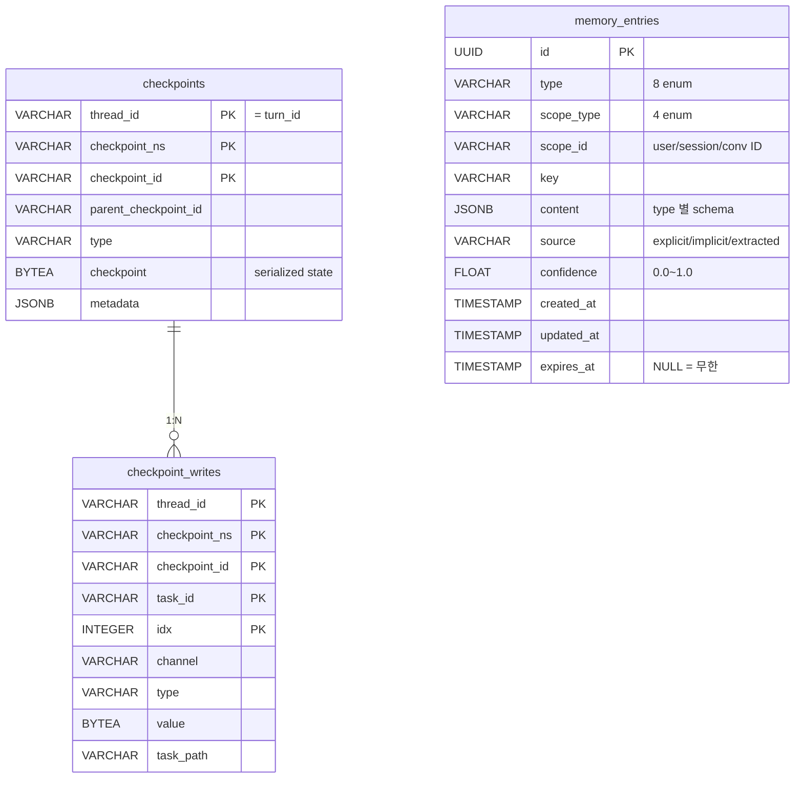
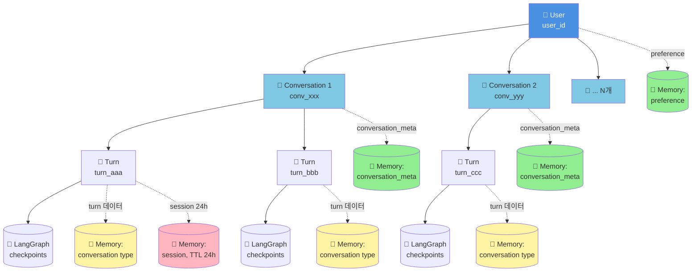
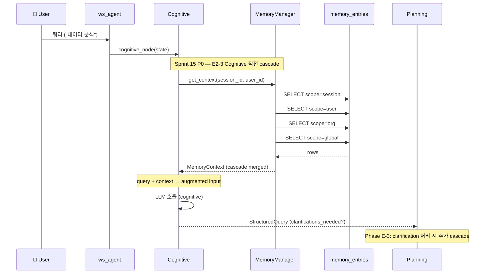
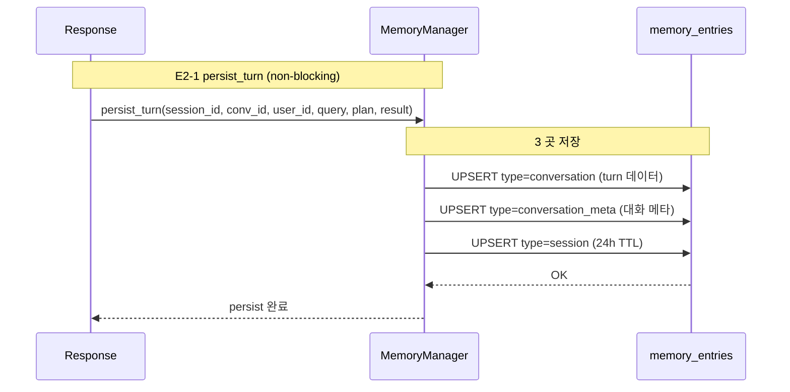
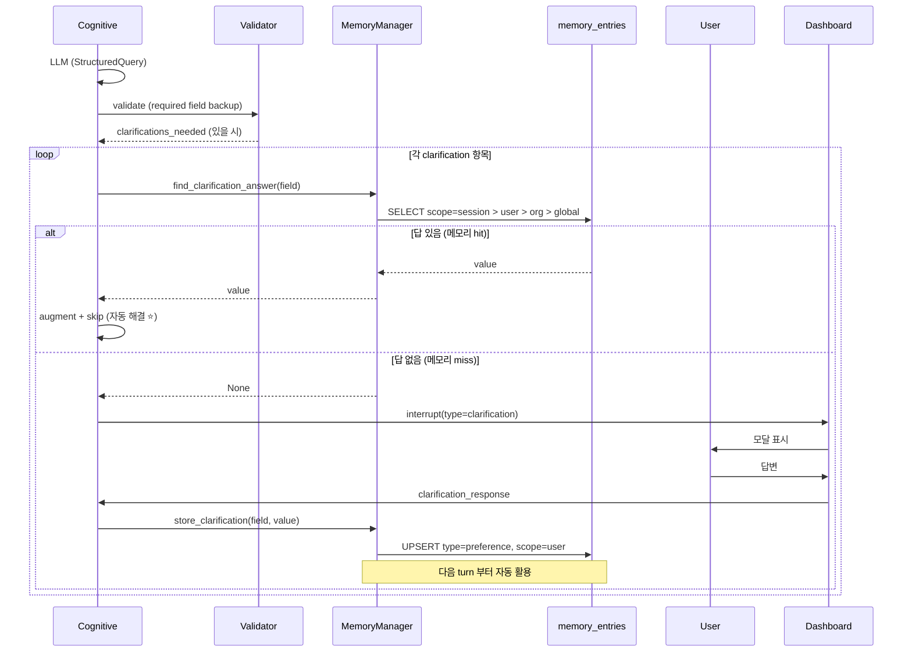
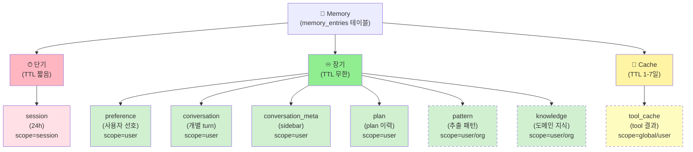
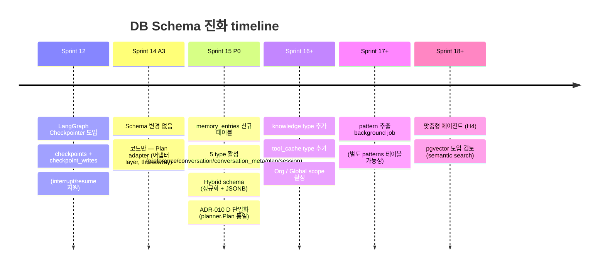
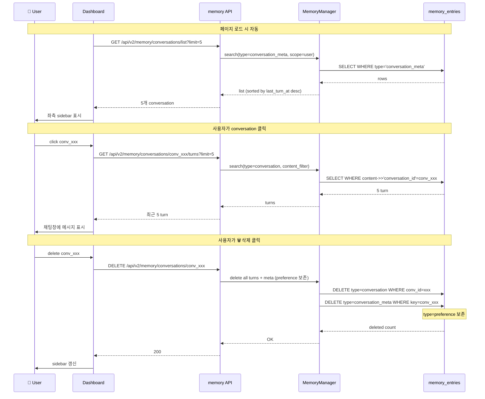
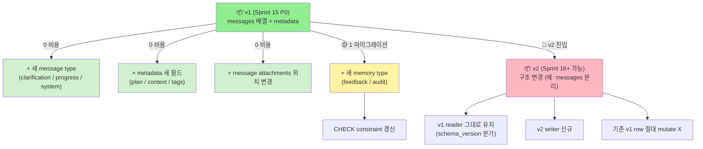

# ERD — 시각화 모음 (Database / Hierarchy / Flow)

| 항목 | 내용 |
|------|------|
| 작성일 | 2026-04-29 |
| 위치 | `docs/agent_specs/erd_database.md` (시각화 전용) |
| 정식 spec | [`35_DB_SCHEMA_v1.0.md`](./35_DB_SCHEMA_v1.0.md) (테이블 정의 source of truth) |
| 짝 | [`30_DATA_MODELS_v1.1.md`](./30_DATA_MODELS_v1.1.md) (Pydantic 모델) |
| 형식 | Mermaid (markdown native — IDE / GitHub 자동 렌더링) |

---

## 0. 본 문서의 역할

**시각화 전용** — 5 view 다이어그램으로 시스템 데이터 구조 한눈 파악.

- ERD (관계형 DB)
- 의미적 hierarchy (User → Conversation → Turn)
- 데이터 흐름 (4Layer ↔ Memory)
- Memory type 분류
- Sprint 진화

다이어그램 외 정의 / 컬럼 / query 패턴 = `35_DB_SCHEMA_v1.0.md` 참조.

---

## 1. View 1: Database ERD (Sprint 15 P0)



### 1.1 관계 요약

| From | To | 종류 | 비고 |
|------|----|----|------|
| `checkpoints` | `checkpoint_writes` | 1:N (FK) | LangGraph native |
| `memory_entries` | (독립) | — | scope_id soft FK 만 |
| `checkpoints` | `memory_entries` | (분리) | 같은 DB, 다른 책임 |

→ POC 단계 = **memory_entries 단일 테이블 + JSONB 유연성**. Sprint 16+ 정규화 가능.

---

## 2. View 2: 의미적 Hierarchy (User → Conversation → Turn)



### 2.1 ID 의 hierarchy

| Level | ID | 예시 | 비고 |
|-------|----|----|------|
| 1 | `user_id` | `demo` | POC = 단일 사용자 |
| 2 | `conversation_id` | `conv_fa81d02` | 사용자가 "+ 새 채팅" 시 발급 |
| 3 | `turn_id` (= `session_id`) | `turn_d36ffd35ad77` | 쿼리 1회당 발급 |

**Sprint 15 P0 단순화**: `session_id` ↔ `turn_id` 통합 (1 turn = 1 session).

### 2.2 scope_type 별 ID 연결

| scope_type | scope_id 의미 | type 예 | TTL |
|----------|-----------|------|-----|
| `user` | user_id | preference / conversation / conversation_meta | 무한 |
| `session` | turn_id | session 단기 변수 | 24h |
| `org` | org_id | (Sprint 16+) | 무한 |
| `global` | "" | system default | 무한 |

→ **conversation 은 별도 scope 아님** — soft FK (`content.conversation_id`) 로 grouping.

---

## 3. View 3: 데이터 흐름 (4Layer ↔ Memory)

### 3.1 Read 흐름 (Cognitive 직전 cascade)



### 3.2 Write 흐름 (Response 후 persist_turn)



### 3.3 Clarification 흐름 (E-3 H0 자동 해결 ⭐)



---

## 4. View 4: Memory Type 분류 (8 가지)



### 4.1 도입 시점

| 도입 | type |
|------|------|
| **Sprint 15 P0** | preference / conversation / conversation_meta / plan / session |
| Sprint 16+ | knowledge / tool_cache |
| Sprint 17+ | pattern (자동 추출) |

---

## 5. View 5: Sprint 별 진화



---

## 6. View 6: E2-5 Conversation Sidebar 데이터 흐름



---

## 7. View 7: 사용자 ↔ AI 자유 대화 (Vision H0~H4)

```mermaid
graph LR
    Q1["1차 turn<br/>'데이터 찾아줘'"] --> Clar1{"clarification?"}
    Clar1 -->|memory miss| Ask1["💬 모달:<br/>'어떤 대상?'"]
    Ans1["사용자:<br/>'&lt;entity&gt;'"]
    Ask1 --> Ans1
    Ans1 --> Mem1[("Memory.set<br/>preference.entity")]
    Mem1 --> Plan1[Planning]
    Plan1 --> Exec1[Execution]
    Exec1 --> Resp1[Response]
    Resp1 --> PT1[("persist_turn<br/>conversation +<br/>conversation_meta")]

    PT1 -.학습 누적.-> Q2

    Q2["2차 turn<br/>'데이터 찾아줘'<br/>(entity 또 누락)"] --> Clar2{"clarification?"}
    Clar2 -->|memory hit ⭐| AutoResolve["✅ 자동 해결:<br/>entity=&lt;entity&gt;<br/>(질문 안 함)"]
    AutoResolve --> Plan2[Planning]
    Plan2 --> Exec2[Execution]
    Exec2 --> Resp2[Response]

    style Q1 fill:#4a90e2,color:#fff
    style Q2 fill:#4a90e2,color:#fff
    style Mem1 fill:#90ee90
    style PT1 fill:#90ee90
    style AutoResolve fill:#ffd700,stroke:#ff6b35,stroke-width:3px
    style Ask1 fill:#ffb6c1
```



→ **H0 자동 해결 메커니즘** = 메모리 cascade 가 clarification 직전에 답을 자동 augment.

---

## 8. View 8: Schema 진화 — 확장/변경 용이성 ⭐

**원칙** (35 spec §0.1): JSONB content + schema_version + append-only.



### 8.1 진화 시 reader 분기 패턴

```python
def parse_conversation_content(content: dict) -> Conversation:
    schema_version = content.get("schema_version", "v1")
    if schema_version == "v1":
        return _parse_v1(content)
    elif schema_version == "v2":
        return _parse_v2(content)
    else:
        raise ValueError(f"Unknown schema_version: {schema_version}")
```

→ 새 v 추가 시 신규 분기만 추가. 기존 분기 손대지 않음.

### 8.2 변경 결정 규칙

| 변경 | 어떻게 |
|------|------|
| messages / metadata 안 변경 | v1 그대로 (schema_version 유지) |
| 구조 자체 변경 (key 명명 / 트리 구조) | v2 신규. 기존 v1 row 보존 |
| 새 type 추가 | CHECK constraint 갱신 + reader 분기 |

---

## 9. 다이어그램 렌더링

### 9.1 IDE / 에디터

- **VS Code**: Mermaid Markdown Preview 확장 자동 렌더링
- **PyCharm**: Mermaid 플러그인
- **GitHub**: 자동 렌더링 (markdown 안의 ```mermaid 블록)

### 9.2 본 문서의 한계

Mermaid = 스타일/레이아웃 제한적. 본격 도식 (drawio / Figma) 필요 시 별도 자료.

---

## 10. 관련 문서

- **정식 spec**: [`35_DB_SCHEMA_v1.0.md`](./35_DB_SCHEMA_v1.0.md) — 컬럼 / 제약 / query 패턴
- **Pydantic models**: [`30_DATA_MODELS_v1.1.md`](./30_DATA_MODELS_v1.1.md)
- **north star**: [`00_vision_and_intent.md`](./00_vision_and_intent.md)
- **ADR**: ADR-010 (Plan/Todo schema 통합), ADR-015 (메모리 + Clarification) — 결정 박제

---

## 변경 이력

> 프레임워크 추출(2026-06-19) 이전(마케팅 도메인 시기)의 상세 변경 이력은 git 히스토리를 참조하세요.
