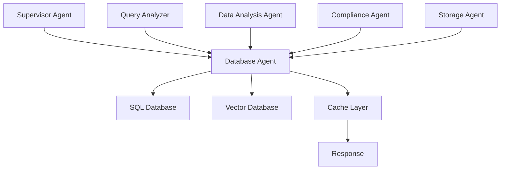

# Database Agent Requirements and Schema Documentation

## 목차
1. [데이터베이스 아키텍처 개요](#1-데이터베이스-아키텍처-개요)
2. [관계형 데이터베이스 구조](#2-관계형-데이터베이스-구조)
3. [벡터 데이터베이스 구조](#3-벡터-데이터베이스-구조)
4. [Agent 데이터 접근 요구사항](#4-agent-데이터-접근-요구사항)
5. [구현 가이드라인](#5-구현-가이드라인)

---

## 1. 데이터베이스 아키텍처 개요

### 1.1 하이브리드 데이터베이스 시스템
현재 시스템은 **하이브리드 데이터베이스 아키텍처**를 사용하며, 다음과 같은 구성요소로 이루어져 있습니다:

- **관계형 데이터베이스 (SQLite + AsyncSQLAlchemy)**
  - 대화 세션 관리
  - 메시지 히스토리
  - Agent 상태 추적
  - HR 및 영업 실적 데이터

- **벡터 데이터베이스 (ChromaDB)**
  - 의미론적 검색
  - 규정 및 가이드라인 검색
  - 임베딩 기반 유사도 매칭

### 1.2 주요 특징
- **비동기 처리**: AsyncSQLAlchemy를 통한 비동기 DB 작업
- **세션 관리**: 컨텍스트 매니저를 통한 안전한 세션 관리
- **하이브리드 검색**: 메타데이터 + 벡터 검색 조합
- **다중 데이터 소스**: 여러 SQLite DB 파일 통합

---

## 2. 관계형 데이터베이스 구조

### 2.1 메인 데이터베이스 (pharma_chatbot.db)

#### Conversations 테이블
```python
class Conversation:
    id: str (UUID, PK)
    user_id: str
    session_id: str
    company_id: str (nullable)
    status: str (default: "initializing")
    metadata: JSON
    created_at: DateTime
    updated_at: DateTime
    
    # Relationships
    messages: List[Message]
    agent_states: List[AgentState]
    analysis_results: List[AnalysisResult]
```

#### Messages 테이블
```python
class Message:
    id: str (UUID, PK)
    conversation_id: str (FK)
    role: str ("user", "assistant", "system", "tool")
    content: Text
    sequence_number: int
    metadata: JSON
    created_at: DateTime
```

#### AgentState 테이블
```python
class AgentState:
    id: str (UUID, PK)
    conversation_id: str (FK)
    agent_name: str
    task_id: str (nullable)
    state_data: JSON
    execution_status: str
    execution_time: float (nullable)
    confidence_score: float (nullable)
    created_at: DateTime
    updated_at: DateTime
```

#### AnalysisResult 테이블
```python
class AnalysisResult:
    id: str (UUID, PK)
    conversation_id: str (FK)
    agent_name: str
    result_type: str
    query: Text (nullable)
    result_data: JSON
    confidence_score: float (nullable)
    metadata: JSON
    created_at: DateTime
```

### 2.2 HR 데이터베이스 (hr_data.db)
- **인사자료 테이블**: 직원 정보, 조직 구조
- **고객연락처 테이블**: 고객 정보 관리

### 2.3 영업 성과 데이터베이스
- **sales_performance_db.db**: 영업 실적 데이터
- **clients_db.db**: 고객 정보
- **clients_info.db**: 고객 상세 정보
- **sales_target_db.db**: 영업 목표 데이터

---

## 3. 벡터 데이터베이스 구조

### 3.1 ChromaDB 컬렉션

#### internal_regulations 컬렉션
```python
{
    "id": "chunk_id",
    "document": "텍스트 내용",
    "metadata": {
        "part": "제1부_취업규칙",  # 부 구분
        "article_nums": "제10조",   # 조항 번호
        "keywords": ["휴가", "연차"],  # 키워드
        "importance_score": 0.8,    # 중요도
        "chunk_type": "규정"        # 청크 타입
    },
    "embedding": [...]  # 벡터 임베딩
}
```

### 3.2 검색 엔진 구조

#### ComplianceSearchEngine
```python
class ComplianceSearchEngine:
    # 하이브리드 검색 기능
    - vector_search()     # 벡터 유사도 검색
    - metadata_search()   # 메타데이터 기반 검색
    - hybrid_search()     # 벡터 + 메타데이터 조합
    
    # 쿼리 분석
    - QueryAnalyzer:
      - 의도 파악
      - 금액/빈도 추출
      - 시나리오 매칭
```

---

## 4. Agent 데이터 접근 요구사항

### 4.1 데이터베이스 Agent가 제공해야 할 기능

#### 1) 대화 관리
- 대화 세션 생성/조회/업데이트
- 메시지 히스토리 관리
- Agent 상태 저장 및 복원

#### 2) 데이터 조회
- SQL 쿼리 실행 (HR, 영업 데이터)
- 벡터 검색 (규정, 가이드라인)
- 하이브리드 검색 (메타데이터 + 의미론적)

#### 3) 분석 결과 저장
- 분석 결과 저장
- 컴플라이언스 체크 결과 기록
- 감사 로그 기록

### 4.2 Agent 인터페이스 설계

```python
class DatabaseAgent:
    """데이터베이스 접근 Agent"""
    
    async def execute_query(
        self,
        query_type: str,  # "sql", "vector", "hybrid"
        query: str,
        database: str,    # 타겟 데이터베이스
        filters: Dict = None
    ) -> Dict[str, Any]:
        """데이터베이스 쿼리 실행"""
        pass
    
    async def save_analysis_result(
        self,
        conversation_id: str,
        agent_name: str,
        result_data: Dict
    ) -> str:
        """분석 결과 저장"""
        pass
    
    async def get_conversation_history(
        self,
        conversation_id: str,
        limit: int = 10
    ) -> List[Message]:
        """대화 히스토리 조회"""
        pass
    
    async def search_regulations(
        self,
        query: str,
        search_type: str = "hybrid",
        top_k: int = 5
    ) -> List[SearchResult]:
        """규정 검색"""
        pass
```

### 4.3 필요한 데이터 접근 패턴

#### 1) 읽기 작업
- **포인트 쿼리**: 특정 ID로 레코드 조회
- **범위 쿼리**: 날짜/숫자 범위로 조회
- **조인 쿼리**: 여러 테이블 연결
- **집계 쿼리**: SUM, AVG, COUNT 등
- **벡터 검색**: 유사도 기반 검색

#### 2) 쓰기 작업
- **삽입**: 새 레코드 추가
- **업데이트**: 기존 레코드 수정
- **트랜잭션**: 여러 작업 원자성 보장

#### 3) 특수 작업
- **벌크 작업**: 대량 데이터 처리
- **스트리밍**: 실시간 데이터 처리
- **캐싱**: 자주 사용하는 데이터 캐싱

---

## 5. 구현 가이드라인

### 5.1 데이터베이스 연결 관리

```python
# 비동기 세션 관리 예제
from database.database import get_session

async def query_database():
    async with get_session() as session:
        # 쿼리 실행
        result = await session.execute(query)
        return result.scalars().all()
```

### 5.2 에러 처리 전략

```python
class DatabaseError(Exception):
    """데이터베이스 에러 기본 클래스"""
    pass

class ConnectionError(DatabaseError):
    """연결 오류"""
    pass

class QueryError(DatabaseError):
    """쿼리 실행 오류"""
    pass

async def safe_query_execution(query):
    try:
        result = await execute_query(query)
        return result
    except ConnectionError:
        # 재시도 로직
        await asyncio.sleep(1)
        return await execute_query(query)
    except QueryError as e:
        # 로깅 및 대체 처리
        logger.error(f"Query failed: {e}")
        return None
```

### 5.3 성능 최적화

#### 1) 쿼리 최적화
- 인덱스 활용
- 배치 처리
- 커넥션 풀링

#### 2) 캐싱 전략
```python
from functools import lru_cache
from typing import Optional

class CachedDatabaseAgent:
    @lru_cache(maxsize=100)
    async def get_cached_result(
        self, 
        query_hash: str
    ) -> Optional[Dict]:
        """캐시된 결과 반환"""
        pass
```

#### 3) 벡터 검색 최적화
- 임베딩 사전 계산
- 청크 크기 최적화
- 메타데이터 인덱싱

### 5.4 보안 고려사항

#### 1) SQL Injection 방지
```python
# 파라미터 바인딩 사용
query = text("SELECT * FROM users WHERE id = :user_id")
result = await session.execute(query, {"user_id": user_id})
```

#### 2) 접근 제어
- Role-based access control
- 데이터 마스킹
- 감사 로깅

### 5.5 모니터링 및 로깅

```python
import logging
from datetime import datetime

class DatabaseMonitor:
    def log_query(self, query: str, execution_time: float):
        logger.info(f"Query executed in {execution_time}s: {query[:100]}")
    
    def log_error(self, error: Exception, context: Dict):
        logger.error(f"Database error: {error}", extra=context)
    
    def track_performance(self, metric_name: str, value: float):
        # 성능 메트릭 추적
        pass
```

---

## 6. Agent 통합 아키텍처

### 6.1 Agent간 데이터 흐름



### 6.2 State 관리

```python
class DatabaseAgentState:
    """Database Agent 상태"""
    current_connections: Dict[str, Any]
    active_queries: List[str]
    cache_status: Dict[str, Any]
    performance_metrics: Dict[str, float]
```

---

## 7. 구현 체크리스트

### Phase 1: 기본 구현
- [ ] DatabaseAgent 클래스 생성
- [ ] 비동기 데이터베이스 연결 관리
- [ ] 기본 CRUD 작업 구현
- [ ] 에러 처리 로직

### Phase 2: 검색 기능
- [ ] SQL 쿼리 빌더
- [ ] 벡터 검색 통합
- [ ] 하이브리드 검색 구현
- [ ] 쿼리 최적화

### Phase 3: 고급 기능
- [ ] 캐싱 레이어
- [ ] 배치 처리
- [ ] 트랜잭션 관리
- [ ] 성능 모니터링

### Phase 4: 통합
- [ ] 다른 Agent와 통합
- [ ] State 관리 통합
- [ ] 로깅 및 감사
- [ ] 테스트 및 검증

---

## 8. 참고 사항

### 8.1 데이터베이스 파일 위치
- 메인 DB: `./pharma_chatbot.db`
- HR DB: `./database/hr_information/hr_data.db`
- 영업 DB: `./database/sales_performance_db/*.db`
- 벡터 DB: `./chromadb/`

### 8.2 환경 변수
```bash
DATABASE_URL=sqlite+aiosqlite:///./pharma_chatbot.db
CHROMA_DB_PATH=./chromadb
```

### 8.3 의존성
```python
# requirements.txt
sqlalchemy>=2.0
aiosqlite
chromadb
langchain
pydantic>=2.0
```

---

이 문서는 데이터베이스 Agent 개발에 필요한 모든 정보를 포함하고 있으며, 실제 구현 시 참조할 수 있는 가이드라인을 제공합니다.