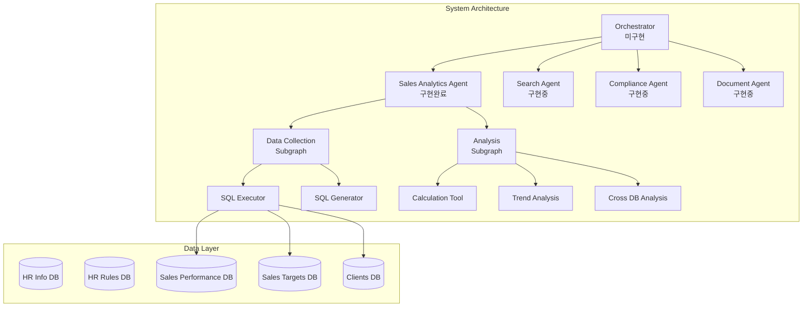

# NaruTalk Backend - LangGraph 0.6.7 Architecture

## 📌 Overview

NaruTalk Backend는 LangGraph 0.6.7의 Context API를 활용한 멀티 에이전트 시스템입니다. Orchestrator-Agent-Subgraph-Tool 계층 구조로 설계되어 복잡한 비즈니스 로직을 효율적으로 처리합니다.

### 주요 특징
- **LangGraph 0.6.x Context API** 완벽 준수
- **Clean Architecture**: Config(정적 설정), Context(런타임 메타데이터), State(워크플로우 데이터) 분리
- **Multi-Agent System**: 여러 전문 에이전트가 협업하여 작업 수행
- **Subgraph Pattern**: 복잡한 작업을 재사용 가능한 서브그래프로 분해
- **LLM Planning**: GPT-4o 기반 동적 실행 계획 수립

## 🏗️ Architecture



## 📁 Directory Structure

```
backend/
├── service/
│   ├── core/                 # 핵심 컴포넌트
│   │   ├── config.py         # 시스템 정적 설정
│   │   ├── context.py        # 런타임 컨텍스트 정의
│   │   ├── states.py         # 워크플로우 상태 정의
│   │   ├── base_agent.py     # 베이스 에이전트 클래스
│   │   └── checkpointer.py   # 체크포인트 관리
│   │
│   ├── agents/               # 에이전트 구현
│   │   ├── sales_analytics_agent.py  # 영업 분석 에이전트
│   │   ├── search_agent.py           # HR 정보 검색 에이전트
│   │   ├── compliance_check_agent.py # 규정 확인 에이전트
│   │   └── document_generation_agent.py # 문서 생성 에이전트
│   │
│   ├── subgraphs/           # 재사용 가능한 서브그래프
│   │   ├── data_collection_subgraph.py  # 데이터 수집
│   │   └── analysis_subgraph.py         # 데이터 분석
│   │
│   ├── tools/               # 도구 구현
│   │   ├── sql_executor.py      # SQL 실행
│   │   ├── sql_generator.py     # SQL 생성
│   │   ├── calculation_tool.py  # 기본 계산
│   │   ├── trend_analysis_tool.py    # 추세 분석
│   │   └── cross_db_analysis_tool.py # 교차 DB 분석
│   │
│   ├── orchestrator/        # 오케스트레이터 (미구현)
│   │   └── __init__.py
│   │
│   └── utils/               # 유틸리티
│       └── llm_manager.py   # LLM 관리
│
└── database/               # 데이터베이스 스토리지
    └── storage/
        ├── hr_information/
        │   └── hr_data.db
        ├── hr_rules/
        │   └── chromadb/
        └── sales_performance/
            ├── sales_performance_db.db
            ├── sales_target_db.db
            └── clients_db.db
```

## 🔑 Core Concepts

### 1. State (상태)
워크플로우 실행 중 변경되는 데이터를 관리합니다. Reducer 패턴을 사용하여 상태 업데이트를 제어합니다.

```python
class SalesState(BaseState):
    query: str                        # 사용자 쿼리
    execution_plan: Optional[Dict]    # LLM 생성 계획
    collected_data: Annotated[Dict, merge_dicts]  # 수집된 데이터
    insights: Annotated[List, append_unique]      # 인사이트
```

### 2. Context (컨텍스트)
런타임 메타데이터를 전달합니다. 읽기 전용이며 실행 중 변경되지 않습니다.

```python
class AgentContext(TypedDict):
    user_id: str          # 사용자 ID
    session_id: str       # 세션 ID
    language: str         # 언어 설정
    api_keys: Dict        # API 키
```

### 3. Config (설정)
시스템 전역 정적 설정을 관리합니다.

```python
class Config:
    DATABASES = {...}     # DB 경로
    DEFAULT_MODELS = {...}  # LLM 모델 설정
    TIMEOUTS = {...}      # 타임아웃 설정
```

## 🚀 Quick Start

### 1. 환경 설정

```bash
# 가상환경 생성
python -m venv venv

# 가상환경 활성화 (Windows)
venv\Scripts\activate

# 의존성 설치
pip install -r requirements.txt
```

### 2. 환경 변수 설정

`.env` 파일 생성:
```env
OPENAI_API_KEY=your-api-key-here
LOG_LEVEL=INFO
```

### 3. 에이전트 실행

```python
import asyncio
from backend.service.agents.sales_analytics_agent import SalesAnalyticsAgent

async def main():
    # 에이전트 생성
    agent = SalesAnalyticsAgent()

    # 쿼리 실행
    result = await agent.run(
        query="김철수의 이번달 판매 실적 분석",
        user_id="user123",
        session_id="session456",
        language="ko"
    )

    # 결과 출력
    print(result.get("formatted_result"))

asyncio.run(main())
```

## 🔧 Configuration

### LLM 모델 설정
`backend/service/core/config.py`:

```python
DEFAULT_MODELS = {
    "intent": "gpt-4o-mini",      # 빠른 의도 분석
    "planning": "gpt-4o",          # 정확한 계획 수립
}
```

### 데이터베이스 경로
```python
DATABASES = {
    "hr_info": "database/storage/hr_information/hr_data.db",
    "sales_performance": "database/storage/sales_performance/sales_performance_db.db",
    "sales_targets": "database/storage/sales_performance/sales_target_db.db",
    "clients": "database/storage/sales_performance/clients_db.db",
}
```

## 📊 Agent Capabilities

### Sales Analytics Agent (구현 완료)
- **기능**: 영업 데이터 분석 및 인사이트 제공
- **서브그래프**: Data Collection, Analysis
- **도구**: SQL Executor, Calculation Tool, Trend Analysis

### Search Agent (구현 중)
- **기능**: HR 정보 및 규정 검색
- **데이터**: HR 정보 DB, 규정 DB

### Compliance Check Agent (구현 중)
- **기능**: 규정 준수 확인

### Document Generation Agent (구현 중)
- **기능**: 보고서 및 문서 자동 생성

## 🛠️ Development

### 새 에이전트 추가

1. `backend/service/agents/` 디렉토리에 새 파일 생성
2. `BaseAgent` 클래스 상속
3. 필수 메서드 구현:
   - `_build_graph()`: 워크플로우 정의
   - `plan_execution()`: LLM 계획 수립
   - `execute_plan()`: 계획 실행
   - `format_results()`: 결과 포맷팅

### 새 도구 추가

1. `backend/service/tools/` 디렉토리에 도구 클래스 생성
2. 입력/출력 스키마 정의
3. 핵심 로직 구현
4. 에러 처리 추가

## 📝 Logging

로그 레벨은 환경 변수로 설정:
```env
LOG_LEVEL=DEBUG  # DEBUG, INFO, WARNING, ERROR, CRITICAL
```

로그 파일 위치: `logs/` 디렉토리

## 🔒 Security

- API 키는 환경 변수로 관리
- SQL Injection 방지를 위한 파라미터화된 쿼리 사용
- 실행 시간 제한 설정
- 결과 행 수 제한

## 🧪 Testing

```bash
# 단위 테스트 실행
python -m pytest tests/

# 특정 에이전트 테스트
python backend/service/agents/sales_analytics_agent.py
```

## 📚 References

- [LangGraph Documentation](https://python.langchain.com/docs/langgraph)
- [LangGraph 0.6.x Context API](https://langchain-ai.github.io/langgraph/concepts/context/)
- [OpenAI API Documentation](https://platform.openai.com/docs)

## 🤝 Contributing

1. Feature 브랜치 생성
2. 변경사항 구현
3. 테스트 작성 및 실행
4. Pull Request 제출

## 📄 License

Internal Use Only - Proprietary Software

---

**Version**: 0.0.33 (Beta)
**Last Updated**: 2025-01-26
**Maintainer**: NaruTalk Development Team